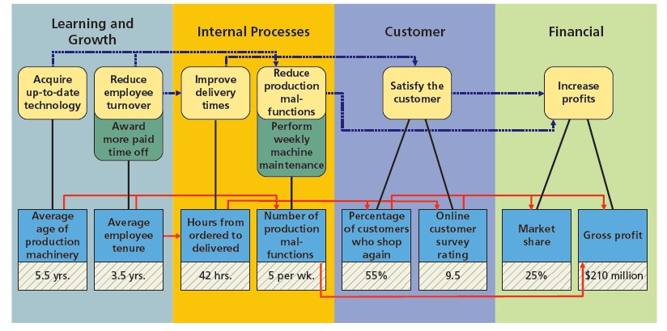

# Chapter 15

## Pre-Lecture Videos

1. All of the following are considered phases of the management process *except* **executing**.
2. The process by which managers run day-to-day operations is called **directing**.
3. **Continuous process improvement** is the philosophy of enhancing employees, business processes, and products on a regular basis
4. Which of the following are ways by which managerial accounting provides information and reports for managers to use in operating the business?
   - **Managerial accounting provides the cost of manufacturing a product, which can be used to determine its selling price.**
   - **Managerial accounting allows for comparing the costs of manufacturing products over time and can be used to monitor and control the cost of direct materials, direct labor, and factory overhead.**
   - **Performance reports allow management to identify any large amounts of scrap materials or employee downtime.**
5. Managerial accounting provides performance reports to internal users. Which of the following is considered an advantage of performance reports?
   - **Performance reports allow management to identify any large amounts of scrap materials or employee downtime.**
   - **A report could analyze the potential efficiencies and dollar savings of purchasing computerized equipment to speed up the production process.**
   - **A report could analyze how many units need to be sold to cover operating costs and expenses and used to set monthly selling targets and bonuses for sales personnel.**
6. **Direct costs** are identified with and can be traced to a cost object.
7. **Indirect costs** cannot be identified with or traced to a cost object.
8. **Period costs** consist of selling and administrative costs.
9. Inventory that consists of the costs of the direct and indirect materials that have not yet entered the manufacturing process is known as **materials inventory**.
10. Inventory that consists of the direct materials, direct labor, and factory overhead costs for products that have entered the manufacturing process but are not yet completed is known as **work in process inventory**.
11. The total cost of making products that are available for sale during the period is called **cost of goods manufactured**.

## Mini Quiz

1. Managerial accounting information can be used for all of the following except **communicating with shareholders**.

2. Which of the following would not be considered a conversion cost by a baking company?

   - **Depreciation on oven**

3. Which of the following positions would have a salary or wage that is classified as a factory overhead cost by a baking company?

   - **Factory supervisor**

4. Which of the following would be classified as a factory overhead cost by a baking company?

   - **Depreciation of factory equipment**

5. Managerial accounting information uses **historical and estimated data**.

6. Ralph's Cafe has the following information for June:

   | Cost Type                              | Cost     |
   | -------------------------------------- | -------- |
   | Cost of materials placed in production | \$30,000 |
   | Direct labor                           | \$25,000 |
   | Factory overhead                       | \$14,000 |
   | Work in process inventory, June 1      | \$2,900  |
   | Work in process inventory, June 30     | \$3,500  |

   What is the cost of goods manufactured?

   - $2900+(30000+25000+14000)-3500 =$ **$68400$**

7. Which of the following would be classified as an indirect cost by a baking company?

   - **Salaries of production supervisors**

8. How much of the U.S. economic activity as measured by gross domestic product is represented by services?

   - **Nearly 80%**

9. Ultimate Luxury Hotel is a single hotel with 300 rooms. During the month of October, the hotel had 5,000 guests, who each stayed one night. What is the occupancy rate for October (rounded to the nearest whole percent)?

   - $\frac{5000}{300 * 31}=.537=54\%$

10. The measure that captures the use of a fixed asset in serving customers relative to the asset's capacity is known as the **utilization** rate.

11. Super Sleep Hotel has 2,000 guests who stayed for two nights and rented 150 rooms. How many guest nights did the hotel have during this period?

    - $2000*2=4000$

12. Which of the following statements regarding the differences between managerial accounting applications for manufacturing and service companies is true?

    - **Service companies may use cost of services on the income statement rather than cost of goods sold.**

## Practice Exercises

1. Three phases of the management process are planning, directing, and controlling. Match the following descriptions to the proper phase by clicking on the phase (on the left) and then clicking on the correct description (on the right).

   - **Directing –> Process by which managers, given their assigned levels of responsibilities, run day-to-day operations.**
   - **Planning –> Developing long-range courses of action to achieve goals.**
   - **Controlling –> Isolating significant departures from plans for further investigation and possible remedial action. It may lead to a revision of future plans.**

2. Identify the following *costs* as direct materials, direct labor, or factory overhead for a magazine publisher:

   - | Item                                | Type                 |
     | ----------------------------------- | -------------------- |
     | Staples used to bind magazines      | **Direct materials** |
     | Wages of printing machine employees | **Direct labor**     |
     | Maintenance on printing machines    | **Factory overhead** |
     | Paper used in the magazine          | **Direct materials** |

3. Indicate whether each of the following costs of an automobile manufacturer would be classified as *direct materials cost*, *direct labor cost*, or *factory overhead cost*:

   - | Item                                               | Type                      |
     | -------------------------------------------------- | ------------------------- |
     | Automobile engine                                  | **Direct materials cost** |
     | Brake pads                                         | **Direct materials cost** |
     | Depreciation of robotic assembly line equipment    | **Factory overhead cost** |
     | Glass for front and rear windshields               | **Direct materials cost** |
     | Safety helmets and masks for assembly line workers | **Factory overhead cost** |
     | Salary of quality control inspector                | **Factory overhead cost** |
     | Steering wheel                                     | **Direct materials cost** |
     | Tires                                              | **Direct materials cost** |
     | Wages of assembly line workers                     | **Direct labor cost**     |

4. Identify the following costs as a prime cost (**P**), conversion cost (**C**), or both (**B**) for a magazine publisher:

   - | Item                                | Type           |
     | ----------------------------------- | -------------- |
     | Paper used for the magazine         | **Prime**      |
     | Wages of printing machine employees | **Both**       |
     | Glue used to bind magazine          | **Prime**      |
     | Maintenance on printing machines    | **Conversion** |

5. Identify the following *costs* as a product cost or a period cost for a magazine publisher:

   - | Item                                        | Type        |
     | ------------------------------------------- | ----------- |
     | Sales salaries                              | **Period**  |
     | Paper used for the machine                  | **Product** |
     | Maintenance on printing machines            | **Product** |
     | Depreciation expense–corporate headquarters | **Period**  |

6. For apparel manufacturer Abercrombie & Fitch, Inc. (ANF), classify each of the following costs as either a product cost or a period cost:

   - | Item                                               | Type        |
     | -------------------------------------------------- | ----------- |
     | Advertising expenses                               | **Period**  |
     | CFO's salary                                       | **Period**  |
     | Depreciation on office equipment                   | **Period**  |
     | Depreciation on sewing machines                    | **Product** |
     | Fabric used during production                      | **Product** |
     | Factory janitorial supplies                        | **Product** |
     | Factory supervisors' salaries                      | **Product** |
     | Property taxes on factory building and equipment   | **Product** |
     | Oil used to lubricate sewing machines              | **Product** |
     | Repairs and maintenance costs for sewing machines  | **Product** |
     | Research and development costs                     | **Period**  |
     | Sales commissions                                  | **Period**  |
     | Salaries of distribution center personnel          | **Period**  |
     | Salaries of production quality control supervisors | **Product** |
     | Travel costs of media relations employees          | **Period**  |
     | Utility costs for office building                  | **Period**  |
     | Wages of sewing machine operators                  | **Product** |

7. Glenville Company has the following information for April:

   | Line Item                                     |        |
   | --------------------------------------------- | ------ |
   | *Cost of direct materials* used in production | 280000 |
   | *Direct labor*                                | 324000 |
   | *Factory overhead*                            | 188900 |
   | *Work in process inventory*, April 1          | 72300  |
   | Work in process inventory, April 30           | 76600  |
   | *Finished goods inventory*, April 1           | 39600  |
   | Finished goods inventory, April 30            | 41200  |

   1. For April, determine the cost of goods manufactured. Using the data given, prepare a statement of Cost of Goods Manufactured.

      - | Statement of Cost of Goods Manufactured     |               |                   |
        | ------------------------------------------- | ------------- | ----------------- |
        | Work in process inventory, April 1          |               | 72300             |
        | Cost of direct materials used in production | 280000        |                   |
        | Direct Labor                                | 324000        |                   |
        | Factory overhead                            | <u>188900</u> |                   |
        | Total manufacturing costs incurred in April |               | <u>792900</u>     |
        | Total manufacturing costs                   |               | 865200            |
        | Work in process inventory, April 30         |               | <u>76600</u>      |
        | Cost of goods manufactured                  |               | **<u>788600</u>** |

   2. For April, determine the cost of goods sold. Using the data given, prepare a statement of Cost of Goods Sold.

      - | Statement of Cost of Goods Sold           |                   |
        | ----------------------------------------- | ----------------- |
        | Finished goods inventory, April 1         | 39600             |
        | Cost of goods manufactured                | <u>788600</u>     |
        | Cost of finished goods available for sale | 828200            |
        | Finished goods inventory, April 30        | <u>41200</u>      |
        | Cost of goods sold                        | <u>**787000**</u> |

8. The following information is available for Fuller Manufacturing Company for the month ending October 31:

   | Line Item                                   |         |
   | ------------------------------------------- | ------- |
   | Cost of direct materials used in production | 1323600 |
   | Direct labor                                | 1680000 |
   | Work in process inventory, October 1        | 455300  |
   | Work in process inventory, October 31       | 378100  |
   | Total factory overhead                      | 3544200 |

   Determine Fuller Manufacturing’s cost of goods manufactured for the month ended October 31.

   - | Statement of Cost of Goods Manufactured For the Month Ended October 31 |                |                    |
     | ------------------------------------------------------------ | -------------- | ------------------ |
     | Work in process inventory, October 1                         |                | 455300             |
     | Manufacturing costs incurred during October:                 |                |                    |
     | Cost of direct materials used in production                  | 1323600        |                    |
     | Direct labor                                                 | 1680000        |                    |
     | Factory overhead                                             | <u>3544200</u> |                    |
     | Total manufacturing costs incurred                           |                | <u>6547800</u>     |
     | Total manufacturing costs                                    |                | 7003100            |
     | Work in process inventory, October 31                        |                | <u>378100</u>      |
     | Cost of goods manufactured                                   |                | **<u>6625000</u>** |

9. Jake’s Cabins is a small motel chain with locations near the national parks of Utah, Wyoming, and Montana. The chain has a total of 500 guest rooms. The following operating data are available for June:

   | Number of Guests | Nights per Visit | Guest Nights |
   | ---------------- | ---------------- | ------------ |
   | 4400             | 1                | 4400         |
   | 1800             | 2                | 3600         |
   | 750              | 3                | 2250         |
   | 600              | 4                | 2400         |
   | 20               | 5                | 100          |

   1. Determine the guest nights for June
      - $(4400*1)+(1800*2)+(750*3)+(600*4)+(20*5)=12750$
   2. Determine the available room nights for June
      - $500*30=15000$
   3. Determine the occupancy rate for June
      - $\frac{12750}{15000}=.85=85\%$
   4. Assume that the occupancy rate for June of the prior year was 82%. Has the utilization rate for Jake’s Cabins improved or declined?
      - **Improved**

10. The following informa20tion is available for Shanika Company for 20Y6:

    | Inventories     | January 1 | December 31 |
    | --------------- | --------- | ----------- |
    | Materials       | 77350     | 95550       |
    | Work in process | 109200    | 96200       |
    | Finished goods  | 113750    | 100100      |

    | Line Item                              |         |
    | -------------------------------------- | ------- |
    | Advertising expense                    | $68,250 |
    | Depreciation expense-office equipment  | 22,750  |
    | Depreciation expense-factory equipment | 14,560  |
    | Direct labor                           | 186,550 |
    | Heat, light, and power-factory         | 5,850   |
    | Indirect labor                         | 23,660  |
    | Materials purchased                    | 123,500 |
    | Office salaries expense                | 77,350  |
    | Property taxes-factory                 | 4,095   |
    | Property taxes-headquarters building   | 13,650  |
    | Rent expense-factory                   | 6,825   |
    | Sales                                  | 864,500 |
    | Sales salaries expense                 | 136,500 |
    | Supplies-factory                       | 3,250   |
    | Miscellaneous costs-factory            | 4,420   |

    1. Prepare the 20Y6 statement of cost of goods manufactured.

       - | Statement of Cost of Goods Manufactured For the Year Ended December 31, 20Y6 |               |              |                   |
         | ------------------------------------------------------------ | ------------- | ------------ | ----------------- |
         | Work in process inventory, January 1, 20Y6                   |               |              | 109200            |
         | Direct materials:                                            |               |              |                   |
         | Materials inventory, January 1, 20Y6                         | 77350         |              |                   |
         | Purchases                                                    | <u>123500</u> |              |                   |
         | Cost of materials available for use                          | 200850        |              |                   |
         | Materials inventory, December 31, 20Y6                       | <u>95550</u>  |              |                   |
         | Cost of Direct Materials used in Production                  |               | 105300       |                   |
         | Direct Labor                                                 |               | 186550       |                   |
         | Factory Overhead:                                            |               |              |                   |
         | Indirect labor                                               | 23660         |              |                   |
         | Depreciation expense-factory equipment                       | 14560         |              |                   |
         | Heat, light, and power-factory                               | 5850          |              |                   |
         | Property taxes-factory                                       | 4096          |              |                   |
         | Rent expense-factory                                         | 6825          |              |                   |
         | Supplies-factory                                             | 3250          |              |                   |
         | Miscellaneous costs-factory                                  | <u>4420</u>   |              |                   |
         | Total factory overhead                                       |               | <u>62660</u> |                   |
         | Total manufacturing costs incurred in 20Y6                   |               |              | <u>354510</u>     |
         | Total manufacturing costs                                    |               |              | 463710            |
         | Work in process inventory, December 31, 20Y6                 |               |              | <u>96200</u>      |
         | Cost of goods manufactured                                   |               |              | **<u>367510</u>** |

    2. Prepare the 20Y6 income statement

       - | Income Statement For the Year Ended December 31, 20Y6 |               |               |                   |
         | ----------------------------------------------------- | ------------- | ------------- | ----------------- |
         | Sales                                                 |               |               | 864500            |
         | Cost of good sold:                                    |               |               |                   |
         | Finished goods inventory, January 1, 20Y6             |               | 113750        |                   |
         | Cost of goods manufactured                            |               | <u>367510</u> |                   |
         | Cost of finished goods available for sale             |               | 481260        |                   |
         | Finished goods inventory, December 31, 20Y6           |               | <u>100100</u> |                   |
         | Cost of goods sold                                    |               |               | 381160            |
         | Gross profit                                          |               |               | 483340            |
         | Operating expenses:                                   |               |               |                   |
         | Administrative expenses:                              |               |               |                   |
         | Office salaries expense                               | 77350         |               |                   |
         | Depreciation expense-office equipment                 | 22750         |               |                   |
         | Property taxes-headquarters building                  | <u>13650</u>  | 113750        |                   |
         | Selling expenses:                                     |               |               |                   |
         | Advertising expense                                   | 68250         |               |                   |
         | Sales salaries expense                                | <u>136500</u> | <u>204750</u> |                   |
         | Total operating expenses                              |               |               | <u>318500</u>     |
         | Net income                                            |               |               | **<u>164840</u>** |

## Homework Exercises

1. Which of the following items are properly classified as part of factory overhead for Ford Motor Company (F), a maker of heavy automobiles and trucks?

   - | Item                                                         | Part of Factory Overhead |
     | ------------------------------------------------------------ | ------------------------ |
     | Air conditioner units for installation in vehicles           | **No**                   |
     | Consultant fees for a study of production line efficiency    | **Yes**                  |
     | ealership sales incentives                                   | **No**                   |
     | Depreciation on headquarters building in Dearborn, Michigan  | **No**                   |
     | Depreciation on mechanical robots used on the assembly line  | **Yes**                  |
     | Leather to be used on vehicles that have leather interiors   | **No**                   |
     | Machine lubricant used to maintain the assembly line at the Louisville, Kentucky, assembly plant | **Yes**                  |
     | Plant manager’s salary at Buffalo, New York, stamping plant, which manufactures auto and truck subassemblies | **Yes**                  |
     | Property taxes on the Dearborn, Michigan, headquarters building | **No**                   |
     | Vice president of human resource’s salary                    | **No**                   |

2. From the choices presented in parentheses, choose the appropriate term for completing each of the following sentences:

   - | Sentence                                                     | Appropriate term for completing sentence |
     | ------------------------------------------------------------ | ---------------------------------------- |
     | A product, sales territory, department, or activity to which costs are traced is called a (direct cost, cost object). | **cost object**                          |
     | Advertising costs are usually viewed as (period, product) costs. | **period**                               |
     | Factory overhead costs combined with direct labor costs are called (prime, conversion) costs. | **conversion**                           |
     | Feedback is often used to (improve, direct) operations. | **improve**                              |
     | A sacrifice made to obtain some benefit is a (cost, expense). | **cost**                                 |
     | The balance sheet of a manufacturer would include an account for (cost of goods sold, work in process inventory). | **work in process inventory**            |
     | The implementation of automatic, robotic factory equipment normally (increases, decreases) the direct labor component of product costs. | **decreases**                            |

3. From the choices presented in parentheses, choose the appropriate term for completing each of the following sentences:

   - | Sentence                                                     | Appropriate term for completing sentence  |
     | ------------------------------------------------------------ | ----------------------------------------- |
     | An example of factory overhead is (electricity used to run assembly line, CEO salary). | **electricity used to run assembly line** |
     | Direct materials costs combined with direct labor costs are called (prime, conversion) costs. | **prime**                                 |
     | Long-term plans are called (strategic, operational) plans. | **strategic**                             |
     | Materials for use in production are called (supplies, materials inventory). | **materials inventory**                   |
     | The phase of the management process that uses process information to eliminate the source of problems in a process so that the process delivers the correct product in the correct quantities is called (directing, improving). | **improving**                             |
     | The plant manager’s salary would be considered (direct, indirect) to the product. | **indirect**                              |
     | The salaries of salespeople are normally considered a (period, product) cost. | **period**                                |

4. The following information is available for Fuller Manufacturing Company for the month ending October 31:

   | Line Item                                   |          |
   | ------------------------------------------- | -------- |
   | Cost of direct materials used in production | $129,000 |
   | Direct labor                                | 154,800  |
   | Work in process inventory, October 1        | 58,100   |
   | Work in process inventory, October 31       | 78,700   |
   | Total factory overhead                      | 71,000   |

   - | Statement of Cost of Goods Manufactured For the Month Ended October 31 |              |                   |
     | ------------------------------------------------------------ | ------------ | ----------------- |
     | Work in process inventory, October 1                         |              | 58100             |
     | Manufacturing costs incurred during October:                 |              |                   |
     | Cost of direct materials used in production                  | 129000       |                   |
     | Direct labor                                                 | 154800       |                   |
     | Factory overhead                                             | <u>71000</u> |                   |
     | Total manufacturing costs incurred                           |              | <u>354800</u>     |
     | Total manufacturing costs                                    |              | 412900            |
     | Work in process inventory, October 31                        |              | <u>78700</u>      |
     | Cost of goods manufactured                                   |              | **<u>334200</u>** |

## Quiz

1. Factory overhead includes **indirect labor and indirect materials**.

2. Costs other than direct materials cost and direct labor cost incurred in the manufacturing process are classified as **factory overhead cost**.

3. Managers use managerial information for all of the following purposes *except* **to evaluate the company's stock performance**.

4. Indirect costs incurred in a manufacturing environment that cannot be traced directly to a product are treated as **product costs and expensed when the goods are sold**.

5. If the cost of a direct material is a small portion of total production cost, it may be classified as part of **factory overhead cost**.

6. A company manufactured 50,000 units of a product at a cost of \$450,000. It sold 45,000 units at \$15 each. The gross profit is:

   - $(45000*15)-(\frac{450000}{50000}*45000)=270000$

7. Which of the following would be least likely to be considered a managerial accounting report?

   - **statement of stockholders’ equity**

8. Which of the following statements is false?

   - **There is no overlap between financial and managerial accounting.**

9. Jensen Company reports the following:

   | Line Item                 |         |
   | ------------------------- | ------- |
   | Direct materials used     | 345,000 |
   | Direct labor incurred     | 250,000 |
   | Factory overhead incurred | 400,000 |
   | Operating expenses        | 175,000 |

   Jensen Company’s period costs are

   - $175000$

10. Which of the following is *not* a prime cost?

    - **plant janitor’s wages**

11. Finished goods inventory is reported on the **balance sheet as a current asset**.

12. In order to be useful to managers, managerial accounting reports should possess all of the following characteristics *except* **be prepared in accordance with generally accepted accounting principles**.

13. Prime costs are **direct materials and direct labor**.

14. On the income statement of a manufacturing company, which of the following replaces purchases in the "Cost of goods sold" section of a retail company?

    - **cost of goods manufactured**

15. Which of the following is part of factory overhead cost?

    - **depreciation of factory equipment and machines**

16. Which of the following accounts will be found on the income statement?

    - **cost of goods sold**

17. Which of the following is the principal reason for preparing managerial accounting reports?

    - **usefulness to management**

18. Which of the following is an example of direct materials cost for an automobile manufacturer?

    - **cost of interior upholstery**

19. Which of the following terms is used to describe the process of developing the organization’s objectives and translating those into courses of action?

    - **planning**

20. Which of the following terms is used to describe the process of monitoring operating results and comparing actual results with the expected results?

    - **controlling**

# Chapter 16

## Pre-Lecture Videos

1. The two main types of cost accounting systems for manufacturing businesses are the **process** cost system and the **job order** cost system.

2. A **job order** cost system provides product costs for each quantity of product that is manufactured.

3. The journal entry to record the direct materials used for the month is **a debit to Work in Process and a credit to Materials**.

4. The journal entry to record the direct labor costs for the month is **a debit to Work in Process and a credit to Wages Payable**.

5. Which of the following accounts are NOT likely appear in a job order cost system of a service business?

   - **Finished goods**

6. The primary costs for a service business includes **direct labor**.

7. Starfish Enterprises produces men’s sports coats that are sold by popular department stores. Each retail order is treated as a job that accumulates materials, labor, and overhead costs for a batch of sports coats. Management has obtained data on the labor costs for four selected jobs over a six-month period. Each selected job represents a similar style and size of sports coat. The data are as follows:

   |         | Count | Direct Labor Hour | Direct Labor Rate per Hour | Total Direct Labor Cost |
   | ------- | ----- | ----------------- | -------------------------- | ----------------------- |
   | Job 107 | 10    | 4.50              | 14.00                      | 63.00                   |
   | Job 125 | 14    | 7.00              | 14.00                      | 98.00                   |
   | Job 160 | 16    | 8.80              | 14.00                      | 123.20                  |
   | Job 190 | 8     | 3.20              | 14.00                      | 51.20                   |

   The direct labor cost per unit for Job 125 is **\$7.00**.

8. Starfish Enterprises produces men’s sports coats that are sold by popular department stores. Each retail order is treated as a job that accumulates materials, labor, and overhead costs for a batch of sports coats. Management has obtained data on the labor costs for four selected jobs over a six-month period. Each selected job represents a similar style and size of sports coat. The data are as follows:

      |         | Count | Direct Labor Hour | Direct Labor Rate per Hour | Total Direct Labor Cost |
   | ------- | ----- | ----------------- | -------------------------- | ----------------------- |
   | Job 107 | 10    | 4.50              | 14.00                      | 63.00                   |
   | Job 125 | 14    | 7.00              | 14.00                      | 98.00                   |
   | Job 160 | 16    | 8.80              | 14.00                      | 123.20                  |
   | Job 190 | 8     | 3.20              | 14.00                      | 51.20                   |
   
   The direct labor hour per unit for Job 190 is **0.40** hours.

## Mini Quiz

1. For services, billing a customer can be done **at the end of the month**, **in advance**, or **once the work is completed**.
2. During July, Jamal Company incurred factory overhead as follows: utilities, \$6,500; accumulated depreciation, \$2,500; and indirect salaries, \$3,600. Which of the following journal entries is correct?
   - **Factory Overhead, \$12,600 Dr.; Utilities Payable, \$6,500 Cr.; Accumulated Depreciation, \$2,500 Cr.; Wages Payable, \$3,600 Cr.**
3. A job order system will be used by which of the following manufacturing companies?
   - **Custom limousine factory**
4. Which of the following is the correct flow of manufacturing costs?
   - **Materials, work in process, finished goods, cost of goods sold**
5. A hotel will use a job order cost system for which of the following expenses?
   - **Room service**
6. Job cost sheets can be used to determine **product costs**.
7. An accounting firm, Shultz & Worsk, accumulates costs associated with individual cases using a job order cost system. For the upcoming year, the firm estimates that it will use 30,000 hours of direct labor for professional staff at an hourly rate of \$150 per hour. Estimated total overhead costs are \$900,000. The firm allocates overhead costs to individual client services on the basis of direct labor hours of its professional staff. What is the firm's predetermined overhead rate for the upcoming year?
   - **\$30**
8. A cost accounting system that accumulates costs for each manufacturing department or process is called a **process cost system**.
9. A process cost system will be used by all of the following manufacturing companies except a(n) **custom sailboat factory**.
10. Which of the following products or services would most likely be accounted for using a job order cost system?
    - **Custom aircraft manufacturer**
11. The purpose of a cost accounting system is to **measure, record, and report product costs**.
12. The job order cost system for a service business includes all of the following except **materials and supplies inventory**.
13. A law firm, Morris & Morris, accumulates costs associated with individual cases using a job order cost system. On August 5, the firm charged 200 hours of professional (lawyer) time to the Micro Systems Co. breach of contract suit to prepare for the trial, at a rate of \$340 per hour. What is the journal entry for this transaction?
    - **Debit Work in Process and credit Salaries Payable for \$68,000**

## Practice Exercises

1. On May 7, Bergan Company purchased on account 10,000 units of raw materials at \$8 per unit. During May, raw materials were requisitioned for production as follows: 7,500 units for Job 200 at \$8 per unit and 1,480 units for Job 305 at ​\$5 per unit.

   Journalize the entry on May 7 to record the purchase. If an amount box does not require an entry, leave it blank.

   - | Line item        | Debt  | Credit |
     | ---------------- | ----- | ------ |
     | Materials        | 80000 |        |
     | Accounts Payable |       | 80000  |

   Journalize the entry on May 31 to record the requisition from the materials storeroom. If an amount box does not require an entry, leave it blank.

   - | Line item       | Debt  | Credit |
     | --------------- | ----- | ------ |
     | Work in process | 67400 |        |
     | Materials       |       | 67400  |

2. During May, Bergan Company accumulated 2,500 hours of direct labor costs on Job 200 and 3,000 hours on Job 305. The total direct labor was incurred at a rate of \$28 per direct labor hour for Job 200 and ​\$24 per direct labor hour for Job 305.

   Journalize the entry to record the flow of labor costs into production during May. If an amount box does not require an entry, leave it blank.

   - | Line item       | Debt   | Credit |
     | --------------- | ------ | ------ |
     | Work in process | 142000 |        |
     | Wages payable   |        | 142000 |

3. During May, Bergan Company incurred factory overhead costs as follows: indirect materials, \$8,800; indirect labor, ​\$6,600; utilities cost, ​\$4,800; and factory depreciation, \$9,000.

   Journalize the entry to record the factory overhead incurred during May.

   If an amount box does not require an entry, leave it blank.
   
	- | Line item                        | Debt  | Credit |
		| -------------------------------- | ----- | ------ |
		| Factory overhead                 | 29200 |        |
		| Materials                        |       | 8800   |
		| Wages payable                    |       | 6600   |
		| Utilities Payable                |       | 4800   |
		| Accumulated Depreciation-Factory |       | 9000   |
	
4. Bergan Company estimates that total factory overhead costs will be \$620,000 for the year. Direct labor hours are estimated to be 80,000.

   1. For Bergan Company, determine the *predetermined factory overhead rate* using direct labor hours as the activity base. *If required, round your answer to two decimal places.*

      - $\frac{\$620000}{80000}=7.75$ per direct labor hour

   2. During May, Bergan Company accumulated 2,500 hours of direct labor costs on Job 200 and 3,000 hours on Job 305. Determine the amount of factory overhead applied to Jobs 200 and 305 in May.

      - $2500+3000=5500*\$7.75=\$42625$

   3. Prepare the journal entry to apply factory overhead to both jobs in May according to the predetermined overhead rate. If an amount box does not require an entry, leave it blank.

      - | Line item        | Debt  | Credit |
        | ---------------- | ----- | ------ |
        | Work in process  | 42625 |        |
        | Factory overhead |       | 42625  |

5. Factory Overhead Rates, Entries, and Account Balance

      Eclipse Solar Company operates two factories. The company applies factory overhead to jobs on the basis of machine hours in Factory 1 and on the basis of direct labor hours in Factory 2. Estimated factory overhead costs, direct labor hours, and machine hours are as follows:

      |                                                              | Factory 1    | Factory 2    |
      | ------------------------------------------------------------ | ------------ | ------------ |
      | Estimated factory overhead cost for fiscal year beginning August 1 | \$18,500,000 | \$44,000,000 |
      | Estimated direct labor hours for year                        |              | 800,000      |
      | Estimated machine hours for year                             | 1,250,000    |              |
      | Actual factory overhead costs for August                     | \$1,515,800  | \$3,606,300  |
      | Actual direct labor hours for August                         |              | 64,500       |
      | Actual machine hours August                                  | 105,000      |              |

      1. Determine the factory overhead rate for Factory 1. *Round your answer to two decimal places.*

         - $\frac{\$18500000}{1,250,000}=\$14.80$ per machine hour

      2. Determine the factory overhead rate for Factory 2.

         - $\frac{\$44000000}{800000}=\$55$ per direct labor hour

      3. Journalize the entries to apply factory overhead to production in each factory for August. If an amount box does not require an entry, leave it blank.

         - | Factory 1        | Debt                       | Credit  |
           | ---------------- | -------------------------- | ------- |
           | Work in process  | $105000*\$14.80=\$1554000$ |         |
           | Factory overhead |                            | 1554000 |

         - | Factory 2        | Debt                   | Credit  |
           | ---------------- | ---------------------- | ------- |
           | Work in process  | $64500*\$55=\$3547500$ |         |
           | Factory overhead |                        | 3547500 |

      4. Determine the balances of the factory overhead accounts for each factory as of August 31, and indicate whether the amounts represent *overapplied factory overhead* or *underapplied factory overhead*.

         - | Factory   |                         |        |              |
           | --------- | ----------------------- | ------ | ------------ |
           | Factory 1 | $1554000-1515800=38200$ | Credit | Overapplied  |
           | Factory 2 | $3606300-3547500=58800$ | Debit  | Underapplied |

6. Exotic Engine Shop uses a *job order cost system* to determine the cost of performing engine repair work. Estimated costs and expenses for the coming period are as follows:

      | Line item                                  | Value                |
      | ------------------------------------------ | -------------------- |
      | Engine parts                               | $380,000             |
      | Shop direct labor                          | 1,872,000            |
      | Shop and repair equipment depreciation     | 62,500               |
      | Shop supervisor salaries                   | 240,000              |
      | Shop property taxes                        | 36,940               |
      | Shop supplies                              | 10,000               |
      | Advertising expense                        | 28,000               |
      | Administrative office salaries             | 150,000              |
      | Administrative office depreciation expense | <u>8,000</u>         |
      | Total costs and expenses                   | <u>**\$2787440**</u> |

      The average shop direct labor rate is \$37.50 per hour.

      Determine the predetermined shop overhead rate per direct labor hour.

      - $$
        \frac{1872000}{\$37.50}=\$49920\\
        62500+240000+36940+10000=349440\\
        \frac{349440}{49920}=\$7
        $$

7. At the end of May, Bergan Company had completed Jobs 200 and 305. Job 200 is for 2,390 units, and Job 305 is for 2,053 units.

      The following data relate to these two jobs:

      On May 7, Bergan Company purchased on account 10,000 units of raw materials at \$8 per unit. During May, raw materials were requisitioned for production as follows: 7,500 units for Job 200 at \$8 per unit and 1,480 units for Job 305 at ​\$5 per unit.

      During May, Bergan Company accumulated 2,500 hours of direct labor costs on Job 200 and 3,000 hours on Job 305. The total direct labor was incurred at a rate of \$28 per direct labor hour for Job 200 and ​\$24 per direct labor hour for Job 305.

      Bergan Company estimates that total factory overhead costs will be \$620,000 for the year. Direct labor hours are estimated to be 80,000.

      1. Determine the balance on the *job cost sheets* for Jobs 200 and 305 at the end of May.

         - | Job     | Balance at the end of May                                    |
           | ------- | ------------------------------------------------------------ |
           | Job 200 | $8*7500=60000$ $28*2500=70000$ $7.75*2500=19375$ $60000+70000+19375=149375$ |
           | Job 305 | $5*1480=7400$ $24*3000=72000$ $7.75*3000=23250$ $7400+72000+23250=102650$ |

      2. Determine the cost per unit for Jobs 200 and 305 at the end of May. If required, round your answers to two decimal places.

         - | Job     | Cost per unit at the end of May |
           | ------- | ------------------------------- |
           | Job 200 | $\frac{149375}{2390}=\$62.50$   |
           | Job 305 | $\frac{102650}{2053}=\$50.00$   |

8. Pine Creek Company completed 200,000 units during the year at a cost of \$3,000,000. The beginning finished goods inventory was 25,000 units at ​\$310,000. Determine the cost of goods sold for 210,000 units, assuming a FIFO cost flow.

      - Beginning inventory: $\frac{\$310000}{25000}=\$12.40$
        Completed Units: $\frac{$3000000}{200000}=\$15$
        Cost of goods: $(25000*12.40)+[(210000-25000)*25]=310000+2775000=\$3085000$

9. Ginocera Inc. is a designer, manufacturer, and distributor of custom gourment kitchen knives. A new kitchen knife series called the Kitchen Ninja was released for production in early 20Y8. In January, the company spent \$600,000 to develop a late-night advertising infomercial for the new product. During 20Y8, the company spent an additional \$1,400,000 promoting the product through these infomercials, and \$800,000 in legal costs. The knives were ready for manufacture on January 1, 20Y8.

      Ginocera uses a job order cost system to accumulate costs associated with the Kitchen Ninja Knife. The unit direct materials cost for the knife is:

      | Line item                                              |       |
      | ------------------------------------------------------ | ----- |
      | Hardened steel blanks (used for knife shaft and blade) | $4.00 |
      | Wood (for handle)                                      | 1.50  |
      | Packaging                                              | 0.50  |

      The production process is straightforward. First, the hardened steel blanks, which are purchased directly from a raw material supplier, are stamped into a single piece of metal that includes both the blade and the shaft. The stamping machine requires one hour per 250 knives.

      After the knife shafts are stamped, they are brought to an assembly area where an employee attaches the handle to the shaft and packs the knife into a decorative box. The direct labor cost is \$0.50 per unit.

      The knives are sold to stores. Each store is given promotional materials, such as posters and aisle displays. Promotional materials cost \$60 per store. In addition, shipping costs average ​\$0.20 per knife.

      Total completed production was 1,200,000 units during the year. Other information is as follows:

      | Line item                            |           |
      | ------------------------------------ | --------- |
      | Number of customers (stores)         | 60,000    |
      | Number of knives sold                | 1,120,000 |
      | Wholesale price (to store) per knife | $16       |

      Factory overhead cost is applied to jobs at the rate of \$800 per stamping machine hour after the knife blanks are stamped. There were an additional 25,000 stamped knives, handles, and cases in process and waiting to be assembled on December 31, 20Y8.
      *In your computations, if required, round interim per unit costs to two decimal places.*

      1. Prepare an annual income statement for the Kitchen Ninja knife series.

            - | Income Statement for the Year Ended December 31, 20Y8 |                                  |                                  |                                    |
              | ----------------------------------------------------- | -------------------------------- | -------------------------------- | ---------------------------------- |
              | Sales                                                 |                                  |                                  | $1120000*\$16=\$17920000$          |
              | Cost of goods sold                                    |                                  |                                  | $1120000*\$9.70=$<u>\$10864000</u> |
              | Gross profit                                          |                                  |                                  | $17920000-10864000=\$7056000$      |
              | Selling and admin expenses:                           |                                  |                                  |                                    |
              | Selling expenses:                                     |                                  |                                  |                                    |
              | Infomercial campaign                                  | $2000000$                        |                                  |                                    |
              | Promo materials                                       | $60000*\$60=\$3600000$           |                                  |                                    |
              | Shipping expenses                                     | $1120000*\$0.20=$<u>\$224000</u> |                                  |                                    |
              | Total selling expenses                                |                                  | $2000000+3600000+224000=5824000$ |                                    |
              | Admin expenses:                                       |                                  |                                  |                                    |
              | Legal expenses                                        |                                  | <u>800000</u>                    |                                    |
              | Total selling and admin expenses                      |                                  |                                  | <u>6624000</u>                     |
              | Operating income                                      |                                  |                                  | <u>**432000**</u>                  |

      2. Determine the balances in the work in process and finished goods inventories for the Kitchen Ninja knife series on December 31, 20Y8.

            - | Type            | Value                                       |
              | --------------- | ------------------------------------------- |
              | Finished goods  | $80000*[(1200000-1120000)*\$9.70]=\$776000$ |
              | Work in process | $25000*(\$6.00+\$3.20)=\$230000$            |

10. Technology Accessories Inc. is a designer, manufacturer, and distributor of accessories for consumer electronic products. Early in 20Y3, the company began production of a leather cover for tablet computers, called the iLeather. The cover is made of stitched leather with a velvet interior and fits snugly around most tablet computers. In January, \$750,000 was spent on developing marketing and advertising materials. For the first six months of 20Y3, the company spent an additional ​\$1,400,000 promoting the iLeather. The product was ready for manufacture on January 21, 20Y3.

      Technology Accessories Inc. uses a *job order cost system* to accumulate costs for the iLeather. Direct materials unit costs for the iLeather are as follows:

    | Item      | Value             |
    | --------- | ----------------- |
    | Leather   | $10.00            |
    | Velvet    | 5.00              |
    | Packaging | <u>0.40</u>       |
    | Total     | <u>**$15.40**</u> |

      The actual production process for the iLeather is fairly straightforward. First, leather is brought to a cutting and stitching machine. The machine cuts the leather and stitches an exterior edge into the product. The machine requires one hour per 125 iLeathers.

      After the iLeather is cut and stitched, it is brought to assembly, where assembly personnel affix the velvet interior and pack the iLeather for shipping. The direct labor cost for this work is \$0.50 per unit.

      The completed packages are then sold to retail outlets through a sales force. The sales force is compensated by a 20% commission on the wholesale price for all sales.

      Total completed production was 500,000 units during the year. Other information is as follows:

    | Item                                  | Value   |
    | ------------------------------------- | ------- |
    | Number of iLeather units sold in 20Y3 | 460,000 |
    | Wholesale price per unit              | $40     |

      Factory overhead cost is applied to jobs at the rate of \$1,250 per machine hour. There were an additional 22,000 cut and stitched iLeathers waiting to be assembled on December 31, 20Y3.
      *In your computations, if required, round interim per unit costs to two decimal places.*

      1. Prepare an annual income statement for the iLeather product.

            - | Income Statement For the Year Ended December 31, 20Y3 |                         |                                           |
              | ----------------------------------------------------- | ----------------------- | ----------------------------------------- |
              | Sales                                                 |                         | $\$40*460000=\$18400000$                  |
              | Cost of goods sold                                    |                         | $\$25.90*460000=$<u>\$11914000</u>        |
              | Gross profit                                          |                         | $18400000-11914000=6486000$               |
              | Selling expenses:                                     |                         |                                           |
              | Salesperson commissions                               | $20\%*18400000=3680000$ |                                           |
              | Advertising design                                    | 750000                  |                                           |
              | Advertising expenses                                  | <u>1400000</u>          |                                           |
              | Total selling expenses                                |                         | $3680000+750000+1400000=$<u>\$5830000</u> |
              | Income from operations                                |                         | $6486000-5830000=$<u>\$656000</u>         |

      2. Determine the balances in the finished goods and work in process inventories for the iLeather product on December 31, 20Y3.

            - | Type            | Value                        |
              | --------------- | ---------------------------- |
              | Finished goods  | $40000*\$25.90=\$1036000$    |
              | Work in process | $22000*(15.4+\$10)=\$558800$ |

## Homework Exercises

1. On May 7, Keenan Company purchased on account 670 units of raw materials at \$25 per unit. During May, raw materials were requisitioned for production as follows: 241 units for Job 200 at \$22 per unit and 301 units for Job 305 at ​\$25 per unit.

   Journalize the entry on May 7 to record the purchase. If an amount box does not require an entry, leave it blank.

   - | May 7            | Debt             | Credit    |
     | ---------------- | ---------------- | --------- |
     | Materials        | $670*25=\$16750$ |           |
     | Accounts Payable |                  | $\$16750$ |

   Journalize the entry on May 31 to record the requisition from the materials storeroom. If an amount box does not require an entry, leave it blank.

   - | May 31          | Debt                        | Credit    |
     | --------------- | --------------------------- | --------- |
     | Work in process | $(22*241)+(25*301)=\$12827$ |           |
     | Materials       |                             | $\$12827$ |

2. During May, Jernigan Company accumulated 630 hours of direct labor costs on Job 200 and 530 hours on Job 305. The total direct labor was incurred at a rate of \$21 per direct labor hour for Job 200 and \$25 per direct labor hour for Job 305.

   Journalize the entry to record the flow of labor costs into production during May. If an amount box does not require an entry, leave it blank.

   - |                 | Debt                        | Credit    |
     | --------------- | --------------------------- | --------- |
     | Work in process | $(630*21)+(530*25)=\$26480$ |           |
     | Wages payable   |                             | $\$26480$ |

3. During May, Jernigan Company incurred factory overhead costs as follows: indirect materials, \$3,780; indirect labor, ​\$3,220; utilities cost, ​\$1,840; and factory depreciation, ​\$5,340.

   Journalize the entry to record the factory overhead incurred during May.

   If an amount box does not require an entry, leave it blank.

   - | Line item                        | Debt                        | Credit |
     | -------------------------------- | --------------------------- | ------ |
     | Factory overhead                 | $3780+3220+1840+5340=14180$ |        |
     | Materials                        |                             | 3780   |
     | Wages payable                    |                             | 3220   |
     | Utilities Payable                |                             | 1840   |
     | Accumulated Depreciation-Factory |                             | 5340   |

4. Hatch Company estimates that total factory overhead costs will be $432,000 for the year. Direct labor hours are estimated to be 27,000.

   1. For Hatch Company, determine the *predetermined factory overhead rate* using direct labor hours as the activity base. *If required, round your answer to two decimal places.*

      - $\frac{432000}{27000}=\$16$ per direct labor hour

   2. During May, Hatch Company accumulated 760 hours of direct labor costs on Job 200 and 860 hours on Job 305. Determine the amount of factory overhead applied to Jobs 200 and 305 in May.

      - $(760+860)*16=\$25920$

   3. Prepare the journal entry to apply factory overhead to both jobs in May according to the predetermined overhead rate. If an amount box does not require an entry, leave it blank.

      - |                  | Debt  | Credit |
        | ---------------- | ----- | ------ |
        | Work in process  | 25920 |        |
        | Factory overhead |       | 25920  |

5. Eclipse Solar Company operates two factories. The company applies factory overhead to jobs on the basis of machine hours in Factory 1 and on the basis of direct labor hours in Factory 2. Estimated factory overhead costs, direct labor hours, and machine hours are as follows:

   |                                                              | Factory 1 | Factory 2 |
   | ------------------------------------------------------------ | --------- | --------- |
   | Estimated factory overhead cost for fiscal year beginning August 1 | \$420,400 | \$600,600 |
   | Estimated direct labor hours for year                        |           | 9,100     |
   | Estimated machine hours for year                             | 21,020    |           |
   | Actual factory overhead costs for August                     | \$33,620  | \$51,960  |
   | Actual direct labor hours for August                         |           | 820       |
   | Actual machine hours August                                  | 1,640     |           |

   1. Determine the factory overhead rate for Factory 1.
      - $\frac{420400}{21020}=\$20$ per machine hour
      
   2. Determine the factory overhead rate for Factory 2.
      - $\frac{600600}{9100}=\$66$ per direct labor hour
      
   3. Journalize the entries to apply factory overhead to production in each factory for August. If an amount box does not require an entry, leave it blank.
         - | Factory 1        | Debt              | Credit |
           | ---------------- | ----------------- | ------ |
           | Work in process  | $1640*20=\$32800$ |        |
           | Factory overhead |                   | 32800  |

         - | Factory 2        | Debt               | Credit |
           | ---------------- | ------------------ | ------ |
           | Work in process  | $820*\$66=\$54120$ |        |
           | Factory overhead |                    | 54120  |
         
   4. Determine the balances of the factory overhead accounts for each factory as of August 31, and indicate whether the amounts represent *overapplied factory overhead* or *underapplied factory overhead*.

         - | Factory   |                    |        |              |
           | --------- | ------------------ | ------ | ------------ |
           | Factory 1 | $32800-33620=-820$ | Debit  | Underapplied |
           | Factory 2 | $54120-51960=2160$ | Credit | Overapplied  |

6. Exotic Engine Shop uses a *job order cost system* to determine the cost of performing engine repair work. Estimated costs and expenses for the coming period are as follows:

   | Line item                                  | Value                |
   | ------------------------------------------ | -------------------- |
   | Engine parts                               | $861,700             |
   | Shop direct labor                          | 629,000              |
   | Shop and repair equipment depreciation     | 36,400               |
   | Shop supervisor salaries                   | 101,300              |
   | Shop property taxes                        | 18,400               |
   | Shop supplies                              | 18,400               |
   | Advertising expense                        | 14,100               |
   | Administrative office salaries             | 17,200               |
   | Administrative office depreciation expense | <u>9500</u>          |
   | Total costs and expenses                   | <u>**\$1761700**</u> |

   The average shop direct labor rate is \$17.00 per hour.
   Determine the predetermined shop overhead rate per direct labor hour. *Round the answer to nearest whole cent.*

   - $$
     \frac{629000}{\$17}=\$37000\\
     36400+101300+18400+14100=170200\\
     \frac{170200}{37000}=\$4.60
     $$

7. Poehling Medical Center has a single operating room that is used by local physicians to perform surgical procedures. The cost of using the operating room is accumulated by each patient procedure and includes the direct materials costs (drugs and medical devices), physician surgical time, and operating room overhead. On January 1 of the current year, the annual operating room overhead is estimated to be:

   | Item                          | Value               |
   | ----------------------------- | ------------------- |
   | Disposable supplies           | \$179300            |
   | Depreciation expense          | 32300               |
   | Utilities                     | 18800               |
   | Nurse salaries                | 269300              |
   | Technician wages              | <u>88300</u>        |
   | Total operating room overhead | <u>**\$588000**</u> |

   The overhead costs will be assigned to procedures, based on the number of surgical room hours. Poehling Medical Center expects to use the operating room an average of eight hours per day, seven days per week. In addition, the operating room will be shut down two weeks per year for general repairs.

   1. Determine the predetermined operating room overhead rate for the year.
         - $\frac{588000}{8*7*50}=\$210$ per hour
   2. Bill Harris had a 7-hour procedure on January 22. How much operating room overhead would be charged to his procedure, using the rate determined in part (a)?
         - $210*7=\$1470$
   3. During January, the operating room was used 186 hours. The actual overhead costs incurred for January were \$38,200. Determine the *overapplied operating overhead* or *underapplied operating overhead* for the period.
         - $38200-(210*186)=860$ **overapplied**

8. Technology Accessories Inc. is a designer, manufacturer, and distributor of accessories for consumer electronic products. Early in 20Y3, the company began production of a leather cover for tablet computers, called the iLeather. The cover is made of stitched leather with a velvet interior and fits snugly around most tablet computers. In January, \$779,000 was spent on developing marketing and advertising materials. For the first six months of 20Y3, the company spent an additional ​\$1,405,000 promoting the iLeather. The product was ready for manufacture on January 21, 20Y3.

   Technology Accessories Inc. uses a job order cost system to accumulate costs for the iLeather. Direct materials unit costs for the iLeather are as follows:
       
   | Item      | Value  |
   | --------- | ------ |
   | Leather   | $10.00 |
   | Velvet    | 5.00   |
   | Packaging | 0.40   |
   | Total     | $15.40 |
   
   The actual production process for the iLeather is fairly straightforward. First, leather is brought to a cutting and stitching machine. The machine cuts the leather and stitches an exterior edge into the product. The machine requires one hour per 130 iLeathers.
   
   After the iLeather is cut and stitched, it is brought to assembly, where assembly personnel affix the velvet interior and pack the iLeather for shipping. The direct labor cost for this work is \$0.50 per unit.
   
   The completed packages are then sold to retail outlets through a sales force. The sales force is compensated by a 20% commission on the wholesale price for all sales.
   Total completed production was 540,000 units during the year. Other information is as follows:
       
   
   | Item                                  | Value   |
   | ------------------------------------- | ------- |
   | Number of iLeather units sold in 20Y3 | 500,000 |
   | Wholesale price per unit              | $40     |
   
   Factory overhead cost is applied to jobs at the rate of \$1,300 per machine hour. There were an additional 21,000 cut and stitched iLeathers waiting to be assembled on December 31, 20Y3.
   *In your computations, if required, round interim per unit costs to two decimal places and final answers to the nearest whole dollar.*
   
      1. Prepare an annual income statement for the iLeather product.
   
         - | Income Statement For the Year Ended December 31, 20Y3 |                         |                                                        |
             | ----------------------------------------------------- | ----------------------- | ------------------------------------------------------ |
             | Sales                                                 |                         | $\$40*500000=\$20000000$                               |
             | Cost of goods sold                                    |                         | $(15.40+.5+\frac{1300}{130})*500000=$<u>\$12950000</u> |
             | Gross profit                                          |                         | $20000000-12950000=7050000$                            |
             | Selling expenses:                                     |                         |                                                        |
             | Salesperson commissions                               | $20\%*20000000=4000000$ |                                                        |
             | Advertising design                                    | 779000                  |                                                        |
             | Advertising expenses                                  | <u>1405000</u>          |                                                        |
             | Total selling expenses                                |                         | $4000000+779000+1405000=$<u>\$6184000</u>              |
             | Income from operations                                |                         | $7050000-6184000=$<u>\$866000</u>                      |
      2. Determine the balances in the finished goods and work in process inventories for the iLeather product on December 31, 20Y3.
         
               - | Type            | Value                        |
               | --------------- | ---------------------------- |
                 | Finished goods  | $40000*\$25.90=\$1036000$    |
                 | Work in process | $21000*(15.4+\$10)=\$533400$ |
   
8. Cost accounting systems measure, record, and report product costs.
   
      - **True**
   
9. A process cost accounting system provides product costs for each of the departments or processes within the factory.
   
      - **True**
   
10. A job order cost system would be appropriate for a crude oil refining business.
   
      - **False**
   
11. The materials requisition serves as the source document for debiting the accounts in the materials ledger.
   
       - **False**
   
12. Depreciation expense on factory equipment is part of factory overhead cost.
   
       - **True**
   
13. If factory overhead applied exceeds the actual costs, overhead is said to be underapplied.
   
       - **False**
   
14. Each account in the work in process subsidiary ledger in a job order costing system is called a job cost sheet.
   
       - **True**
   
15. Generally accepted accounting principles require companies to use only one factory overhead rate for product costing.
   
       - **False**
   
16. The debit to Factory Overhead for the cost of indirect materials is obtained from the summary of the materials requisitions.
   
       - **True**
   
17. The current year's advertising costs are normally considered period costs.
   
       - **True**

## Quiz

1. Selected accounts with some amounts omitted are as follows

   | Work in Process |                  |        |           |                |         |
   | --------------- | ---------------- | ------ | --------- | -------------- | ------- |
   | August 1        | Balance          | 275000 | August 31 | Goods finished | 1030000 |
   | 31              | Direct materials | X      |           |                |         |
   | 31              | Direct labor     | 450000 |           |                |         |
   | 31              | Factory overhead | X      |           |                |         |

   | Factory overhead |                |        |          |         |       |
   | ---------------- | -------------- | ------ | -------- | ------- | ----- |
   | August 1-31      | Costs incurred | 145000 | August 1 | Balance | 15000 |
   |                  |                |        | 31       | Applied | X     |

   If the balance of Work in Process on August 31 is $220,000, what was the amount debited to Work in Process for factory overhead in August, assuming a factory overhead rate of 30% of direct labor costs?

   - Amount debited to Work in Process for factory overhead in August = Direct labor costs × Factory overhead rate = $\$450,000 × 30\% = \$135,000$

2. Journalizing the entry to record the indirect labor costs incurred for general factory use would include a debit to **factory overhead**.

3. At the end of the fiscal year, the balance in Factory Overhead is small. The balance will be **transferred to cost of goods sold**.

4. Reynolds Manufacturers Inc. has estimated total factory overhead costs of $95,000 and expected direct labor hours of 9,500 for the current fiscal year. If Job 117 incurs 2,300 direct labor hours, Work in Process will be debited and Factory Overhead will be credited for

   - Predetermined Factory Overhead Rate = Estimated Total Factory Overhead Costs ÷ Estimated Activity Base = $\frac{\$95,000}{9,500 \textrm{ labor hours}} = \$10 \textrm{ per labor hour}$

5. Journalizing the entry to record a job completed would include a credit to **work in process**.

6. The controlling account for the job cost sheets is **work in process**.

7. When Job 117 was completed, direct materials totaled \$4,400; direct labor, ​\$5,600; and factory overhead, \$2,400. A total of 1,000 units were produced at a per-unit cost of $\frac{4400+5600+2400}{1000}=\$12.40$

8. Journalizing the entry to record jobs shipped and customers billed would include a debit to **cost of goods sold**.

9. Selected accounts with some amounts omitted are as follows

   | Work in Process |                  |        |           |                |         |
   | --------------- | ---------------- | ------ | --------- | -------------- | ------- |
   | August 1        | Balance          | 275000 | August 31 | Goods finished | 1030000 |
   | 31              | Direct materials | X      |           |                |         |
   | 31              | Direct labor     | 450000 |           |                |         |
   | 31              | Factory overhead | X      |           |                |         |

   | Factory overhead |                |        |          |                                    |       |
   | ---------------- | -------------- | ------ | -------- | ---------------------------------- | ----- |
   | August 1-31      | Costs incurred | 145000 | August 1 | Balance                            | 15000 |
   |                  |                |        | 31       | Applied (30% of direct labor cost) | X     |

   If the balance of Work in Process on August 31 is $220,000, what was the amount debited to Work in Process for factory overhead in August?

   - Amount debited to Work in Process for direct materials in August = Finished goods + Balance of Work in Process on August 31 – Balance of Work in Process on August 1 – Direct labor – Applied factory overhead = $\$1030000 + \$220000 – \$275000 – \$450000 – (\$450000 × 30\%) = \$390000$

10. Selected accounts with a credit amount omitted are as follows:

    | Work in process |                  |        |          |                |      |
    | --------------- | ---------------- | ------ | -------- | -------------- | ---- |
    | April 1         | Balance          | 7000   | April 30 | Goods finished | X    |
    | 30              | Direct materials | 78400  |          |                |      |
    | 30              | Direct labor     | 195000 |          |                |      |
    | 30              | Factory overhead | 136500 |          |                |      |

    | Finished goods |                |        |      |      |      |
    | -------------- | -------------- | ------ | ---- | ---- | ---- |
    | April 1        | Balance        | 42000  |      |      |      |
    | 30             | Goods finished | 387000 |      |      |      |

    What was the balance of Work in Process as of April 30?

    - Balance of Work in Process as of April 30 = Finished goods – Balance of Work in Process on April 1 – Direct materials – Direct labor – Factory overhead = $\$387000 – \$7000 – \$78400 – \$195000 – \$136500 = \$29900$

11. If the amount of factory overhead cost incurred exceeds the amount applied, the factory overhead account will have a **debit balance and be underapplied**.

12. At the end of July, the first month of the current fiscal year, the factory overhead account had a debit balance. Which of the following describes the nature of this balance and how it would be reported on the interim balance sheet?

    - **underapplied, deferred debit**

13. The journal entries to record the cost and sale of a finished good on account are

    - **debit Cost of Goods Sold, credit Finished Goods; debit Accounts Receivable, credit Sales**

14. In a job order cost accounting system, the journal entry to record the flow of direct labor costs into production consists of a **debit to Work in Process and a credit to Wages Payable**.

15. Journalizing the entry to record a job completed would include a debit to **finished goods**.

16. Selected accounts with a credit amount omitted are as follows:

    | Work in process |                  |        |            |                |      |
    | --------------- | ---------------- | ------ | ---------- | -------------- | ---- |
    | October 1       | Balance          | 20000  | October 31 | Finished goods | X    |
    | 31              | Direct materials | 96700  |            |                |      |
    | 31              | Direct labor     | 201000 |            |                |      |
    | 31              | Factory overhead | X      |            |                |      |

    | Finished goods |                |        |      |      |      |
    | -------------- | -------------- | ------ | ---- | ---- | ---- |
    | October 1      | Balance        | 52000  |      |      |      |
    | 31             | Goods finished | 360000 |      |      |      |

    If the balance of Work in Process on October 31 is $21,000, what was the amount of factory overhead applied in October?

    - Amount of factory overhead applied in October = Finished goods + Balance of Work in Process on October 31 – Balance of Work in Process on October 1 – Direct materials – Direct labor = $\$360000 + \$21000 – \$20000 – \$96700 – \$201000 = \$63300$

17. A widely used activity base for developing factory overhead rates in highly automated settings is **machine hours**.

18. The finished goods account is the controlling account for the **stock ledger**.

19. Journalizing the entry to record jobs shipped and customers billed would include a credit to **finished goods**.

20. Journalizing the entry to record the application of factory overhead costs to jobs would include a credit to **factory overhead**.

# Chapter 17

## Pre-Lecture Videos

1. Which of the following manufacturers is most likely to use a process cost system?

   - **Sports drink manufacturer**

2. Process and job order cost systems are similar in that both systems

   - **record and summarize product costs**
   - **classify product costs as direct materials, direct labor, and factory overhead**
   - **allocate factory overhead costs to products**

3. The first step in preparing a cost of production report is to **determine the units to be assigned costs.**

4. The last step in preparing a cost of production report is to **allocate costs to units transferred out and partially completed units**.

5. The journal entry to recognize depreciation on machinery is **a debit to Factory Overhead and a credit to Accumulated Depreciation**.

6. Which of the following represents the computation of direct materials cost per equivalent unit?

   - **Total direct cost for the period divided by total equivalent units of direct materials.**

7. What is the conversion cost per equivalent unit, when the total conversion cost for the period is \$1,225 and the total units of packaged drinking water produced during the same period is 5,000 gallons (70 percent complete).

   - $\frac{1225}{\frac{5000}{70}*100}=.1715$

8. Rambo-Conduit Corporation manufactures plastic conduit that is used in the cable industry. A conduit is a tube that encircles and protects the underground cable. In the process of making the plastic conduit, called extrusion, the melted plastic (resin) is pressed through a die to form a tube. Scrap is produced in this process. Information from the cost of production reports for three months is as follows, assuming that inventory remains constant:

   |                                        | May      | June      | July      |
   | -------------------------------------- | -------- | --------- | --------- |
   | Resin pounds input into the process    | 470,000  | 700,000   | 650,000   |
   | Price per pound                        | ×$1.50   | ×$1.50    | x\$1.50   |
   | Plastic material costs                 | $493,000 | $640,000  | \$677,000 |
   | Conversion costs                       | $80,000  | $120,000  | \$115,000 |
   | Conduit output from the process (feet) | 800,000  | 1,200,000 | 1,130,000 |

   Assuming that there is one-half pound of resin per foot of the finished product, determine the resin materials cost per foot of finished product for June.

   - $\frac{640000}{1200000}=0.53$

9. Rambo-Conduit Corporation manufactures plastic conduit that is used in the cable industry. A conduit is a tube that encircles and protects the underground cable. In the process of making the plastic conduit, called extrusion, the melted plastic (resin) is pressed through a die to form a tube. Scrap is produced in this process. Information from the cost of production reports for three months is as follows, assuming that inventory remains constant:

   |                                        | May      | June      | July      |
   | -------------------------------------- | -------- | --------- | --------- |
   | Resin pounds input into the process    | 470,000  | 700,000   | 650,000   |
   | Price per pound                        | ×$1.50   | ×$1.50    | x\$1.50   |
   | Plastic material costs                 | $493,000 | $640,000  | \$677,000 |
   | Conversion costs                       | $80,000  | $120,000  | \$115,000 |
   | Conduit output from the process (feet) | 800,000  | 1,200,000 | 1,130,000 |

   Assuming that there is one-half pound of resin per foot of the finished product, determine the conversion cost per foot of finished product for May.

   - $\frac{80000}{800000}=0.10$

10. Under the **average cost** method, all production costs (materials and conversion costs) are combined together for determining equivalent units and cost per equivalent unit.

11. The cost per equivalent unit is determined by dividing the **total production costs** by the **total equivalent units of production**.

## Mini Quiz

1. Conversion costs are comprised of **direct labor and factory overhead.**

2. The journal entry to record applied factory overhead includes a(n) **decrease to Factory Overhead.**

3. The cost of production report may be used for all the following except analyzing the change in **general and administrative costs per equivalent units between periods.**

4. Conversion costs are **one part of a cost of production report that is prepared to show greater detail, including multiple cost categories.**

5. For the month of September, Florida, Inc., incurs a direct materials cost of \$12,000 for 7,500 gallons of strawberry lemonade produced in its Mixing Department. It also incurs conversion costs of ​\$6,000 with 80% completed. If the direct materials cost per equivalent unit was ​\$0.90 in August and the conversion cost per equivalent unit was ​\$1.15 per gallon in August, what is the difference in the direct materials cost per equivalent unit between the two months?

   - **0.10**

6. The cost of production report may include all of the following except **advertising costs**.

7. The last step in preparing a cost of production report is **allocating costs to units transferred out.**

8. Guardino Company manufactures a single product by a continuous process, involving three production departments. The records indicate that direct materials, direct labor, and applied factory overhead for Department 1 were \$100,000, ​\$125,000, and ​\$150,000, respectively. The records further indicate that direct materials, direct labor, and applied factory overhead for Department 2 were \$50,000, ​\$60,000, and ​\$70,000, respectively. In addition, work in process at the beginning of the period for Department 1 totaled ​\$75,000, and work in process at the end of the period totaled \$60,000.

   The journal entry to record the flow of costs into Department 1 during the period for factory overhead is

   - | Department 1     |         |         |
     | ---------------- | ------- | ------- |
     | Work in Process  | 150,000 |         |
     | Factory Overhead |         | 150,000 |

9. If the materials output is less than the materials input into a process, a company may be experiencing **materials losses from waste.**

10. The cost of energy consumed in producing good units in the Canning Department of Mandarin Orange Processing Company was \$10,790 and ​\$5,170 for March and April, respectively. The number of equivalent units produced in March and April was 83,000 and 47,000 liters, respectively. What is the cost of energy for the two months?

    - **\$0.13 and \$0.11 for March and April, respectively**

11. For which of the following businesses would a process cost system be appropriate?

    - **Beverage producer**

12. During the current month, Grey Company sold 60,000 units for \$10 each. Each unit had an equivalent cost of ​\$6 each. The journal entry to record the sale would include which of the following?

    - | Grey Company       |         |         |
      | ------------------ | ------- | ------- |
      | Cost of Goods Sold | 360,000 |         |
      | Finished Goods     |         | 360,000 |

13. The third step in preparing a cost of production report is **determining the cost per equivalent unit of production.**

14. What is the journal entry for the application of Factory Overhead to Work in Process if the driver is imprints, the rate is $1.80 per imprint, and the imprint meter reads 1,780 at the start of the day and 2,890 at the end of the day?

    - | Imprints         |       |       |
      | ---------------- | ----- | ----- |
      | Work in Process  | 1,998 |       |
      | Factory Overhead |       | 1,998 |

15. Libby Company manufactures a single product by a continuous process, involving the production departments. The records indicate that direct materials, direct labor, and applied factory overhead for Department 1 were \$160,000, ​\$125,000, and ​\$150,000, respectively.

    The journal entry to record the cost of direct labor for the period is

    - | Department 1    |         |         |
      | --------------- | ------- | ------- |
      | Work in Process | 125,000 |         |
      | Wages Payable   |         | 125,000 |

## Practice Exercises

1. Which of the following industries would typically use job order costing, and which would typically use process costing?

   - | Industry                       | Designation       |
     | ------------------------------ | ----------------- |
     | Steel manufacturing            | Process costing   |
     | Business consulting            | Job order costing |
     | Web designer                   | Job order costing |
     | Computer chip manufacturing    | Process costing   |
     | Candy making                   | Process costing   |
     | Designer clothes manufacturing | Job order costing |

2. In October, the cost of materials transferred into the Rolling Department from the Casting Department of Kraus Steel Company is \$3,000,000. The conversion cost for the period in the Rolling Department is ​\$462,600 (​\$275,000 factory overhead applied and ​\$187,600 direct labor). The total cost transferred to Finished Goods for the period was ​\$3,392,400. The Rolling Department had a beginning inventory of ​\$163,800.

   1. Journalize the cost of transferred-in materials. If an amount box does not require an entry, leave it blank.

      - |                           | Debit     | Credit    |
        | ------------------------- | --------- | --------- |
        | Work in process - Rolling | 3,000,000 |           |
        | Work in process - Casting |           | 3,000,000 |

   2. Journalize the conversion costs. If an amount box does not require an entry, leave it blank.

      - |                            | Debit   | Credit  |
        | -------------------------- | ------- | ------- |
        | Work in process - Rolling  | 462,600 |         |
        | Factory overhead - Rolling |         | 275,000 |
        | Wages payable              |         | 187,600 |

   3. Journalize the costs transferred out to Finished Goods. If an amount box does not require an entry, leave it blank.

      - |                           | Debit   | Credit  |
        | ------------------------- | ------- | ------- |
        | Finished Goods            | 3392400 |         |
        | Work in process - Rolling |         | 3392400 |

   4. Determine the balance of Work in Process—Rolling at the end of the period.

      - $163800+3000000+462600-3392400=234000$

3. Radford Inc. manufactures a sugar product by a continuous process, involving three production departments—Refining, Sifting, and Packing. Assume that records indicate that direct materials, direct labor, and applied factory overhead for the first department, Refining, were \$1,250,000, ​\$660,000, and ​\$975,000, respectively. Also, work in process in the Refining Department at the beginning of the period totaled ​\$328,000, and work in process at the end of the period totaled ​\$295,000.

   1. Journalize the entries to record the flow of costs into the Refining Department during the period for (1) direct materials, (2) direct labor, and (3) factory overhead. If an amount box does not require an entry, leave it blank.

      - | Direct Materials           | Debit   | Credit  |
        | -------------------------- | ------- | ------- |
        | Work in process - Refining | 1250000 |         |
        | Materials                  |         | 1250000 |

      - | Direct Labor               | Debit  | Credit |
        | -------------------------- | ------ | ------ |
        | Work in process - Refining | 660000 |        |
        | Wages payable              |        | 660000 |

      - | Factory Overhead            | Debit  | Credit |
        | --------------------------- | ------ | ------ |
        | Work in process - Refining  | 975000 |        |
        | Factory overhead - Refining |        | 975000 |

   2. Journalize the entry to record the transfer of production costs to the second department, Sifting. If an amount box does not require an entry, leave it blank.

      - |                            | Debit                                         | Credit  |
        | -------------------------- | --------------------------------------------- | ------- |
        | Work in process - Sifting  | $328000+1250000+660000+975000-295000=2918000$ |         |
        | Work in process - Refining |                                               | 2918000 |

4. The Converting Department of Tender Soft Tissue Company uses the weighted average method and had 1,900 units in work in process that were 60% complete at the beginning of the period. During the period, 15,800 units were completed and transferred to the Packing Department. There were 1,200 units in process that were 30% complete at the end of the period.

   1. Determine the number of *whole units* to be accounted for and to be assigned costs for the period.
      - $15800+1200=17000$
   2. Determine the number of equivalent units of production for the period. Assume that direct materials are placed in process during production.
      - $(15800*100\%)+(1200*30\%)=16160$

5. The charges to Work in Process—Baking Department for a period as well as information concerning production are as follows. The Baking Department uses the weighted average method, and all direct materials are placed in process during production.

   | Work in Process  | Units |      |       | To             | Units |
   | ---------------- | ----- | ---- | ----- | -------------- | ----- |
   | Balance          | 900   | 40%  | 2466  | Finished Goods | 8100  |
   | Direct materials | 8400  |      | 34500 |                |       |
   | Direct labor     |       |      | 16200 |                |       |
   | Factory overhead |       |      | 8574  |                |       |
   | Balance          | 1200  | 60%  | ?     |                |       |

   1. Determine the number of *whole units* to be accounted for and to be assigned costs.
      - $8100+1200=9300$
   2. Determine the number of equivalent units of production.
      - $8100+(1200*60\%)=8820$
   3. Determine the cost per equivalent unit.
      - $\frac{2466+34500+16200+8574}{8820}=7$
   4. Determine the cost of units transferred to Finished Goods.
      - $8100*7=56700$
   5. Determine the cost of units in ending Work in Process.
      - $1200*60\%*7=5040$

6. Assuming that direct materials are placed in process during production, use the weighted average method with the following data:

   |                                                              | Units | % Completed | Cost   |
   | ------------------------------------------------------------ | ----- | ----------- | ------ |
   | Work in process, January 1                                   | 3400  | 75          |        |
   | Materials added during January from Weaving Department       | 64000 |             | 23000  |
   | Direct labor for January                                     |       |             | 105100 |
   | Factory overhead for January                                 |       |             | 80710  |
   | Goods finished during January (includes goods in process, January 1) | 63500 |             |        |
   | Work in process, January 31                                  | 3900  | 10          |        |

   Prepare a cost of production report for the Cutting Department of Dalton Carpet Company for January. *If required, round your cost per equivalent unit answer to the nearest cent.*

   - Unit information
     | Units charged to production:                        |                  |
     | --------------------------------------------------- | ---------------- |
     | Inventory in process, January 1                     | 3400             |
     | Received from Weaving Department                    | <u>64000</u>     |
     | Total units accounted for by the Cutting Department | **<u>67400</u>** |

     | Units to be assigned costs:              | Whole Units      | Equivalent Units of Production |
     | ---------------------------------------- | ---------------- | ------------------------------ |
     | Transferred to finished goods in January | 63500            | 63500                          |
     | Inventory in process, January 31         | <u>3900</u>      | $3900*10\%=$<u>**390**</u>     |
     | Total units to be assigned costs         | **<u>67400</u>** | **<u>63890</u>**               |

   - Cost information
     | Cost per equivalent unit:                     | Costs                                |
     | --------------------------------------------- | ------------------------------------ |
     | Total costs for January in Cutting Department | $23000+366200+105100+80710=575010$   |
     | Total equivalent units                        | <u>63890</u>                         |
     | Cost per equivalent unit                      | $\frac{575010}{63890}=$ <u>**9**</u> |

     | Costs assigned to production:                       | Costs                                |
     | --------------------------------------------------- | ------------------------------------ |
     | Inventory in process, January 1                     | 23000                                |
     | Costs incurred in January                           | $366200+105100+80710=$ <u>552010</u> |
     | Total costs accounted for by the Cutting Department | $23000+552010=$ <u>**575010**</u>    |
     
     | Costs allocated to completed and partially completed units: | Costs                            |
     | ----------------------------------------------------------- | -------------------------------- |
     | Transferred to finished goods in January                    | $63500*9=571500$                 |
     | Inventory in process, January 31                            | $(3900*10\%)*9=$ <u>3510</u>     |
     | Total costs assigned by the Cutting Department              | $571500+3510=$ <u>**575010**</u> |

7. Blue Ribbon Flour Company manufactures flour by a series of three processes, beginning in the Milling Department. From the Milling Department, the materials pass through the Sifting and Packaging departments, emerging as packaged refined flour.

   The balance in the account Work in Process—Sifting Department was as follows on May 1:
   |                                                              | Units | % Completed | Cost  |
   | ------------------------------------------------------------ | ----- | ----------- | ----- |
   | Work in proces - Sifting Department                          | 1500  | 75          | 3400  |
   | The following costs were charged to Work in Process—Sifting Department during May: |       |             |       |
   | Direct materials transferred from Milling Department:        | 18300 |             | 32600 |
   | Direct labor                                                 |       |             | 14560 |
   | Factory overhead                                             |       |             | 7490  |

   During May, 18,000 units of flour were completed and transferred to finished goods. Work in Process—Sifting Department on May 31 was 1,800 units, 75% completed.

   *Required:*

   Prepare a cost of production report for the Sifting Department for May, using the weighted average method. Assume that direct materials are placed in process during production.

   - Unit information

     | Units charged to production:                        |                                |
     | --------------------------------------------------- | ------------------------------ |
     | Inventory in process, May 1                         | 1500                           |
     | Received from Milling Department                    | <u>18300</u>                   |
     | Total units accounted for by the Sifting Department | $1500+18300=$ <u>**19800**</u> |

     | Units to be assigned costs:              | Whole Units      | Equivalent Units of Production |
     | ---------------------------------------- | ---------------- | ------------------------------ |
     | Transferred to finished goods in January | 18000            | 18000                          |
     | Inventory in process, May 31             | <u>1800</u>      | $1800*75\%=$<u>**1350**</u>    |
     | Total units to be assigned costs         | **<u>19800</u>** | **<u>19350</u>**               |

   - Cost information

     | Cost per equivalent unit:                 | Costs                               |
     | ----------------------------------------- | ----------------------------------- |
     | Total costs for May in Sifting Department | $3400+32600+14560+7490+58050$       |
     | Total equivalent units                    | <u>19350</u>                        |
     | Cost per equivalent unit                  | $\frac{58050}{19350}=$ <u>**3**</u> |

     | Costs assigned to production:                       | Costs                           |
     | --------------------------------------------------- | ------------------------------- |
     | Inventory in process, May 1                         | 3400                            |
     | Costs incurred in May                               | $32600+14560+7490$ <u>54560</u> |
     | Total costs accounted for by the Cutting Department | $3400+54650$ <u>**58050**</u>   |

     | Costs allocated to completed and partially completed units: | Costs                          |
     | ----------------------------------------------------------- | ------------------------------ |
     | Transferred to finished goods in May                        | $18000*3=54000$                |
     | Inventory in process, May 31                                | $(1800*75\%)*3=$ <u>4050</u>   |
     | Total costs assigned by the Cutting Department              | $54000+4050=$ <u>**58050**</u> |

8. Kraus Steel Company has two departments, Casting and Rolling. In the Rolling Department, ingots from the Casting Department are rolled into steel sheet. The Rolling Department received 4,000 tons from the Casting Department in October. During October, the Rolling Department completed 3,900 tons, including 200 tons of work in process on October 1. The ending work in process inventory on October 31 was 300 tons.

   How many tons were started and completed during October?

   - $3900-200=3700$

9. The Rolling Department of Kraus Steel Company had 200 tons in beginning work in process inventory (60% complete) on October 1. During October, 3,900 tons were completed. The ending work in process inventory on October 31 was 300 tons (25% complete).

   What are the total equivalent units for direct materials for October if materials are added at the beginning of the process?

   - $(3900-200)+(300*100\%)=4000$

10. The Rolling Department of Kraus Steel Company had 200 tons in beginning work in process inventory (60% complete) on October 1. During October, 3,900 tons were completed. The ending work in process inventory on October 31 was 300 tons (25% complete).

    What are the total equivalent units for conversion costs?

    - $3900-(.6*200)+(.25*300)=3855$

11. The cost of direct materials transferred into the Rolling Department of Kraus Company is \$3,000,000. The conversion cost for the period in the Rolling Department is ​\$462,600. The total equivalent units for direct materials and conversion are 4,000 tons and 3,855 tons, respectively.

    Determine the direct materials and conversion costs per equivalent unit.

    - Direct materials cost per equivalent unit: $\frac{3000000}{4000}=750$
      Conversion cost per equivalent unit: $\frac{462600}{3855}=120$

12. The *costs per equivalent unit* of direct materials and conversion in the Rolling Department of Kraus Steel Company are \$750 and ​\$120, respectively. The equivalent units to be assigned costs are as follows:

    | Equivalent Units –>                    | Direct Materials | Conversion      |
    | -------------------------------------- | ---------------- | --------------- |
    | Inventory in process, October 1        | 0                | 80              |
    | Started and completed during October   | <u>3700</u>      | <u>3700</u>     |
    | Transferred out of Rolling (Completed) | 3700             | 3780            |
    | Inventory in process, October 31       | <u>300</u>       | <u>75</u>       |
    | Total units to be assigned costs       | <u>**4000**</u>  | <u>**3855**</u> |

    The beginning work in process inventory on October 1 had a cost of $163,800. Determine the cost of completed and transferred-out production, the ending work in process inventory, and the total costs assigned by the Rolling Department.

    - Completed and transferred-out production: $(750*3700)+(120*3780)+163800=3392400$
      Inventory in process, October 31: $(750*300)+(120*75)=234000$
      Total costs assigned by the Rolling Department: $(750*4000)+(120*3855)+163800=3626400$

13. The costs of materials consumed in producing good units in the Forming Department of Thomas Company were \$76,000 and ​\$77,350 for September and October, respectively. The number of equivalent units produced in September and October was 800 tons and 850 tons, respectively. Evaluate the change in the cost of materials between the two months.

    - Material cost per ton, September: $\frac{76000}{800}=95$
      Material cost per ton, October: $\frac{77350}{850}=91$
      The cost of materials **decreased** by $95-91=4$ per ton between September and October

14. *The Hershey Company (HSY)* manufactures chocolate confectionery products. The three largest raw materials are cocoa, sugar, and dehydrated milk. These raw materials first go into the Blending Department. The blended product is then sent to the Molding Department, where the bars of candy are formed. The candy is then sent to the Packing Department, where the bars are wrapped and boxed. The boxed candy is then sent to the distribution center, where it is eventually sold to food brokers and retailers.

    Show the accounts debited and credited for each of the following business events:

    - | Materials used by the Blending Department |                                       |
      | ----------------------------------------- | ------------------------------------- |
      | Debit                                     | Work in process - Blending department |
      | Credit                                    | Materials - Cocoa                     |
      | Credit                                    | Materials - Sugar                     |
      | Credit                                    | Materials - Dehydrated milk           |

    - | Transfer or blended product to the Molding Department |                                       |
      | ----------------------------------------------------- | ------------------------------------- |
      | Debit                                                 | Work in process - Molding department  |
      | Credit                                                | Work in process - Blending department |

    - | Transfer of chocolate to the Packing Department |                                      |
      | ----------------------------------------------- | ------------------------------------ |
      | Debit                                           | Work in process - Packing department |
      | Credit                                          | Work in process - Molding department |

    - | Transfer of boxed chocolate to the distribution center |                                      |
      | ------------------------------------------------------ | ------------------------------------ |
      | Debit                                                  | Finished goods                       |
      | Credit                                                 | Work in process - Packing department |

    - | Sale of boxed chocolate |                    |
      | ----------------------- | ------------------ |
      | Debit                   | Cost of goods sold |
      | Credit                  | Finished goods     |

15. *Alcoa Inc. (AA)* is the world's largest producer of aluminum products. One product that Alcoa manufactures is aluminum sheet products for the aerospace industry. The entire output of the Smelting Department is transferred to the Rolling Department. Part of the fully processed goods from the Rolling Department are sold as rolled sheet, and the remainder of the goods are transferred to the Converting Department for further processing into sheared sheet.

    Indicate the flow of costs from the processing department accounts into the finished goods accounts and then into the cost of goods sold account. The relevant accounts are as follows:

    | Accounts                               | Accounts Cont.                        |
    | -------------------------------------- | ------------------------------------- |
    | Cost of Goods Sold                     | Finished Goods—Rolled Sheet           |
    | Materials                              | Finished Goods—Sheared Sheet          |
    | Factory Overhead—Smelting Department   | Work in Process—Smelting Department   |
    | Factory Overhead—Rolling Department    | Work in Process—Rolling Department    |
    | Factory Overhead—Converting Department | Work in Process—Converting Department |

    1. Materials flow to which department?
       - **Work in process - Smelting department**
    2. The costs from Factory Overhead-Converting Department flow to which department?
       - **Work in process - Converting department**
    3. The costs from Work in process-Smelting Department flow to which department?
       - **Work in process - Rolling department**
    4. The costs from Finished Goods-Sheared Sheet flow to which account?
       - **Cost of goods sold**

## Homework Exercises

1. In October, the cost of materials transferred into the Rolling Department from the Casting Department of Kraus Steel Company is \$552,200. The conversion cost for the period in the Rolling Department is \$106,600 (\$64,800 factory overhead applied and \$41,800 direct labor). The total cost transferred to Finished Goods for the period was \$520,000. The Rolling Department had a beginning inventory of ​\$29,800.
   1. Journalize the cost of transferred-in materials. If an amount box does not require an entry, leave it blank.

      - |                           | Debit  | Credit |
        | ------------------------- | ------ | ------ |
        | Work in process - Rolling | 552200 |        |
        | Work in process - Casting |        | 552200 |

   2. Journalize the conversion costs. If an amount box does not require an entry, leave it blank.

      - |                            | Debit  | Credit |
        | -------------------------- | ------ | ------ |
        | Work in process - Rolling  | 106600 |        |
        | Factory overhead - Rolling |        | 64800  |
        | Wages payable              |        | 41800  |

   3. Journalize the costs transferred out to Finished Goods. If an amount box does not require an entry, leave it blank.

      - |                           | Debit  | Credit |
        | ------------------------- | ------ | ------ |
        | Finished Goods            | 520000 |        |
        | Work in process - Rolling |        | 520000 |

   4. Determine the balance of Work in Process—Rolling at the end of the period.

      - $29800+552200+106600-520000=168600$

2. Radford Inc. manufactures a sugar product by a continuous process, involving three production departments—Refining, Sifting, and Packing. Assume that records indicate that direct materials, direct labor, and applied factory overhead for the first department, Refining, were \$405,100, \$141,800, and ​\$93,200, respectively. Also, work in process in the Refining Department at the beginning of the period totaled ​\$22,700, and work in process at the end of the period totaled ​\$28,000.

   1. Journalize the entries to record the flow of costs into the Refining Department during the period for (1) direct materials, (2) direct labor, and (3) factory overhead. If an amount box does not require an entry, leave it blank.

      - | Direct Materials           | Debit  | Credit |
        | -------------------------- | ------ | ------ |
        | Work in process - Refining | 405100 |        |
        | Materials                  |        | 405100 |

      - | Direct Labor               | Debit  | Credit |
        | -------------------------- | ------ | ------ |
        | Work in process - Refining | 141800 |        |
        | Wages payable              |        | 141800 |

      - | Factory Overhead            | Debit | Credit |
        | --------------------------- | ----- | ------ |
        | Work in process - Refining  | 93200 |        |
        | Factory overhead - Refining |       | 93200  |

   2. Journalize the entry to record the transfer of production costs to the second department, Sifting. If an amount box does not require an entry, leave it blank.

      - |                            | Debit                                    | Credit |
        | -------------------------- | ---------------------------------------- | ------ |
        | Work in process - Sifting  | $22700+405100+141800+93200-28000=634800$ |        |
        | Work in process - Refining |                                          | 634800 |

3. The Converting Department of Tender Soft Tissue Company uses the weighted average method and had 3,100 units in work in process that were 70% complete at the beginning of the period. During the period, 39,100 units were completed and transferred to the Packing Department. There were 1,700 units in process that were 20% complete at the end of the period.

   1. Determine the number of *whole units* to be accounted for and to be assigned costs for the period.
      - $39100+1700=40800$
   2. Determine the number of equivalent units of production for the period. Assume that direct materials are placed in process during production.
      - $(39100*100\%)+(1700*20\%)=39440$
   
4. The following information concerns production in the Finishing Department for May. The Finishing Department uses the Weighted average method.

   | Date  | Item              | Units | %    | Debit  | Credit | Balance Debit | Balance Credit |
   | ----- | ----------------- | ----- | ---- | ------ | ------ | ------------- | -------------- |
   | May 1 | Bal.              | 4200  | 70   |        |        | 36500         |                |
   | 31    | Direct materials  | 23600 |      | 125800 |        | 162300        |                |
   | 31    | Direct labor      |       |      | 75400  |        | 237700        |                |
   | 31    | Factory overhead  |       |      | 82675  |        | 320375        |                |
   | 31    | Goods transferred | 24700 |      |        | 308750 | 11625         |                |
   | 31    | Bal               |       | 30   |        |        | 11625         |                |

   1. Determine the number of units in work in process inventory at the end of the month.
      - $23600+4200-24700=3100$
   2. Determine the number of *whole units* to be accounted for and to be assigned costs and the equivalent units of production for May. Assume that direct materials are placed in process during production.
      - Whole units to be accounted for: $4200+23600=27800$
        Whole units to be assigned costs: $27800$
        Equivalent units of production: $((4200+23600-24700)*30\%)+24700=25630$

5. The increases to Work in Process—Roasting Department for Highlands Coffee Company for May as well as information concerning production are as follows:

   |                               | Units | % Completed | Cost  |
   | ----------------------------- | ----- | ----------- | ----- |
   | Work in proces, May 1         | 1150  | 40          | 1700  |
   | Coffee beans added during may | 10900 |             | 28600 |
   | Conversion costs during May   |       |             | 12504 |
   | Work in process, May 31       | 800   | 80          |       |
   | Goods finishing during May    | 11250 |             |       |

   Prepare a cost of production report for May, using the Weighted average method. Assume that direct materials are placed in process during production. *If required, round cost per equivalent unit answers to the nearest cent.*

   - Unit information

     | Units charged to production:                         |                                |
     | ---------------------------------------------------- | ------------------------------ |
     | Inventory in process, May 1                          | 1150                           |
     | Received from materials storeroom                    | <u>10900</u>                   |
     | Total units accounted for by the Roasting Department | $1150+10900=$ <u>**12050**</u> |

     | Units to be assigned costs:          | Whole Units      | Equivalent Units of Production |
     | ------------------------------------ | ---------------- | ------------------------------ |
     | Transferred to finished goods in May | 11250            | 11250                          |
     | Inventory in process, May 31         | <u>800</u>       | $800*80\%=$<u>**640**</u>      |
     | Total units to be assigned costs     | **<u>12050</u>** | **<u>11890</u>**               |

   - Cost information

     | Cost per equivalent unit:                  | Costs                                 |
     | ------------------------------------------ | ------------------------------------- |
     | Total costs for May in Roasting Department | $1700+28600+12504=42804$              |
     | Total equivalent units                     | <u>11890</u>                          |
     | Cost per equivalent unit                   | $\frac{42804}{11890}=$ <u>**3.6**</u> |

     | Costs assigned to production:                        | Costs                          |
     | ---------------------------------------------------- | ------------------------------ |
     | Inventory in process, May 1                          | 1700                           |
     | Costs incurred in May                                | $28600+12504=$ <u>41104</u>    |
     | Total costs accounted for by the Roasting Department | $1700+41104=$ <u>**42804**</u> |

     | Costs allocated to completed and partially completed units: | Costs                          |
     | ----------------------------------------------------------- | ------------------------------ |
     | Transferred to finished goods in May                        | $11250*3.6=40500$              |
     | Inventory in process, May 31                                | $640*3.6=$ <u>2304</u>         |
     | Total costs assigned by the Roasting Department             | $40500+2304=$ <u>**42804**</u> |

6. Sunrise Coffee Company roasts and packs coffee beans. The process begins in the Roasting Department. From the Roasting Department, the coffee beans are transferred to the Packing Department. The following is a partial work in process account of the Roasting Department at May 31:

   |                                                              | Units | % Completed | Cost  |
   | ------------------------------------------------------------ | ----- | ----------- | ----- |
   | Work in proces - Sifting Department                          | 1500  | 75          | 3400  |
   | The following costs were charged to Work in Process—Sifting Department during May: |       |             |       |
   | Direct materials transferred from Milling Department:        | 18300 |             | 32600 |
   | Direct labor                                                 |       |             | 14560 |
   | Factory overhead                                             |       |             | 7490  |

   Prepare a cost of production report, using the weighted average method, and identify the missing amounts for Work in Process—Roasting Department. Assume that direct materials are placed in process during production. If required, round your cost per equivalent unit answer to two decimal places.

   - Unit information

     | Units charged to production:                        |                                   |
     | --------------------------------------------------- | --------------------------------- |
     | Inventory in process, May 1                         | 19200                             |
     | Received from Milling Department                    | <u>332200</u>                     |
     | Total units accounted for by the Sifting Department | $19200+332200=$ <u>**351400**</u> |

     | Units to be assigned costs:              | Whole Units                      | Equivalent Units of Production   |
     | ---------------------------------------- | -------------------------------- | -------------------------------- |
     | Transferred to finished goods in January | 335000                           | 335000                           |
     | Inventory in process, May 31             | $351400-335000=$<u>16400</u>     | $16400*80\%=$<u>**13120**</u>    |
     | Total units to be assigned costs         | $335000+16400=$**<u>351400</u>** | $335000+13120=$**<u>348120</u>** |

   - Cost information

     | Cost per equivalent unit:                 | Costs                                    |
     | ----------------------------------------- | ---------------------------------------- |
     | Total costs for May in Sifting Department | $1984284$                                |
     | Total equivalent units                    | <u>384120</u>                            |
     | Cost per equivalent unit                  | $\frac{1984284}{384120}=$ <u>**5.7**</u> |

     | Costs assigned to production:                       | Costs                                  |
     | --------------------------------------------------- | -------------------------------------- |
     | Inventory in process, May 1                         | 81024                                  |
     | Costs incurred in May                               | $793958+454814+654488=$ <u>1903260</u> |
     | Total costs accounted for by the Cutting Department | $81024+1903260=$ <u>**1984284**</u>    |

     | Costs allocated to completed and partially completed units: | Costs                               |
     | ----------------------------------------------------------- | ----------------------------------- |
     | Transferred to finished goods in May                        | $335000*5.7=1909500$                |
     | Inventory in process, May 31                                | $13120*5.7=$ <u>74784</u>           |
     | Total costs assigned by the Cutting Department              | $1909500+74784=$ <u>**1984284**</u> |

## Quiz

1. Both process and job order cost systems maintain perpetual inventory accounts with subsidiary ledgers.

   - **True**

2. If the products of a manufacturing process are produced to customer specifications, a process cost system is more appropriate than a job order cost system.

   - **False**

3. In a process costing system, a separate work in process inventory account is maintained for each customer's job.

   - **False**

4. In a process costing system, each process will have a work in process inventory account.

   - **True**

5. Equivalent units are the sum of direct materials used and direct labor incurred.

   - **False**

6. Industries that typically use process cost systems include chemicals, oil, metals, food, paper, and pharmaceuticals.

   - **True**

7. Process manufacturers typically use large machines to process a continuous flow of raw materials into a finished state.

   - **True**

8. The Mountain Springs Water Company has two departments, Purifying and Bottling. The Bottling Department received 67,000 liters from the Purifying Department. During the period, the Bottling Department completed 65,000 liters, including 3,000 liters of work in process at the beginning of the period. The ending work in process was 5,000 liters. How many liters were started and completed during the period?

   - $65000-3000=62000$ liters started and completed

9. Process manufacturing usually reflects a manufacturer that produces small quantities of unique items.

   - **False**

10. The cost of direct materials transferred into the Bottling Department of the Mountain Springs Water Company is \$28,072. The conversion cost for the period in the Bottling Department is ​\$10,275. The total equivalent units for direct materials and conversion are 63,800 liters and 68,500 liters, respectively. Determine the direct materials and conversion cost per equivalent unit.

    - Cost per equivalent unit of materials: $\frac{28072}{63800}=.44$
      Cost per equivalent unit of conversion: $\frac{10275}{68500}=.15$

11. Match each business that follows with the job cost system it would most likely utilize.

    - | Industry           | Cost System |
      | ------------------ | ----------- |
      | Tax consultant     | Job order   |
      | Paint manufacturer | Process     |
      | Nail manufacturer  | Process     |

12. The debits to Work in Process—Assembly Department for April, together with data concerning production, are as follows:

    |                               | Units | %    | Value |
    | ----------------------------- | ----- | ---- | ----- |
    | April 1, work in process:     |       |      |       |
    | Materials cost                | 3000  |      | 7500  |
    | Conversion costs              | 3000  | 80   | 6000  |
    | Materials added during April  | 10000 |      | 29000 |
    | Conversion costs during April |       |      | 35000 |
    | Goods finished during April   | 11500 |      |       |
    | April 30, work in process     | 1500  | 60   |       |

    All direct materials are placed in process at the beginning of the process, and the weighted average method is used to cost inventories.

    The materials cost per equivalent unit (to the nearest cent) for April is $\frac{7500+29000}{11500+(1500*100\%)}=2.81$

13. Department F had 4,000 units in Work in Process that were 40% completed at the beginning of the period at a cost of \$12,500. Of the ​\$12,500, ​\$8,000 was for material and ​\$4,500 was for conversion costs, 14,000 units of direct materials were added during the period at a cost of ​\$28,700, 15,000 units were completed during the period, and 3,000 units were 75% completed at the end of the period. All materials are added at the beginning of the process. Direct labor was ​\$32,450 and factory overhead was ​\$18,710.

    If the weighted average method is used, the conversion cost per unit (rounded to the nearest cent) would be $\frac{4500+32450+18710}{15000+(3000*75\%)}=3.23$

14. If the principal products of a manufacturing process are identical, a process cost system is more appropriate than a job order cost system.

    - **True**

15. Department E had 4,000 units in Work in Process that were 40% completed at the beginning of the period at a cost of \$12,500, 14,000 units of direct materials were added during the period at a cost of ​\$28,700, 15,000 units were completed during the period, and 3,000 units were 75% completed at the end of the period. All materials are added at the beginning of the process. Direct labor was \$32,450 and factory overhead was ​\$18,710.

    The number of equivalent units of production for the period for conversion if the weighted average method is used to cost inventories was $15000+(3000*75\%)=17250$

16. Department E had 4,000 units in Work in Process that were 40% completed at the beginning of the period at a cost of \$12,500, 14,000 units of direct materials were added during the period at a cost of ​\$28,700, 15,000 units were completed during the period, and 3,000 units were 75% completed at the end of the period. All materials are added at the beginning of the process. Direct labor was \$32,450 and factory overhead was ​\$18,710.

    The number of equivalent units of production for the period for conversion if the weighted average method is used to cost inventories was $\frac{8000+28700}{15000+3000}=2.04$

17. The debits to Work in Process—Assembly Department for April, together with data concerning production, are as follows:

    |                               | Units | %    | Value |
    | ----------------------------- | ----- | ---- | ----- |
    | April 1, work in process:     |       |      |       |
    | Materials cost                | 3000  |      | 7500  |
    | Conversion costs              | 3000  | 80   | 6000  |
    | Materials added during April  | 10000 |      | 29000 |
    | Conversion costs during April |       |      | 35000 |
    | Goods finished during April   | 11500 |      |       |
    | April 30, work in process     | 1500  | 60   |       |

    All direct materials are placed in process at the beginning of the process, and the weighted average method is used to cost inventories.

    The materials cost per equivalent unit (to the nearest cent) for April is $\frac{6000+35000}{11500+(1500*60\%)}=3.31$

18. Direct materials, direct labor, and factory overhead are assigned to each manufacturing process in a process costing system.

    - **True**

19. Process cost systems use job order cost cards to accumulate cost data.

    - **False**

20. Custom-made goods would be accounted for using a process costing system.

    - **False**

# Chapters 15-17 Exam

1. Gallons of output for October and November were 45,000 and 56,000, respectively. Gallons of input for October and November were 46,000 and 64,000, respectively. Which of the following statements is true?

   - **The yield for October was 0.98** ($\frac{45000}{46000}=0.98$)
   
2. The following information is available for Shanika Company for 20Y6:
   **FIX NUMBERS IN SOLUTION**
   
   | Inventories     | January 1 | December 31 |
   | --------------- | --------- | ----------- |
   | Materials       | 364890    | 452460      |
   | Work in process | 656800    | 615350      |
   | Finished goods  | 631260    | 628920      |
   
   | Item                                     | Value   |
   | ---------------------------------------- | ------- |
   | Advertising expense                      | 307220  |
   | Depreciation expense - office equipment  | 43440   |
   | Depreciation expense - factory equipment | 58370   |
   | Direct labor                             | 696790  |
   | Heat, light, and power - facotry         | 23080   |
   | Indirect labor                           | 81440   |
   | Materials purchased                      | 683210  |
   | Office salaries expense                  | 238450  |
   | Property taxes - factory                 | 19000   |
   | Property taxes - headquarters building   | 39360   |
   | Rent expense - factory                   | 32120   |
   | Sales                                    | 3198890 |
   | Sales salaries expense                   | 392740  |
   | Supplies - factory                       | 15840   |
   | Miscellaneous costs - factory            | 9950    |
   
   1. Prepare the 20Y6 statement of cost of goods manufactured.
   
      - | Statement of Cost of Goods Manufactured For the Year Ended December 31, 20Y6 |                |               |                    |
        | ------------------------------------------------------------ | -------------- | ------------- | ------------------ |
        | Work in process inventory, January 1, 20Y6                   |                |               | 109200             |
        | Direct materials:                                            |                |               |                    |
        | Materials inventory, January 1, 20Y6                         | 364890         |               |                    |
        | Purchases                                                    | <u>683210</u>  |               |                    |
        | Cost of materials available for use                          | 1048100        |               |                    |
        | Materials inventory, December 31, 20Y6                       | <u>-452460</u> |               |                    |
        | Cost of Direct Materials used in Production                  |                | 595640        |                    |
        | Direct Labor                                                 |                | 696790        |                    |
        | Factory Overhead:                                            |                |               |                    |
        | Indirect labor                                               | 81440          |               |                    |
        | Depreciation expense-factory equipment                       | 58370          |               |                    |
        | Heat, light, and power-factory                               | 23080          |               |                    |
        | Property taxes-factory                                       | 19000          |               |                    |
        | Rent expense-factory                                         | 32120          |               |                    |
        | Supplies-factory                                             | 15840          |               |                    |
        | Miscellaneous costs-factory                                  | <u>9950</u>    |               |                    |
        | Total factory overhead                                       |                | <u>239800</u> |                    |
        | Total manufacturing costs incurred in 20Y6                   |                |               | <u>1532230</u>     |
        | Total manufacturing costs                                    |                |               | 2189030            |
        | Work in process inventory, December 31, 20Y6                 |                |               | <u>-615350</u>     |
        | Cost of goods manufactured                                   |                |               | **<u>1573780</u>** |
   
   2. Prepare the 20Y6 income statement
   
      - | Income Statement For the Year Ended December 31, 20Y6 |               |                |                   |
        | ----------------------------------------------------- | ------------- | -------------- | ----------------- |
        | Sales                                                 |               |                | 3198890           |
        | Cost of good sold:                                    |               |                |                   |
        | Finished goods inventory, January 1, 20Y6             |               | 631260         |                   |
        | Cost of goods manufactured                            |               | <u>1573680</u> |                   |
        | Cost of finished goods available for sale             |               | 2204940        |                   |
        | Finished goods inventory, December 31, 20Y6           |               | <u>-628920</u> |                   |
        | Cost of goods sold                                    |               |                | -1576020          |
        | Gross profit                                          |               |                | 1662870           |
        | Operating expenses:                                   |               |                |                   |
        | Administrative expenses:                              |               |                |                   |
        | Office salaries expense                               | 238450        |                |                   |
        | Depreciation expense-office equipment                 | 43440         |                |                   |
        | Property taxes-headquarters building                  | <u>39360</u>  | 321250         |                   |
        | Selling expenses:                                     |               |                |                   |
        | Advertising expense                                   | 307220        |                |                   |
        | Sales salaries expense                                | <u>392740</u> | <u>699960</u>  |                   |
        | Total operating expenses                              |               |                | <u>-1021210</u>   |
        | Net income                                            |               |                | **<u>601660</u>** |
   
3. The source document for the data for debiting Work in Process for direct materials is a **materials requisition**.

4. Indirect costs incurred in a manufacturing environment that cannot be traced directly to a product are treated as **product costs and expensed when the goods are sold**.

5. Which of the following are basic phases of the management process?

   - **planning and controlling**

6. Indicate whether the following costs of Procter & Gamble (PG), a maker of consumer products, would be classified as *direct materials cost*, *direct labor cost*, or *factory overhead cost*:

   - | Cost                                                         | Classification            |
     | ------------------------------------------------------------ | ------------------------- |
     | Depreciation on assembly line equipment in the Mehoopany, Pennsylvania, paper products plant | **Factory overhead cost** |
     | Licensing payments for use of Disney characters on children products | **Factory overhead cost** |
     | Maintenance supplies                                         | **Factory overhead cost** |
     | Packaging materials                                          | **Direct materials cost** |
     | Paper used in bath tissue                                    | **Direct materials cost** |
     | Plant manager salary for the Iowa City, Iowa, plant          | **Factory overhead cost** |
     | Resins for body wash products                                | **Direct materials cost** |
     | Salary of process engineers                                  | **Factory overhead cost** |
     | Scents and fragrances used in making soaps and detergents    | **Direct materials cost** |
     | Wages of production line emolyees at the Pinevill, Louisiana, soap and detergent plant | **Direct labor cost**     |

7. The cost system best suited to industries that manufacture a large number of identical units of commodities on a continuous basis is **process**.

8. Radford Inc. manufactures a sugar product by a continuous process, involving three production departments—Refining, Sifting, and Packing. Assume that records indicate that direct materials, direct labor, and applied factory overhead for the first department, Refining, were \$641,900, \$224,700, and \$147,600, respectively. Also, work in process in the Refining Department at the beginning of the period totaled ​\$35,900, and work in process at the end of the period totaled \$44,300.

   1. 

   2. 1. Journalize the entries to record the flow of costs into the Refining Department during the period for (1) direct materials, (2) direct labor, and (3) factory overhead. If an amount box does not require an entry, leave it blank.

         - | Direct Materials           | Debit  | Credit |
           | -------------------------- | ------ | ------ |
           | Work in process - Refining | 405100 |        |
           | Materials                  |        | 405100 |

         - | Direct Labor               | Debit  | Credit |
           | -------------------------- | ------ | ------ |
           | Work in process - Refining | 141800 |        |
           | Wages payable              |        | 141800 |

         - | Factory Overhead            | Debit | Credit |
           | --------------------------- | ----- | ------ |
           | Work in process - Refining  | 93200 |        |
           | Factory overhead - Refining |       | 93200  |

      2. Journalize the entry to record the transfer of production costs to the second department, Sifting. If an amount box does not require an entry, leave it blank.

         - |                            | Debit                                      | Credit  |
           | -------------------------- | ------------------------------------------ | ------- |
           | Work in process - Sifting  | $35900+641900+224700+147600-44300=1005800$ |         |
           | Work in process - Refining |                                            | 1005800 |

9. Technology Accessories Inc. is a designer, manufacturer, and distributor of accessories for consumer electronic products. Early in 20Y3, the company began production of a leather cover for tablet computers, called the iLeather. The cover is made of stitched leather with a velvet interior and fits snugly around most tablet computers. In January, \$775,000 was spent on developing marketing and advertising materials. For the first six months of 20Y3, the company spent an additional ​\$1,402,000 promoting the iLeather. The product was ready for manufacture on January 21, 20Y3.

   Technology Accessories Inc. uses a job order cost system to accumulate costs for the iLeather. Direct materials unit costs for the iLeather are as follows:

   | Item      | Value           |
   | --------- | --------------- |
   | Leather   | 10              |
   | Velvet    | 5               |
   | Packaging | <u>.4</u>       |
   | Total     | <u>**15.4**</u> |

   The actual production process for the iLeather is fairly straightforward. First, leather is brought to a cutting and stitching machine. The machine cuts the leather and stitches an exterior edge into the product. The machine requires one hour per 130 iLeathers.

   After the iLeather is cut and stitched, it is brought to assembly, where assembly personnel affix the velvet interior and pack the iLeather for shipping. The direct labor cost for this work is \$0.50 per unit.

   The completed packages are then sold to retail outlets through a sales force. The sales force is compensated by a 20% commission on the wholesale price for all sales.

   Total completed production was 500,000 units during the year. Other information is as follows:

   | Item                                  | Value  |
   | ------------------------------------- | ------ |
   | Number of ILeather units sold in 20Y3 | 460000 |
   | Wholesale price per unit              | 40     |

   Factory overhead cost is applied to jobs at the rate of \$1,300 per machine hour. There were an additional 22,000 cut and stitched iLeathers waiting to be assembled on December 31, 20Y3.

   *In your computations, if required, round interim per unit costs to two decimal places and final answers to the nearest whole dollar.*

   1. Prepare an annual income statement for the iLeather product.

      - | Income Statement For the Year Ended December 31, 20Y3 |                         |                                          |
        | ----------------------------------------------------- | ----------------------- | ---------------------------------------- |
        | Sales                                                 |                         | $\$40*460000=\$18400000$                 |
        | Cost of goods sold                                    |                         | $(15.4+.5+10)*460000=$<u>\$11914000</u>  |
        | Gross profit                                          |                         | $18400000-11914000=6486000$              |
        | Selling expenses:                                     |                         |                                          |
        | Salesperson commissions                               | $20\%*18400000=3680000$ |                                          |
        | Advertising design                                    | 775000                  |                                          |
        | Advertising expenses                                  | <u>1402000</u>          |                                          |
        | Total selling expenses                                |                         | $3680000+775000+1409000=$<u>-5857000</u> |
        | Income from operations                                |                         | $6486000-5857000=$<u>\$629000</u>        |

   2. Determine the balances in the finished goods and work in process inventories for the iLeather product on December 31, 20Y3.

      - | Type            | Value                        |
        | --------------- | ---------------------------- |
        | Finished goods  | $40000*\$25.90=\$1036000$    |
        | Work in process | $22000*(15.4+\$10)=\$558800$ |
   
10. In order to be useful to managers, managerial accounting reports should possess all of the following characteristics *except* **be prepared in accordance with generally accepted accounting principles**.

11. A summary of the materials requisitions completed during a period serves as the basis for transferring the cost of the materials from the controlling account in the general ledger to the controlling accounts for **work in process and factory overhead**.

12. At the end of July, the first month of the current fiscal year, the factory overhead account had a debit balance. Which of the following describes the nature of this balance and how it would be reported on the interim balance sheet?

    - **underapplied, deferred debt**

13. Sunrise Coffee Company roasts and packs coffee beans. The process begins in the Roasting Department. From the Roasting Department, the coffee beans are transferred to the Packing Department. The following is a partial work in process account of the Roasting Department at December 31:

    | Date       | Item              | Units  | %    | Debit  | Credit | Balance Debit | Balance Credit |
    | ---------- | ----------------- | ------ | ---- | ------ | ------ | ------------- | -------------- |
    | December 1 | Bal.              | 11100  | 40   |        |        | 36186         |                |
    | 31         | Direct materials  | 192000 |      | 355200 |        | 391386        |                |
    | 31         | Direct labor      |        |      | 204228 |        | 595614        |                |
    | 31         | Factory overhead  |        |      | 293890 |        | 889504        |                |
    | 31         | Goods transferred | 193700 |      |        | ?      | ?             |                |
    | 31         | Bal               | ?      | 90   |        |        | ?             |                |

    *Required:*

    Prepare a cost of production report, using the weighted average method, and identify the missing amounts for Work in Process—Roasting Department. Assume that direct materials are placed in process during production. If required, round your cost per equivalent unit answer to two decimal places.

    - Unit information

      | Units charged to production:                         |                                  |
      | ---------------------------------------------------- | -------------------------------- |
      | Inventory in process, December 1                     | 11100                            |
      | Received from materials storeroom                    | <u>192000</u>                    |
      | Total units accounted for by the Roasting Department | $11100+192000$ <u>**203100**</u> |

      | Units to be assigned costs:              | Whole Units                     | Equivalent Units of Production  |
      | ---------------------------------------- | ------------------------------- | ------------------------------- |
      | Transferred to finished goods in January | 193700                          | 193700                          |
      | Inventory in process, May 31             | $203100-193700=$<u>9400</u>     | $9400*90\%=$<u>**8460**</u>     |
      | Total units to be assigned costs         | $193700+9400=$**<u>203100</u>** | $193700+8460=$**<u>202160</u>** |

    - Cost information

      | Cost per equivalent unit:                       | Costs                                   |
      | ----------------------------------------------- | --------------------------------------- |
      | Total costs for December in Roasting Department | $889504$                                |
      | Total equivalent units                          | <u>202160</u>                           |
      | Cost per equivalent unit                        | $\frac{889504}{202160}=$ <u>**4.4**</u> |

      | Costs assigned to production:                        | Costs                                 |
      | ---------------------------------------------------- | ------------------------------------- |
      | Inventory in process, December 1                     | 36186                                 |
      | Costs incurred in December                           | $355200+204228+293890=$ <u>853318</u> |
      | Total costs accounted for by the Roasting Department | $36186+853318=$ <u>**889504**</u>     |

      | Costs allocated to completed and partially completed units: | Costs                             |
      | ----------------------------------------------------------- | --------------------------------- |
      | Transferred to finished goods in December                   | $193700*4.4=852280$               |
      | Inventory in process, December 31                           | $8460*4.4=$ <u>37224</u>          |
      | Total costs assigned by the Roasting Department             | $852280+37224=$ <u>**889504**</u> |
    
14. Managerial accountants could prepare all of the following reports *except* a(n) **annual report for external regulators such as the SEC**.

15. Department B had 3,000 units in Work in Process that were 25% completed at the beginning of the period at a cost of \$12,500, 13,700 units of direct materials were added during the period at a cost of \$28,700, 15,000 units were completed during the period, and 1,700 units were 95% completed at the end of the period. All materials are added at the beginning of the process. Direct labor was \$32,450 and factory overhead was ​\$18,710.

    The number of equivalent units of production for the period for conversion, if the first-in, first-out method is used to cost inventories, was $(3000*75\%)+(12000*100\%)+(1700*95\%)=15865$

16. Exotic Engine Shop uses a *job order cost system* to determine the cost of performing engine repair work. Estimated costs and expenses for the coming period are as follows:

    | Line item                                  | Value                |
    | ------------------------------------------ | -------------------- |
    | Engine parts                               | $813800              |
    | Shop direct labor                          | 594000               |
    | Shop and repair equipment depreciation     | 41000                |
    | Shop supervisor salaries                   | 114100               |
    | Shop property taxes                        | 20700                |
    | Shop supplies                              | 15900                |
    | Advertising expense                        | 16300                |
    | Administrative office salaries             | 70000                |
    | Administrative office depreciation expense | <u>9000</u>          |
    | Total costs and expenses                   | <u>**\$1694800**</u> |

    The average shop direct labor rate is $22.00 per hour.

    Determine the predetermined shop overhead rate per direct labor hour. *Round the answer to nearest whole cent.*

    - $\frac{41000+114100+20700+15900}{\frac{594000}{22.00}}=7.10$

# Chapter 18

## Pre-Lecture Videos

1. Product costs consist of **direct materials**, **direct labor**, and **factory overhead**.
2. All of the following are common methods of allocating factory overhead to products *except* the **inventory costing** method.
3. **Single plantwide factory overhead rate** method uses only one rate to allocate the factory overhead costs.
4. Assume that Valdez Company, which manufactures snow shovels and snow blowers in a single factory, has total budgeted factory overhead costs of \$2,750,000 for the year and 25,000 total budgeted direct labor hours. Revenue is estimated to be ​\$10,000,000. Using the single plantwide rate method, what would be the factory overhead rate to apply?
   - $\frac{2750000}{25000}=110$
5. Production department factory overhead rate is computed by dividing budgeted department factory overhead by budgeted department allocation base.
   - **True**
6. The **multiple production department factory overhead rate** method uses different rates for each production department to allocate factory overhead costs to products.
7. The **activity-based costing (ABC)** method provides an alternative approach for allocating factory overhead that uses multiple factory overhead rates based on different activities.
8. Conversion cost per equivalent unit is arrived at by dividing budgeted activity cost by total equivalent units of conversion cost.
   - **False**
9. **Activity rates** are the budgeted activity costs assigned to products using factory overhead rates for each activity.
10. **GAAP** require that selling and administrative expenses be reported as period expenses on the income statement.
11. Which of the following is a disadvantage of allocating selling and administrative expenses to products based on sales volume?
    - **Products may consume activities in ways that are unrelated to their sales volumes.**
12. Which of the following activities is identified with a service business?
    - **Diagnostic imaging**
13. Jacobsville Hospital has budgeted costs of \$850,000 in diagnostic imaging. The total estimated activity-based usage is 2,500 images. Total costs for the entire hospital are estimated to be \$3,000,000. The activity rate per image is $\frac{850000}{2500}=340$

## Mini Quiz

1. Jason's Outdoors manufactures two products: snow skis and water skis. Jason's managerial accountant suspects that product cost distortion through factory overhead allocation is occurring where snow skis are underpriced and water skis are overpriced. As a result, all of the following statements are true except **Jason's accountant should consider a single plantwide rate to correct the problem.**

2. Managers use product cost information for decisions regarding **product price**, **product mix**, **whether to discontinue a product line**.

3. The total factory overhead for Norton Company is budgeted for the year at \$300,000, divided into three activities: assembly, \$200,000; setup, \$50,000; and materials handling, ​\$150,000. Norton manufactures two products: Product A and Product B. The activity-based usage quantities for each product by each activity are estimated as follows:

   |                           | Assembly         | Setup            | Materials Handling |
   | ------------------------- | ---------------- | ---------------- | ------------------ |
   | Product A                 | 2000             | 8000             | 5                  |
   | Product B                 | <u>10000</u>     | <u>24000</u>     | <u>15</u>          |
   | Total activity-base usage | <u>**12000**</u> | <u>**32000**</u> | <u>**20**</u>      |

   What is the activity rate for the assembly activity?

   - $\frac{200000}{12000}=16.67$

4. Which of the following statements is true?

   - **Using the activity-based costing method typically results in more accurate product costs than using the single plantwide rate.**

5. The total factory overhead for Martin Company is budgeted for the year at \$375,000. Martin manufactures two garden products: a leaf blower and a garden wagon. These products each require 4 direct labor hours (dlh) to manufacture. Each product is budgeted for 2,500 units of production for the year. What would the single plantwide factory overhead rate be?

   - $\frac{375000}{(2500*4)+(2500*4)}=18.75$

6. Under activity-based costing, selling and administrative expenses may be allocated using which of the following formulas for activity rate?

   - **Activity Rate = Budgeted Activity Cost ÷ Total Activity-Base Usage**

7. Using ABC product cost information when considering reducing cost, which of the following would not be a way to reduce activity costs?

   - Switch to a plantwide allocation rate.

8. Using the single plantwide factory overhead rate may cause product cost distortions due to which of the following?

   - **Differences in production department factory overhead rates** and **differences among products in the ratios of allocation base usage within a department and across departments**

9. Which of the following is an important feature when considering the use of a single plantwide factory overhead rate?

   - **It is easy to use**

10. Activity rates for use in service businesses are calculated by **dividing the budgeted activity cost by the total activity-base usage.**

11. When production departments differ significantly in their manufacturing processes, factory overhead costs may be more accurately allocated using which of the following?

    - **Multiple production department overhead rates**

12. The total factory overhead for Simmons Company is budgeted for the year at \$450,000 and divided into two departments: Fabrication, \$315,000 and Assembly, \$135,000. Simmons manufactures two products: chairs and tables. Each chair requires 1 direct labor hour in Fabrication and 3 direct labor hours in Assembly. Each table requires 3 direct labor hours in Fabrication and 6 direct labor hours in Assembly. Each product is budgeted for 3,750 units of production for the year. What would the factory overhead allocated per unit for each table be, using the department factory overhead allocation rates?

    - $[3*\frac{315000}{(3750*1)+(3750*3)}]+[6*\frac{135000}{(3750*3)+(3750*6)}]=87$

13. Single plantwide factory overhead rate is calculated as **total budgeted factory overhead divided by total budgeted plantwide allocation base.**

14. Using ABC product cost information when considering reducing cost, which of the following would be recommended?

    - **Using an activity-based approach with multiple overhead allocation rates**

15. Which of the following is not one of the steps for applying activity-based costing in a service business?

    - **Pay the vendor for raw materials.**

16. Countryside Bank uses activity-based costing to determine the cost of servicing customers. There are three activity pools: teller transaction processing (\$2.60 per teller transaction), check processing (\$0.20 per canceled check), and ATM transaction processing (​\$0.15 per ATM transaction). Rosa Bush had 5 teller transactions, 10 canceled checks, and 7 ATM transactions during the month. What is the total monthly activity-based cost for Rosa Bush during the month?

    - $(5*2.60)+(10*0.20)+(7*0.15)=16.05$

17. Which of the following is a common method of allocating factory overhead costs to products?

    - **Multiple production department factory overhead rate method**

18. Under activity-based costing, selling and administrative expenses may be allocated to **both products and customers.**

19. Sebastian Company manufactures and sells sportswear products. Sebastian uses activity-based costing to determine the cost of the customer return processing and shipping activities. The customer return processing activity has an activity rate of \$60 per return, and the shipping activity has an activity rate of ​\$20 per shipment. Sebastian shipped 4,000 units of Product 1 in 800 shipments (some shipments are more than one unit). There were 90 returns. What is the total activity cost for the return and shipping activities of Product 1?

    - $(800*20)+(60*90)=21400$

## Practice Exercises

### Single Plantwide Factory Overhead Rate

1. The total factory overhead for Bardot Marine Company is budgeted for the year at \$600,000. Bardot Marine manufactures two types of boats: speedboats and bass boats. The speedboat and bass boat each require 12 direct labor hours for manufacture. Each product is budgeted for 250 units of production for the year.
   1. Determine the total number of budgeted direct labor hours for the year.
      - $(250*2)*12=6000$
   2. Determine the single plantwide factory overhead rate.
      - $\frac{600000}{6000}=100$
   3. Determine the factory overhead allocated per unit for each product using the single plantwide factory overhead rate.
      - Speedboats: $12*100=1200$
        Bass boats: $12*100=1200$

### Multiple Production Department Factory Overhead Rates

2. The total factory overhead for Bardot Marine Company is budgeted for the year at \$600,000 divided into two departments: Fabrication, ​\$420,000, and Assembly, \$180,000. Bardot Marine manufactures two types of boats: speedboats and bass boats. The speedboats require 8 direct labor hours in Fabrication and 4 direct labor hours in Assembly. The bass boats require 4 direct labor hours in Fabrication and 8 direct labor hours in Assembly. Each product is budgeted for 250 units of production for the year.

   If required, round all per unit answers to the nearest cent.

   1. Determine the total number of budgeted direct labor hours for the year in each department.
      - Fabrication: $(250*8)+(250*4)=3000$ direct labor hours
        Assembly: $(250*4)+(250*8)=3000$ direct labor hours
   2. Determine the departmental factory overhead rates for both departments.
      - Fabrication department rate: $\frac{420000}{3000}=140$
        Assembly department rate: $\frac{180000}{3000}=60$
   3. Determine the factory overhead allocated per unit for each product using the department factory overhead allocation rates.
      - Total factory overhead per speedboat: $(140*8)+(60*4)=1360$
        Total factory overhead per bass boat: $(140*4)+(60*8)=1040$

### Activity-Based Costing: Factory Overhead Costs

3. The total factory overhead for Bardot Marine Company is budgeted for the year at \$600,000, divided into four activities: fabrication, \$204,000; assembly, \$105,000; *setup*, \$156,000; and inspection, \$135,000. Bardot Marine manufactures two types of boats: speedboats and bass boats. The *activity-base* usage quantities for each product by each activity are as follows:

   |           | Fabrication     | Assembly        | Setup          | Inspection      |
   | --------- | --------------- | --------------- | -------------- | --------------- |
   | Speedboat | 2000            | 1000            | 300            | 1100            |
   | Bass boat | <u>1000</u>     | <u>2000</u>     | <u>100</u>     | <u>400</u>      |
   | Total     | <u>**3000**</u> | <u>**3000**</u> | <u>**400**</u> | <u>**1500**</u> |

   Each product is budgeted for 250 units of production for the year.

   1. Determine the *activity rates* for each activity.
      - Fabrication: $\frac{204000}{3000}=68$
        Assembly: $\frac{105000}{3000}=35$
        Setup: $\frac{156000}{400}=390$
        Inspection: $\frac{135000}{1500}=90$
   2. Determine the activity-based factory overhead per unit for each product
      - Speedboats per unit: $\frac{(2000*68)+(1000*35)+(300*390)+(1100*90)}{250}=1548$
        Bass boats per unit: $\frac{(1000*68)+(2000*35)+(100*390)+(400*90)}{250}=852$

### Activity-Based Costing: Selling and Administrative Expenses

4. Jungle Junior Company manufactures and sells outdoor play equipment. Jungle Junior uses activity-based costing to determine the cost of the sales order processing and the customer return activity. The sales order processing activity has an *activity rate* of \$20 per sales order, and the customer return activity has an activity rate of \$100 per return. Jungle Junior sold 2,500 swing sets, which consisted of 750 orders and 80 returns.
   1. Determine the total sales order processing and customer return activity cost for swing sets.
      - $(750*20)+(80*100)=23000$
   2. Determine the per-unit sales order processing and customer return activity cost for swing sets. Round your answer to the nearest cent.
      - $\frac{15000}{2000}+\frac{8000}{2500}=9.20$

### Activity-Based Costing for a Service Business

5. Sterling Hotel uses activity-based costing to determine the cost of servicing customers. There are three activity pools: guest check-in, room cleaning, and meal service. The activity rates associated with each activity pool are \$8 per guest check-in, \$25 per room cleaning, and \$4 per served meal (not including food). Ginny Campbell visited the hotel for a three-night stay. Campbell had three meals in the hotel during her visit.

   Determine the total activity-based cost for Campbell's visit.

   - $(8*1)+(25*3)+(4*3)=95$

### Product Costing and Decision Analysis for a Service Company

6. Pleasant Stay Medical Inc. wishes to determine its product costs. Pleasant Stay offers a variety of medical procedures (operations) that are considered its “products.” The overhead has been separated into three major activities. The annual estimated activity costs and activity bases follow:

   | Activity                 | Budgeted Activity Cost | Activity Base          |
   | ------------------------ | ---------------------- | ---------------------- |
   | Scheduling and admitting | 432000                 | Number of patients     |
   | Housekeeping             | 4212000                | Number of patient days |
   | Nursing                  | <u>5376000</u>         | Weighted care unit     |
   | Total costs              | <u>**10020000**</u>    |                        |

   Total “patient days” are determined by multiplying the number of patients by the average length of stay in the hospital. A weighted care unit (wcu) is a measure of nursing effort used to care for patients. There were 192,000 weighted care units estimated for the year. In addition, Pleasant Stay estimated 6,000 patients and 27,000 patient days for the year. (The average patient is expected to have a a little more than a four-day stay in the hospital.)

   During a portion of the year, Pleasant Stay collected patient information for three selected procedures, as follows:

   | Activity-Base Usage –> | Procedure A      | Procedure B     | Procedure C      |
   | ---------------------- | ---------------- | --------------- | ---------------- |
   | Number of patients     | 280              | 650             | 1200             |
   | Average length of stay | 6                | 5               | 4                |
   | Patient Days           | <u>1680</u>      | <u>3250</u>     | <u>4800</u>      |
   | Weighted care units    | <u>**19200**</u> | <u>**6000**</u> | <u>**24000**</u> |

   Private insurance reimburses the hospital for these activities at a fixed daily rate of \$406 per patient day for all three procedures.

   1. Determine the activity rates

      - | Activity                 | Activity Rate               |
        | ------------------------ | --------------------------- |
        | Scheduling and admitting | $\frac{432000}{6000}=72$    |
        | Housekeeping             | $\frac{4212000}{27000}=156$ |
        | Nursing                  | $\frac{5376000}{192000}=28$ |

   2. Determine the activity cost for each procedure

      - | Activity    | Total Activity Cost by Procedure          |
        | ----------- | ----------------------------------------- |
        | Procedure A | $(72*280)+(156*1680)+(28*19200)=819840$   |
        | Procedure B | $(72*650)+(156*3250)+(28*6000)=721800$    |
        | Procedure C | $(72*1200)+(156*4800)+(28*24000)=1507200$ |

   3. Determine the excess or deficiency of reimbursements to activity cost.

      - | Activity    | Excess (deficiency) of reimbursement over activity cost |
        | ----------- | ------------------------------------------------------- |
        | Procedure A | $(406*1680)-819840=-137760$                             |
        | Procedure B | $(406*3250)-721800=597700$                              |
        | Procedure C | $(406*4800)-1507200=441600$                             |

   4.  

      1. Based on the determination of the excess or deficiency of reimbursement to activity cost, indicate which procedure cost is too high.
         - **Procedure A**
      2. Hospital management has decided to further investigate the nursing effort. Determine the weighted care units per patient days for each procedure. *Round to one decimal place.*
         - Procedure A: $\frac{19200}{1680}=11.4$
           Procedure B: $\frac{6000}{3250}=1.8$
           Procedure C: $\frac{24000}{4800}=5.0$

7. Blue Star Airline provides passenger airline service, using small jets. The airline connects four major cities: Charlotte, Pittsburgh, Detroit, and San Francisco. The company expects to fly 170,000 miles during a month. The following costs are budgeted for a month:

   | Item             | Value              |
   | ---------------- | ------------------ |
   | Fuel             | 2120000            |
   | Ground personnel | 788500             |
   | Crew salaries    | 850000             |
   | Depreciation     | <u>430000</u>      |
   | Total costs      | <u>**4188500**</u> |

   Blue Star management wishes to assign these costs to individual flights in order to gauge the profitability of its service offerings. The following activity bases were identified with the budgeted costs:

   | Airline Cost                       | Activity Base                                   |
   | ---------------------------------- | ----------------------------------------------- |
   | Fuel, crew, and depreciation costs | Number of miles flown                           |
   | Ground personnel                   | Number of arrivals and departures at an airport |

   The size of the company's ground operation in each city is determined by the size of the workforce. The following monthly data are available from corporate records for each terminal operation:

   | Terminal City | Ground Personnel Cost | Number of Arrivals/Departures |
   | ------------- | --------------------- | ----------------------------- |
   | Charlotte     | 256000                | 320                           |
   | Pittsburgh    | 97500                 | 130                           |
   | Detroit       | 129000                | 150                           |
   | San Francisco | <u>306000</u>         | <u>340</u>                    |
   | Total         | <u>**788500**</u>     | <u>**940**</u>                |

   Three recent representative flights have been selected for the profitability study. Their characteristics are as follows:

   | Flight Number | Description                | Miles Flown | Number of Passengers | Ticket Price per Passenger |
   | ------------- | -------------------------- | ----------- | -------------------- | -------------------------- |
   | Flight 101    | Charlotte to San Francisco | 2000        | 80                   | 695                        |
   | Flight 102    | Detroit to Charlotte       | 800         | 50                   | 441.5                      |
   | Flight 103    | Charlotte to Pittsburgh    | 400         | 20                   | 382                        |

   1. Determine the fuel, crew, and depreciation cost per mile flown.

      - $\frac{850000+2120000+430000}{170000}=20$

   2. Determine the cost per arrival or departure by terminal city.

      - Charlotte: $\frac{256000}{320}=800$
        Pittsburgh: $\frac{97500}{130}=750$
        Detroit: $\frac{129000}{150}=860$
        San Francisco: $\frac{306000}{340}=900$

   3. Use the information in (1) and (2) to construct a profitability report for the three flights. Each flight has a single arrival and departure to its origin and destination city pairs.

      - Blue Star Airline Flight Profitability Report for Three Representative Flights

        |                                    | Flight 101       | Flight 102      | Flight 103       |
        | ---------------------------------- | ---------------- | --------------- | ---------------- |
        | Passenger revenue                  | <u>55600</u>     | <u>22075</u>    | <u>7640</u>      |
        | Fuel, crew, and depreciation costs | 40000            | 16000           | 8000             |
        | Ground personnel                   | <u>1700</u>      | <u>1660</u>     | <u>1550</u>      |
        | Total costs                        | <u>41700</u>     | <u>17660</u>    | <u>9550</u>      |
        | Flight operating income (loss)     | <u>**13900**</u> | <u>**4415**</u> | <u>**-1910**</u> |

## Homework Exercises

1. Managers depend on the accuracy of product costing to make decisions regarding continuing operations and product mix.

   - **True**

2. Bob's Biscuit Corporation budgeted \$1,200,000 of factory overhead cost for the coming year. Its plantwide allocation base, machine hours, is budgeted at 100,000 hours. Budgeted units to be produced are 200,000 units. Bob's plantwide factory overhead rate is ​\$12 per machine hour.

   - **True**

3. Use of a plantwide factory overhead rate does *not* distort product costs when there are differences in the factory overhead rates across different production departments.

   - **False**

4. Activity-based costing can be used to allocate period costs to various products that the company sells.

   - **True**

5. Which of the following does *not* rely on managerial decisions involving accurate product costing?

   - **product constraints**

6. Ramapo Company produces two products, Blinks and Dinks. They are manufactured in two departments, Fabrication and Assembly. Data for the products and departments are listed below.

   | Product | Number of Units | Labor Hours per Unit | Machine Hours per Unit |
   | ------- | --------------- | -------------------- | ---------------------- |
   | Blinks  | 1000            | 4                    | 5                      |
   | Dinks   | 2000            | 2                    | 8                      |

   All of the machine hours take place in the Fabrication Department, which has an estimated overhead of \$84,000. All of the labor hours take place in the Assembly Department, which has an estimated total overhead of \$72,000.

   Ramapo Company uses a single plantwide overhead rate to apply all factory overhead costs. The single plantwide rate, if it is based on machine hours instead of labor hours, is $\frac{84000+72000}{(1000*5)+(2000*8)}=7.43$

7. Blue Ridge Marketing Inc. manufactures two products, A and B. Presently, the company uses a single plantwide factory overhead rate for allocating overhead to products. However, management is considering moving to a multiple department rate system for allocating overhead. The following table presents information about estimated overhead and direct labor hours.

   |                      | Overhead | Direct Labor Hours | Product A | Product B |
   | -------------------- | -------- | ------------------ | --------- | --------- |
   | Painting department  | 248000   | 10000              | 16        | 4         |
   | Finishing department | 72000    | 10000              | 4         | 16        |
   | Totals               | 320000   | 20000              | 20        | 20        |

   The factory overhead allocated per unit of Product B in the Painting Department if Blue Ridge Marketing Inc. uses the multiple production department factory overhead rate method is $\frac{248000}{10000}*4=99.2$

8. Scoresby Co. uses 6 machine hours and 2 direct labor hours to produce Product X. It uses 8 machine hours and 16 direct labor hours to produce Product Y. Scoresby's Assembly and Finishing departments have factory overhead rates of \$240 per machine hour and ​\$160 per direct labor hour, respectively. How much total factory overhead will be allocated to a unit of each of the two products?

   - Product X: $(6*240)+(2*160)=1760$
     Product Y: $(8*240)+(16*160)=4480$

9. Panamint Systems Corporation is estimating activity costs associated with producing disk drives, tapes drives, and wire drives. The indirect labor can be traced to five separate activity pools. The budgeted activity cost and activity base data by product are provided below.

   |                     | Activity Cost | Activity Base                 |
   | ------------------- | ------------- | ----------------------------- |
   | Procurement         | 370000        | Number of purchase orders     |
   | Scheduling          | 250000        | Number of production orders   |
   | Materials handling  | 500000        | Number of moves               |
   | Product development | 730000        | Number of engineering changes |
   | Production          | 1500000       | Machine hours                 |

   |             | Number of Purchase Orders | Number of Production Orders | Number of Moves | Number of Engineering Changes | Machine Hours | Number of Units |
   | ----------- | ------------------------- | --------------------------- | --------------- | ----------------------------- | ------------- | --------------- |
   | Disk drives | 4000                      | 300                         | 1400            | 10                            | 2000          | 2000            |
   | Tape drives | 4000                      | 150                         | 800             | 10                            | 8000          | 4000            |
   | Wire drives | 12000                     | 800                         | 4000            | 25                            | 10000         | 2500            |

   The activity rate for the production cost pool is $\frac{1500000}{2000+8000+10000}=75$

10. Beauty Beyond Words Salon uses an activity-based costing system to determine the cost of services. The salon has determined the costs of services by activity and activity usage as follows:

    | Activity           | Activity Rate |
    | ------------------ | ------------- |
    | Hair washing       | 4             |
    | Conditioning       | 3.5           |
    | Chemical treatment | 25            |
    | Styling            | 10            |

    |                | Hair Washing | Conditioning | Chemical Treatment | Styling |
    | -------------- | ------------ | ------------ | ------------------ | ------- |
    | Haircut        | 1            | 1            | 0                  | 0       |
    | Complete style | 1            | 1            | 0                  | 0       |
    | Perm           | 2            | 3            | 1                  | 1       |
    | Highlights     | 3            | 4            | 2                  | 1       |

    The cost of services for a haircut is $(1*4)+(1*3.5)=7.5$

### Single Plantwide Factory Overhead Rate

11. The total factory overhead for Bardot Marine Company is budgeted for the year at \$841,500. Bardot Marine manufactures two types of boats: speedboats and bass boats. The speedboat and bass boat each require three direct labor hours for manufacture. Each product is budgeted for 8,500 units of production for the year.

    When required, round all per unit answers to the nearest cent.

    1. Determine the total number of budgeted direct labor hours for the year
       - $(8500*2)*3=51000$
    2. Determine the single plantwide factory overhead rate
       - $\frac{841500}{51000}=16.5$
    3. Determine the factory overhead allocated per unit for each product using the single plantwide factory overhead rate.
       - Speedboats: $16.5*3=49.5$
         Bass boats: $16.5*3=49.5$

12. Kennedy Appliance Inc.’s Machining Department incurred \$133,000 of factory overhead cost in producing hoses and valves. The two products consumed a total of 3,500 direct machine hours. Of that amount, hoses consumed 1,800 direct machine hours.

    Determine the total amount of factory overhead that should be allocated to hoses using machine hours as the allocation base.

    - $133000*\frac{1800}{3500}=68400$

13. Bach Instruments Inc. makes three musical instruments: flutes, clarinets, and oboes. The budgeted factory overhead cost is \$116,480. Overhead is allocated to the three products on the basis of direct labor hours. The products have the following budgeted production volume and direct labor hours per unit:

    |           | Budgeted Production Volume | Direct Labor Hours per Unit |
    | --------- | -------------------------- | --------------------------- |
    | Flutes    | 3100                       | .6                          |
    | Clarinets | 800                        | 1.5                         |
    | Oboes     | 1100                       | 1                           |

    *If required, round all per unit answers to the nearest cent.*

    1. Determine the single plantwide overhead rate.

       - $\frac{116480}{(3100*.6)+(800*1.5)+(1100*1)}=28$

    2. Use the overhead rate in (a) to determine the amount of total and per-unit overhead allocated to each of the three products.

       - |           | Total Factory Overhead Cost | Per Unit Factory Overhead Cost |
         | --------- | --------------------------- | ------------------------------ |
         | Flutes    | $(3100*.6)*28=52080$        | $\frac{52080}{3100}=16.8$      |
         | Clarinets | $(800*1.5)*28=33600$        | $\frac{33600}{800}=42$         |
         | Oboes     | $(1100*1)*28=30800$         | $\frac{30800}{1100}=28$        |
         | Total     | $52080+33600+30800=116480$  |                                |

### Multiple Production Department Factory Overhead Rates

14. The total factory overhead for Bardot Marine Company is budgeted for the year at \$800,000, divided into two departments: Fabrication, ​\$300,000, and Assembly, \$500,000. Bardot Marine manufactures two types of boats: speedboats and bass boats. The speedboats require one direct labor hour in Fabrication and four direct labor hours in Assembly. The bass boats require one direct labor hour in Fabrication and one direct labor hour in Assembly. Each product is budgeted for 8,000 units of production for the year.

    If required, round all per unit answers to the nearest cent.

    1. Determine the total number of budgeted direct labor hours for the year in each department.
       - Fabrication direct labor hours: $(8000*1)+(8000*1)=16000$
         Assembly direct labor hours: $(8000*4)+(8000*1)=40000$
    2. Determine the departmental factory overhead rates for both departments.
       - Fabrication: $\frac{300000}{16000}=18.75$
         Assembly: $\frac{500000}{40000}=12.5$
    3. Determine the factory overhead allocated per unit for each product using the department factory overhead allocation rates.
       - Speedboat per unit: $(18.75*1)+(12.5*4)=68.75$
         Bass boat per unit: $(18.75*1)+(12.5*1)=31.25$

### Activity-Based Costing: Factory Overhead Costs

15. The total factory overhead for Bardot Marine Company is budgeted for the year at \$1,196,800, divided into four activities: fabrication, \$608,000; assembly, \$272,000; *setup*, \$172,800; and inspection, $144,000. Bardot Marine manufactures two types of boats: speedboats and bass boats. The *activity-base* usage quantities for each product by each activity are as follows:

    |           | Fabrication      | Assembly         | Setup          | Inspection     |
    | --------- | ---------------- | ---------------- | -------------- | -------------- |
    | Speedboat | 8000             | 25500            | 58             | 100            |
    | Bass boat | <u>24000</u>     | <u>8500</u>      | <u>422</u>     | <u>700</u>     |
    | Total     | <u>**32000**</u> | <u>**34000**</u> | <u>**480**</u> | <u>**800**</u> |

    Each product is budgeted for 5,000 units of production for the year.

    1. Determine the *activity rates* for each activity.
       - Fabrication: $\frac{608000}{32000}=19$
         Assembly: $\frac{272000}{34000}=8$
         Setup: $\frac{172800}{480}=360$
         Inspection: $\frac{144000}{800}=180$
    2. Determine the activity-based factory overhead per unit for each product
       - Speedboats per unit: $\frac{(19*8000)+(8*25500)+(360*58)+(180*100)}{5000}=79$
         Bass boats per unit: $\frac{(19*24000)+(8*8500)+(360*422)+(180*700)}{5000}=160$

### Activity-Based Costing for a Service Business

16. Sterling Hotel uses activity-based costing to determine the cost of servicing customers. There are three activity pools: guest check-in, room cleaning, and meal service. The activity rates associated with each activity pool are \$8.70 per guest check-in, ​\$24.00 per room cleaning, and \$3.00 per served meal (not including food). Tara Campbell visited the hotel for a 3-night stay. Tara had 3 meals in the hotel during the visit.

    Determine the total activity-based cost for Campbell's visit during the month. Round your answer to the nearest cent.

    - $(8.7*1)+(24*3)+(3*3)=89.7$

### *Activity Rates* and *Product Costs* using Activity-Based Costing

17. Lonsdale Inc. manufactures entry and dining room lighting fixtures. Five activities are used in manufacturing the fixtures. These activities and their associated budgeted activity costs and *activity bases* are as follows:

    | Activity           | Budgeted Activity Cost | Activity Base         |
    | ------------------ | ---------------------- | --------------------- |
    | Casting            | 328100                 | Machine hours         |
    | Assembly           | 165000                 | Direct labor hours    |
    | Inspecting         | 24840                  | Number of inspections |
    | *Setup*            | 50660                  | Number of setups      |
    | Materials handling | 39360                  | Number of loads       |

    Corporate records were obtained to estimate the amount of activity to be used by the two products. The estimated activity-base usage quantities and units produced follow:

    | Activity Base         | Entry | Dining | total |
    | --------------------- | ----- | ------ | ----- |
    | Machine hours         | 5110  | 4540   | 9650  |
    | Direct labor hours    | 4400  | 6600   | 11000 |
    | Number of inspections | 1570  | 500    | 2070  |
    | Number of setups      | 280   | 60     | 340   |
    | Number of loads       | 650   | 170    | 820   |
    | Units produced        | 10200 | 5100   | 15300 |

    1. Determine the activity rate for each activity. *If required, round the rate to the nearest dollar.*

       - | Activity           | Activity Rate             |                       |
         | ------------------ | ------------------------- | --------------------- |
         | Casting            | $\frac{328100}{9650}=34$  | per machine hour      |
         | Assembly           | $\frac{165000}{11000}=15$ | per direct labor hour |
         | Inspecting         | $\frac{24840}{2070}=12$   | per inspection        |
         | *Setup*            | $\frac{50660}{340}=149$   | per setup             |
         | Materials handling | $\frac{39360}{820}=48$    | per load              |

    2. Use the activity rates in (a) to determine the total and per-unit activity costs associated with each product. *Round the per unit amounts to the nearest cent.*

       - | Product                       | Total Activity Cost                                       | Activity Cost per Unit      |
         | ----------------------------- | --------------------------------------------------------- | --------------------------- |
         | Entry lighting fixtures       | $(5110*34)+(4400*15)+(1570*12)+(280*149)+(650*48)=331500$ | $\frac{331500}{10200}=32.5$ |
         | Dining room lighting fixtures | $(4540*34)+(6600*15)+(500*12)+(60*149)+(170*48)=276460$   | $\frac{276460}{5100}=54.21$ |

## Quiz

1. If selling and administrative expenses are allocated to different products, they should be reported as a **period cost**.

2. Dawson Company manufactures small table lamps and desk lamps. The following shows the activities per product and the total overhead information:

   |                   | Units | Setups | Inspections | Assembly |
   | ----------------- | ----- | ------ | ----------- | -------- |
   | Small table lamps | 3000  | 8000   | 9000        | 16000    |
   | Desk lamps        | 6000  | 16000  | 15000       | 12000    |

   | Activity    | Total Activity-Based Usage | Budgeted Activity Cost |
   | ----------- | -------------------------- | ---------------------- |
   | Setups      | 24000                      | 60000                  |
   | Inspections | 24000                      | 120000                 |
   | Assembly    | 28000                      | 280000                 |

   The total factory overhead to be allocated to each unit of small table lamps is $\frac{(\frac{60000}{24000}*16000)+(\frac{120000}{24000}*15000)+(\frac{280000}{28000}*12000)}{3000}=75$
   
3. Aleutian Company produces two products: Rings and Dings. They are manufactured in two departments: Fabrication and Assembly. Data for the products and departments are listed below.

   | Product | Number of Units | Direct Labor Hours per Unit | Machine Hours per Unit |
   | ------- | --------------- | --------------------------- | ---------------------- |
   | Rings   | 1000            | 4                           | 6                      |
   | Dings   | 2000            | 3                           | 9                      |

   All of the machine hours take place in the Fabrication Department, which has estimated total factory overhead of \$90,000. All of the labor hours take place in the Assembly Department, which has estimated total factory overhead of ​\$105,000.

   Aleutian Company uses the multiple production department factory overhead rate method. The Fabrication Department uses machine hours as an allocation base, and the Assembly Department uses direct labor hours.

   1. The total factory overhead allocated per unit of Rings is $[6*\frac{90000}{(1000*6)+(2000*9)}]+[4*\frac{105000}{(1000*4)+(2000*3)}]=64.5$
   2. The Fabrication Department's factory overhead rate is $\frac{90000}{(1000*6)+(2000*9)}=3.75$

4. Panamint Systems Corporation is estimating activity costs associated with producing disk drives, tapes drives, and wire drives. The indirect labor can be traced to five separate activity pools. The budgeted activity cost and activity base data by product are provided below.

   |                     | **Activity Cost** | Activity Base                 |
   | ------------------- | ----------------- | ----------------------------- |
   | Procurement         | $370,000          | Number of purchase orders     |
   | Scheduling          | 250,000           | Number of production orders   |
   | Materials handling  | 500,000           | Number of moves               |
   | Product development | 730,000           | Number of engineering changes |
   | Production          | 1,500,000         | Machine hours                 |

   |             | Number of Purchase Orders | Number of Production Orders | Number of Moves | Number of Engineering Changes | Machine Hours | Number of Units |
   | ----------- | ------------------------- | --------------------------- | --------------- | ----------------------------- | ------------- | --------------- |
   | Disk drives | 4,000                     | 300                         | 1,400           | 10                            | 2,000         | 2,000           |
   | Tape drives | 4,000                     | 150                         | 800             | 10                            | 8,000         | 4,000           |
   | Wire drives | 12,000                    | 800                         | 4,000           | 25                            | 10,000        | 2,500           |

   1. The activity-based cost for each wire drive unit is $\frac{(12000*\frac{370000}{4000+4000+12000})+(800*\frac{250000}{300+150+800})+(4000*\frac{500000}{1400+800+4000})+(25*\frac{730000}{10+10+25})+(10000*\frac{1500000}{2000+8000+10000})}{2500}=744.06$
   2. The activity rate for the product development cost pool is $\frac{730000}{10+10+25}=16222$
   3. The activity-based cost for each disk drive unit is $\frac{(4000*\frac{370000}{4000+4000+12000})+(300*\frac{250000}{300+150+800})+(1400*\frac{500000}{1400+800+4000})+(10*\frac{730000}{10+10+25})+(2000*\frac{1500000}{2000+8000+10000})}{2000}=279.57$
   4. The activity rate for the procurement activity cost pool is $\frac{370000}{4000+4000+12000}=18.5$

5. Adirondack Marketing Inc. manufactures two products, A and B. Presently, the company uses a single plantwide factory overhead rate for allocating overhead to products. However, management is considering moving to a multiple department rate system for allocating overhead.

   |           | Overhead | Total Direct Labor Hours | DLH for Product A | DLH for Product B |
   | --------- | -------- | ------------------------ | ----------------- | ----------------- |
   | Painting  | 250000   | 10000                    | 16                | 4                 |
   | Finishing | 75000    | 12000                    | 4                 | 16                |
   | Totals    | 325000   | 22000                    | 20                | 20                |

   The single plantwide factory overhead rate for Adirondack Marketing Inc. is $\frac{325000}{22000}=14.77$

6. Kaumajet Factory produces two products: table lamps and desk lamps. It has two separate departments: Fabrication and Assembly. The factory overhead budget for the Fabrication Department is \$550,000, using 500,000 direct labor hours. The factory overhead budget for the Assembly Department is ​\$400,000, using 80,000 direct labor hours.

   1. If a table lamp requires 2 hours of fabrication and 1 hour of assembly, the amount of factory overhead that Kaumajet Factory will allocate to each unit of table lamp using the multiple production department factory overhead rate method with an allocation base of direct labor hours is $(2*\frac{550000}{500000})+(1*\frac{400000}{80000})=7.2$
   2. If a table lamp requires 2 hours of fabrication and 1 hour of assembly, the total amount of factory overhead that Kaumajet Factory will allocate to table lamps using the multiple production department factory overhead rate method with an allocation base of direct labor hours if 75,000 units are produced is $[(2*\frac{550000}{500000})+(1*\frac{400000}{80000})]*75000=540000$

7. Activity rates are determined by **dividing the cost budgeted for each activity pool by the estimated activity base for that pool**.

8. Which of the following is *not* a factory overhead allocation method?

   - **factory costing**

9. Product costs consist of only direct materials and direct labor.

   - **False**

10. Blue Ridge Marketing Inc. manufactures two products, A and B. Presently, the company uses a single plantwide factory overhead rate for allocating overhead to products. However, management is considering moving to a multiple department rate system for allocating overhead. The following table presents information about estimated overhead and direct labor hours.

    |           | Overhead | Direct Labor Hours | Product A | Product B |
    | --------- | -------- | ------------------ | --------- | --------- |
    | Painting  | 248000   | 10000              | 16        | 4         |
    | Finishing | 72000    | 10000              | 4         | 16        |
    | Totals    | 320000   | 20000              | 20        | 20        |

    Using a single plantwide rate, the factory overhead allocated per unit of Product B is $\frac{320000}{20000}*20=320$

11. Blackwelder Factory produces two similar products: small table lamps and desk lamps. The total factory overhead budget is \$640,000 with 400,000 estimated direct labor hours. It is further estimated that small table lamp production will require 275,000 direct labor hours, and desk lamp production will need 125,000 direct labor hours.

    Using a single plantwide factory overhead rate with an allocation base of direct labor hours, the factory overhead that Blackwelder Factory will allocate to small table lamp production if actual direct labor hours for the period for small table lamp production is 285,000 would be $\frac{640000}{400000}*285000=456000$

12. Ramapo Company produces two products, Blinks and Dinks. They are manufactured in two departments, Fabrication and Assembly. Data for the products and departments are listed below.

    | Product | Number of Units | Direct Labor Hours per Unit | Machine Hours per Unit |
    | ------- | --------------- | --------------------------- | ---------------------- |
    | Blinks  | 1000            | 4                           | 5                      |
    | Dinks   | 2000            | 2                           | 8                      |
    
    All of the machine hours take place in the Fabrication Department, which has an estimated overhead of \$84,000. All of the labor hours take place in the Assembly Department, which has an estimated total overhead of ​\$72,000.
    
    Ramapo Company uses a single plantwide overhead rate to apply all factory overhead costs based on direct labor hours. The factory overhead allocated per unit of Dinks is $\frac{84000+72000}{(1000*4)+(2000*2)}*2=39$

13. Skagit Company manufactures Hooks and Nooks. The following shows the activities per product and total activity information:

    |       | Units | Setups | Inspections | Assembly |
    | ----- | ----- | ------ | ----------- | -------- |
    | Hooks | 4000  | 1      | 3           | 1        |
    | Nooks | 8000  | 2      | 2           | 3        |

    | Activity    | Total Activity-Based Usage | Budgeted Activity Cost |
    | ----------- | -------------------------- | ---------------------- |
    | Setups      | 20000                      | 60000                  |
    | Inspections | 24000                      | 120000                 |
    | Assembly    | 28000                      | 420000                 |
    
    The total factory overhead to be allocated to Nooks is $[(\frac{60000}{20000}*2)+(\frac{120000}{24000}*2)+(\frac{420000}{28000}*3)]*8000=488000$

14. Beauty Beyond Words Salon uses an activity-based costing system to determine the cost of services. The salon has determined the costs of services by activity and activity usage as follows:

    | Activity           | Activity Rate |
    | ------------------ | ------------- |
    | Hair washing       | 4             |
    | Conditioning       | 3.5           |
    | Chemical treatment | 25            |
    | Styling            | 10            |

    |                | Hair Washing | Conditioning | Chemical Treatment | Styling |
    | -------------- | ------------ | ------------ | ------------------ | ------- |
    | Haircut        | 1            | 1            | 0                  | 0       |
    | Complete style | 1            | 1            | 0                  | 0       |
    | Perm           | 2            | 3            | 1                  | 1       |
    | Highlights     | 3            | 4            | 2                  | 1       |

    Determine the cost of services for a highlight.

    - Hair washing: $3*4=12$
      Conditioning: $4*3.5=14$
      Chemical treatment: $2*25=50$
      Styling: $1*10=10$
      Total: $12+14+50+10=86$

# Chapter 20

## Pre-Lecture Videos

1. Costs that do not change with the change in the level of production for some time is classified as **fixed costs**.
2. Under variable costing, the cost of goods manufactured consists of all except **fixed factory overhead**.
3. Costs that have characteristics of both a variable cost and a fixed cost are classified as **mixed costs**.
4. Cost-volume-profit analysis is used for **analyzing the effects of changes in costs on profits**, **analyzing the effects of changes in volume on profits**, **determining selling price**.
5. Contribution margin is the **difference between sales and variable costs**.
6. Which of the following formulas is used to calculate break-even units?
   - **Fixed Costs ÷ Unit Contribution Margin**
7. What effect does the increase in fixed costs have on the break-even units?
   - **Increase**
8. If a company decides to increase the selling price of its product, what is its effect on break-even point?
   - **Decrease**
9. Which of the following assumptions is false in a cost-volume-profit analysis?
   - **There are no changes in the inventory quantities during the period.**
10. Which of the following charts plot only a profit line rather than sales and cost lines?
    - **Profit-volume chart**
11. The difference between contribution margin and income from operations is **fixed costs**.
12. The relationship between a company’s contribution margin and income from operations is measured by **operating leverage**.
13. The **sales mix** is the relative distribution of sales among the products sold by a company.
14. The unit selling price of the overall enterprise product equals the **sum of the unit selling prices of each product multiplied by its sales mix percentage**.

## Mini Quiz

1. Beachside Co. sells two products: Skis and Snorkels. Last year, Beachside sold 12,600 units of Skis and 23,400 units of Snorkels. Related data are as follows:

   | Product  | Unit Selling Price | Unit Variable Cost | Unit Contribution Margin |
   | -------- | ------------------ | ------------------ | ------------------------ |
   | Skis     | $120               | $80                | $40                      |
   | Snorkels | 80                 | 60                 | 20                       |

   What was Beachside Co.'s total unit selling price?

   - $\frac{(12600*120)+(23400*80)}{12600+23400}=94$

2. **Operating leverage** is a measure of the relative mix of a business's variable costs and fixed costs, computed as contribution margin divided by operating income.

3. Which of the following conditions would cause the break-even point to decrease?

   - **Total fixed costs decrease**

4. The equation for the break-even point in sales units is **fixed costs divided by unit contribution margin.**

5. Which of the following costs is an example of a cost that remains the same in total as the number of units produced changes?

   - **Factory rent**

6. Total direct materials costs are \$127,500, fixed costs are ​\$75,000, and units produced are 15,000. What is the direct materials cost per unit?

   - $\frac{127000}{15000}=8.5$

7. Variable costs for Oswego Company were 35% of sales, and sales were \$425,000. Fixed costs were ​\$100,000. What was the operating income?

   - $425000-(425000*35\%)-100000=176250$

8. Break-even analysis for a service company involves identifying the correct **unit of analysis**.

9. All of the following are assumptions of cost-volume-profit analysis except **within the relevant range of operating activity, the efficiency of operations can change.**

10. Contribution margin is **sales revenue minus variable costs.**

11. Contribution margin ratio is also referred to as **profit-volume ratio.**

12. Operating leverage can be used to measure **the impact of changes in sales on operating income.**

13. When direct materials costs per unit are plotted on the vertical axis of a graph and units produced are plotted on the horizontal axis, a unit variable cost appears as a **horizontal straight line**.

14. In a service company, the unit of analysis can influence whether costs are defined as **fixed or variable.**

15. In a cost-volume-profit chart, the **slope of the total costs line is dependent on the variable cost per unit.**

16. If fixed costs are \$400,000 and the unit contribution margin is \$20, how many units must be sold in order to realize an operating income of \$250,000?

    - $\frac{400000+250000}{20}=32500$

17. Unit variable costs may be affected by all of the following except changes in the **level of activity**.

18. Target profit **can be calculated by modifying the break-even equation.**

19. If fixed costs are \$300,000 and the unit contribution margin is ​\$20, how many units must be sold in order to have a zero profit?

    - $\frac{300000}{20}=15000$

20. If sales are \$440,000, variable costs are 75% of sales, and operating income is ​\$40,000, what is the operating leverage?

    - $\frac{440000-(440000*75\%)}{40000}=2.75$

21. Operating leverage is determined as **contribution margin divided by operating income.**

22. Companies with high fixed costs will normally have **high operating leverage.**

23. Craig Co. sells two products: A and B. Last year, Craig sold 14,000 units of A and 21,000 units of B. Related data are as follows:

    | Product | Unit Selling Price | Unit Variable Cost | Unit Contribution Margin |
    | ------- | ------------------ | ------------------ | ------------------------ |
    | A       | $110               | $70                | $40                      |
    | B       | 70                 | 50                 | 20                       |

    - Total Units: $14000+21000=35000$
      A's Proportion: $\frac{14000}{35000}=.4$
      B's Proportion: $\frac{21000}{35000}=.6$
      Unit selling price of A and B: $(110*.4)+(70*.6)=86$
      Unit variable cost: $(70*.4)+(50*.6)=58$
      Unit contribution margin: $(40*.4)+(20*.6)=28$

24. Sales mix is **the relative distribution of sales among the products sold by a company.**

## Practice Exercises

### Break-Even Analysis

1. Media outlets such as ESPN and FOX Sports often have websites that provide in-depth coverage of news and events. Portions of these websites are restricted to members who pay a monthly subscription to gain access to exclusive news and commentary.

   These websites typically offer a free trial period to introduce viewers to the websites. Assume that during a recent fiscal year, [ESPN.com](https://www.espn.com/) spent $4,200,000 on a promotional campaign for the [ESPN.com](https://www.espn.com/) websites that offered two free months of service for new subscribers. In addition, assume the following information:

   | Number of months an average new customer stays with the service (including the two free months) | 14 months |
   | ------------------------------------------------------------ | --------- |
   | Revenue per month per customer subscription                  | 10        |
   | Variable cost per month per customer subscription            | 5         |

   Determine the number of new customer accounts needed to break even on the cost of the promotional campaign. In forming your answer, (1) treat the cost of the promotional campaign as a fixed cost, and (2) treat the revenue less variable cost per account for the subscription period as the unit contribution margin.

   - $\frac{4200000}{(10*12)-(5*14)}=84000$ accounts

### Break-Even Point

2. Freese Inc. sells a product for 650 per unit. The *variable cost* is 455 per unit, while *fixed costs* are 4,290,000.

   Determine (a) the break-even point in sales units and (b) the break-even point if the selling price were increased to \$655 per unit.

   1. Break-even point in sales units: $\frac{4290000}{650-455}=22000$
   2. Break-even point if the selling price were increased to \$655 per unit: $\frac{4290000}{655-455}=21450$

### Break-even sales and sales to realize operating income

3. For the current year ended March 31, Cosgrove Company expects *fixed costs* of \$27,600,000, a unit *variable cost* of ​\$805, and a unit selling price of \$1,150.
   1. Compute the anticipated break-even sales (units)
      - $\frac{27600000}{1150-805}=80000$
   2. Compute the sales (units) required to realize operating income of \$5,175,000.
      - $\frac{27600000+5175000}{1150-805}=95000$

### Break-Even Sales Under Present and Proposed Conditions

4. Portmann Company, operating at full capacity, sold 1,000,000 units at a price of \$188 per unit during the current year. Its income statement is as follows:

   | Item                    | Debit           | Credit              |
   | ----------------------- | --------------- | ------------------- |
   | Sales                   |                 | 188000000           |
   | Cost of goods sold      |                 | <u>(100000000)</u>  |
   | Gross profit            |                 | 88000000            |
   | Expenses:               |                 |                     |
   | Selling expenses        | 16000000        |                     |
   | Administrative expenses | <u>12000000</u> |                     |
   | Total expenses          |                 | <u>(28000000)</u>   |
   | Operating income        |                 | <u>**60000000**</u> |

   The division of costs between *variable* and *fixed* is as follows:

   |                         | Variable | Fixed |
   | ----------------------- | -------- | ----- |
   | Cost of goods sold      | 70%      | 30%   |
   | Selling expenses        | 75%      | 25%   |
   | Administrative expenses | 50%      | 50%   |

   Management is considering a plant expansion program for the following year that will permit an increase of \$11,280,000 in yearly sales. The expansion will increase fixed costs by \$5,000,000 but will not affect the relationship between sales and variable costs.

   1. Determine the total variable costs and the total fixed costs for the current year.
      - Total variable costs: $70000000+12000000+6000000=88000000$
        Total fixed costs: $30000000+4000000+6000000=40000000$
   2. Determine (a) the unit variable cost and (b) the *unit contribution margin* for the current year.
      - Unit variable cost: $\frac{88000000}{1000000}=88$
        Unit contribution margin: $\frac{188}{88}=100$
   3. Compute the break-even sales (units) for the current year.
      - $\frac{40000000}{100}=40000$
   4. Compute the break-even sales (units) under the proposed program for the following year.
      - $\frac{40000000+5000000}{100}=45000$
   5. Determine the amount of sales (units) that would be necessary under the proposed program to realize the \$60,000,000 of operating income that was earned in the current year.
      - $\frac{45000000+60000000}{100}=1050000$
   6. Determine the maximum operating income possible with the expanded plant.
      - $(188000000+11280000)-(88000000+(\frac{11280000}{188}*88))-45000000=61000000$
   7. If the proposal is accepted and sales remain at the current level, what will the operating income or loss be for the following year?
      - $188000000-88000000-450000000=55000000$ **Income**
   8. Based on the data given, would you recommend accepting the proposal?
      - **In favor of the proposal because of the possibility of increasing income from operations.**

5. Howard Industries Inc., operating at full capacity, sold 64,000 units at a price of $45 per unit during the current year. Its income statement is as follows:

   | Item                    | Debit         | Credit            |
   | ----------------------- | ------------- | ----------------- |
   | Sales                   |               | 2880000           |
   | Cost of goods sold      |               | <u>(1400000)</u>  |
   | Gross profit            |               | 1480000           |
   | Expenses:               |               |                   |
   | Selling expenses        | 400000        |                   |
   | Administrative expenses | <u>387500</u> |                   |
   | Total expenses          |               | <u>(787500)</u>   |
   | Operating income        |               | <u>**692500**</u> |

   The division of costs between *variable* and *fixed* is as follows:

   |                         | Variable | Fixed |
   | ----------------------- | -------- | ----- |
   | Cost of goods sold      | 70%      | 25%   |
   | Selling expenses        | 60%      | 40%   |
   | Administrative expenses | 80%      | 20%   |

   Management is considering a plant expansion program for the following year that will permit an increase of \$900,000 in yearly sales. The expansion will increase *fixed costs* by ​\$212,500 but will not affect the relationship between sales and *variable costs*.

   1. Determine the total variable costs and the total fixed costs for the current year.
      - Total variable costs: $1600000$
        Total fixed costs: $587500$
   2. Determine (a) the unit variable cost and (b) the *unit contribution margin* for the current year.
      - Unit variable cost: $25$
        Unit contribution margin: $20$
   3. Compute the break-even sales (units) for the current year.
      - $29375$
   4. Compute the break-even sales (units) under the proposed program for the following year.
      - $40000$
   5. Determine the amount of sales (units) that would be necessary under the proposed program to realize the \$60,000,000 of operating income that was earned in the current year.
      - $74625$
   6. Determine the maximum operating income possible with the expanded plant.
      - $880000$
   7. If the proposal is accepted and sales remain at the current level, what will the operating income or loss be for the following year?
      - $480000$ **Income**
   8. Based on the data given, would you recommend accepting the proposal?
      - **In favor of the proposal because of the possibility of increasing income from operations.**

### Classify Costs

6. Following is a list of various costs incurred in producing replacement automobile parts. With respect to the production and sale of these auto parts, classify each cost as either *variable costs*, *fixed costs*, or *mixed costs*.

   - | Item                                                         | Cost Type |
     | ------------------------------------------------------------ | --------- |
     | Oil used in manufacturing equipment                          | Variable  |
     | Plastic                                                      | Variable  |
     | Property taxes, \$165,000 per year on factory building and equipment | Fixed     |
     | Salary of plant manager                                      | Fixed     |
     | Cost of labor for hourly workers                             | Variable  |
     | Packaging                                                    | Variable  |
     | Factory cleaning costs, \$6,000 per month                    | Fixed     |
     | Metal                                                        | Variable  |
     | Rent on warehouse, \$10,000 per month plus ​\$25 per square foot of storage used | Mixed     |
     | Property insurance premiums, \$3,600 per month plus \$0.01 for each dollar of property over \$1,200,000 | Mixed     |
     | Straight-line depreciation on the production equipment       | Fixed     |
     | Hourly wages of machine operators                            | Variable  |
     | Electricity costs, \$0.20 per kilowatt-hour                  | Variable  |
     | Computer chip (purchased from a vendor)                      | Variable  |
     | Pension cost, \$1.00 per employee hour on the job            | Variable  |

### Contribution Margin

7. Waite Company sells 250,000 units at 120 per unit. *Variable costs* are 78 per unit, and *fixed costs* are 8,175,000.

   Determine (a) the contribution margin ratio, (b) the unit contribution margin, and (c) operating income.

   1. Contribution margin ratio $\frac{120-78}{120}=35\%$
   2. Unit contribution margin $120-78=42$ per unit
   3. Operating income: $(250000*(120-78))-8175000=2325000$

### Contribution Margin Ratio

8.  
   1. Young Company budgets sales of \$112,900,000, fixed costs of \$25,000,000, and variable costs of \$66,611,000. What is the contribution margin ratio for Young Company?
      - $\frac{112900000-66611000}{112900000}=41\%$
   2. If the contribution margin ratio for Martinez Company is 40%, sales were \$34,800,000, and fixed costs were ​\$1,500,000, what was the operating income?
      - $(34800000*40\%)-1500000=12420000$

### High-Low Method

9. The manufacturing costs of Rosenthal Industries for the first three months of the year follow:

   |          | Total Costs | Units Produced |
   | -------- | ----------- | -------------- |
   | January  | 1890000     | 22500          |
   | February | 2800000     | 35000          |
   | March    | 4230000     | 55000          |

   Using the high-low method, determine (a) the variable cost per unit and (b) the total fixed cost.

   1. Variable cost per unit: $\frac{4230000-1890000}{55000-22500}=72$
   2. Total fixed cost: $4230000-(55000*72)=270000$

10. Ziegler Inc. has decided to use the high-low method to estimate the total cost and the fixed and variable cost components of the total cost. The data for various levels of production are as follows:

    | Units Produced | Total Costs |
    | -------------- | ----------- |
    | 80000          | 25100000    |
    | 92000          | 27206000    |
    | 120000         | 32120000    |

    1. Determine the variable cost per unit and the total fixed cost.
       - Variable cost (Round to two decimal places): $\frac{32120000-25100000}{120000-80000}=175.50$
         Total fixed cost: $32120000-(175.5*120000)=11060000$
    2. Based on part (a), estimate the total cost for 115,000 units of production.
       - $11060000+(175.5*115000)=31242500$

### Margin of Safety

11. Jorgensen Company has sales of \$380,000,000, and the break-even point in sales dollars is ​\$323,000,000.

    Determine Jorgensen Company’s margin of safety as a percent of current sales.

    - $\frac{380000000-323000000}{380000000}=15\%$

### Operating Leverage

12. Haywood Co. reports the following data:

    | Item                | Value              |
    | ------------------- | ------------------ |
    | Sales               | 6160000            |
    | Variable Costs      | <u>(4620000)</u>   |
    | Contribution margin | 1540000            |
    | Fixed costs         | <u>(440000)</u>    |
    | Operating income    | **<u>1100000</u>** |

    Determine Haywood Co.’s operating leverage. *Round your answer to one decimal place.*

    - $\frac{1540000}{1100000}=1.4$

### Sales Mix and Break-Even Analysis

13. Conley Company has fixed costs of \$17,802,000. The unit selling price, variable cost per unit, and contribution margin per unit for the company’s two products follow:

    | Product Model | Selling Price | Variable Cost per Unit | Contribution Margin per Unit |
    | ------------- | ------------- | ---------------------- | ---------------------------- |
    | Yankee        | 180           | 99                     | 81                           |
    | Zoro          | 225           | 135                    | 90                           |

    The sales mix for products Yankee and Zoro is 80% and 20%, respectively. Determine the break-even point in units of Yankee and Zoro.

    1. Product Model Yankee: $\frac{17802000}{(81*80\%)+(90*20\%)}*80\%=172000$
    2. Product Model Zero: $\frac{17802000}{(81*80\%)+(90*20\%)}*20\%=43000$

### Target Profit

14. Beard Company sells a product for \$15 per unit. The variable cost is 10 per unit, and fixed costs are 1,750,000.

    Determine (a) the break-even point in sales units and (b) the sales units required for the company to achieve a target profit of \$400,000.

    1. Break-even point in sales units: $\frac{1750000}{15-10}=350000$
    2. Break-even point in sales units required for the company to achieve a target profit of \$400,000: $\frac{1750000+400000}{15-10}=430000$

## Homework Exercises

1. If the property tax rates are increased, this change in fixed costs will result in a decrease in the break-even point.
   - **False**
2. If employees accept a wage contract that increases the unit contribution margin, the break-even point will decrease.
   - **True**
3. If direct materials cost per unit increases, the break-even point will decrease.
   - **False**
4. If direct materials cost per unit decreases, the amount of sales necessary to earn a desired amount of profit will decrease.
   - **True**
5. If fixed costs are \$650,000 and the unit contribution margin is \$30, the sales necessary to earn an operating income of \$30,000 are 14,000 units.
   - **False**
6. Only a single line, which represents the difference between total sales revenues and total costs, is plotted on the cost-volume-profit chart.
   - **False**
7. The reliability of cost-volume-profit analysis does *not* depend on the assumption that costs can be accurately divided into fixed and variable components.
   - **False**
8. If a business sells four products, it is not possible to estimate the break-even point.
   - **False**
9. If the unit selling price is \$40, the volume of sales is ​\$3,000,000, sales at the break-even point amount to \$2,500,000, and the maximum possible sales are ​\$3,300,000, the margin of safety is 11,500 units.
   - **False**
10. If the volume of sales is \$6,000,000 and sales at the break-even point amount to ​\$4,800,000, the margin of safety is 25%.
    - **False**

### Break-Even Point

11. Sheridan Inc. sells a product for \$107 per unit. The variable cost is \$54 per unit, while fixed costs are \$522,474.
    Determine (a) the break-even point in sales units and (b) the break-even point if the selling price were increased to \$116 per unit.
    1. Break-even point in sales units: $\frac{522474}{107-54}=9858$
    2. Break-even point if the selling price were increased to \$116 per unit: $\frac{522474}{116-54}=8427$

### Break-even sales and sales to realize operating income

12. For the current year ended March 31, Cosgrove Company expects fixed costs of \$455,400, a unit variable cost of ​\$46, and a unit selling price of \$69.
    1. Compute the anticipated break-even sales (units): $\frac{455400}{69-46}=19800$
    2. Compute the sales (units) required to realize operating income of \$105,800: $\frac{455400+105800}{69-46}=24400$

### Contribution Margin

13. Harry Company sells 21,000 units at \$19 per unit. Variable costs are \$14.06 per unit, and fixed costs are \$36,300.

    Determine (a) the contribution margin ratio, (b) the unit contribution margin, and (c) operating income.

    1. Contribution margin ratio (Enter as a whole number.): $\frac{19-14.06}{19}=26\%$
    2. Unit contribution margin *(Round to nearest cent.)*: $19-14.06=4.94$
    3. Operating income: $(21000*4.94)-36300=67440$

### Contribution Margin Ratio

14. 
    1. Young Company budgets sales of \$1,280,000, fixed costs of ​\$54,700, and variable costs of \$243,200. What is the contribution margin ratio for Young Company?
       - $\frac{1280000-243200}{1280000}=81\%$
    2. If the contribution margin ratio for Martinez Company is 51%, sales were \$556,000, and fixed costs were ​\$195,660, what was the operating income?
       - $(556000*51\%)-195660=87900$

### High-Low Method

15. The manufacturing costs of Rosenthal Industries for the first three months of the year follow:

    |          | Total Costs | Production |
    | -------- | ----------- | ---------- |
    | January  | 181440      | 880        |
    | February | 236480      | 1680       |
    | March    | 282240      | 2480       |

    Using the high-low method, determine (a) the variable cost per unit and (b) the total fixed cost.

    1. Variable cost per unit: $\frac{282240-181440}{2480-880}=63$
    2. Total fixed cost: $181440-(880*63)=126000$

16. Ziegler Inc. has decided to use the high-low method to estimate the total cost and the fixed and variable cost components of the total cost. The data for various levels of production are as follows:

    | Units Produced | Total Costs |
    | -------------- | ----------- |
    | 3010           | 239940      |
    | 5370           | 349510      |
    | 7310           | 373240      |

    1. Determine the variable cost per unit and the total fixed cost.
       - Variable cost (Round to nearest dollar.): $\frac{373240-239940}{7310-3010}=31$
         Total fixed cost: $373240-(7310*31)=146630$
    2. Based on part (a), estimate the total cost for 3,720 units of production.
       - Total cost for 3,720 units: $146630+(31*3720)=261950$

### Margin of Safety

17. The Whitehead Company has sales of \$480,000, and the break-even point in sales dollars is ​\$379,200.

    Determine the Whitehead company's margin of safety as a percent of current sales.

    - $\frac{480000-379200}{480000}=21\%$

### Sales Mix and Break-Even Analysis

18. Jordan Company has fixed costs of \$557,040. The unit selling price, variable cost per unit, and contribution margin per unit for the company’s two products follow:

    | Product Model | Selling Price | Variable Cost per Unit | Contribution Margin per Unit |
    | ------------- | ------------- | ---------------------- | ---------------------------- |
    | Yankee        | 140           | 80                     | 60                           |
    | Zoro          | 220           | 140                    | 80                           |

    The sales mix for products Yankee and Zoro is 70% and 30%, respectively. Determine the break-even point in units of Yankee and Zoro.

    1. Product model Yankee: $\frac{557040}{(60*70\%)+(80*30\%)}*70\%=5908$
       Product model Zoro: $\frac{557040}{(60*.70)+(80*.30)}*.3=2532$

### Target Profit

19. Woodsman Company sells a product for \$235 per unit. The variable cost is ​\$125 per unit, and fixed costs are \$572,000.

    Determine (a) the break-even point in sales units and (b) the sales units required for the company to achieve a target profit of \$188,760.

    1. Break-even point in sales units: $\frac{572000}{235-125}=5200$
    2. Break-even point in sales units required for the company to achieve a target profit of \$188,760: $\frac{572000+188760}{235-125}=6916$

## Quiz

1. Cost behavior refers to the manner in which a cost **changes as the related activity changes**.

2. If fixed costs are \$250,000, the unit selling price is \$125, and the unit variable costs are \$73, the break-even sales (units) is $\frac{250000}{125-73}=4808$

3. Cost behavior refers to the methods used to estimate costs for use in managerial decision making.

   - **False**

4. Thompson Company manufactures and sells cookware. Because of current trends, it expects to increase sales by 15% next year. If this expected level of production and sales occurs and plant expansion is not needed, how should this increase affect next year's total amounts for the following costs?

   - Variable Costs: **increase**
     Fixed Costs: **no change**
     Mixed Costs: **increase**

5. Spice Inc.'s unit selling price is \$60, the unit variable costs are \$35, fixed costs are \$125,000, and current sales are 10,000 units. How much will operating income change if sales increase by 8,000 units?

   - $8000*(60-35)=200000$

6. If sales are \$425,000, variable costs are 62% of sales, and operating income is ​\$50,000, the contribution margin ratio is $100\%-62\%=38\%$

7. A cost that has characteristics of both a variable cost and a fixed cost is called a **mixed cost**.

8. Which of the following types of cost is shown in the cost data below?

   | **Total Cost** | **Number of Units** |
   | -------------- | ------------------- |
   | $20            | 1                   |
   | 40             | 2                   |
   | 60             | 3                   |
   | 80             | 4                   |

   - **variable cost**

9. If fixed costs are \$400,000 and the unit contribution margin is ​\$20, the amount of units that must be sold in order to have a zero profit is

   - $\frac{400000}{20}=20000$

10. A firm operated at 80% of capacity for the past year, during which fixed costs were \$330,000, variable costs were 70% of sales, and sales were ​\$1,000,000. Operating income (loss) was $1000000-(70\%*1000000)-330000=-30000$

11. If sales are \$820,000, variable costs are 55% of sales, and operating income is ​\$260,000, the contribution margin ratio is $100\%-55\%=45\%$

12. Which of the following graphs in Figure 1 illustrates the behavior of a total variable cost?
    

    - **Graph 3**

13. If fixed costs are \$1,200,000, the unit selling price is ​\$240, and the unit variable costs are \$110, the amount of sales (units) required to realize an operating income of ​\$200,000 is $\frac{1200000+200000}{240-110}=10769$

14. Understanding how costs behave is useful to management for all of the following reasons *except* **predicting customer demand**.

15. Given the following cost and activity observations for Bounty Company's utilities, use the high-low method to determine Bounty's variable utilities cost per machine hour. Round your answer to the nearest cent.

    |       | **Cost** | **Machine Hours** |
    | ----- | -------- | ----------------- |
    | March | $3,100   | 15,000            |
    | April | 2,700    | 10,000            |
    | May   | 2,900    | 12,000            |
    | June  | 3,600    | 18,000            |

    - $\frac{3600-2700}{18000-10000}=.11$

16. Given the following cost and activity observations for George Company's utilities, use the high-low method to determine George's variable utilities cost per machine hour.

    |        | **Cost** | **Machine Hours** |
    | ------ | -------- | ----------------- |
    | May    | $16,500  | 105,000           |
    | June   | 18,000   | 120,000           |
    | July   | 16,000   | 100,000           |
    | August | 17,500   | 117,000           |

    - $\frac{18000-16000}{120000-100000}=.1$

17. If fixed costs are \$500,000, the unit selling price is ​\$55, and the unit variable costs are \$30, the break-even sales (units) if fixed costs are increased by ​\$80,000 is $\frac{500000+80000}{55-30}=23200$

18. Which of the following is *not an example of a cost that varies in total as the number of units produced changes?

    - **straight-line depreciation on factory equipment**

19. The point where the sales line and the total costs line intersect on the cost-volume-profit chart represents the **break-even point**.

20. Which of the following activity bases would be the most appropriate for gasoline costs of a delivery service?

    - **total miles driven**

# Chapter 21

## Pre-Lecture Videos

1. Both fixed and variable factory costs are included as a part of factory overhead when accounting for absorption costing.
   - **True**
2. Both fixed and variable factory costs are included as a part of factory overhead when accounting for variable costing.
   - **False**
3. When units manufactured are less than the number of units sold, the variable costing operating income will be **greater than** that of absorption costing.
4. When the units manufactured are greater than the units sold, finished goods inventory **increases**.
5. Under absorption costing, increasing finished goods inventory causes **operating income to increase**.
6. **Controllable** costs are costs that can be influenced (increased or decreased) by management at a specific level.
7. Which of the following costs are controllable costs for operating management?
   - **Variable manufacturing costs**
8. Markets can be divided into market segments by **sales territories**, **product lines**, **salespersons**.
9. The contribution margin ratio is computed as **contribution margin divided by sales**.
10. Which of the following items does a service company not have on its financial statements?
    - **Cost of goods sold**
11. Common activity bases used by an airline are the number of **passengers** and the number of **miles flown**.

## Mini Quiz

1. Jersey Company uses variable costing for internal decision-making purposes and has the following information for April:

   | Item                                         | Value  |
   | -------------------------------------------- | ------ |
   | Sales                                        | 810000 |
   | Variable cost of goods sold                  | 340000 |
   | Fixed manufacturing costs                    | 120000 |
   | Variable selling and administrative expenses | 90000  |
   | Fixed selling and administrative expenses    | 50000  |

   1. What is the manufacturing margin?
      - $810000-340000=470000$

   2. What is the manufacturing margin for April?
      - $810000-340000-90000=380000$

2. Sonic Flights is preparing a contribution margin report segmented by route. The following information is available:

   |                                    | Miami/LA | Atlanta/New York | New York/Chicago |
   | ---------------------------------- | -------- | ---------------- | ---------------- |
   | Average ticket price per passenger | 1200     | 800              | 700              |
   | Total passengers served            | 6400     | 10800            | 11300            |
   | Total miles flown                  | 150000   | 105000           | 80000            |

   The variable costs per unit are as follows:

   | Cost                  | Value | Unit          |
   | --------------------- | ----- | ------------- |
   | Fuel                  | 17    | per mile      |
   | Wages                 | 21    | per mile      |
   | Food/beverage service | 12    | per pessenger |
   | Selling               | 65    | per passenger |

   What is the contribution margin ratio for the Atlanta/New York route (rounded to one decimal place)?

   - $\frac{[105000*(17+21)]+[10800*(12+65)]}{800*10800}=44.2\%$

3. Sales mix is sometimes referred to as the **product mix**.

4. Which of the following statements regarding service companies is not true?

   - **A contribution margin report cannot be used to analyze and evaluate market segments.**

5. Product A's contribution margin ratio (60%) is greater than Product B's contribution margin ratio (40%). Product A's contribution margin ratio can be contributed to its lower promotion and sales commissions costs. Thus, management should consider

   - **increasing the price of Product B.**
     **reducing Product B's promotion and sales commissions costs.**
     **emphasizing product A in its marketing plans.**

6. A company with a seasonal demand for its products may have an opportunity to obtain an off-season order. The relevant factors for such a short-run decision include the **additional revenues and variable costs.**

7. Operating income is often termed EBIT because it represents **earnings before interest and taxes.**

8. If the number of units manufactured is greater than the number of units sold, the operating income reported under the absorption costing concept **would be larger than the operating income reported under the variable costing concept.**

9. Given the following information for Smith Company's Northern Division, what is the division's EBITDA margin?

   | Item             | Value |
   | ---------------- | ----- |
   | Revenue          | 44140 |
   | Operating income | 18112 |
   | Depreciation     | 5000  |
   | Amortization     | 1422  |
   | Tax Rate         | 20%   |

   - $\frac{18112+5000+1422}{44140}=56\%$

10. Under absorption costing, managers may be encouraged to **produce inventory**.

11. EBITDA represents earnings before which of the following have been deducted?

    - **Income taxes**, **interest**, **depreciation and amortization**

12. All of the following are examples of market segments except **advertising.**

13. Variable manufacturing costs are \$70 per unit, and fixed costs are ​\$134,680. Sales are estimated to be 5,200 units. How much would absorption costing operating income differ between a plan to produce 5,200 units and a plan to produce 6,500 units?

    - $(6500-5200)*\frac{134680}{6500}=26936$

14. Which of the following is true under absorption costing?

    -  **Decreases in operating income can be due to changes in inventory levels.**
      **Increases in operating income can be due to changes in inventory levels.**
      **A portion of a finished goods inventory increase is due to the allocation of fixed manufacturing overhead to ending inventory.**

15. A logical activity base for the fuel expense of a bus service would be the number of **miles travelled.**

16. Under variable costing, increases in ending inventory will **have no effect on operating income.**

17. The following information is available for Forever Fragrance Company's Southern Territory by salesperson:

    |                             | Garcia | Jones | Total |
    | --------------------------- | ------ | ----- | ----- |
    | Sales                       | 30000  | 40000 | 70000 |
    | Variable cost of goods sold | 3600   | 4800  | 8400  |
    | Variable selling expenses:  |        |       |       |
    | Promotion costs             | 5000   | 8000  | 13000 |
    | Sales commissions           | 4500   | 6000  | 10500 |

    What is the contribution margin for Jones?

    - $40000-(4800+8000+6000)=21200$

18. Variable costing is sometimes called **direct** costing.

19. If the number of units manufactured is greater than the number of units sold, the operating income reported under the absorption costing concept **would be larger than the operating income reported under the variable costing concept.**

20. Sales less variable cost of goods sold equals **manufacturing margin.**

21. Ormand Company uses variable costing for internal decision-making purposes and has the following information for June:

    | Item                                         | Value  |
    | -------------------------------------------- | ------ |
    | Sales                                        | 900000 |
    | Variable cost of goods sold                  | 440000 |
    | Fixed manufacturing costs                    | 160000 |
    | Variable selling and administrative expenses | 100000 |
    | Fixed selling and administrative expenses    | 70000  |

    What is the operating income for June?

    - $900000-440000-160000-(100000+70000)=130000$

22. Operating income can be determined using **absorption and variable costing.**

## Practice Exercises

1. In determining cost of goods sold, two alternate costing concepts can be used: absorption costing and variable costing.
   - **True**
2. In determining cost of goods sold, two alternate costing concepts can be used: direct costing and variable costing.
   - **False**
3. Fixed factory overhead costs are included as part of the cost of products manufactured under the absorption costing concept.
   - **True**
4. Under absorption costing, the cost of finished goods includes direct materials, direct labor, and all factory overhead.
   - **True**
5. Under absorption costing, the cost of finished goods includes only direct materials, direct labor, and variable factory overhead.
   - **False**
6. In variable costing, the cost of products manufactured is composed of only those manufacturing costs that increase or decrease as the volume of production rises or falls.
   - **True**
7. In variable costing, fixed costs do *not* become part of the cost of goods manufactured, but they are considered an expense of the period.
   - **True**
8. Variable costing is also known as direct costing.
   - **True**
9. For short-run production planning, information in the absorption costing format is more useful to management than is information in the variable costing format.
   - **False**
10. Sales mix is generally defined as the relative distribution of sales among the various products sold.
    - **True**
11. If the ability to sell and the amount of production facilities devoted to each of two products are equal, it is profitable to increase the sales of that product with the lowest contribution margin.
    - **False**
12. If the ability to sell and the amount of production facilities devoted to each of two products are equal, it is profitable to increase the sales of that product with the highest contribution margin.
    - **True**
13. The contribution margin ratio is computed as contribution margin divided by sales.
    - **True**
14. In evaluating the performance of salespersons, the salesperson with the highest level of sales dollars should be evaluated as the best performer.
    - **False**

### Absorption and Variable Costing Income Statements

15. During the first month of operations ended July 31, YoSan Inc. manufactured 2,400 flat panel televisions, of which 2,000 were sold. Operating data for the month are summarized as follows:

    | Item                                 |               |         |
    | ------------------------------------ | ------------- | ------- |
    | Sales                                |               | 2150000 |
    | Manufacturing costs:                 |               |         |
    | Direct materials                     | 960000        |         |
    | Direct labor                         | 420000        |         |
    | Variable manufacturing cost          | 156000        |         |
    | Fixed manufacturing cost             | <u>288000</u> | 1824000 |
    | Selling and administrative expenses: |               |         |
    | Variable                             | 204000        |         |
    | Fixed                                | <u>96000</u>  | 300000  |

    1. Prepare an income statement based on the absorption costing concept.

       - | Absorption Costing Income Statement For the Month Ended July 31 |                                                    |                                   |
         | ------------------------------------------------------------ | -------------------------------------------------- | --------------------------------- |
         | Sales                                                        |                                                    | 2150000                           |
         | Cost of goods sold:                                          |                                                    |                                   |
         | Cost of goods manufactured                                   | 1824000                                            |                                   |
         | Inventory, July 31                                           | $(2400-2000)*\frac{1824000}{2400}=$<u>(304000)</u> |                                   |
         | Total cost of goods sold                                     |                                                    | $1824000-304000=$<u>(1520000)</u> |
         | Gross profit                                                 |                                                    | 630000                            |
         | Selling and administrative expenses                          |                                                    | <u>(300000)</u>                   |
         | Operating income                                             |                                                    | <u>**330000**</u>                 |

    2. Prepare an income statement based on the variable costing concept.

       - | Variable Costing income Statement For the Month Ended July 31 |                                                    |                   |
         | ------------------------------------------------------------ | -------------------------------------------------- | ----------------- |
         | Sales                                                        |                                                    | 2150000           |
         | Variable cost of goods sold:                                 |                                                    |                   |
         | Variable cost of goods manufactured                          | 1536000                                            |                   |
         | Inventory, July 31                                           | $(2400-2000)*\frac{1536000}{2400}=$<u>(256000)</u> |                   |
         | Total variable cost of goods sold                            |                                                    | <u>(1280000)</u>  |
         | Manufacturing margin                                         |                                                    | 870000            |
         | Variable selling and administrative expenses                 |                                                    | <u>(204000)</u>   |
         | Contribution margin                                          |                                                    | 666000            |
         | Fixed costs:                                                 |                                                    |                   |
         | Fixed manufacturing costs                                    | 288000                                             |                   |
         | Fixed selling and administrative expenses                    | <u>96000</u>                                       |                   |
         | Total fixed costs                                            |                                                    | <u>(384000)</u>   |
         | Operating income                                             |                                                    | <u>**282000**</u> |

    3. Explain the reason for the difference in the amount of operating income reported in (1) and (2).

       - The operating income reported under **absorption** costing exceeds the operating income reported under **variable** costing, due to **fixed** manufacturing costs that are deferred to a future month under **absorption** costing.

### Analyzing Income under Absorption and Variable Costing

16. Variable manufacturing costs are \$126 per unit, and fixed manufacturing costs are ​\$157,500. Sales are estimated to be 10,000 units.

    If an amount is zero, enter "0".

    1. How much would absorption costing operating income differ between a plan to produce 10,000 units and a plan to produce 15,000 units?
       - $10000*(\frac{157500}{10000}-\frac{157500}{15000})=52500$
    2. How much would variable costing operating income differ between the two production plans?
       - $0$ because there would be no difference in variable costing operating income.

### Contribution Margin by Segment

17. The following information is for LaPlanche Industries Inc.:

    |                         | East  | West  |
    | ----------------------- | ----- | ----- |
    | Sales volume (units):   |       |       |
    | Product XX              | 45000 | 38000 |
    | Product YY              | 60000 | 50000 |
    | Sales price:            |       |       |
    | Product XX              | 700   | 660   |
    | Product YY              | 728   | 720   |
    | Variable cost per unit: |       |       |
    | Product XX              | 336   | 336   |
    | Product YY              | 360   | 360   |

    1. Determine the contribution margin for the Product YY.
       - $[60000*(728-360)]+[50000*(720-360)]=40080000$
    2. Determine the contribution margin for the West Region.
       - $[38000*(660-336)]+[50000*(720-360)]=30312000$

### Inventory Valuation under Absorption Costing and Variable Costing

18. At the end of the first year of operations, 21,500 units remained in the finished goods inventory. The unit manufacturing costs during the year were as follows:

    | Item                      | Value |
    | ------------------------- | ----- |
    | Direct materials          | 30    |
    | Direct labor              | 18    |
    | Fixed factory overhead    | 22    |
    | Variable factory overhead | 14    |

    Determine the cost of the finished goods inventory reported on the balance sheet under (a) the absorption costing concept and (b) the variable costing concept.

    - Absorption costing: $21500*(30+18+22+14)=1806000$
      Variable costing: $21500*(30+18+14)=1333000$

### Variable and Absorption Costing–Three Products

19. Winslow Inc. manufactures and sells three types of shoes. The income statements prepared under the absorption costing method for the three shoes are as follows:

    | Product Income Statements–Absorption Costing For the Year Ended December 31, 20Y1 | Cross Training Shoes | Golf Shoes         | Running Shoes       |
    | ------------------------------------------------------------ | -------------------- | ------------------ | ------------------- |
    | Revenues                                                     | 5800000              | 6900000            | 4200000             |
    | Cost of goods sold                                           | <u>(3016000)</u>     | <u>(3381000)</u>   | <u>(2814000)</u>    |
    | Gross profit                                                 | 2784000              | 3519000            | 1386000             |
    | Selling and administrative expenses                          | <u>(2436000)</u>     | <u>(2484000)</u>   | <u>(2142000)</u>    |
    | Operating Income                                             | <u>**348000**</u>    | <u>**1035000**</u> | <u>**(756000)**</u> |

    In addition, you have determined the following information with respect to allocated fixed costs:

    |                                     | Cross Training Shoes | Golf Shoes | Running Shoes |
    | ----------------------------------- | -------------------- | ---------- | ------------- |
    | Fixed costs:                        |                      |            |               |
    | Cost of goods sold                  | 928000               | 897000     | 798000        |
    | Selling and administrative expenses | 696000               | 828000     | 588000        |

    These fixed costs are used to support all three product lines and will not change with the elimination of any one product. In addition, you have determined that the effects of inventory may be ignored.

    The management of the company has deemed the profit performance of the running shoe line as unacceptable. As a result, it has decided to eliminate the running shoe line. Management does not expect to be able to increase sales in the other two lines. However, as a result of eliminating the running shoe line, management expects the profits of the company to increase by \$756,000.

    1. Are management’s decision and conclusions correct?

       - Management’s decision and conclusion are **incorrect** . The profit **will not** be improved because the fixed costs used in manufacturing and selling running shoes **will not** be avoided if the line is eliminated.

    2. Prepare a variable costing income statement for the three products. Enter a net loss as a negative number using a minus sign.

       - | Variable Costing Income Statements–Three Product Lines For the Year Ended December 31, 20Y1 | Cross Training Shoes | Golf Shoes | Running Shoes |
         | ------------------------------------------------------------ | -------------------- | ---------- | ------------- |
         | Revenues                                                     | 5800000              | 6900000    | 4200000       |
         | Variable cost of goods sold                                  | -2088000             | -2484000   | -2016000      |
         | Manufacturing margin                                         | 3712000              | 4416000    | 2184000       |
         | Variable selling and administrative expenses                 | -1740000             | -1656000   | -1554000      |
         | Contribution margin                                          | 1972000              | 2760000    | 630000        |
         | Fixed costs:                                                 |                      |            |               |
         | Fixed manufacturing costs                                    | -928000              | -897000    | -798000       |
         | Fixed selling and administrative expenses                    | -696000              | -828000    | -588000       |
         | Total fixed costs                                            | -1624000             | -1725000   | 1386000       |
         | Operating income (loss)                                      | 348000               | 1035000    | -756000       |

    3. Use the report in (b) to determine the profit impact of eliminating the running shoe line, assuming no other changes.

       - If the running shoe line were eliminated, then the contribution margin of the product line would **be eliminated** and the fixed costs **would not** be eliminated. Thus, the profit of the company would actually **decline** by **630000**. Management should keep the line and attempt to improve the profitability of the product by **increasing** prices, **increasing** volume, or **reducing** costs.

### Variable Costing

20. Marley Company has the following information for March:

    | Item                                         | Value  |
    | -------------------------------------------- | ------ |
    | Sales                                        | 912000 |
    | Variable cost of goods sold                  | 474000 |
    | Fixed manufacturing costs                    | 82000  |
    | Variable selling and administrative expenses | 238100 |
    | Fixed selling and administrative expenses    | 54700  |

    Determine the following for Marley Company for the month of March:

    1. Manufacturing margin: $912000-474000=438000$
    2. Contribution margin: $438000-238100=199900$
    3. Operating income: $199900-82000-54700=63200$

### Variable Costing–Production Exceeds Sales

21. Fixed manufacturing costs are \$44 per unit, and variable manufacturing costs are ​\$100 per unit. Production was 67,200 units, while sales were 50,400 units.
    1. Determine whether variable costing operating income is less than or greater than absorption costing operating income.
       - **Variable costing operating income is less than absorption costing.**
    2. Determine the difference in variable costing and absorption costing operating income.
       - $16800*44=739200$

### Variable Costing–Sales Exceed Production

22. The beginning inventory is 52,800 units. All of the units that were manufactured during the period and 52,800 units of the beginning inventory were sold. The beginning inventory fixed manufacturing costs are \$14.70 per unit, and variable manufacturing costs are ​\$30 per unit.
    1. Determine whether variable costing operating income is less than or greater than absorption costing operating income.
       - **Variable costing operating income is greater than absorption costing.**
    2. Determine the difference in variable costing and absorption costing operating income.
       - $52800*14.7=776160$

## Homework Exercises

1. Which of the following terms is commonly used to describe the concept whereby the cost of manufactured products is composed of direct materials cost, direct labor cost, and variable factory overhead cost?

   - **variable costing**

2. Under variable costing, which of the following costs would *not* be included in finished goods inventory?

   - **fixed factory overhead cost**

3. In the variable costing income statement, deduction of variable selling and administrative expenses from manufacturing margin yields **contribution margin**.

4. The amount of income under absorption costing will be more than the amount of income under variable costing when units manufactured **exceed units sold**.

5. A business operated at 100% of capacity during its first month and incurred the following costs:

   | Item                            | Value        | Value  |
   | ------------------------------- | ------------ | ------ |
   | Production costs (20000 units): |              |        |
   | Direct materials                | 180000       |        |
   | Direct labor                    | 240000       |        |
   | Variable factory overhead       | 280000       |        |
   | Operating expenses:             |              |        |
   | Variable operating expenses     | 130000       |        |
   | Fixed operating expenses        | <u>50000</u> | 180000 |

   If 1,600 units remain unsold at the end of the month, the amount of inventory that would be reported on the variable costing balance sheet is

   - $1600*\frac{180000+240000+280000}{20000}=56000$

6. A business operated at 100% of capacity during its first month and incurred the following costs:

   | Item                            | Value        | Value  |
   | ------------------------------- | ------------ | ------ |
   | Production costs (10000 units): |              |        |
   | Direct materials                | 80000        |        |
   | Direct labor                    | 120000       |        |
   | Variable factory overhead       | 140000       |        |
   | Fixed factory overhead          | <u>40000</u> | 380000 |
   | Operating expenses:             |              |        |
   | Variable operating expenses     | 65000        |        |
   | Fixed operating expenses        | <u>25000</u> | 90000  |

   If 600 units remain unsold at the end of the month, the amount of inventory that would be reported on the absorption costing balance sheet is: $\frac{80000+120000+140000+40000}{10000}*600=22800$

7. A business operated at 100% of capacity during its first month and incurred the following costs:

   | Item                           | Value       | Value  |
   | ------------------------------ | ----------- | ------ |
   | Production costs (5000 units): |             |        |
   | Direct materials               | 70000       |        |
   | Direct labor                   | 20000       |        |
   | Variable factory overhead      | 10000       |        |
   | Fixed factory overhead         | <u>2000</u> | 102000 |
   | Operating expenses:            |             |        |
   | Variable operating expenses    | 17000       |        |
   | Fixed operating expenses       | <u>1000</u> | 18000  |

   If 1,000 units remain unsold at the end of the month and sales total \$150,000 for the month, the amount of contribution margin that would be reported on the variable costing income statement is $150000-[(\frac{70000+20000+10000}{5000}*5000)-(\frac{70000+20000+10000}{5000}*1000)]-17000=53000$

8. A business operated at 100% of capacity during its first month and incurred the following costs:

   | Item                          | Value        | Value  |
   | ----------------------------- | ------------ | ------ |
   | Sales (103 units)             |              | 484100 |
   | Production costs (129 units): |              |        |
   | Direct materials              | 65541        |        |
   | Direct labor                  | 16734        |        |
   | Variable factory overhead     | 29284        |        |
   | Fixed factory overhead        | <u>27890</u> | 139449 |
   | Operating expenses:           |              |        |
   | Variable operating expenses   | 6053         |        |
   | Fixed operating expenses      | <u>3513</u>  | 9566   |

   The amount of operating income that would be reported on the absorption costing income statement is $484100-[(\frac{65541+16734+29284+27890}{129}*129)-(\frac{65541+16734+29284+27890}{129}*(129-103))]-9566=363191$

9. Under which inventory costing method could increases or decreases in operating income be misinterpreted to be the result of operating efficiencies or inefficiencies?

   - **only absorption costing**

10. Jake Entertainment Corporation has three segments with revenue, operating income, and depreciation and amortization information (in millions) as follows:

    | Segment    | Revenue         | Operating Income | Depreciation and Amortization |
    | ---------- | --------------- | ---------------- | ----------------------------- |
    | Film       | 5000            | 1500             | 525                           |
    | Theme Park | 1000            | 320              | 112                           |
    | Video Game | <u>500</u>      | <u>175</u>       | <u>53</u>                     |
    | Totals     | <u>**6500**</u> | <u>**1995**</u>  | <u>**690**</u>                |

    The EBITDA for the Theme Park segment is $320000000+112000000=432000000$

### Absorption and Variable Costing Income Statements

11. During the first month of operations ended July 31, YoSan Inc. manufactured 10,100 flat panel televisions, of which 9,500 were sold. Operating data for the month are summarized as follows:

    | Item                                 |               |         |
    | ------------------------------------ | ------------- | ------- |
    | Sales                                |               | 1662500 |
    | Manufacturing costs:                 |               |         |
    | Direct materials                     | 828200        |         |
    | Direct labor                         | 252500        |         |
    | Variable manufacturing cost          | 212100        |         |
    | Fixed manufacturing cost             | <u>111100</u> | 1403900 |
    | Selling and administrative expenses: |               |         |
    | Variable                             | 113000        |         |
    | Fixed                                | <u>61200</u>  | 194200  |

    1. Prepare an income statement based on the absorption costing concept.

       - | Absorption Costing Income Statement For the Month Ended July 31 |                                                    |                                   |
         | ------------------------------------------------------------ | -------------------------------------------------- | --------------------------------- |
         | Sales                                                        |                                                    | 1662500                           |
         | Cost of goods sold:                                          |                                                    |                                   |
         | Cost of goods manufactured                                   | 1403900                                            |                                   |
         | Inventory, July 31                                           | $(10100-9500)*\frac{1403900}{10100}$<u>(83400)</u> |                                   |
         | Total cost of goods sold                                     |                                                    | $1403900-83400=$<u>(1320500)</u>  |
         | Gross profit                                                 |                                                    | $1662500-1320500=342000$          |
         | Selling and administrative expenses                          |                                                    | <u>(194200)</u>                   |
         | Operating income                                             |                                                    | $342000-194200=$<u>**147800**</u> |

    2. Prepare an income statement based on the variable costing concept.

       - | Variable Costing income Statement For the Month Ended July 31 |                                                     |                                   |
         | ------------------------------------------------------------ | --------------------------------------------------- | --------------------------------- |
         | Sales                                                        |                                                     | 1662500                           |
         | Variable cost of goods sold:                                 |                                                     |                                   |
         | Variable cost of goods manufactured                          | $828200+252500+212100=1292800$                      |                                   |
         | Inventory, July 31                                           | $(10100-9500)*\frac{1292800}{10100}=$<u>(76800)</u> |                                   |
         | Total variable cost of goods sold                            |                                                     | $1292800-76800=$<u>(1216000)</u>  |
         | Manufacturing margin                                         |                                                     | $1662500-1216000=446500$          |
         | Variable selling and administrative expenses                 |                                                     | <u>(113000)</u>                   |
         | Contribution margin                                          |                                                     | $446500-133000=313500$            |
         | Fixed costs:                                                 |                                                     |                                   |
         | Fixed manufacturing costs                                    | 111100                                              |                                   |
         | Fixed selling and administrative expenses                    | <u>61200</u>                                        |                                   |
         | Total fixed costs                                            |                                                     | <u>(172300)</u>                   |
         | Operating income                                             |                                                     | $313500-172300=$<u>**141200**</u> |

    3. Explain the reason for the difference in the amount of operating income reported in (1) and (2).

       - The operating income reported under **absorption** costing exceeds the operating income reported under **variable** costing, due to **fixed** manufacturing costs that are deferred to a future month under **absorption** costing.

### Analyzing Income under Absorption and Variable Costing

12. Variable manufacturing costs are \$90 per unit, and fixed manufacturing costs are ​\$69,300. Sales are estimated to be 6,300 units.

    If an amount is zero, enter "0". *Round intermediate calculations to the nearest cent and your final answers to the nearest dollar.*

    1. How much would absorption costing operating income differ between a plan to produce 6,300 units and a plan to produce 7,700 units?
       - $6300*(\frac{69300}{6300}-\frac{69300}{7700})=12600$
    2. How much would variable costing operating income differ between the two production plans?
       - $0$

### Contribution Margin by Segment

13. The following data are for Flat Bed Apparel:

    |                         | East | West |
    | ----------------------- | ---- | ---- |
    | Sales volume (units):   |      |      |
    | Product XX              | 6300 | 7100 |
    | Product YY              | 4200 | 6300 |
    | Sales price:            |      |      |
    | Product XX              | 11   | 9    |
    | Product YY              | 15   | 17   |
    | Variable cost per unit: |      |      |
    | Product XX              | 7    | 7    |
    | Product YY              | 9    | 9    |

    1. Determine the contribution margin for Product YY.
       - $[4200*(15-9)]+[6300*(17-9)]=75600$
    2. Determine the contribution margin for the West Region.
       - $[7100*(9-7)]+[6300*(17-9)]=64600$

### Inventory Valuation under Absorption Costing and Variable Costing

14. At the end of the first year of operations, 6,100 units remained in the finished goods inventory. The unit manufacturing costs during the year were as follows:

    | Item                      | Value |
    | ------------------------- | ----- |
    | Direct materials          | 29.4  |
    | Direct labor              | 16.9  |
    | Fixed factory overhead    | 6.8   |
    | Variable factory overhead | 6     |

    Determine the cost of the finished goods inventory reported on the balance sheet under (a) the absorption costing concept and (b) the variable costing concept.

    - Absorption costing: $6100*(29.4+16.9+6.8+6)=360510$
      Variable costing: $6100*(29.4+16.9+6)=319030$

### Variable and Absorption Costing—Three Products

15. Winslow Inc. manufactures and sells three types of shoes. The income statements prepared under the absorption costing method for the three shoes are as follows:

    | Product Income Statements–Absorption Costing For the Year Ended December 31, 20Y1 | Cross Training Shoes | Golf Shoes       | Running Shoes      |
    | ------------------------------------------------------------ | -------------------- | ---------------- | ------------------ |
    | Revenues                                                     | 447100               | 268300           | 228100             |
    | Cost of goods sold                                           | <u>(232500)</u>      | <u>(131500)</u>  | <u>(152800)</u>    |
    | Gross profit                                                 | 214600               | 136800           | 75300              |
    | Selling and administrative expenses                          | <u>(184600)</u>      | <u>(98500)</u>   | <u>(125800)</u>    |
    | Operating Income                                             | <u>**30000**</u>     | <u>**38300**</u> | <u>**(50500)**</u> |

    In addition, you have determined the following information with respect to allocated fixed costs:

    |                                     | Cross Training Shoes | Golf Shoes | Running Shoes |
    | ----------------------------------- | -------------------- | ---------- | ------------- |
    | Fixed costs:                        |                      |            |               |
    | Cost of goods sold                  | 71500                | 34900      | 31900         |
    | Selling and administrative expenses | 53700                | 32200      | 31900         |

    These fixed costs are used to support all three product lines and will not change with the elimination of any one product. In addition, you have determined that the effects of inventory may be ignored.

    The management of the company has deemed the profit performance of the running shoe line as unacceptable. As a result, it has decided to eliminate the running shoe line. Management does not expect to be able to increase sales in the other two lines. However, as a result of eliminating the running shoe line, management expects the profits of the company to increase by \$50,500.

    1. Are management’s decision and conclusions correct?

       -  Management’s decision and conclusion are **incorrect** . The profit **will not** be improved because the fixed costs used in manufacturing and selling running shoes **will not** be avoided if the line is eliminated.

    2. Prepare a variable costing income statement for the three products. Enter a net loss as a negative number using a minus sign.

       - | Variable Costing Income Statements–Three Product Lines For the Year Ended December 31, 20Y1 | Cross Training Shoes   | Golf Shoes            | Running Shoes          |
         | ------------------------------------------------------------ | ---------------------- | --------------------- | ---------------------- |
         | Revenues                                                     | $447100$               | $268300$              | $228100$               |
         | Variable cost of goods sold                                  | $232500-71500=161000$  | $131500-34900=96600$  | $152800-31900=120900$  |
         | Manufacturing margin                                         | $447100-161000=286100$ | $268300-96600=171700$ | $228100-120900=107200$ |
         | Variable selling and administrative expenses                 | $184600-53700=130900$  | $98500-32200=66300$   | $125800-31900=93900$   |
         | Contribution margin                                          | $286100-130900=155200$ | $171700-66300=105400$ | $107200-93900=13300$   |
         | Fixed costs:                                                 |                        |                       |                        |
         | Fixed manufacturing costs                                    | $71500$                | 34900                 | $31900$                |
         | Fixed selling and administrative expenses                    | $53700$                | 32200                 | $31900$                |
         | Total fixed costs                                            | $71500+53700=125200$   | $34900+32200=67100$   | $31900+31900=63800$    |
         | Operating income (loss)                                      | $155200-125200=30000$  | $105400-67100=38300$  | $13300-63800=-50500$   |

    3. Use the report in (b) to determine the profit impact of eliminating the running shoe line, assuming no other changes.

       - If the running shoes line were eliminated, then the contribution margin of the product line would **be eliminated** and the fixed costs **would not** be eliminated. Thus, the profit of the company would actually **decline** by $13300$. Management should keep the line and attempt to improve the profitability of the product by **increasing** prices, **increasing** volume, or **reducing** costs.

### Variable Costing

16. Marsich Company has the following information for July:

    | Item                                         | Value  |
    | -------------------------------------------- | ------ |
    | Sales                                        | 710000 |
    | Variable cost of goods sold                  | 326600 |
    | Fixed manufacturing costs                    | 106500 |
    | Variable selling and administrative expenses | 78100  |
    | Fixed selling and administrative expenses    | 49700  |

    Determine the following for Marsich Company for the month of July:

    1. Manufacturing margin: $710000-326600=383400$
    2. Contribution margin: $383400-78100=305300$
    3. Operating income: $305300-106500-49700=149100$

### Variable Costing–Production Exceeds Sales

17. Fixed manufacturing costs are \$55 per unit, and variable manufacturing costs are ​\$165 per unit. Production was 132,000 units, while sales were 124,080 units.
    1. Determine whether variable costing operating income is less than or greater than absorption costing operating income.
       -  **Variable costing operating income is less than absorption costing.**
    2. Determine the difference in variable costing and absorption costing operating income.
       - $(132000-124080)*55=435600$

### Variable Costing–Sales Exceed Production

18. The beginning inventory is 13,300 units. All of the units that were manufactured during the period and 13,300 units of the beginning inventory were sold. The beginning inventory fixed manufacturing costs are \$47 per unit, and variable manufacturing costs are ​\$96 per unit.
    1. Determine whether variable costing operating income is less than or greater than absorption costing operating income.
       - **Variable costing operating income is greater than absorption costing.**
    2. Determine the difference in variable costing and absorption costing operating income.
       - $13300*47=625100$

## Quiz

1. Under variable costing, which of the following costs would be included in finished goods inventory?

   - **only variable factory overhead cost**

2. Which of the following would *not* be an appropriate activity base for cost analysis in a service firm?

   - **inventory produced**

3. A business operated at 100% of capacity during its first month and incurred the following costs:

   | Item                          | Value       | Value |
   | ----------------------------- | ----------- | ----- |
   | Sales (90 units)              |             | 90000 |
   | Production costs (100 units): |             |       |
   | Direct materials              | 40000       |       |
   | Direct labor                  | 20000       |       |
   | Variable factory overhead     | 2000        |       |
   | Fixed factory overhead        | <u>7000</u> | 69000 |
   | Operating expenses:           |             |       |
   | Variable operating expenses   | 8000        |       |
   | Fixed operating expenses      | <u>1000</u> | 9000  |

   The amount of operating income that would be reported on the absorption costing income statement is $90000-[69000-(\frac{69000}{100}*(100-90))]-9000=18900$

4. A business operated at 100% of capacity during its first month and incurred the following costs:

   | Item                           | Value       | Value  |
   | ------------------------------ | ----------- | ------ |
   | Production costs (5000 units): |             |        |
   | Direct materials               | 70000       |        |
   | Direct labor                   | 20000       |        |
   | Variable factory overhead      | 10000       |        |
   | Fixed factory overhead         | <u>2000</u> | 102000 |
   | Operating expenses:            |             |        |
   | Variable operating expenses    | 17000       |        |
   | Fixed operating expenses       | <u>1000</u> | 18000  |

   If 1,000 units remain unsold at the end of the month and sales total \$150,000 for the month, the amount of contribution margin that would be reported on the variable costing income statement is $150000-[(70000+20000+10000)-(\frac{100000}{5000}*1000)]-17000=53000$

5. In determining cost of goods sold, two alternate costing concepts can be used: absorption costing and variable costing.

   - **True**

6. A business operated at 100% of capacity during its first month and incurred the following costs:

   | Item                          | Value        | Value  |
   | ----------------------------- | ------------ | ------ |
   | Sales (118 units)             |              | 649000 |
   | Production costs (147 units): |              |        |
   | Direct materials              | 87399        |        |
   | Direct labor                  | 22315        |        |
   | Variable factory overhead     | 39051        |        |
   | Fixed factory overhead        | <u>37190</u> | 185955 |
   | Operating expenses:           |              |        |
   | Variable operating expenses   | 6158         |        |
   | Fixed operating expenses      | <u>3721</u>  | 9879   |

   The amount of gross profit that would be reported on the absorption costing income statement is $649000-[(\frac{185955}{147}*147)-(\frac{185955}{147}*(147-118))]=499731$

7. Which of the following is *not* true when determining the selling price for a product?

   - **Variable costing is effective when determining short-run decisions, but absorption costing is only used for long-term pricing policies.**

8. Which of the following terms is commonly used to describe the concept whereby the cost of manufactured products is composed of direct materials cost, direct labor cost, and all factory overhead cost?

   - **absorption costing**

9. A business operated at 100% of capacity during its first month and incurred the following costs:

   | Item                            | Value         | Value  |
   | ------------------------------- | ------------- | ------ |
   | Production costs (20000 units): |               |        |
   | Direct materials                | 180000        |        |
   | Direct labor                    | 240000        |        |
   | Variable factory overhead       | 280000        |        |
   | Fixed factory overhead          | <u>100000</u> | 800000 |
   | Operating expenses:             |               |        |
   | Variable operating expenses     | 130000        |        |
   | Fixed operating expenses        | <u>50000</u>  | 180000 |

   If 1,500 units remain unsold at the end of the month, the amount of inventory that would be reported on the variable costing balance sheet is $\frac{180000+240000+280000}{20000}*1500=52500$

10. It would be acceptable to have the selling price of a product just above the variable costs and expenses of making and selling it in **the short run**.

11. The level of inventory of a manufactured product has increased by 4,000 units during a period. The following data are also available:

    |                                        | **Variable** | **Fixed** |
    | -------------------------------------- | ------------ | --------- |
    | Unit manufacturing costs of the period | $22.00       | $11.00    |
    | Unit operating expenses of the period  | 7.00         | 5.00      |

    The effect on operating income if absorption costing is used rather than variable costing would be a $11*4000=+44000$

12. The amount of income under absorption costing will equal the amount of income under variable costing when units manufactured **equal units sold**.

13. The level of inventory of a manufactured product has increased by 8,000 units during a period. The following data are also available:

    |                                        | **Variable** | **Fixed** |
    | -------------------------------------- | ------------ | --------- |
    | Unit manufacturing costs of the period | $24.00       | $10.00    |
    | Unit operating expenses of the period  | 8.00         | 3.00      |

    The effect on operating income if absorption costing is used rather than variable costing would be a(n) $10*8000=+80000$

14. Management should focus its sales and production efforts on the product or products that will provide the **maximum contribution margin**.

15. A business operated at 100% of capacity during its first month and incurred the following costs:

    | Item                          | Value       | Value |
    | ----------------------------- | ----------- | ----- |
    | Sales (90 units)              |             | 90000 |
    | Production costs (100 units): |             |       |
    | Direct materials              | 40000       |       |
    | Direct labor                  | 20000       |       |
    | Variable factory overhead     | 2000        |       |
    | Fixed factory overhead        | <u>7000</u> | 69000 |
    | Operating expenses:           |             |       |
    | Variable operating expenses   | 8000        |       |
    | Fixed operating expenses      | <u>1000</u> | 9000  |

    The amount of operating income that would be reported on the variable costing income statement is $90000-[(100*\frac{40000+20000+2000}{100})-(10*\frac{40000+20000+2000}{100})]-8000-(7000+1000)=18200$

16. A business operated at 100% of capacity during its first month and incurred the following costs:

    | Item                            | Value       | Value  |
    | ------------------------------- | ----------- | ------ |
    | Production costs (20000 units): |             |        |
    | Direct materials                | 140000      |        |
    | Direct labor                    | 40000       |        |
    | Variable factory overhead       | 20000       |        |
    | Fixed factory overhead          | <u>4000</u> | 204000 |
    | Operating expenses:             |             |        |
    | Variable operating expenses     | 34000       |        |
    | Fixed operating expenses        | <u>2000</u> | 36000  |

    If 2,000 units remain unsold at the end of the month and sales total \$300,000 for the month, the amount of operating income reported on the variable costing income statement would be $300000-[(\frac{140000+40000+20000}{10000}*10000)-(\frac{140000+40000+20000}{10000}*2000)]-34000-(4000+2000)=100000$

17. A business operated at 100% of capacity during its first month and incurred the following costs:

    | Item                            | Value        | Value  |
    | ------------------------------- | ------------ | ------ |
    | Production costs (20600 units): |              |        |
    | Direct materials                | 177000       |        |
    | Direct labor                    | 232600       |        |
    | Variable factory overhead       | 248200       |        |
    | Fixed factory overhead          | <u>97800</u> | 755600 |
    | Operating expenses:             |              |        |
    | Variable operating expenses     | 129800       |        |
    | Fixed operating expenses        | <u>40700</u> | 170500 |

    If 1,700 units remain unsold at the end of the month and sales total $1,140,000 for the month, what would be the amount of income from operations reported on the absorption costing income statement?

    - $1140000-[(\frac{177000+232600+248200+97800}{20600}*20600)-(\frac{177000+232600+248200+97800}{20600}*1700)]-170500=276248$

18. The level of inventory of a manufactured product has increased by 7,000 units during a period. The following data are also available:

    |                                        | **Variable** | **Fixed** |
    | -------------------------------------- | ------------ | --------- |
    | Unit manufacturing costs of the period | $12.00       | $6.00     |
    | Unit operating expenses of the period  | 4.00         | 1.50      |

    The effect on operating income if absorption costing is used rather than variable costing would be a $6*7000=+42000$

19. A business operated at 100% of capacity during its first month and incurred the following costs:

    | Item                            | Value        | Value  |
    | ------------------------------- | ------------ | ------ |
    | Production costs (10000 units): |              |        |
    | Direct materials                | 80000        |        |
    | Direct labor                    | 120000       |        |
    | Variable factory overhead       | 140000       |        |
    | Fixed factory overhead          | <u>40000</u> | 380000 |
    | Operating expenses:             |              |        |
    | Variable operating expenses     | 65000        |        |
    | Fixed operating expenses        | <u>25000</u> | 90000  |

    If 1,000 units remain unsold at the end of the month, the amount of inventory that would be reported on the absorption costing balance sheet is $\frac{80000+120000+140000+40000}{10000}*1000=38000$

# Chatpers 18,20-21 Exam

## Review

### Absorption Costing Income Statement

1. On October 31, the end of the first month of operations, Maryville Equipment Company prepared the following income statement, based on the variable costing concept:

   | **Maryville Equipment Company Variable Costing Income Statement For the Month Ended October 31** |             |             |           |
   | ------------------------------------------------------------ | ----------- | ----------- | --------- |
   | Sales (220,000 units)                                        |             | $7,920,000  |           |
   | Variable cost of goods sold:                                 |             |             |           |
   | Variable cost of goods manufactured                          | $6,360,000  |             |           |
   | Inventory, October 31 (45,000 units)                         | (1,080,000) |             |           |
   | Total variable cost of goods sold                            |             | (5,280,000) |           |
   | Manufacturing margin                                         |             | $2,640,000  |           |
   | Variable selling and administrative expenses                 |             | (330,000)   |           |
   | Contribution margin                                          |             | $2,310,000  |           |
   | Fixed costs:                                                 |             |             |           |
   | Fixed manufacturing costs                                    | $530,000    |             |           |
   | Fixed selling and administrative expenses                    | 100,000     |             |           |
   | Total fixed costs                                            |             |             | (630,000) |
   | Operating income                                             |             | $1,680,000  |           |

   Prepare an income statement under absorption costing.

   - | Maryville Equipment Company Absorption Costing Income Statement For the Month Ended October 31 |                                                |                                     |
     | ------------------------------------------------------------ | ---------------------------------------------- | ----------------------------------- |
     | Sales                                                        |                                                | 7920000                             |
     | Cost of goods sold:                                          |                                                |                                     |
     | Cost of goods manufactured                                   | $6360000+530000=6890000$                       |                                     |
     | Inventory, October 31                                        | $6890000*\frac{45000}{265000}=$<u>-1170000</u> |                                     |
     | Total cost of goods sold                                     |                                                | $6890000-1170000=$<u>5720000</u>    |
     | Gross profit                                                 |                                                | $7920000-5720000=2200000$           |
     | Selling and administrative expenses                          |                                                | $330000+100000=$<u>430000</u>       |
     | Operating income                                             |                                                | $2200000-430000=$<u>**1770000**</u> |

### Break-Even Sales

2. Currently, the unit selling price of a product is \$7,520, the unit variable cost is ​\$4,400, and the total fixed costs are \$23,400,000. A proposal is being evaluated to increase the unit selling price to \$8,000.
   1. Compute the current break-even sales (units).
      - $\frac{23400000}{7520-4400}=7500$
   2. Compute the anticipated break-even sales (units), assuming that the unit selling price is increased and all costs remain constant.
      - $\frac{23400000}{8000-4400}=6500$

### Break-Even Sales and Sales Mix for a Service Company

3. Zero Turbulence Airline provides air transportation services between Los Angeles, California, and Kona, Hawaii. A single Los Angeles to Kona round-trip flight has the following operating statistics:

   | Item                                       | Value |
   | ------------------------------------------ | ----- |
   | Fuel                                       | 7,000 |
   | Flight crew salaries                       | 3,200 |
   | Airplane depreciation                      | 3,480 |
   | Variable cost per passenger—business class | 140   |
   | Variable cost per passenger—economy class  | 120   |
   | Round-trip ticket price—business class     | 800   |
   | Round-trip ticket price—economy class      | 300   |

   It is assumed that the fuel, crew salaries, and airplane depreciation are fixed, regardless of the number of seats sold for the round-trip flight.

   1. Compute the break-even number of seats sold on a single round-trip flight for the overall enterprise product, E. Assume that the overall product mix is 10% business class and 90% economy class tickets.
      - $\frac{7000+3200+3480}{[(10\%*800)+(90\%*300)]+[(10\%*140)+(90\%*120)]}=60$
   2. How many business class and economy class seats would be sold at the break-even point?
      - Business class seats at break-even: $60*10\%=6$
        Economy class seats at break-even: $60*90\%=54$

### Contribution Margin and Contribution Margin Ratio

4. For a recent year, *McDonald’s (MCD)* company-owned restaurants had the following sales and expenses (in millions):

   | Item                                          | Value            |
   | --------------------------------------------- | ---------------- |
   | Sales                                         | <u>15,295.0</u>  |
   | Food and packaging                            | (4,896.9)        |
   | Payroll                                       | (4,134.2)        |
   | Occupancy (rent, depreciation, etc.)          | (3,667.7)        |
   | General, selling, and administrative expenses | <u>(2,384.5)</u> |
   |                                               | (15,083.3)       |
   | Operating income                              | <u>**211.7**</u> |

   Assume that the variable costs consist of food and packaging, payroll, and 40% of the general, selling, and administrative expenses.

   1. What is McDonald's contribution margin? *Round to the nearest tenth of a million (one decimal place)*.
      - $15295.0-4896.9-4134.2-(40\%*2384.5)=5310.1$
   2. What is McDonald's contribution margin ratio? *Round to one decimal place.*
      - $\frac{5310.1}{15295}=34.7\%$
   3. How much would operating income increase if same-store sales increased by \$800 million for the coming year, with no change in the contribution margin ratio or fixed costs?*Round your answer to the nearest tenth of a million (one decimal place)*.
      - $800*34.7\%=277.6$

### Multiple Production Department Factory Overhead Rate Method

5. Four Finger Appliance Company manufactures small kitchen appliances. The product line consists of blenders and toaster ovens. Four Finger Appliance presently uses the multiple production department factory overhead rate method. The factory overhead is as follows:

   | Item                     | Value              |
   | ------------------------ | ------------------ |
   | Assembly Department      | 186,000            |
   | Test and Pack Department | <u>120,000</u>     |
   | Total                    | <u>**306,000**</u> |

   The direct labor information for the production of 7,500 units of each product is as follows:

   |              | Assembly Department | Test and Repack Department |
   | ------------ | ------------------- | -------------------------- |
   | Blender      | 750                 | 2,250                      |
   | Toaster oven | <u>2,250</u>        | <u>750</u>                 |
   | Total        | <u>**3,000**</u>    | <u>**3,000**</u>           |

   Four Finger Appliance used direct labor hours to allocate production department factory overhead to products.

   If required, round all per unit answers to the nearest cent.

   1. Determine the two production department factory overhead rates.

      - Assembly department per direct labor hour: $\frac{186000}{3000}=62$
        Test and pack department per direct labor hour: $\frac{120000}{3000}=40$

   2. Determine the total factory overhead and the factory overhead per unit allocated to each product.

      - | Product      | Total Factory Overhead      | Factory Overhead Per Unit  |
        | ------------ | --------------------------- | -------------------------- |
        | Blender      | $(750*62)+(2250*40)=136500$ | $\frac{136500}{7500}=18.2$ |
        | Toaster oven | $(2250*62)+(750*40)=169500$ | $\frac{169500}{7500}=22.6$ |

### Variable Costing Income Statement

6. On April 30, the end of the first month of operations, Joplin Company prepared the following income statement, based on the absorption costing concept:

   | **Joplin Company Absorption Costing Income Statement For the Month Ended April 30** |                  |                    |
   | ------------------------------------------------------------ | ---------------- | ------------------ |
   | Sales (275,000 units)                                        |                  | 4,950,000          |
   | Cost of goods sold:                                          |                  |                    |
   | Cost of goods manufactured (300,000 units)                   | 4,050,000        |                    |
   | Inventory, April 30 (25,000 units)                           | <u>(337,500)</u> |                    |
   | Total cost of goods sold                                     |                  | (3,712,500)        |
   | Gross profit                                                 |                  | 1,237,500          |
   | Selling and administrative expenses                          |                  | <u>(275,000)</u>   |
   | Operating income                                             |                  | <u>**962,500**</u> |

   If the fixed manufacturing costs were \$450,000 and the fixed selling and administrative expenses were \$165,000, prepare an income statement according to the variable costing concept.

   - | Joplin Company variable Costing Income Statement For the Month Ended April 30 |                                              |                               |
     | ------------------------------------------------------------ | -------------------------------------------- | ----------------------------- |
     | Sales                                                        |                                              | 4950000                       |
     | Variable cost of goods sold:                                 |                                              |                               |
     | Variable cost of goods manufactured                          | $4050000-450000=$3600000                     |                               |
     | Inventory, April 30                                          | $\frac{3600000}{300000}*25000=$<u>300000</u> |                               |
     | Total Variable cost of goods sold                            |                                              | <u>3300000</u>                |
     | Manufacturing margin                                         |                                              | 1650000                       |
     | Variable selling and administrative expenses                 |                                              | $275000-165000=$<u>110000</u> |
     | Contribution margin                                          |                                              | 1540000                       |
     | Fixed costs:                                                 |                                              |                               |
     | Fixed manufacturing costs                                    | 450000                                       |                               |
     | Fixed selling and administrative expenses                    | <u>165000</u>                                |                               |
     | Total fixed costs                                            |                                              | <u>615000</u>                 |
     | Operating Income                                             |                                              | <u>**925000**</u>             |

## Exam

1. Dragon Sports Inc. manufactures and sells two products, baseball bats and baseball gloves. The fixed costs are \$336,000, and the sales mix is 40% bats and 60% gloves. The unit selling price and the unit variable cost for each product are as follows:

   | Product | Unit Selling Price | Unit Variable Cost |
   | ------- | ------------------ | ------------------ |
   | Bats    | $60                | $50                |
   | Gloves  | 150                | 90                 |

   1. Compute the break-even sales (units) for the overall enterprise product, E.
      - $\frac{336000}{[(60-50)*40\%]+[(150-90)*60\%]}=8400$
   2. How many units of each product, baseball bats and baseball gloves, would be sold at the break-even point?
      - Baseball bats: $8400*40\%=3360$
        Baseball gloves: $8400*60\%=5040$

2. For the current year ended March 31, Cosgrove Company expects fixed costs of \$621,000, a unit variable cost of \$56, and a unit selling price of \$83.

   1. Compute the anticipated break-even sales (units).
      - $\frac{621000}{83-56}=23000$
   2. Compute the sales (units) required to realize operating income of $143,100.
      - $\frac{621000+143100}{83-56}=28300$

3. At the end of the first year of operations, 4,100 units remained in the finished goods inventory. The unit manufacturing costs during the year were as follows:

   | Item                      | Value  |
   | ------------------------- | ------ |
   | Direct materials          | $29.50 |
   | Direct labor              | 17.50  |
   | Fixed factory overhead    | 6.70   |
   | Variable factory overhead | 5.90   |

   Determine the cost of the finished goods inventory reported on the balance sheet under (a) the absorption costing concept and (b) the variable costing concept.

   - Absorption costing: $4100*(29.5+17.5+6.7+5.9)=244360$
     Variable costing: $4100*(29.5+17.5+5.9)=216890$

4. The total factory overhead for Bardot Marine Company is budgeted for the year at \$598,500, divided into two departments: Fabrication, ​\$418,500, and Assembly, \$180,000. Bardot Marine manufactures two types of boats: speedboats and bass boats. The speedboats require two direct labor hours in Fabrication and three direct labor hours in Assembly. The bass boats require four direct labor hours in Fabrication and three direct labor hours in Assembly. Each product is budgeted for 3,000 units of production for the year.

   If required, round all per unit answers to the nearest cent.

   1. Determine the total number of budgeted direct labor hours for the year in each department.
      - Fabrication direct labor hours: $(3000*2)+(3000*4)=18000$
        Assembly direct labor hours: $(3000*3)+(3000*3)=18000$
   2. Determine the departmental factory overhead rates for both departments.
      - Fabrication department rate: $\frac{418500}{18000}=23.25$
        Assembly department rate: $\frac{180000}{18000}=10.00$
   3. Determine the factory overhead allocated per unit for each product using the department factory overhead allocation rates.
      - Total factory overhead per speedboat: $(23.25*2)+(10*3)=76.50$
        Total factory overhead per bass boat: $(23.25*4)+(10*3)=123.00$

5. United Merchants Company sells 36,000 units at \$27 per unit. Variable costs are ​\$21.87 per unit, and fixed costs are \$99,700.

   Determine (a) the contribution margin ratio, (b) the unit contribution margin, and (c) operating income.

   1. Contribution margin ratio (Enter as a whole number.)
      - $\frac{27-21.87}{27}=19\%$
   2. Unit contribution margin *(Round to the nearest cent.)*
      - $27-21.87=5.13$
   3. Operating income
      - $(5.13*36000)-99700=84980$

6. During the first month of operations ended July 31, YoSan Inc. manufactured 12,400 flat panel televisions, of which 11,500 were sold. Operating data for the month are summarized as follows:

   | Item                                 |               |         |
   | ------------------------------------ | ------------- | ------- |
   | Sales                                |               | 1725000 |
   | Manufacturing costs:                 |               |         |
   | Direct materials                     | 880400        |         |
   | Direct labor                         | 260400        |         |
   | Variable manufacturing cost          | 223200        |         |
   | Fixed manufacturing cost             | <u>111600</u> | 1475600 |
   | Selling and administrative expenses: |               |         |
   | Variable                             | 138000        |         |
   | Fixed                                | <u>63500</u>  | 201500  |

   1. Prepare an income statement based on the absorption costing concept.

      - | Absorption Costing Income Statement For the Month Ended July 31 |                                                       |                                   |
        | ------------------------------------------------------------ | ----------------------------------------------------- | --------------------------------- |
        | Sales                                                        |                                                       | 1725000                           |
        | Cost of goods sold:                                          |                                                       |                                   |
        | Cost of goods manufactured                                   | 1475600                                               |                                   |
        | Inventory, July 31                                           | $(12400-11500)*\frac{1475600}{12400}=$<u>(107100)</u> |                                   |
        | Total cost of goods sold                                     |                                                       | $1475600-107100=$<u>(1368500)</u> |
        | Gross profit                                                 |                                                       | $1725000-1368500=356500$          |
        | Selling and administrative expenses                          |                                                       | <u>(201500)</u>                   |
        | Operating income                                             |                                                       | $356500-201500=$<u>**155000**</u> |

   2. Prepare an income statement based on the variable costing concept.

      - | Variable Costing income Statement For the Month Ended July 31 |                                                      |                                   |
        | ------------------------------------------------------------ | ---------------------------------------------------- | --------------------------------- |
        | Sales                                                        |                                                      | 1725000                           |
        | Variable cost of goods sold:                                 |                                                      |                                   |
        | Variable cost of goods manufactured                          | $880400+260400+223200=1364000$                       |                                   |
        | Inventory, July 31                                           | $(12400-11500)*\frac{1364000}{12400}=$<u>(99000)</u> |                                   |
        | Total variable cost of goods sold                            |                                                      | $1364000-99000=$<u>(1265000)</u>  |
        | Manufacturing margin                                         |                                                      | $1725000-1265000=460000$          |
        | Variable selling and administrative expenses                 |                                                      | <u>(138000)</u>                   |
        | Contribution margin                                          |                                                      | $460000-138000=322000$            |
        | Fixed costs:                                                 |                                                      |                                   |
        | Fixed manufacturing costs                                    | 111600                                               |                                   |
        | Fixed selling and administrative expenses                    | <u>63500</u>                                         |                                   |
        | Total fixed costs                                            |                                                      | $111600+63500=$<u>(175100)</u>    |
        | Operating income                                             |                                                      | $322000-175100=$<u>**146900**</u> |

   3. Explain the reason for the difference in the amount of operating income reported in (1) and (2).

      - The operating income reported under **absorption** costing exceeds the operating income reported under **variable** costing, due to **fixed** manufacturing costs that are deferred to a future month under **absorption** costing.

7. Ziegler Inc. has decided to use the high-low method to estimate the total cost and the fixed and variable cost components of the total cost. The data for various levels of production are as follows:

   | Units Produced | Total Costs |
   | -------------- | ----------- |
   | 1,620          | $395,280    |
   | 3,010          | 585,890     |
   | 5,220          | 614,880     |

   1. Determine the variable cost per unit and the total fixed cost.
      - Variable cost (Round to the nearest dollar.): $\frac{614880-395280}{5220-1620}=61$
        Total fixed cost: $614880-(61*5220)=296460$
   2. Based on part (a), estimate the total cost for 2,460 units of production.
      - $296460+(61*2460)=446520$

# Chapter 22

## Pre-Lecture Videos

1. Budgeting involves **establishing specific goals**, **executing plans to achieve the goals**, **periodically comparing actual results with the goals**.
2. Budgeting does not affect the following managerial functions: **planning**, **directing**, and **controlling**.
3. The responsibility of developing an annual budget is normally assigned to **the budget committe**.
4. The first step in preparing a flexible budget is to **identify the relevant activity levels**.
5. A budget that shows the expected results of a responsibility center for only one activity level is known as a **static** budget.
6. A master budget includes **financial budgets**, **a sales budget**, and an **expense budget**.
7. The financial budgets provide information for the budgeted **balance sheet**.
8. All of the following are integrated into the cost of goods sold budget *except* the **selling and administrative expenses** budget.
9. The **sales budget** is often used as the starting point for the selling and administrative expenses budget.
10. Pisa Trophy Co. budgeted production of 50,000 brass trophies for the coming year. Each trophy requires engraving. Assume that 15 minutes are required to engrave each trophy. If engraving labor costs \$15.00 per hour, determine the direct labor cost budget for the year.
    - $50000*\frac{15}{\frac{60}{15}}=187500$
11. Which of the following formulas determines the budgeted units to be produced?
    - Expected Units to Be Sold + Desired Units in Ending Inventory – Estimated Units in Beginning Inventory
12. All of the following budgets are considered financial budgets *except* the **sales** budget.
13. A budget that estimates the expected receipts (inflows) and payments (outflows) of cash for a period of time is called a **cash** budget.

## Mini Quiz

1. Budgeting supports the planning process by encouraging all of the following activities except **directing the day-to-day activities of the company.**

2. The labor budget in a service business is often called the **staffing budget**.

3. Which of the following is not a benefit of using a computerized budgeting system?

   - **Such systems require more employees to be involved in the process.**

4. The balance sheet budgets primarily reflect **financing and investing activities.**

5. A firm's operating budgets usually begin with the **sales budget**.

6. A **static** budget shows the expected results of a responsibility center for only one level of activity.

7. Which of the following statements regarding the production budget is true?

   - **It indicates the total units to be produced during the period, based on expected sales and desired inventory levels.**

8. On the cash budget, the amounts entered for estimated cash receipts come from **planned receipts from debt financing**, **the schedule of collections from sales**, **planned receipts from the issuance of common stock**.

9. Production and sales estimates for March for Streamline Systems Co. are as follows:

   | Item                                 | Value  |
   | ------------------------------------ | ------ |
   | Estimated inventory (units), March 1 | 17,500 |
   | Desired inventory (unit), March 31   | 20,300 |
   | Expected sales volume (units)        | 35,000 |
   | Unit sales price                     | $15    |

   What are the total units to be produced in March?

   - $35000+20300-17500=37800$

10. As of January 1 of the current year, Phyllis Company had accounts receivable of \$50,000. The sales for January, February, and March were \$120,000, \$140,000, and \$160,000, respectively. 20% of each month's sales are for cash. Of the remaining 80% (the credit sales), 60% are collected in the month of sale, with the remaining 40% collected in the following month. What is the total cash collected (both from accounts receivable and for cash sales) in the month of March?

    - $(160000*20\%)+(160000*80\%*60\%)+(140000*80\%*40\%)=153600$

11. The budgetary units of an organization are called **responsibility centers.**.

12. A hotel has 200 rooms. The housekeeping staff is able to clean 10 rooms per employee. The average employee is paid \$100 per day. The hotel is expecting to be operating at full capacity for the coming weekend. How many employees will it need per weekend day?

    - **20**

13. Which of the following budgets is not part of the cost of goods sold budget?

    - **Cash budget**

14. For February, sales revenue is \$900,000; sales commissions are 5% of sales; the sales manager's salary is \$96,000; advertising expenses are \$80,000; shipping expenses total 2% of sales; and miscellaneous selling expenses are \$2,100 plus 1/2 of 1% of sales. Total selling expenses for the month of February are $(900000*5\%)+96000+80000+(900000*2\%)+[2100+(900000*.5\%)]=245600$

15. The budgeted income statement is prepared by integrating all of the following budgets except for the **cash budget**.

16. Which of the following is likely true of a service business as compared to a manufacturing business?

    - **Its budgeted income statement is simplified.**

17. The guidelines for setting goals for a budget that will motivate employees and managers include **setting reasonable and attainable goals.**

18. The budget process involves doing all of the following except **not giving raises to all managers who fail to achieve operational goals specified in the budget.**

19. Production budgets are used to prepare which of the following budgets?

    - **Direct materials purchases, direct labor cost, factory overhead cost**

20. Soft and Silky, Inc., manufactures bedding sets. The budgeted production is for 53,000 comforters in the coming year. Each comforter requires 6 yards of material. The estimated January 1 beginning inventory is 31,000 yards. The desired ending balance is 30,000 yards of material. If the material costs \$1.50 per yard, what is the materials budget for the coming year?

    - $[(53000*6)+30000-31000]*1.50=475000$

21. The sales budget might include revisions to prior year's sales quantities for all of the following except **productive capacity.**

22. The **production** budget estimates the number of units to be manufactured to meet budgeted sales and desired inventory levels.

23. The budgeted finished goods inventory and cost of goods sold for a manufacturing company for the year are as follows: January 1 finished goods, \$765,000; December 31 finished goods, \$540,000; cost of goods sold for the year, \$2,560,000. The budgeted cost of goods manufactured for the year is $2560000-765000+540000=2335000$

## Practice Exercises

### Cash Budget

1. Pasadena Candle Inc. pays 40% of its purchases on account in the month of the purchase and 60% in the month following the purchase. If purchases are budgeted to be \$40,000 for August and \$36,000 for September.

   Prepare a simple cash budget for Pasadena Candle Inc.

   - | Pasadena Candle Inc. Schedule of Cash Payments for Purchases For the Month Ending September |                                 |
     | ------------------------------------------------------------ | ------------------------------- |
     | Payments for August purchases                                | $40000*60\%=24000$              |
     | Payments for September purchases                             | $36000*40\%=$ <u>14400</u>      |
     | Total payments for purchases on account                      | $24000+14400=$ <u>**38400**</u> |

### Cost of goods sold budget

2. Pasadena Candle Inc. budgeted production of 785,000 candles for January. Each candle requires molding. Assume that six minutes are required to mold each candle. If molding labor costs \$18 per hour, determine the direct labor cost budget for January. Wax is required to produce a candle. Assume 487,125 pounds of material will be purchased during January. The candle wax costs \$1.24 per pound.

   Prepare a cost of goods sold budget for Pasadena Candle Inc. using the information above. Assume the estimated inventories on January 1 for finished goods and work in process were \$200,000 and \$41,250, respectively and direct materials wax inventory of 16,000 pounds. Also assume the desired inventories on January 31 for finished goods and work in process were \$120,000 and \$28,500, respectively and direct materials wax inventory of 12,500 pounds. Factory overhead was budgeted at \$300,000. For those boxes in which you must enter subtracted or negative numbers use a minus sign.

   - | Pasadena Candle Inc. Cost of Goods Sold Budget For the Month Ending January 31 |                                  |                                         |                                      |
     | ------------------------------------------------------------ | -------------------------------- | --------------------------------------- | ------------------------------------ |
     | Finished goods inventory, January 1                          |                                  |                                         | 200000                               |
     | Work in process inventory, January 1                         |                                  | 41250                                   |                                      |
     | Direct materials:                                            |                                  |                                         |                                      |
     | Direct materials inventory, January 1                        | $16000*1.24=19840$               |                                         |                                      |
     | Direct materials purchases                                   | $487125*1.24=$ <u>604035</u>     |                                         |                                      |
     | Cost of direct materials available for use                   | $19840+604035=623875$            |                                         |                                      |
     | Direct materials inventory, January 31                       | $12500*1.24$<u>-15500</u>        |                                         |                                      |
     | Cost of direct materials placed in production                | $623875-15500=608375$            |                                         |                                      |
     | Direct labor                                                 | $785000*6*\frac{18}{60}=1413000$ |                                         |                                      |
     | Factory overhead                                             | <u>300000</u>                    |                                         |                                      |
     | Total manufacturing costs                                    |                                  | $608375+1413000+300000=$ <u>2321375</u> |                                      |
     | Total work in process during period                          |                                  | $41250+2321375=2362625$                 |                                      |
     | Work in process inventory, January 31                        |                                  | <u>-28500</u>                           |                                      |
     | Cost of goods manufactured                                   |                                  |                                         | $2362625-28500=$ <u>2334125</u>      |
     | Cost of finished goods available for sale                    |                                  |                                         | $200000+2334125=2534125$             |
     | Finished goods inventory, January 31                         |                                  |                                         | <u>-120000</u>                       |
     | Cost of goods sold                                           |                                  |                                         | $1534125-120000=$ <u>**2414125**</u> |

### Direct Labor Cost Budget

3. Pasadena Candle Inc. budgeted production of 785,000 candles for January. Each candle requires molding. Assume that six minutes are required to mold each candle. If molding labor costs \$18 per hour, determine the direct labor cost budget for January.

   - | Pasadena Candle Inc. Direct Labor Cost Budget For the Month Ending January 31 | Sign |           | Unit  |
     | ------------------------------------------------------------ | ---- | --------- | ----- |
     | Hours required for assembly:                                 |      |           |       |
     | Candles                                                      |      | 4710000   | min   |
     | Convert minutes to hours                                     | \    | <u>60</u> | min   |
     | Molding hours                                                |      | 78500     | hours |
     | Hourly rate                                                  | \*   | <u>18</u> | \     |
     | Total direct labor cost                                      |      | 1413000   | \$    |

### Direct Materials Purchases Budget

4. Pasadena Candle Inc. budgeted production of 785,000 candles for January. Wax is required to produce a candle. Assume 10 ounces of wax is required for each candle. The estimated January 1 wax inventory is 16,000 pounds. The desired January 31 wax inventory is 12,500 pounds. If candle wax costs \$1.24 per pound, determine the direct materials purchases budget for January. (One pound = 16 ounces.) For those boxes in which you must enter subtracted or negative numbers use a minus sign.

   - | Pasadena Candle Inc. Direct Labor Cost Budget For the Month Ending January 31 |                                  |
     | ------------------------------------------------------------ | -------------------------------- |
     | Pounds of wax required for production:                       |                                  |
     | Candles                                                      | $\frac{785000*10}{16}=490625$    |
     | Estimated beginning inventory, January 31                    | <u>12500</u>                     |
     | Total units available                                        | $490625+12500=503125$            |
     | Candles                                                      | <u>-16000</u>                    |
     | Total pounds to be purchased                                 | $503125-16000=487125$            |
     | Unit price (per lb.)                                         | <u>1.24</u>                      |
     | Total direct materials to be purchased in January            | $487125*1.24=$ <u>**604035**</u> |

5. Tobin’s Frozen Pizza Inc. has determined from its production budget the following estimated production volumes for 12'' and 16'' frozen pizzas for November:

   |                            | 12" Pizza | 16" Pizza |
   | -------------------------- | --------- | --------- |
   | Budgeted production volume | 70,000    | 50,000    |

   There are three direct materials used in producing the two types of pizza. The quantities of direct materials expected to be used for each pizza are as follows:

   | **12" Pizza**     | 12" Pizza | 16" Pizza |
   | ----------------- | --------- | --------- |
   | Direct materials: |           |           |
   | Dough             | 0.55      | 0.80      |
   | Tomato            | 0.25      | 0.40      |
   | Cheese            | 0.70      | 1.20      |

   In addition, Tobin’s has determined the following information about each material:

   |                                 | **Dough** | Tomato | Cheese |
   | ------------------------------- | --------- | ------ | ------ |
   | Estimated inventory, November 1 | 2,500     | 1,000  | 3,000  |
   | Desired inventory, November 30  | 2,000     | 1,200  | 2,800  |
   | Price per pound                 | $0.50     | $0.60  | $0.85  |

   Prepare November’s direct materials purchases budget for Tobin’s Frozen Pizza Inc. For those boxes in which you must enter subtracted or negative numbers use a minus sign.

   - | Tobin’s Frozen Pizza Inc. Direct Materials Purchases Budget For the Month Ending November 30 | Dough                         | Tomato                        | Cheese                          | Total                                   |
     | ------------------------------------------------------------ | ----------------------------- | ----------------------------- | ------------------------------- | --------------------------------------- |
     | Units required for production:                               |                               |                               |                                 |                                         |
     | 12" pizza                                                    | $70000*.55=38500$             | $70000*.25=17500$             | $70000*.7=49000$                |                                         |
     | 16" pizza                                                    | $50000*.8=40000$              | $50000*.4=20000$              | $50000*1.2=60000$               |                                         |
     | Desired inventory, November 30                               | <u>2000</u>                   | <u>1200</u>                   | <u>2800</u>                     |                                         |
     | Total units available                                        | $38500+40000+2000=80500$      | $17500+20000+1200=38700$      | $49000+60000+2800=111800$       |                                         |
     | Estimated inventory, November 1                              | <u>-2500</u>                  | -1000                         | <u>-3000</u>                    |                                         |
     | Total units to be purchased                                  | $80500-2500=78000$            | $38700-1000=37700$            | $111800-3000=108800$            |                                         |
     | Unit Price                                                   | x <u>$0.50</u>                | x <u>$0.60</u>                | x $0.85                         |                                         |
     | Total direct materials to be purchased                       | $78000*.5=$ <u>**$39000**</u> | $37700*.6=$ <u>**$22620**</u> | $108800*.85=$ <u>**$92480**</u> | $39000+22620+92480=$ <u>**$154100**</u> |

6. Coca-Cola Enterprises (CCE) is the largest bottler of Coca-Cola® in Western Europe. The company purchases Coke® and Sprite® concentrate from The Coca-Cola Company (K0), dilutes and mixes the concentrate with carbonated water, and then fills the blended beverage into cans or plastic two-liter bottles. Assume that the estimated production for Coke and Sprite two-liter bottles at the Wakefield, UK, bottling plant is as follows for the month of May:

   | Type   | Amount                    |
   | ------ | ------------------------- |
   | Coke   | 153,000 two-liter bottles |
   | Sprite | 86,500 two-liter bottles  |

   In addition, assume that the concentrate costs \$75 per pound for both Coke and Sprite and is used at a rate of 0.15 pound per 100 liters of carbonated water in blending Coke and 0.10 pound per 100 liters of carbonated water in blending Sprite. Assume that two liters of carbonated water are used for each two-liter bottle of finished product. Assume further that two-liter bottles cost \$0.08 per bottle and carbonated water costs \$0.06 per liter.

   Prepare a direct materials purchases budget for May, assuming inventories are ignored, because there are no changes between beginning and ending inventories for concentrate, bottles, and carbonated water.

   - | Coca-Cola Enterprises-Wakefield Plant Direct Materials Purchases Budget For the Month Ending May 31 (assumed data) | Concentrate           | 2-Liter Bottles    | Carbonated Water   |
     | ------------------------------------------------------------ | --------------------- | ------------------ | ------------------ |
     | Materials required for production:                           |                       |                    |                    |
     | Coke                                                         | $0.0015*153000*2=459$ | $153000$           | $2*153000=306000$  |
     | Sprite                                                       | $0.0010*86500*2=173$  | $86500$            | $2*86500=173000$   |
     | Total Materials                                              | $632$                 | $239500$           | $479000$           |
     | Direct Materials unit price                                  | $75$                  | $0.08$             | $0.06$             |
     | Total direct materials to be purchased                       | $632*75=47400$        | $239500*.08=19160$ | $479000*.06=28740$ |

### Flexible Budgeting

7. At the beginning of the period, the Fabricating Department budgeted direct labor of \$72,000 and equipment depreciation of \$18,500 for 2,400 hours of production. The department actually completed 2,350 hours of production.

   Determine the budget for the department, assuming that it uses flexible budgeting.

   - $(2350*\frac{72000}{2400})+18500=89000$

### Flexible Budget for Selling and Administrative Expenses for a Service Company

8. Digital Solutions Inc. uses flexible budgets that are based on the following data:

   | Item                                 | Value                               |
   | ------------------------------------ | ----------------------------------- |
   | Sales commissions                    | 8% of sales                         |
   | Advertising expense                  | 15% of sales                        |
   | Miscellaneous administrative expense | $10,000 per month plus 4% of sales  |
   | Office salaries expense              | $50,000 per month                   |
   | Customer support expenses            | $20,000 per month plus 30% of sales |
   | Research and development expense     | $75,000 per month                   |

   Prepare a flexible selling and administrative expenses budget for October for sales volumes of $500,000, $750,000, and $1,000,000. (Use [Exhibit 5](https://college.cengage.com/geyser/warren_9781337902663/images/ch22/exhibit-22-5.pdf) as a model.)
   

   - | Flexible Selling and Administrative Expenses Budget For the Month Ending October 31 |                                   |                                    |                                    |
     | ------------------------------------------------------------ | --------------------------------- | ---------------------------------- | ---------------------------------- |
     | Total sales                                                  | 500000                            | 750000                             | 1000000                            |
     | Variable cost:                                               |                                   |                                    |                                    |
     | Sales commissions                                            | $500000*8\%=40000$                | $750000*8\%=60000$                 | $1000000*8\%=80000$                |
     | Advertising expense                                          | $500000*15\%=75000$               | $750000*15\%=112500$               | $1000000*15\%=150000$              |
     | Miscellaneous administrative expense                         | $500000*4\%=20000$                | $750000*4\%=30000$                 | $1000000*4\%=40000$                |
     | Customer support expenses                                    | $500000*30\%=150000$              | $750000*30\%=225000$               | $1000000*30\%=300000$              |
     | Total variable cost                                          | $40000+75000+20000+150000=285000$ | $60000+112500+30000+225000=427500$ | $80000+150000+40000+300000=570000$ |
     | Fixed cost:                                                  |                                   |                                    |                                    |
     | Miscellaneous administrative expense                         | $10000$                           | $10000$                            | $10000$                            |
     | Office salaries expense                                      | $50000$                           | $50000$                            | $50000$                            |
     | Customer support expenses                                    | $20000$                           | $20000$                            | $20000$                            |
     | Research and development expense                             | $75000$                           | $75000$                            | $75000$                            |
     | Total fixed cost                                             | $10000+50000+20000+75000=155000$  | $10000+50000+20000+75000=155000$   | $10000+50000+20000+75000=155000$   |
     | Total selling and administrative expenses                    | $285000+155000=440000$            | $427500+155000=582500$             | $570000+155000=725000$             |

### Production Budget

9. Pasadena Candle Inc. projected sales of 800,000 candles for January. The estimated January 1 inventory is 35,000 units, and the desired January 31 inventory is 20,000 units.

   Prepare a production budget report in units for Pasadena Candle Inc. For those boxes in which you must enter subtracted or negative numbers use a minus sign.

   - | Pasadena Candle Inc. Production Budget For the Month Ending January 31 |                                   |
     | ------------------------------------------------------------ | --------------------------------- |
     | Expected units to be sold                                    | $800000$                          |
     | Desired ending inventory, Dec 31                             | <u>20000</u>                      |
     | Total units available                                        | $800000+20000=820000$             |
     | Estimated beginning inventory,Jan 1                          | <u>-35000</u>                     |
     | Total units to be produced                                   | $820000-35000=$ <u>**785000**</u> |

10. Healthy Measures Inc. produces a Bath and Gym version of its popular electronic scale. The anticipated unit sales for the scales by sales region are as follows:

    |                            | Bath Scale | Gym Scale |
    | -------------------------- | ---------- | --------- |
    | Northern Region unit sales | 40,000     | 25,000    |
    | Southern Region unit sales | 75,000     | 35,000    |
    | Total                      | 115,000    | 60,000    |

    The finished goods inventory estimated for March 1, for the Bath and Gym scale models is 11,800 and 8,100 units, respectively. The desired finished goods inventory for March 31 for the Bath and Gym scale models is 15,000 and 7,500 units, respectively.

    Prepare a production budget for the Bath and Gym scales for the month ended March 31. For those boxes in which you must enter subtracted or negative numbers use a minus sign.

    - | Healthy Measures Inc. Production Budget For the Month Ending March 31 | Units Bath Scale  | Units Gym Scale  |
      | ------------------------------------------------------------ | ----------------- | ---------------- |
      | Expected units to be sold                                    | 115000            | 60000            |
      | Desired inventory, October 31                                | <u>15000</u>      | <u>7500</u>      |
      | Total units available                                        | 130000            | 67500            |
      | Estimated inventory, October 1                               | <u>-11800</u>     | <u>-8100</u>     |
      | Total units to be produced                                   | <u>**118200**</u> | <u>**59400**</u> |

### Sales and Production Budgets

11. Sonic Inc. manufactures two models of speakers, Rumble and Thunder. Based on the following production and sales data for June, prepare (a) a sales budget and (b) a production budget:

    |                                     | **Rumble** | **Thunder** |
    | ----------------------------------- | ---------- | ----------- |
    | Estimated inventory (units), June 1 | 750        | 300         |
    | Desired inventory (units), June 30  | 500        | 250         |
    | Expected sales volume (units):      |            |             |
    | Midwest Region                      | 12,000     | 3,500       |
    | South Region                        | 14,000     | 4,000       |
    | Unit sales price                    | $60        | $90         |

    1. Prepare a sales budget.

       - | Sonic Inc. Sales Budget For the Month Ending June 30 |                                 |                        |                                      |
         | ---------------------------------------------------- | ------------------------------- | ---------------------- | ------------------------------------ |
         | **Product and Area**                                 | **Unit Sales Volume**           | **Unit Selling Price** | **Total Sales**                      |
         | Model: Rumble                                        |                                 |                        |                                      |
         | Midwest Region                                       | $12000$                         | $60$                   | $12000*60=720000$                    |
         | South Region                                         | <u>14000</u>                    | $60$                   | $14000*60=$ <u>840000</u>            |
         | Total                                                | $12000+14000=$ <u>**26000**</u> |                        | $720000+840000=$ <u>**1560000**</u>  |
         | Model: Thunder                                       |                                 |                        |                                      |
         | Midwest Region                                       | $3500$                          | $90$                   | $35000*90=315000$                    |
         | South Region                                         | <u>4000</u>                     | $90$                   | $4000*90=$ <u>360000</u>             |
         | Total                                                | $3500+4000=$ <u>**7500**</u>    |                        | $315000+360000=$ <u>675000</u>       |
         | Total revenue from sales                             |                                 |                        | $1560000+675000=$ <u>**2235000**</u> |

    2. Prepare a production budget. For those boxes in which you must enter subtracted or negative numbers use a minus sign.

       - | Sonic Inc. Production Budget For the Month Ending June 30 | Units Rumble      | Units Thunder   |
         | --------------------------------------------------------- | ----------------- | --------------- |
         | Expected units to be sold                                 | $26000$           | $7500$          |
         | Desired inventory, June 30                                | $500$             | $250$           |
         | Total units available                                     | $26000+500=26500$ | $7500+250=7750$ |
         | Estimated inventory, June 1                               | $-750$            | $-300$          |
         | Total units to be produced                                | $26500-750=25750$ | $7750-300=7450$ |

### Schedule of Cash Collections of Accounts Receivable

12. Pet Supplies Inc., a pet wholesale supplier, was organized on January 1. Projected sales for each of the first three months of operations are as follows:

   | Month    | Value    |
   | -------- | -------- |
   | January  | $300,000 |
   | February | 500,000  |
   | March    | 750,000  |

   All sales are on account. Seventy-five percent of sales are expected to be collected in the month of the sale, 20% in the month following the sale, and the remainder in the second month following the sale.

   Prepare a schedule indicating cash collections from sales for January, February, and March. Enter all amounts as positive numbers.

    - | Pet Supplies Inc. Schedule of Cash Collections from Sales For the Three Months Ending March 31 | January              | February              | March                        |
    | ------------------------------------------------------------ | -------------------- | --------------------- | ---------------------------- |
    | January Sales on Account                                     |                      |                       |                              |
    | Collected in January                                         | $300000*75\%=225000$ |                       |                              |
    | Collected in February                                        |                      | $300000*20\%=60000$   |                              |
    | Collected in March                                           |                      |                       | $300000*(100-75-20)\%=15000$ |
    | February Sales on Account                                    |                      |                       |                              |
    | Collected in February                                        |                      | $500000*75\%=375000$  |                              |
    | Collected in March                                           |                      |                       | $500000*20\%=100000$         |
    | March Sales on Account                                       |                      |                       |                              |
    | Collected in March                                           |                      |                       | $750000*75\%=562500$         |
    | Total Cash Collected                                         | $225000$             | $60000+375000=435000$ | $15000+100000+562500=677500$ |

13. OfficeMart Inc. has "cash and carry" customers and credit customers. OfficeMart estimates that 25% of monthly sales are to cash customers, while the remaining sales are to credit customers. Of the credit customers, 30% pay their accounts in the month of sale, while the remaining 70% pay their accounts in the month following the month of sale. Projected sales for the next three months are as follows:

   | Month    | Value   |
   | -------- | ------- |
   | October  | $58,000 |
   | November | 65,000  |
   | December | 72,000  |

   The Accounts Receivable balance on September 30 was \$35,000.

   Prepare a schedule of cash collections from sales for October, November, and December. Enter all amounts as positive numbers.

    - | OfficeMart inc. Schedule of cash Collections from Sales For the Three Months Ending December 31 | October                   | November                  | December                  |
    | ------------------------------------------------------------ | ------------------------- | ------------------------- | ------------------------- |
    | Receipts from cash sales:                                    |                           |                           |                           |
    | Cash sales                                                   | $14500$                   | $16250$                   | $18000$                   |
    | September sales on account:                                  |                           |                           |                           |
    | Collected in October                                         | $35000$                   |                           |                           |
    | October sales on account:                                    |                           |                           |                           |
    | Collected in October                                         | $43500*30\%=13050$        |                           |                           |
    | Collected in November                                        |                           | $43500*70\%=30450$        |                           |
    | November sales on account:                                   |                           |                           |                           |
    | Collected in November                                        |                           | $48750*30\%=14625$        |                           |
    | Collected in December                                        |                           |                           | $48750*70\%=34125$        |
    | December sales on account:                                   |                           |                           |                           |
    | Collected in December                                        |                           |                           | $54000*30\%=16200$        |
    | Total cash collected                                         | $14500+35000+13050=62550$ | $16250+30450+14625=61325$ | $18000+34125+16200=68325$ |

### Static Budget versus Flexible Budget

14. The production supervisor of the Machining Department for Hagerstown Company agreed to the following monthly static budget for the upcoming year:

    | **Hagerstown Company Machining Department Monthly Production Budget** |            |
    | ------------------------------------------------------------ | ---------- |
    | Wages                                                        | $2,250,000 |
    | Utilities                                                    | 72,000     |
    | Depreciation                                                 | 36,000     |
    | Total                                                        | $2,358,000 |

    The actual amount spent and the actual units produced in the first three months in the Machining Department were as follows:

    |      | Amount Spent | Units Produced |
    | ---- | ------------ | -------------- |
    | May  | $1,600,000   | 40,000         |
    | June | 1,950,000    | 48,000         |
    | July | 2,200,000    | 52,000         |

    The Machining Department supervisor has been very pleased with this performance because actual expenditures for May–July have been significantly less than the monthly static budget of $2,358,000. However, the plant manager believes that the budget should not remain fixed for every month but should “flex” or adjust to the volume of work that is produced in the Machining Department. Additional budget information for the Machining Department is as follows:

    | item                               | Value  |
    | ---------------------------------- | ------ |
    | Wages per hour                     | $25.00 |
    | Utility cost per direct labor hour | $0.80  |
    | Direct labor hours per unit        | 1.5    |
    | Planned monthly unit production    | 60,000 |

    1. Prepare a flexible budget for the actual units produced for May, June, and July in the Machining Department. Assume depreciation is a fixed cost. If required, use per unit amounts carried out to two decimal places.

       - | Hagerstown Company Machining Department Budget For the Three Months Ending July 31 | May           | June          | July          |
         | ------------------------------------------------------------ | ------------- | ------------- | ------------- |
         | Units of production                                          | 40,000        | 48,000        | 52,000        |
         | Wages                                                        | $1,500,000.00 | $1,800,000.00 | $1,950,000.00 |
         | Utilities                                                    | $48,000.00    | $57,600.00    | $62,400.00    |
         | Depreciation                                                 | $36,000.00    | $36,000.00    | $36,000.00    |
         | Total                                                        | $1,584,000.00 | $1,893,600.00 | $2,048,400.00 |
         | Supporting calculations:                                     |               |               |               |
         | Units of production                                          | 40,000        | 48,000        | 52,000        |
         | Hours per unit                                               | 1.5           | 1.5           | 1.5           |
         | Total hours of production                                    | 60000         | 72000         | 78000         |
         | Wages per hour                                               | $25.00        | $25.00        | $25.00        |
         | Total wages                                                  | $1,500,000.00 | $1,800,000.00 | $1,950,000.00 |
         | Total hours of production                                    | 60000         | 72000         | 78000         |
         | Utility costs per hour                                       | $0.80         | $0.80         | $0.80         |
         | Total utilities                                              | $48,000.00    | $57,600.00    | $62,400.00    |

    2. Compare the flexible budget with the actual expenditures for the first three months.

       - |                                   | May           | June          | July          |
         | --------------------------------- | ------------- | ------------- | ------------- |
         | Total flexible budget             | $1,584,000.00 | $1,893,600.00 | $2,048,400.00 |
         | Actual cost                       | $1,600,000.00 | $1,950,000.00 | $2,200,000.00 |
         | Excess of actual cost over budget | $16,000.00    | $56,400.00    | $151,600.00   |

       1. The Machining Department has performed better than originally thought.
          - **No**
       2. The department is spending more than would be expected.
          - **Yes**

## Homework Exercises

1. Goal conflict can be avoided if budget goals are carefully designed for consistency across all areas of the organization.

   - **True**

2. A capital expenditures budget is prepared before the operating budgets.

   - **False**

3. Budgets are prepared in the Accounting Department and monitored by various department managers.

   - **False**

4. Flexible budgeting builds the effect of changes in level of activity into the budget system.

   - **True**

5. The first budget to be prepared is usually the sales budget.

   - **True**

6. Which of the following budgets allows for adjustments in activity levels?

   - **flexible budget**

7. Miller and Sons' static budget for 10,000 units of production includes \$50,000 for direct materials, \$44,000 for direct labor, variable utilities of \$5,000, and supervisor salaries of \$24,000. A flexible budget for 12,000 units of production would show **direct materials of \$60,000, direct labor of ​\$52,800, utilities of \$6,000, and supervisor salaries of \$24,000**.

8. At the beginning of the period, the Assembly Department budgeted direct labor of \$110,000, direct materials of ​\$170,000, and fixed factory overhead of \$28,000 for 8,000 hours of production. The department actually completed 10,000 hours of production. The appropriate total budget for the department, assuming it uses flexible budgeting, is $(10000*\frac{110000}{8000})+(10000*\frac{170000}{8000})+28000=378000$

9. Below is budgeted production and sales information for Flushing Company for the month of December.

   |                               | **Product XXX** | **Product ZZZ** |
   | ----------------------------- | --------------- | --------------- |
   | Estimated beginning inventory | 32,000 units    | 20,000 units    |
   | Desired ending inventory      | 34,000 units    | 17,000 units    |
   | Region I, anticipated sales   | 320,000 units   | 260,000 units   |
   | Region II, anticipated sales  | 180,000 units   | 140,000 units   |

   The unit selling price for product XXX is \$5 and for product ZZZ is ​\$15.

   Budgeted production for product ZZZ during the month is $260000+140000+17000-20000=397000$

10. Which of the following budgets provides the starting point for the preparation of the direct labor cost budget?

    - **production budget**

### Direct Labor Cost Budget

11. Pasadena Candle Inc. budgeted production of 42,000 candles for January. Each candle requires molding. Assume that 10 minutes are required to mold each candle. If molding labor costs \$14 per hour, determine the direct labor cost budget for January.

    - | Pasadena Candle Inc. Direct Labor Cost Budget For the Month Ending January 31 |                          | Unit  |
      | ------------------------------------------------------------ | ------------------------ | ----- |
      | Hours required for assembly:                                 |                          |       |
      | Candles                                                      | $42000*10=420000$        | min   |
      | Convert minutes to hours                                     | <u>60</u>                | min   |
      | Molding hours                                                | $\frac{420000}{60}=7000$ | hours |
      | Hourly rate                                                  | <u>14</u>                | \     |
      | Total direct labor cost                                      | $7000*14=98000$          | \$    |

### Direct Materials Purchases Budget

12. Tobin’s Frozen Pizza Inc. has determined from its production budget the following estimated production volumes for 12'' and 16'' frozen pizzas for November:

    |                            | 12" Pizza | 16" Pizza |
    | -------------------------- | --------- | --------- |
    | Budgeted production volume | 14,300    | 24,200    |

    There are three direct materials used in producing the two types of pizza. The quantities of direct materials expected to be used for each pizza are as follows:

    |                   | 12" Pizza | 16" Pizza |
    | ----------------- | --------- | --------- |
    | Direct materials: |           |           |
    | Dough             | 0.90      | 1.50      |
    | Tomato            | 0.60      | 1.00      |
    | Cheese            | 0.80      | 1.30      |

    In addition, Tobin's has determined the following information about each material:

    |                                 | Dough | Tomato | Cheese |
    | ------------------------------- | ----- | ------ | ------ |
    | Estimated inventory, November 1 | 630   | 200    | 350    |
    | Desired inventory, November 30  | 660   | 190    | 380    |
    | Price per pound                 | $1.30 | $2.20  | $3.00  |

    Prepare November's direct materials purchases budget for Tobin’s Frozen Pizza Inc. For those boxes in which you must enter subtracted or negative numbers use a minus sign.

    - | Tobin’s Frozen Pizza Inc. Direct Materials Purchases Budget For the Month Ending November 30 | Dough                           | Tomato                          | Cheese                           | Total                                   |
      | ------------------------------------------------------------ | ------------------------------- | ------------------------------- | -------------------------------- | --------------------------------------- |
      | Units required for production:                               |                                 |                                 |                                  |                                         |
      | 12" pizza                                                    | $14300*.9=12870$                | $14300*.6=8580$                 | $14300*.8=11440$                 |                                         |
      | 16" pizza                                                    | $24200*1.5=36300$               | $24200*1=24200$                 | $24200*1.3=31460$                |                                         |
      | Desired inventory, November 30                               | <u>660</u>                      | <u>190</u>                      | <u>380</u>                       |                                         |
      | Total units available                                        | $12870+36300+660=49830$         | $8580+24200+190=32970$          | $11440+31460+380=43280$          |                                         |
      | Estimated inventory, November 1                              | <u>-630</u>                     | <u>-200</u>                     | <u>-350</u>                      |                                         |
      | Total units to be purchased                                  | $49830-630=49200$               | $32970-200=32770$               | $43280-350=42930$                |                                         |
      | Unit Price                                                   | x <u>$1.30</u>                  | x <u>$2.20</u>                  | x <u>\$3.00</u>                  |                                         |
      | Total direct materials to be purchased                       | $49200*1.30=$ <u>**$63960**</u> | $32770*2.20=$ <u>**$72094**</u> | $42930*3.00=$ <u>**$128790**</u> | $63960+72094+128790$ <u>**$264844**</u> |

13. Pasadena Candle Inc. budgeted production of 755,000 candles for the January. Wax is required to produce a candle. Assume 15 ounces of wax is required for each candle. The estimated January 1 wax inventory is 18,300 pounds. The desired January 31 wax inventory is 12,700 pounds. If candle wax costs \$2.00 per pound, determine the direct materials purchases budget for January. (One pound = 16 ounces.) Round all computed answers to the nearest whole number. For those boxes in which you must enter subtracted or negative numbers use a minus sign.

    - | Pasadena Candle Inc. Direct Labor Cost Budget For the Month Ending January 31 |                                |
      | ------------------------------------------------------------ | ------------------------------ |
      | Pounds of wax required for production:                       |                                |
      | Candles                                                      | $\frac{755000*15}{16}=707813$  |
      | Desired ending inventory, January 31                         | <u>12700</u>                   |
      | Total units available                                        | $707813+12700=720513$          |
      | Estimated beginning inventory, January 1                     | <u>-18300</u>                  |
      | Total pounds to be purchased                                 | $720513-18300=702213$          |
      | Unit price                                                   | <u>2.00</u>                    |
      | Total direct materials to be purchased in January            | $702213*2=$ <u>**1404426**</u> |

### Flexible Budgeting

14. At the beginning of the period, the Fabricating Department budgeted direct labor of \$77,000 and equipment depreciation of \$36,000 for 7,000 hours of production. The department actually completed 9,400 hours of production.

    Determine the budget for the department, assuming that it uses flexible budgeting.

    - $(9400*\frac{77000}{7000})+36000=139400$

### Flexible Budget for Selling and Administrative Expenses for a Service Company

15. Digital Solutions Inc. uses flexible budgets that are based on the following data:

    | Item                                 | Value                               |
    | ------------------------------------ | ----------------------------------- |
    | Sales commissions                    | 14% of sales                        |
    | Advertising expense                  | 18% of sales                        |
    | Miscellaneous administrative expense | $8,500 per month plus 12% of sales  |
    | Office salaries expense              | $30,000 per month                   |
    | Customer support expenses            | $12,000 per month plus 20% of sales |
    | Research and development expense     | $32,000 per month                   |

    Prepare a flexible selling and administrative expenses budget for October for sales volumes of $400,000, $500,000, and $600,000. (Use [Exhibit 5](https://college.cengage.com/geyser/warren_9781337902663/images/ch22/exhibit-22-5.pdf) as a model.)

    - | Flexible Selling and Administrative Expenses Budget For the Month Ending October 31 |                                  |                                   |                                    |
         | ------------------------------------------------------------ | -------------------------------- | --------------------------------- | ---------------------------------- |
         | Total sales                                                  | 400000                           | 500000                            | 600000                             |
         | Variable cost:                                               |                                  |                                   |                                    |
         | Sales commissions                                            | $400000*14\%=56000$              | $500000*14\%=70000$               | $600000*14\%=84000$                |
         | Advertising expense                                          | $400000*18\%=72000$              | $500000*18\%=90000$               | $600000*18\%=108000$               |
         | Miscellaneous administrative expense                         | $400000*12\%=48000$              | $500000*12\%=60000$               | $600000*12\%=72000$                |
         | Customer support expenses                                    | $400000*20\%=80000$              | $500000*20\%=100000$              | $600000*20\%=120000$               |
         | Total variable cost                                          | $56000+72000+48000+80000=256000$ | $70000+90000+60000+100000=320000$ | $84000+108000+72000+120000=384000$ |
         | Fixed cost:                                                  |                                  |                                   |                                    |
         | Miscellaneous administrative expense                         | $8500$                           | $8500$                            | $8500$                             |
         | Office salaries expense                                      | $30000$                          | $30000$                           | $30000$                            |
         | Customer support expenses                                    | $12000$                          | $12000$                           | $12000$                            |
         | Research and development expense                             | $32000$                          | $32000$                           | $32000$                            |
         | Total fixed cost                                             | $8500+30000+12000+32000=82500$   | $8500+30000+12000+32000=82500$    | $8500+30000+12000+32000=82500$     |
         | Total selling and administrative expenses                    | $2560000+82500=338500$           | $320000+82500=402500$             | $384000+82500=466500$              |

### Production Budget

16. Pasadena Candle Inc. projected sales of 35,000 candles for January. The estimated January 1 inventory is 1,800 units, and the desired January 31 inventory is 4,000 units.

    Prepare a production budget report in units for Pasadena Candle Inc. For those boxes in which you must enter subtracted or negative numbers use a minus sign.

    - | Pasadena Candle Inc. Production Budget For the Month Ending January 31 |                    |
      | ------------------------------------------------------------ | ------------------ |
      | Expected units to be sold                                    | $35000$            |
      | Desired ending inventory, January 31                         | $4000$             |
      | Total units available                                        | $35000+4000=39000$ |
      | Estimated beginning inventory, January 1                     | $-1800$            |
      | Total units to be produced in January                        | $39000-1800=37200$ |

17. Healthy Measures Inc. produces a Bath and Gym version of its popular electronic scale. The anticipated unit sales for the scales by sales region are as follows:

    |                            | Bath Scale | Gym Scale |
    | -------------------------- | ---------- | --------- |
    | Northern Region unit sales | 26,400     | 41,200    |
    | Southern Region unit sales | 28,500     | 29,900    |
    | Total                      | 54,900     | 71,100    |

    The finished goods inventory estimated for March 1, for the Bath and Gym scale models is 1,300 and 2,700 units, respectively. The desired finished goods inventory for March 31 for the Bath and Gym scale models is 900 and 2,900 units, respectively.

    Prepare a production budget for the Bath and Gym scales for the month ended March 31. For those boxes in which you must enter subtracted or negative numbers use a minus sign.

    - | Healthy Measures Inc. Production Budget For the Month Ending March 31 | Units Bath Scale   | Units Gym Scale    |
      | ------------------------------------------------------------ | ------------------ | ------------------ |
      | Expected units to be sold                                    | $54900$            | $71000$            |
      | Desired inventory, March 31                                  | $900$              | $2900$             |
      | Total units available                                        | $54900+900=55800$  | $71100+2900=74000$ |
      | Estimated inventory, March 1                                 | $-1300$            | $-2700$            |
      | Total units to be produced                                   | $55800-1300=54500$ | $74000-2700=71300$ |

### Schedule of Cash Collections of Accounts Receivable

18. OfficeMart Inc. has "cash and carry" customers and credit customers. OfficeMart estimates that 30% of monthly sales are to cash customers, while the remaining sales are to credit customers. Of the credit customers, 20% pay their accounts in the month of sale, while the remaining 80% pay their accounts in the month following the month of sale. Projected sales for the next three months are as follows:

    | Month    | Value    |
    | -------- | -------- |
    | October  | $125,000 |
    | November | 156,000  |
    | December | 229,000  |

    The Accounts Receivable balance on September 30 was \$84,000.

    Prepare a schedule of cash collections from sales for October, November, and December. Round all calculations to the nearest whole dollar.

    - | OfficeMart inc. Schedule of cash Collections from Sales For the Three Months Ending December 31 | October                     | November                    | December                    |
      | ------------------------------------------------------------ | --------------------------- | --------------------------- | --------------------------- |
      | Receipts from cash sales:                                    |                             |                             |                             |
      | Cash sales                                                   | $125000*30\%=37500$         | $156000*30\%=46800$         | $229000*30\%=68700$         |
      | September sales on account:                                  |                             |                             |                             |
      | Collected in October                                         | $84000$                     |                             |                             |
      | October sales on account:                                    |                             |                             |                             |
      | Collected in October                                         | $(125000-37500)*20\%=17500$ |                             |                             |
      | Collected in November                                        |                             | $(125000-37500)*80\%=70000$ |                             |
      | November sales on account:                                   |                             |                             |                             |
      | Collected in November                                        |                             | $(156000-46800)*20\%=21840$ |                             |
      | Collected in December                                        |                             |                             | $(156000-46800)*80\%=87360$ |
      | December sales on account:                                   |                             |                             |                             |
      | Collected in December                                        |                             |                             | $(229000-68700)*20\%=32060$ |
      | Total cash collected                                         | $37500+84000+17500=139000$  | $46800+70000+21840=138640$  | $68700+87360+32060=188120$  |

## Quiz

1. Next year's sales forecast shows that 20,000 units of Product A and 22,000 units of Product B are going to be sold for prices of \$10 and ​\$12 per unit, respectively. The desired ending inventory of Product A is 20% higher than its beginning inventory of 2,000 units. The beginning inventory of Product B is 2,500 units. The desired ending inventory of Product B is 3,000 units.

   Budgeted production of Product B for the year would be $22000-2500+3000=22500$

2. For April, sales revenue is \$700,000, sales commissions are 5% of sales, the sales manager's salary is ​\$98,000, advertising expenses are \$90,000, shipping expenses total 2% of sales, and miscellaneous selling expenses are ​\$2,100 plus 1/2 of 1% of sales. Total selling expenses for the month of April are $(700000*5\%)+98000+90000+(700000*2\%)+[2100+(.5\%*700000)]=242600$

3. Finch Company began its operations on March 31 of the current year. Finch has the following projected costs:

   |                         | **April** | **May**  | **June** |
   | ----------------------- | --------- | -------- | -------- |
   | Manufacturing costs*    | $156,800  | $195,200 | $217,600 |
   | Insurance expense**     | 1,000     | 1,000    | 1,000    |
   | Depreciation expense    | 2,000     | 2,000    | 2,000    |
   | Property tax expense*** | 500       | 500      | 500      |

   *Of the manufacturing costs, three-fourths is paid for in the month they are incurred; one-fourth is paid in the following month.*
   *Insurance expense is $1,000 a month; however, the insurance is paid four times yearly in the first month of the quarter (i.e., January, April, July, and October).*
   *Property tax is paid once a year in November.*

   The cash payments expected for Finch Company in the month of April are $(156800*75\%)+(1000*3)=120600$

4. A variant of fiscal-year budgeting whereby a 12-month projection into the future is maintained at all times is termed **continuous** budgeting.

5. Nuthatch Corporation began its operations on September 1 of the current year. Budgeted sales for the first three months of business September, October, and November are \$260,000, ​\$375,000, and \$400,000, respectively. The company expects to sell 30% of its merchandise for cash. Of sales on account, 80% are expected to be collected in the month of the sale and 20% in the month following the sale.

   The cash collections expected in September from accounts receivable are estimated to be $(260000*70\%)*80\%=145600$

6. A company is preparing its cash budget. Its cash balance on January 1 is \$290,000, and it has a minimum cash requirement of \$340,000. The following data have been provided:

   |               | **January** | **February** | **March**   |
   | ------------- | ----------- | ------------ | ----------- |
   | Cash receipts | \$1,061,200 | \$1,182,400  | \$1,091,700 |
   | Cash payments | 984,500     | 1,210,000    | 1,075,000   |

   The amount of cash excess or deficiency (after considering the minimum cash balance required) for March is a(n) $290000+(1061200-984500)+(1182400-1210000)+(1091700-1075000)-340000=$ **15800 excess**.

7. The production budget is used to prepare which of the following budgets?

   - **direct materials purchases, direct labor cost, and factory overhead cost**

8. Production estimates for July for Starling Co. are as follows:

   | Item                                | Value  |
   | ----------------------------------- | ------ |
   | Estimated inventory (units), July 1 | 8,500  |
   | Desired inventory (units), July 31  | 10,500 |
   | Expected sales volume (units), July | 76,000 |

   For each unit produced, the direct materials requirements are as follows:

   | Item                     | Value    |
   | ------------------------ | -------- |
   | Material A ($5 per lb.)  | 3.0 lbs. |
   | Material B ($18 per lb.) | 0.5 lb.  |

   The number of pounds of Materials A and B required for July production is

   - $76000+10500-8500=78000$
     **Material A:** $78000*3=234000$
     **Material B:** $78000*.5=39000$

9. A formal written statement of management's plans for the future, expressed in financial terms, is a **budget**.

10. Pelican Roost Hotel has 100 rooms. For a normal February, it averages 60% capacity. However, there are three 3-day events scheduled for February in which the hotel expects to be completely booked. Of the additional guests coming for the events, one-half will likely attach an extra day before or after the event to enjoy the beach and/or other local sights. You have determined that the housekeeping staff requires 30 minutes to clean each occupied room. The housekeeping staff is paid \$14 per hour. The housekeeping labor cost is fully variable to the number of occupied rooms. Assuming it is not a leap year, the total housekeeping budget for February is $[(3*3*100)+([28-(3*3)]*[100*60\%])+(40*.5*3)]*.5*14=14700$

11. Mandy Corporation sells a single product. Budgeted sales for the year are anticipated to be 640,000 units, estimated beginning inventory is 98,000 units, and desired ending inventory is 80,000 units. The quantities of direct materials expected to be used for each unit of finished product are given below.

    Material A: 0.5 lb. per unit @ \$0.60 per pound
    Material B: 1.0 lb. per unit @ ​\$1.70 per pound
    Material C: 1.2 lbs. per unit @ ​\$1.00 per pound

    The dollar amount of Material C used in production during the year is $(640000+80000-98000)*1.2*1=746400$

12. Cardinal Company has finished goods inventory of 55,000 units on January 1. Its projected sales for the next four months are: January, 200,000 units; February, 180,000 units; March, 210,000 units; and April, 230,000 units. Cardinal Company wishes to maintain a desired ending finished goods inventory of 20% of the following month's sales.

    The budgeted units of production for March would be $210000+46000-42000=214000$

13. Dove Corporation began its operations on September 1 of the current year. Budgeted sales for the first three months of business are \$250,000, ​\$320,000, and \$410,000, respectively, for September, October, and November. The company expects to sell 25% of its merchandise for cash. Of sales on account, 70% are expected to be collected in the month of the sale and 30% in the month following the sale.

    The cash collections in November are $[(320000*[1-.25])*30\%]+[(410000*[1-.25])*70\%]+(410000*25\%)=389750$

14. Chelsa Manufacturing Co.'s static budget at 5,000 units of production includes \$40,000 for direct labor and ​\$5,000 for variable electric power. Total fixed costs are \$23,000. At 8,000 units of production, a flexible budget would show

    - **Total fixed costs:** $23000$
      **Total variable costs:** $(8000*\frac{40000}{5000})+(8000*\frac{5000}{5000})=72000$

15. As of January 1 of the current year, Grayson Company had accounts receivable of \$40,000. The sales for January, February, and March were ​\$120,000, \$140,000, and ​\$150,000, respectively. Of each month's sales, 20% are for cash. Of the remaining 80% (the credit sales), 60% are collected in the month of sale, with the remaining 40% collected in the following month. The total cash collected (both from accounts receivable and for cash sales) in the month of January is $40000+[(120000*80\%)*60\%]+(120000*20\%)=121600$

16. Principal components of a master budget include **capital expenditures budget**, **production budget**, and **sales budget**.

17. An October sales forecast projects 7,000 units are going to be sold at a price of \$11.50 per unit. The desired ending inventory in units is 15% higher than the beginning inventory of 1,000 units. Total October sales are anticipated to be $7000*11.5=80500$

18. Below is budgeted production and sales information for Flushing Company for the month of December.

    |                               | **Product XXX** | **Product ZZZ** |
    | ----------------------------- | --------------- | --------------- |
    | Estimated beginning inventory | 32,000 units    | 20,000 units    |
    | Desired ending inventory      | 34,000 units    | 17,000 units    |
    | Region I, anticipated sales   | 320,000 units   | 260,000 units   |
    | Region II, anticipated sales  | 180,000 units   | 140,000 units   |

    The unit selling price for product XXX is \$5 and for product ZZZ is ​\$15.

    Budgeted sales for the month is $[(320000+180000)*5]+[(260000+140000)*15]=8500000$

19. If the expected sales volume for the current period is 8,000 units, the desired ending inventory is 1,400 units, and the beginning inventory is 1,200 units, the number of units set forth in the production budget, representing total production for the current period, is $8000+1400-1200=8200$

20. The budgeting process does *not* involve which of the following activities?

    - **increased marketing efforts to boost sales**

# Chapter 23

## Pre-Lecture Video

1. Manufacturers normally establish standard costs for **direct materials**, **direct labor**, **factory overhead**.
2. Standards that can be attained with reasonable effort are known as **normal** standards.
3. The differences between actual and standard costs are called **cost** variances.
4. A favorable cost variance results when **actual cost is less than standard cost at actual volumes.**
5. The components of the total direct materials cost variance are the **direct materials price** variance and the **direct materials quantity** variance.
6. The direct labor rate variance and the direct labor time variance make up the **total direct labor cost variance**.
7. Which of the following measures the direct materials quantity variance?
   - **(Actual Quantity – Standard Quantity) × Standard Price**
8. Factory overhead has **both fixed and variable cost elements**.
9. An unfavorable fixed factory overhead volume variance occurs when the **actual units produced is less than 100% of normal capacity.**
10. An unfavorable volume variance occurs due to **machine breakdowns**, **work stoppages caused by lack of materials or skilled labor**, **lack of enough sales orders to keep the factory operating at normal capacity**.
11. The journal entry to record an unfavorable direct materials price variance would include a **debit to Direct Materials Price Variance**.
12. Jake Shirt Co. used 5,300 square yards of polyester to produce 3,000 shirts. The standard quantity of material for the 3,000 shirts produced is 6,100 square yards. The standard price for direct materials is $4.00 per square yard. The entry to record the direct materials quantity variance would include a **credit to Direct Materials Quantity for \$3,200**.
13. In preparing an income statement for external users, the balances of the variance accounts are normally transferred to **cost of Goods Sold**.

## Mini Quiz

1. Standards that can be attained with reasonable effort are called **normal** standards.

2. A standard is **estimate of acceptable production efficiency.**

3. Given the following information for The Pelican Inn, what is the direct labor time variance?

   | Item                                   | Value  |
   | -------------------------------------- | ------ |
   | Actual housekeeping staff hours worked | 760    |
   | Standard staff hours for rooms cleaned | 800    |
   | Standard staff pay rate per hour       | $12.50 |
   | Actual staff pay rate per hour         | $13.00 |

   - $(800-760)*12.5=$ **(500) favorable**

4. Blueberry Baking Company produced 5,500 cakes that require 3 standard pounds per unit at a \$3 standard price per pound. The company actually used 16,650 pounds in production. Journalize the entry to record the standard direct materials used in production.

   - **Debit Work in Process for \$49,500 and Direct Materials Quantity Variance for \$450 and credit Materials for \$49,950**

5. If a company uses standard costs to record its inventory in the general ledger, what would the journal entry be for a purchase of direct materials with an unfavorable price variance?

   - **Debit Materials (at standard) and Direct Materials Price Variance and credit Accounts Payable**

6. Which of the following formulas represents the direct materials price variance?

   - **(Actual Price – Standard Price) × Actual Quantity**

7. Which of the following statements regarding standards in nonmanufacturing settings is true?

   - **Standards may be used in nonmanufacturing settings where the tasks are repetitive in nature.**

8. Jordan Industries produced 6,000 units of product that required 1.5 standard hours per unit. The standard variable overhead cost per unit is \$2.75 per hour. The actual variable factory overhead was ​\$29,000. What is the variable factory overhead controllable variance?

   - $29000-(6000*1.5*2.75)=$ **\$4,250 unfavorable**

9. At the end of the period, the balance left in the factory overhead account is equal to the **total factory overhead cost variance.**

10. Given the following information for Albright Company, what was the factory overhead cost variance?

    | Manufacturing Costs | Actual Costs      | Standard Cost at Actual Volume | Budgeted Cost     |
    | ------------------- | ----------------- | ------------------------------ | ----------------- |
    | Direct materials    | 80300             | 76000                          | 71250             |
    | Direct labor        | 77000             | 72500                          | 68400             |
    | Factory overhead    | <u>44800</u>      | <u>48000</u>                   | <u>45600</u>      |
    | Total               | <u>**202100**</u> | <u>**196500**</u>              | <u>**185250**</u> |

    - $44800-48000=$ **(3200) favorable**

11. When actual costs are lower than standard costs, it is said to be a(n) **favorable** variance.

12. Standard amounts budgeted are determined by multiplying the standard costs per unit by **planned** production.

13. The **variable factory overhead controllable** variance is the difference between the actual variable overhead costs and the budgeted variable overhead for actual production.

14. Standards are used in which of the following service settings?

    - **Professional services**, **automotive services**, and **software development**.

15. The difference between the budgeted fixed overhead at 100% of normal capacity and the standard fixed overhead for the actual units produced is the **volume variance**.

16. Strawberry Mansion Company reported the following:

    | Item                       | Value     |
    | -------------------------- | --------- |
    | Standard quantity per unit | 3 lbs     |
    | Standard price per pound   | \$2.75    |
    | Actual pounds used         | 15000 lbs |
    | Actual price per pound     | \$3.00    |
    | Number of units produced   | 4900      |

    What is the direct materials quantity variance?

    - **825 unfavorable**

17. When actual hours exceed standard hours, the result is a(n) **unfavorable direct labor time variance.**

18. One major objective in setting standards is to **motivate employees to achieve efficient operations.**

19. The differences between standard costs and actual costs are called **cost variances.**

20. The direct materials cost variance is separated into which of the following two components?

    - **Price and quantity**

21. An income statement reporting variances from standard costs **is for internal use only.**

22. At the end of the period, the balance left in the factory overhead account is equal to the **total factory overhead cost variance.**

23. Standard costs may be used as a management tool to control costs by **either including standard costs and variances in the general ledger or controlling these costs separately.**

24. Which of the following statements about the reporting of variances is not true?

    - **Variances are reported to external financial statement users.**

## Practice Questions

### Direct Labor Variances

1. Bellingham Company produces a product that requires 4 standard direct labor hours per unit at a standard hourly rate of \$20 per hour. If 15,000 units used 61,800 hours at an hourly rate of ​\$19.85 per hour, what is the direct labor (a) rate variance, (b) time variance, and (c) cost variance? Enter a favorable variance as a negative number using a minus sign and an unfavorable variance as a positive number.

   1. Direct labor rate variance
      - $(19.85-20)*61800=$ **(9270) Favorable**
   2. Direct labor time variance
      - $(61800-60000)*20=$ **36000 Unfavorable**
   3. Direct labor cost variance
      - $(19.85*61800)-(20*60000)=$ **26730 Unfavorable**

2. The following data relate to labor cost for production of 20,000 cellular telephones:

   | Item      | Value                |
   | --------- | -------------------- |
   | Actual:   | 8,450 hrs. at $22.50 |
   | Standard: | 8,400 hrs. at $23.00 |

   1. Determine the direct labor rate variance, direct labor time variance, and total direct labor cost variance. Enter a favorable variance as a negative number using a minus sign and an unfavorable variance as a positive number.
      - Rate variance: $(22.5-23)*8450=$ **(4225) Favorable**
        Time variance: $(8450-8400)*23=$ **1150 Unfavorable**
        Total direct labor cost variance: $-4224+1150=$ **(3075) Favorable**
   2. The employees may have been less-experienced or poorly trained, thereby resulting in a **lower** labor rate than planned. The lower level of experience or training may have resulted in **less** efficient performance. Thus, the actual time required was **more** than standard.

### Direct Materials Variances

3. Bellingham Company produces a product that requires 2.5 standard pounds per unit. The standard price is \$3.75 per pound. If 15,000 units used 36,000 pounds, which were purchased at ​\$4.00 per pound, what is the direct materials (a) price variance, (b) quantity variance, and (c) cost variance? Enter a favorable variance as a negative number using a minus sign and an unfavorable variance as a positive number.

   1. Direct materials price variance
      - $(4-3.75)*36000=$ **9000 Unfavorable**
   2. Direct materials quantity variance
      - $(36000-37500)*3.75= $ **(5625) Favorable**
   3. Direct materials cost variance
      - $(4*36000)-(3.75*37500)=$ **3375 Unfavorable**

4. The following data relate to the direct materials cost for the production of 50,000 automobile tires:

   | Item      | Value                         |
   | --------- | ----------------------------- |
   | Actual:   | 725,000 lbs. at $3.00 per lb. |
   | Standard: | 730,000 lbs. at $2.95 per lb. |

   1. Determine the direct materials price variance, direct materials quantity variance, and total direct materials cost variance. Enter a favorable variance as a negative number using a minus sign and an unfavorable variance as a positive number.
      - Direct Materials Price Variance: $(3-2.95)*725000=$ **36250 Unfavorable**
        Direct Materials Quantity Variance: $(725000-730000)*2.95=$ **(14750) Favorable**
        Direct Materials Cost Variance: $36250-14750=$ **21500 Unfavorable**
   2. The direct materials price variance should normally be reported to the **Purchasing Department** . When lower amounts of direct materials are used because of production efficiencies, the variance would be reported to the **Production Supervisor** . When the favorable use of raw materials is caused by the purchase of higher-quality raw materials, the variance should be reported to the **Purchasing Department** .

### Direct Materials, Direct Labor, and Factory Overhead Cost Variance Analysis

5. Mackinaw Inc. processes a base chemical into plastic. Standard costs and actual costs for direct materials, direct labor, and factory overhead incurred for the manufacture of 40,000 units of product were as follows:

   |                  | **Standard Costs**                                           | **Actual Costs**              |                       |
   | ---------------- | ------------------------------------------------------------ | ----------------------------- | --------------------- |
   | Direct materials | 120,000 lbs. at $3.20 per lb.                                | 118,500 lbs. at $3.25 per lb. |                       |
   | Direct labor     | 12,000 hrs. at $24.40 per hr.                                | 11,700 hrs. at $25.00 per hr. |                       |
   | Factory overhead | Rates per direct labor hr., based on 100% of normal capacity of 15,000 direct labor hrs.: |                               |                       |
   |                  |                                                              | Variable cost, $8.00          | $91,200 variable cost |
   |                  |                                                              | Fixed cost, $10.00            | $150,000 fixed cost   |

   Each unit requires 0.3 hour of direct labor.

   1. Determine the direct materials price variance, direct materials quantity variance, and total direct materials cost variance. Enter a favorable variance as a negative number using a minus sign and an unfavorable variance as a positive number.
      - Direct Materials Price Variance: $(3.25-3.2)*118500=$ **5925 Unfavorable**
        Direct Materials Quantity Variance: $(118500-120000)*3.2=$ **(4800) Favorable**
        Direct Materials Cost Variance: $5925-4800=$ **1125 Unfavorable**
   2. Determine the direct labor rate variance, direct labor time variance, and total direct labor cost variance. Enter a favorable variance as a negative number using a minus sign and an unfavorable variance as a positive number.
      - Direct Labor Rate Variance: $(25-24.4)*11700=$ **7020 Unfavorable**
        Direct Labor Time Variance: $(11700-12000)*24.4=$ **(7320) Favorable**
        Direct Labor Cost Variance: $-7320+7020=$ **(300) Favorable**
   3. Determine the variable factory overhead controllable variance, fixed factory overhead volume variance, and total factory overhead cost variance. Enter a favorable variance as a negative number using a minus sign and an unfavorable variance as a positive number.
      - Variable factory overhead controllable variance: $91200-96000=$ **(4800) Favorable**
        Fixed factory overhead volume variance: $(15000-12000)*10=$ **30000 Unfavorable**
        Total factory overhead cost variance: $-4800+30000=$ **25200 Unfavorable**

### Factory Overhead Controllable Variance

6. Bellingham Company produced 15,000 units of product that required 4 standard direct labor hours per unit. The standard variable overhead cost per unit is \$0.90 per direct labor hour. The actual variable factory overhead was ​\$52,770. Determine the variable factory overhead controllable variance. Enter a favorable variance as a negative number using a minus sign and an unfavorable variance as a positive number.
   - $52770-(.9*15000*4)=$ **(1230) Favorable**

### Factory Overhead Variance Corrections

7. The data related to Shunda Enterprises Inc.'s factory overhead cost for the production of 100,000 units of product are as follows:

   | Actual:   |                                                              |          |
   | --------- | ------------------------------------------------------------ | -------- |
   |           | Variable factory overhead                                    | $458,000 |
   |           | Fixed factory overhead                                       | 494,000  |
   | Standard: | 132,000 hrs. at \$7.30 (\$3.50 for variable factory overhead) | 963,600  |

   Productive capacity at 100% of normal was 130,000 hours, and the factory overhead cost budgeted at the level of 132,000 standard hours was \$956,000. Based on these data, the chief cost accountant prepared the following variance analysis:

   | Variable factory overhead controllable variance:     |           |      |            |
   | ---------------------------------------------------- | --------- | ---- | ---------- |
   | Actual variable factory overhead cost incurred       | \$458,000 |      |            |
   | Budgeted variable factory overhead for 132,000 hours | (462,000) |      |            |
   | Variance—favorable                                   |           |      | \$ (4,000) |
   | Fixed factory overhead volume variance:              |           |      |            |
   | Normal productive capacity at 100%                   | 130,000   | hrs. |            |
   | Standard for amount produced                         | (132,000) |      |            |
   | Productive capacity not used                         | 2,000     | hrs. |            |
   | Standard variable factory overhead rate              | x $7.30   |      |            |
   | Variance—unfavorable                                 |           |      | 14,600     |
   | Total factory overhead cost variance—unfavorable     |           |      | \$10,600   |

   Compute the following to assist you in identifying the errors in the factory overhead cost variance analysis. Enter a favorable variance as a negative number using a minus sign and an unfavorable variance as a positive number. *Round your interim computations to the nearest cent, if required.*

   - | Variance                                        | Amount                                | Favorable/Unfavorable |
     | ----------------------------------------------- | ------------------------------------- | --------------------- |
     | Variable Factory Overhead Controllable Variance | $458000-462000=$ **(4000)**           | **Favorable**         |
     | Fixed Factory Overhead Volume Variance          | $(132000-130000)*3.8=$ **(7600)**     | **Favorable**         |
     | Total Factory Overhead Cost Variance            | $(458000+494000)-963600=$ **(11600)** | **Favorable**         |

### Factory Overhead Volume Variance

8. Bellingham Company produced 15,000 units of product that required 4 standard direct labor hours per unit. The standard fixed overhead cost per unit is \$1.15 per direct labor hour at 58,000 hours, which is 100% of normal capacity. Determine the fixed factory overhead volume variance. Enter a favorable variance as a negative number using a minus sign and an unfavorable variance as a positive number.
   - $1.15*[58000-(15000*4)]=$ **(2300) Favorable**

### Income Statement with Variances

9. Bellingham Company produces a product that requires 2.5 standard pounds per unit at a standard price of \$3.75 per pound. The company used 36,000 pounds to produce 15,000 units, which were purchased at \$4.00 per pound. Each unit requires 4 standard direct labor hours per unit at a standard hourly rate of \$20 per hour. For the 15,000 units produced, 61,800 hours were needed and employees were paid an hourly rate of \$19.85 per hour. The company uses a standard variable overhead cost per unit of \$0.90 per direct labor hour. Actual variable factory overhead was \$52,770. The company uses a standard fixed overhead cost per unit of $1.15 per direct labor hour at 58,000 hours, which is 100% of normal capacity.

   Prepare an income statement through gross profit for Bellingham Company for the month ending March 31. Assume Bellingham sold 15,000 units at \$172 per unit. For those boxes in which you must enter subtractive or negative numbers use a minus sign. If an amount box does not require an entry, leave it blank..

   - | Bellingham Company Income Statement Through Gross Profit For the Month Ending March 31 | <u>Favorable</u>                    | <u>Unfavorable</u>           |                                                              |
     | ------------------------------------------------------------ | ----------------------------------- | ---------------------------- | ------------------------------------------------------------ |
     | Sales                                                        |                                     |                              | $15000*172=2580000$                                          |
     | Cost of goods sold-at standard                               |                                     |                              | $(15000*2.5*3.75)+(15000*4*20)+$ $[15000*4*(.9+1.15)]=1463625$ |
     | Gross profit-at standard                                     |                                     |                              | $2580000-1463625=1116375$                                    |
     | Variances from standard cost:                                |                                     |                              |                                                              |
     | Direct materials price                                       |                                     | $(4-3.75)*36000=9000$        |                                                              |
     | Direct materials quantity                                    | $[36000-(2.5*15000)]=-5625$         |                              |                                                              |
     | Direct labor rate                                            | $(19.85-20)*61800=-9270$            |                              |                                                              |
     | Direct labor time                                            |                                     | $[61800-(15000*4)]*20=36000$ |                                                              |
     | Factory overhead controllable                                | $52770-(15000*4*.9)=-1230$          |                              |                                                              |
     | Factory overhead volume                                      | $(1.15*58000)-(1.15*15000*4)=-2300$ |                              |                                                              |
     | Net variances from standard cost-favorable                   |                                     |                              | $9000+36000-5625-9270-1230-2300=-26575$                      |
     | Gross profit                                                 |                                     |                              | $1116375-26575=1089800​                                       |

### Standard Cost Journal Entries

10. Bellingham Company produced 15,000 units that require 2.5 standard pounds per unit at a \$3.75 standard price per pound. The company actually used 36,000 pounds in production.

    Journalize the entry to record the standard direct materials used in production. If an amount box does not require an entry, leave it blank.

    - | Item                               |                     |                           |
      | ---------------------------------- | ------------------- | ------------------------- |
      | Work in Process                    | $37500*3.75=140625$ |                           |
      | Direct Materials Quantity Variance |                     | $(36000-37500)*3.75=5625$ |
      | Materials                          |                     | $36000*3.75=135000$       |

## Homework Exercises

1. In most businesses, cost standards are established principally by accountants.
   - **False**
2. Standards are set for only direct labor and direct materials.
   - **False**
3. Standards are designed to evaluate price and quantity variances separately.
   - **True**
4. If the standard to produce a given amount of product is 1,000 units of direct materials at \$11 and the actual direct materials used are 800 units at \$12, the direct materials price variance is \$800 favorable.
   - **False**
5. If the standard to produce a given amount of product is 600 direct labor hours at \$15 and the actual direct labor incurred is 600 hours at ​\$17, the direct labor rate variance is \$1,200 unfavorable.
   - **True**
6. The variance from standard for factory overhead cost resulting from operating at a level above or below 100% of normal capacity is termed volume variance.
   - **True**
7. Although favorable fixed factory overhead volume variances are usually good news, if inventory levels are too high, additional production could be harmful.
   - **True**
8. At the end of the fiscal year, the variances from standard are usually transferred to the finished goods account.
   - **False**
9. Standards can be used in nonmanufacturing settings where the tasks are nonrepetitive in nature.
   - **False**
10. Subtracting actual revenues from planned revenues provides the revenue price variance.
    - **False**

### Direct Labor Variances

11. Bellingham Company produces a product that requires 4 standard direct labor hours per unit at a standard hourly rate of \$22.00 per hour. If 2,800 units used 11,400 hours at an hourly rate of ​\$21.34 per hour, what is the direct labor (a) rate variance, (b) time variance, and (c) cost variance? Enter a favorable variance as a negative number using a minus sign and an unfavorable variance as a positive number.

    1. Direct labor rate variance
       - $(21.34-22)*11400=$ **(7524) Favorable**
    2. Direct labor time variance
       - $[11400-(2800*4)]*22=$ **4400 Unfavorable**
    3. Direct labor cost variance
       - $(21.34*11400)-[22*(2800*4)]=$ **(3124) Favorable**

12. The following data relate to labor cost for production of 4,200 cellular telephones:

    | Item      | Value                |
    | --------- | -------------------- |
    | Actual:   | 2,870 hrs. at $15.60 |
    | Standard: | 2,820 hrs. at $15.90 |

    1. Determine the direct labor rate variance, direct labor time variance, and total direct labor cost variance. Enter a favorable variance as a negative number using a minus sign and an unfavorable variance as a positive number.
       - Rate variance: $(15.6-15.9)*2870=$ **(861) Favorable**
         Time variance: $(2870-2820)*15.9=$ **795 Unfavorable**
         Total direct labor cost variance: $-861+795=$ **(66) Favorable**

### Direct Materials, Direct Labor, and Factory Overhead Cost Variance Analysis

13. Mackinaw Inc. processes a base chemical into plastic. Standard costs and actual costs for direct materials, direct labor, and factory overhead incurred for the manufacture of 74,000 units of product were as follows:

    |                  | **Standard Costs**                                           | **Actual Costs**      |                       |
    | ---------------- | ------------------------------------------------------------ | --------------------- | --------------------- |
    | Direct materials | 244,200 lbs. at $5.90                                        | 241,800 lbs. at $5.70 |                       |
    | Direct labor     | 18,500 hrs. at $17.40                                        | 18,930 hrs. at $17.80 |                       |
    | Factory overhead | Rates per direct labor hr., based on 100% of normal capacity of 19,310 direct labor hrs.: |                       |                       |
    |                  |                                                              | Variable cost, $4.50  | $82,420 variable cost |
    |                  |                                                              | Fixed cost, $7.10     | $137,101 fixed cost   |

    Each unit requires 0.25 hour of direct labor.

    1. Determine the direct materials price variance, direct materials quantity variance, and total direct materials cost variance. Enter a favorable variance as a negative number using a minus sign and an unfavorable variance as a positive number.
       - Direct Materials Price Variance: $(5.7-5.9)*241800=$ **(48360) Favorable**
         Direct Materials Quantity Variance: $(241800-244200)*5.9=$ **(14160) Favorable**
         Total Direct Materials Cost Variance: $-48360-14160=$ **(62520) Favorable**
    2. Determine the direct labor rate variance, direct labor time variance, and total direct labor cost variance. Enter a favorable variance as a negative number using a minus sign and an unfavorable variance as a positive number.
       - Direct Labor Rate Variance: $(17.8-17.4)*18930=$ **7572 Unfavorable**
         Direct Labor Time Variance: $(18930-18500)*17.4=$ **7482 Unfavorable**
         Total Direct Labor Cost Variance: $7572+7482=$ **15054 Unfavorable**
    3. Determine the variable factory overhead controllable variance, fixed factory overhead volume variance, and total factory overhead cost variance. Enter a favorable variance as a negative number using a minus sign and an unfavorable variance as a positive number.
       - Variable factory overhead controllable variance: $82420-(18500*4.5)=$ **(830) Favorable**
         Fixed factory overhead volume variance: $(19310-18500)*7.1=$ **5751 Unfavorable**
         Total factory overhead cost variance: $-830+5751=$ **4921 Unfavorable**

### Direct Materials Variances

14. Bellingham Company produces a product that requires 14 standard pounds per unit. The standard price is \$4.5 per pound. If 4,800 units used 69,200 pounds, which were purchased at ​\$4.73 per pound, what is the direct materials (a) price variance, (b) quantity variance, and (c) cost variance? Enter a favorable variance as a negative number using a minus sign and an unfavorable variance as a positive number.

    1. Direct materials price variance
       - $(4.73-4.5)*69200=$ **15916 Unfavorable**
    2. Direct materials quantity variance
       - $[69200-(14*4800)]*4.5=$ **9000 Unfavorable**
    3. Direct materials cost variance
       - $(4.73*69200)-[4.5*(14*4800)]=$ **24916 Unfavorable**

15. The following data relate to the direct materials cost for the production of 2,000 automobile tires:

    | Item      | Value                        |
    | --------- | ---------------------------- |
    | Actual:   | 53,400 lbs. at $2 per lb.    |
    | Standard: | 52,300 lbs. at $2.05 per lb. |

    1. Determine the direct materials price variance, direct materials quantity variance, and total direct materials cost variance. Enter a favorable variance as a negative number using a minus sign and an unfavorable variance as a positive number.
       - Direct Materials Price Variance: $(2-2.05)*53400=$ **(2670) Favorable**
         Direct Materials Quantity Variance: $(53400-52300)*2.05=$ **2255 Unfavorable**
         Total Direct Materials Cost Variance: $-2670+2255=$ **(415) Favorable**
    2. The direct materials price variance should normally be reported to the **Purchasing Department** . When lower amounts of direct materials are used because of production efficiencies, the variance would be reported to the **Production Supervisor** . When the favorable use of raw materials is caused by the purchase of higher-quality raw materials, the variance should be reported to the **Purchasing Department**.

### Factory Overhead Controllable Variance

16. Bellingham Company produced 6,000 units of product that required 6.5 standard direct labor hours per unit. The standard variable overhead cost per unit is \$4.00 per direct labor hour. The actual variable factory overhead was ​\$158,810. Determine the variable factory overhead controllable variance. Enter a favorable variance as a negative number using a minus sign and an unfavorable variance as a positive number.
    - $158810-(4*6000*6.5)=$ **2810 Unfavorable**

### Factory Overhead Variance Corrections

17. The data related to Shunda Enterprises Inc.’s factory overhead cost for the production of 40,000 units of product are as follows:

    | Actual:   |                                                           |          |
    | --------- | --------------------------------------------------------- | -------- |
    |           | Variable factory overhead                                 | $175,100 |
    |           | Fixed factory overhead                                    | 126,300  |
    | Standard: | 61,000 hrs. at \$5 (​\$2.90 for variable factory overhead) | 305,000  |

    Productive capacity at 100% of normal was 60,200 hours, and the factory overhead cost budgeted at the level of 61,000 standard hours was \$303,200. Based on these data, the chief cost accountant prepared the following variance analysis:

    | Variable factory overhead controllable variance:    |           |      |          |
    | --------------------------------------------------- | --------- | ---- | -------- |
    | Actual variable factory overhead cost incurred      | $175,100  |      |          |
    | Budgeted variable factory overhead for 61,000 hours | (176,900) |      |          |
    | Variance—favorable                                  |           |      | $(1,800) |
    | Fixed factory overhead volume variance:             |           |      |          |
    | Normal productive capacity at 100%                  | 60,200    | hrs. |          |
    | Standard for amount produced                        | (61,000)  |      |          |
    | Productive capacity not used                        | 800       | hrs. |          |
    | Standard variable factory overhead rate             | x $5      |      |          |
    | Variance—unfavorable                                |           |      | 4,000    |
    | Total factory overhead cost variance—unfavorable    |           |      | $2,200   |

    Compute the following to assist you in identifying the errors in the factory overhead cost variance analysis. Enter a favorable variance as a negative number using a minus sign and an unfavorable variance as a positive number. *Round your interim computations to the nearest cent, if required.*

    - | Variance                                        | Amount                              | Favorable/Unfavorable |
      | ----------------------------------------------- | ----------------------------------- | --------------------- |
      | Variable Factory Overhead Controllable Variance | $175100-176900=$ **(1800)**         | **Favorable**         |
      | Fixed Factory Overhead Volume Variance          | $(61000-60200)*(5-2.9)=$ **(1680)** | **Favorable**         |
      | Total Factory Overhead Cost Variance            | $-1800-1680=$ **(3480)**            | **Favorable**         |

### Factory Overhead Volume Variance

18. Bellingham Company produced 3,400 units of product that required 1.5 standard direct labor hours per unit. The standard fixed overhead cost per unit is \$2.40 per direct labor hour at 4,600 hours, which is 100% of normal capacity. Determine the fixed factory overhead volume variance. Enter a favorable variance as a negative number using a minus sign and an unfavorable variance as a positive number.
    - $2.4*[4600-(3400*1.5)]=$ **(1200) Favorable**

### Standard Cost Journal Entries

19. Bellingham Company produced 4,900 units that require nine standard pounds per unit at a $5.5 standard price per pound. The company actually used 45,000 pounds in production.

    Journalize the entry to record the standard direct materials used in production. If an amount box does not require an entry, leave it blank.

    - | Item                               | Debit                       | Credit             |
      | ---------------------------------- | --------------------------- | ------------------ |
      | Work in Process                    | $(4900*9)*5.5=242550$       |                    |
      | Direct Materials Quantity Variance | $[(4900*9)-45000]*5.5=4950$ |                    |
      | Materials                          |                             | $45000*5.5=247500$ |

## Quiz

1. The standard costs and actual costs for factory overhead for the manufacture of 2,500 units of actual production are as follows:

   |                                        | Standard Costs                     |
   | -------------------------------------- | ---------------------------------- |
   | Fixed overhead (based on 10,000 hours) | 3 hours per unit at $0.80 per hour |
   | Variable overhead                      | 3 hours per unit at $2.00 per hour |
   |                                        |                                    |
   | Actual Costs                           |                                    |
   | Total variable cost, $18,000           |                                    |
   | Total fixed cost, $8,000               |                                    |

   The variable factory overhead controllable variance is $18000-15000=$ **3000 unfavorable**.

2. Assuming that the standard fixed overhead rate is based on full capacity, the cost of available but unused productive capacity is indicated by the **fixed factory overhead volume variance**.

3. The standard costs and actual costs for direct labor in the manufacture of 2,500 units of product are as follows:

   | Standard Costs |                       |
   | -------------- | --------------------- |
   | Direct labor   | 7,500 hours at $11.80 |
   |                |                       |
   | Actual Costs   |                       |
   | Direct labor   | 7,400 hours at $11.40 |

   The direct labor time variance is $(7400-7500)*11.8=$ **1180 favorable**.

4. Jaxson Corporation has the following data related to direct labor costs for September: actual costs for 10,200 hours at \$15.75 per hour and standard costs for 10,800 hours at ​\$15.50 per hour.

   The direct labor time variance is $(10200-10800)*15.5=$ **9300 favorable**.
   
5. If the actual quantity of direct materials used in producing a commodity differs from the standard quantity, the variance is a **quantity** variance.

6. The following data are given for Stringer Company:

   | Item                                           | Value                          |
   | ---------------------------------------------- | ------------------------------ |
   | Budgeted production                            | 26,000 units                   |
   | Actual production                              | 27,500 units                   |
   | Materials:                                     |                                |
   | Standard price per ounce                       | $6.50                          |
   | Standard ounces per completed unit             | 8                              |
   | Actual ounces purchased and used in production | 228,000                        |
   | Actual price paid for materials                | $1,504,800                     |
   | Labor:                                         |                                |
   | Standard hourly labor rate                     | $22 per hour                   |
   | Standard hours allowed per completed unit      | 6.6                            |
   | Actual labor hours worked                      | 183,000                        |
   | Actual total labor costs                       | $4,020,000                     |
   | Overhead:                                      |                                |
   | Actual and budgeted fixed overhead             | $1,029,600                     |
   | Standard variable overhead rate                | $24.50 per standard labor hour |
   | Actual variable overhead costs                 | $4,520,000                     |

   Overhead is applied on standard labor hours. (Round interim calculations to the nearest cent.)

   The direct materials quantity variance is $[228000-(27500*8)]*6.5=$ **52000 unfavorable**.

7. Standard costs are divided into which of the following components?

   - **standard price and standard quantity**

8. The following data relate to direct labor costs for the current period:

   | Item           | Value                 |
   | -------------- | --------------------- |
   | Standard costs | 6,000 hours at $12.00 |
   | Actual costs   | 7,500 hours at $11.40 |

   The direct labor rate variance is $(11.4-12)*7500=$ **4500 favorable**.

9. The principle of exceptions allows managers to focus on correcting variances between **standard costs and actual costs**.

10. Accounting systems that use standards for product costs are called variable cost systems.

    - **False**

11. The following data relate to direct labor costs for March:

    Rate: standard, \$12.00; actual, ​\$12.25
    Hours: standard, 18,500; actual, 17,955
    Units of production: 9,450

    The total direct labor variance is $[(17955-18500)*12]+[(12.25-12)*17955]=$ **2051.25 favorable**.

12. The following data relate to direct materials costs for February:

    Materials cost per yard: standard, \$2.00; actual, ​\$2.10
    Yards per unit: standard, 4.5 yards; actual, 4.75 yards
    Units of production: 9,500

    The direct materials price variance is $(2.1-2)*(4.75*9500)=$ **4512.5 unfavorable**.

13. The direct materials price variance is the difference between the **actual costs and the actual quantity at the standard price**.

14. Which of the following is *not* a reason for a direct materials quantity variance?

    - **increased material cost per unit**

15. The total manufacturing cost variance is **the difference between total actual costs and total standard costs for the units produced**.

16. The unfavorable volume variance may be due to all of the following factors *except* **unexpected increases in the cost of utilities**.

17. The following data are given for Harry Company:

    | Item                                           | Value                          |
    | ---------------------------------------------- | ------------------------------ |
    | Budgeted production                            | 26,000 units                   |
    | Actual production                              | 27,500 units                   |
    | Materials:                                     |                                |
    | Standard price per ounce                       | $6.50                          |
    | Standard ounces per completed unit             | 8                              |
    | Actual ounces purchased and used in production | 228,000                        |
    | Actual price paid for materials                | $1,504,800                     |
    | Labor:                                         |                                |
    | Standard hourly labor rate                     | $22.00 per hour                |
    | Standard hours allowed per completed unit      | 6.6                            |
    | Actual labor hours worked                      | 183,000                        |
    | Actual total labor costs                       | $4,020,000                     |
    | Overhead:                                      |                                |
    | Actual and budgeted fixed overhead             | $1,029,600                     |
    | Standard variable overhead rate                | $24.50 per standard labor hour |
    | Actual variable overhead costs                 | $4,520,000                     |

    Overhead is applied on standard labor hours. (Round interim calculations to the nearest cent.)

    The direct labor time variance is $[183000-(6.6*27500)]*22=$ **33000 unfavorable**.

18. The following data relate to direct labor costs for August: actual costs for 5,500 hours at \$24.00 per hour and standard costs for 5,000 hours at ​\$23.70 per hour.

    The direct labor rate variance is $(24-23.7)*5500=$ **1650 unfavorable**.

19. St. Augustine Corporation originally budgeted for \$360,000 of fixed overhead at 100% of normal production capacity. Production was budgeted to be 12,000 units. The standard hours for production were 5 hours per unit. The variable overhead rate was ​\$3 per hour. Actual fixed overhead was \$360,000, and actual variable overhead was ​\$170,000. Actual production was 11,700 units.

    The fixed factory overhead volume variance is $[(12000*5)-(11700*5)]*\frac{360000}{5*12000}=$ **9000 unfavorable**.

20. Which of the following conditions normally would *not* indicate that standard costs should be revised?

    - **Actual costs differed from standard costs for the preceding week.**

# Chapter 24

## Pre-Lecture Video

1. In a centralized company, all major planning and operating decisions are made by **top management**.
2. All of the following are considered advantages of decentralized operations *except* that it **duplicates assets and expenses**.
3. All of the following are types of responsibility centers *except* **fulfillment centers**.
4. Investment centers have the responsibility for **costs**, **revenues**, **investments in assets**.
5. The total direct materials cost variance is equal to the **direct materials price** variance and the **direct materials quantity** variance.
6. Service department charges are computed by **service usage multiplied by the service department charge rate**.
7. Operations of individual profit centers should be evaluated across **time and against its budget**.
8. The return on investment (ROI) is computed as **operating income divided by invested assets**.
9. When comparing Return on Investment (ROI) over time, a favorable trend would be **an increase in ROI**.
10. The excess of operating income over a minimum acceptable Operating Income is called **residual income**.
11. The three common approaches to setting transfer prices include all of the following *except* the **preferred price** approach.
12. Using the **market price** approach, the transfer price will be the price at which the product or service transferred could be sold to outside buyers.
13. The **negotiated price** approach allows the managers to agree among themselves on a transfer price.

## Mini Quiz

1. The following information is for Blueberry Pie Company. What is the residual income if the minimum acceptable operating income as a percent of assets is 12%?

   | Item               | Value      |
   | ------------------ | ---------- |
   | Sales              | $4,300,000 |
   | Costs and expenses | 2,700,000  |
   | Invested assets    | 10,000,000 |

   - $(4300000-2700000)-(10000000*12\%)=400000$

2. The ratio of operating income to sales is referred to as **profit margin**.

3. The transfer price approach that would be used by two related companies if the supplying company is currently using all its capacity and can sell to outside customers is the **market price** approach.

4. According to the DuPont formula, the two factors that affect the rate earned on total assets are **profit margin and investment turnover.**

5. Transfer prices **may be used for cost, profit, and investment centers**, **are used to motivate managers**, and **can be set as low as variable costs**.

6. Bright Times Company manufactures table lamps. It purchases 50,000 light bulbs from an outside supplier for \$0.60 per unit. Neon Company, a sister company, makes the same light bulb. Currently, Neon has excess production of 70,000 units. Each light bulb is sold for ​\$0.60 per unit and has a variable cost of \$0.25. Using the negotiated approach, what is the increase in income for Neon Company if the negotiated price between Bright Times and Neon is ​\$0.45?

   - $(.45*50000)-(.25*50000)=10000$

7. Which of the following is a disadvantage of decentralization?

   - **Decisions made by one manager may not be the best decision for the entire company.**

8. A manager of a cost center has responsibility for **costs only.**

9. Kahle Company has two support departments: Purchasing and Payroll. The Purchasing Department expense is \$500,000 to process 50,000 purchase requisitions, which are the cost driver for the department. The Payroll Department expense is ​\$300,000 to process 25,000 payroll checks, which are the cost driver for the department. The Purchasing Department allocation rate is $\frac{500000}{50000}=10$

10. The centralized Purchasing Department for Ridgewood, Inc., has monthly expenses of \$42,000. The department has prepared 3,500 purchase requisitions this month. Division L initiated 700 purchases, and Division G initiated 500 purchases. How much should Division G be charged for purchases?

    - $\frac{42000}{3500}*500=6000$

11. Divisional operating income should be compared **over time to a budget.**

12. Which of the following would not be considered a service department?

    - **A production department**

13. Which of the following is considered a responsibility center?

    - **Cost**, **profit**, and **investment**

14. Responsibility accounting reports for higher-level managers are **more summarized than those** for lower-level managers.

## Practice Exercises

### Budgetary Performance for Cost Center

1. Vinton Company’s costs were under budget by \$36,000. The company is divided into North and South regions. The North Region’s costs were over budget by ​\$45,000.

   Determine the amount that the South Region's costs were over or under budget.

   - $36000+45000=$ **81000 under budget**

### Divisional Performance Analysis and Evaluation

2. The vice president of operations of Recycling Industries is evaluating the performance of two divisions organized as investment centers. Invested assets and condensed income statement data for the past year for each division are as follows:

   |                    | Business Division | Consumer Division |
   | ------------------ | ----------------- | ----------------- |
   | Sales              | $42,800,000       | $56,000,000       |
   | Cost of goods sold | 23,500,000        | 30,500,000        |
   | Operating expenses | 11,424,800        | 14,300,000        |
   | Invested assets    | 34,240,000        | 70,000,000        |

   *Required:*

   1. Prepare condensed divisional income statements for the year ended December 31, 20Y8, assuming that there were no support department allocations.

      - | Recycling Industries Divisional Income Statements For the Year Ended December 31, 20Y8 | Business Division            | Consumer Division            |
        | ------------------------------------------------------------ | ---------------------------- | ---------------------------- |
        | Sales                                                        | $42800000$                   | $56000000$                   |
        | Cost of goods sold                                           | $-23500000$                  | $-30500000$                  |
        | Gross profit                                                 | $42800000-23500000=19300000$ | $56000000-30500000=25500000$ |
        | Operating expenses                                           | $-11424800$                  | $-14300000$                  |
        | Operating income                                             | $19300000-11424800=7875200$  | $25500000-14300000=11200000$ |

   2. Using the DuPont formula for return on investment, determine the profit margin, investment turnover, and return on investment for each division. *Round percentages to one decimal place and the investment turnover to two decimal places.*

      - | Division          | Profit Margin                      | Investment Turnover              | ROI                                                        |
        | ----------------- | ---------------------------------- | -------------------------------- | ---------------------------------------------------------- |
        | Business Division | $\frac{7875200}{42800000}=18.4\%$  | $\frac{42800000}{34240000}=1.25$ | $\frac{7875200}{42800000}*\frac{42800000}{34240000}=23\%$  |
        | Consumer Division | $\frac{11200000}{56000000}=18.4\%$ | $\frac{56000000}{70000000}=.8$   | $\frac{11200000}{56000000}*\frac{56000000}{70000000}=16\%$ |

   3. If management desires a minimum acceptable return on investment of 10%, determine the residual income for each division.

      - |                   | Residual Income                    |
        | ----------------- | ---------------------------------- |
        | Business Division | $7875200-(34240000*10\%)=4451200$  |
        | Consumer Division | $11200000-(70000000*10\%)=4200000$ |

   4. On the basis of operating income, the **Consumer** Division is the more profitable of the two divisions. However, operating income **does not** consider the amount of invested assets in each division. On the basis of residual income, the **Business** Division is the more profitable of the two divisions.

3. The vice president of operations of Free Ride Bike Company is evaluating the performance of two divisions organized as investment centers. Invested assets and condensed income statement data for the past year for each division are as follows:

   |                    | Road Bike Division | Mountain Bike Division |
   | ------------------ | ------------------ | ---------------------- |
   | Sales              | $1,728,000         | $1,760,000             |
   | Cost of goods sold | 1,380,000          | 1,400,000              |
   | Operating expenses | 175,200            | 236,800                |
   | Invested assets    | 1,440,000          | 800,000                |

   *Required:*

   1. Prepare condensed divisional income statements for the year ended December 31, 20Y7, assuming that there were no support department allocations.

      - | Free Ride Bike Company Divisional Income Statements For the Year Ended December 31, 20Y7 | Road Bike Division       | Mountain Bike Division   |
        | ------------------------------------------------------------ | ------------------------ | ------------------------ |
        | Sales                                                        | $1728000$                | $1760000$                |
        | Cost of goods sold                                           | $-1380000$               | $-1400000$               |
        | Gross profit                                                 | $1728000-1380000=348000$ | $1760000-1400000=360000$ |
        | Operating expenses                                           | $-175200$                | $-236800$                |
        | Operating income                                             | $348000-175200=172800$   | $360000-236800=123200$   |

   2. Using the DuPont formula for return on investment, determine the profit margin, investment turnover, and rate of return on investment for each division. *If required, round your answers to one decimal place.*

      - | Division               | Profit Margin                 | Investment Turnover           | ROI                                                    |
        | ---------------------- | ----------------------------- | ----------------------------- | ------------------------------------------------------ |
        | Road Bike Division     | $\frac{172800}{1728000}=10\%$ | $\frac{1728000}{1440000}=1.2$ | $\frac{172800}{1728000}*\frac{1728000}{1440000}=12\%$  |
        | Mountain Bike Division | $\frac{123200}{1760000}=7\%$  | $\frac{1760000}{800000}=2.2$  | $\frac{123200}{1760000}*\frac{1760000}{800000}=15.4\%$ |

   3. If management's minimum acceptable return on investment is 10%, determine the residual income for each division.

      - |                        | Residual Income               |
        | ---------------------- | ----------------------------- |
        | Road Bike Division     | $172800-(1440000*10\%)=28800$ |
        | Mountain Bike Division | $123200-(800000*10\%)=43200$  |

   4. On the basis of operating income, the **Road Bike** Division is the more profitable of the two divisions. However, operating income **does not** consider the amount of invested assets in each division. On the basis of residual income, the **Mountain Bike** Division is the more profitable of the two divisions.

### Operating Income for Profit Center

4. The centralized computer technology department of Hardy Company has expenses of $320,000. The department has provided a total of 4,000 hours of service for the period. The Retail Division has used 2,750 hours of computer technology service during the period, and the Commercial Division has used 1,250 hours of computer technology service. Additional data for the two divisions is following below:

   |                    | Retail Division | Commercial Division |
   | ------------------ | --------------- | ------------------- |
   | Sales              | $2,150,000      | $1,200,000          |
   | Cost of goods sold | 1,300,000       | 800,000             |
   | Selling expenses   | 150,000         | 175,000             |

   Determine the divisional operating income for the Retail Division and the Commercial Division. Do not round interim calculations.

   - | Hardy Company Divisional Operating Income          | Retail Division                     | Commercial Division                 |
     | -------------------------------------------------- | ----------------------------------- | ----------------------------------- |
     | Sales                                              | $2150000$                           | $1200000$                           |
     | Cost of goods sold                                 | $-1300000$                          | $-800000$                           |
     | Gross profit                                       | $215000-1300000=850000$             | $1200000-800000=400000$             |
     | Selling expenses                                   | $-150000$                           | $-175000$                           |
     | Operating income before service department charges | $850000-150000=700000$              | $400000-175000=225000$              |
     | Service department charges                         | $-\frac{2750}{4000}*320000=-220000$ | $-\frac{1250}{4000}*320000=-100000$ |
     | Operating income                                   | $700000-220000=480000$              | $225000-100000=125000$              |

### Profit Margin, Investment Turnover, and ROI

5. Briggs Company has operating income of \$36,000, invested assets of \$180,000, and sales of \$720,000. Use the DuPont formula to compute the return on investment.
   1. Profit margin
      - $\frac{36000}{720000}=5\%$
   2. Investment turnover
      - $\frac{720000}{180000}=4$
   3. Return on investment
      - $5\%*4=20\%$

### Residual Income

6. The Commercial Division of Galena Company has operating income of \$12,680,000 and assets of ​\$74,500,000. The minimum acceptable return on assets is 12%.

   What is the residual income for the division?

   - $12680000-(74500000*12\%)=3740000$

### Support Department Allocations

7. The centralized computer technology department of Hardy Company has expenses of \$320,000. The department has provided a total of 4,000 hours of service for the period. The Retail Division has used 2,750 hours of computer technology service during the period, and the Commercial Division has used 1,250 hours of computer technology service.

   How much should each division be allocated for computer technology department services? Do not round interim calculations.

   - Retail Division: $\frac{2750}{4000}*320000=220000$
     Commercial Division: $\frac{1250}{4000}*320000=100000$

### Transfer Pricing

8. The materials used by the Multinomah Division of Isbister Company are currently purchased from outside suppliers at \$90 per unit. These same materials are produced by the Pembroke Division. The Pembroke Division can produce the materials needed by the Multinomah Division at a variable cost of \$75 per unit. The division is currently producing 120,000 units and has capacity of 150,000 units. The two divisions have recently negotiated a transfer price of \$82 per unit for 15,000 units.

   By how much will each division's income increase as a result of this transfer?

   - Pembroke Division: $(82-75)*15000=105000$
     Multinomah Division: $(90-82)*15000=120000$

## Homework Exercises

1. The primary disadvantage of decentralized operations is that decisions made by one manager may affect other managers in such a way that the profitability of the entire company may suffer.

   - **True**

2. A responsibility center in which the department manager has responsibility for and authority over costs, revenues, and assets invested in the department is termed a cost center.

   - **False**

3. Operating expenses directly traceable to or incurred for the sole benefit of a specific department and usually subject to the control of the department manager are termed direct operating expenses.

   - **True**

4. The rates at which centralized services are charged to each division are called support department allocation rates.

   - **True**

5. The return on investment may be computed by multiplying investment turnover by the profit margin.

   - **True**

6. A manager is responsible for costs only in a(n) **cost** center.

7. Which of the following is a measure of a cost center manager's performance?

   - **budget performance report**

8. Division A reported operating income of \$975,000 and total support department allocations of \$675,000. As a result, **operating income before support department allocations was \$1,650,000**.

9. ABC Corporation has three support departments with the following costs and cost drivers:

   | **Support Department** | **Cost** | **Cost Driver**              |
   | ---------------------- | -------- | ---------------------------- |
   | Graphics Production    | $200,000 | number of copies made        |
   | Accounting             | 500,000  | number of invoices processed |
   | Personnel              | 400,000  | number of employees          |

   ABC has three operating divisions, Micro, Macro, and Super. Their revenue, cost, and activity information are as follows:

   |                              | **Micro** | **Macro** | **Super** |
   | ---------------------------- | --------- | --------- | --------- |
   | Revenues                     | $700,000  | $850,000  | $650,000  |
   | Direct operating expenses    | 50,000    | 70,000    | 100,000   |
   | Number of copies made        | 20,000    | 30,000    | 50,000    |
   | Number of invoices processed | 700       | 800       | 500       |
   | Number of employees          | 130       | 145       | 125       |

   The operating income of the Micro Division after all support department allocations will be $305000$

10. A responsibility center in which the department manager is responsible for costs, revenues, and assets for a department is called a(n) **investment** center.

### Budgetary Performance for Cost Center

11. Cumming Company's costs were over budget by \$24,000. The company is divided into North and South regions. The North Region’s costs were under budget by ​\$1,900.

    Determine the amount that the South Region’s costs were over or under budget.

    - $24000+1900=$ **25900 over budget**

### Profit Margin, Investment Turnover, and ROI

12. Briggs Company has operating income of \$16,170, invested assets of \$70,000, and sales of \$147,000. Use the DuPont formula to compute the return on investment. If required, round your answers to two decimal places.
    1. Profit margin: $\frac{16170}{147000}=16.33\%$
    2. Investment turnover: $\frac{147000}{70000}=2.1$
    3. Return on investment: $11\%*2.1=23.1\%$

### Residual Income

13. The Commercial Division of Galena Company has operating income of \$138,500 and assets of ​\$541,000. The minimum acceptable return on assets is 8%.

    What is the residual income for the division?

    - $138500-(541000*8\%)=95220$

### Support Department Allocations

14. The centralized computer technology department of Hardy Company has expenses of \$183,400. The department has provided a total of 13,100 hours of service for the period. The Retail Division has used 5,371 hours of computer technology service during the period, and the Commercial Division has used 7,729 hours of computer technology service.

    How much should each division be allocated for computer technology department services? Do not round interim calculations.

    - Retail Division: $\frac{5371}{13100}*183400=75194$
      Commercial Division: $\frac{7729}{13100}*183400=108206$

## Quiz

1. Responsibility accounting reports for profit centers will include **revenues, expenses, and operating income or loss**.

2. All of the following are advantages of decentralization:

   - **expertise in all areas of the business is difficult; decentralization makes it better to delegate certain responsibilities**
     **managers make better decisions when closer to the operations of the company**
     **decentralized managers can respond quickly to customer needs**

3. Blaser Corporation had \$275,000 in invested assets, sales of \$330,000, operating income amounting to $33,000, and a desired minimum return on investment of 7.5%. The return on investment for Blaser Corporation is

   Round the percentage to one decimal place.

   - $\frac{33000}{275000}=12\%$

4. In an investment center, the manager has responsibility and authority for making decisions that affect **costs, revenues, and assets**.

5. The best measure of managerial efficiency in the use of investments in assets is **investment turnover**.

6. Mason Corporation had \$650,000 in invested assets, sales of \$700,000, operating income amounting to \$99,000, and a desired minimum return on investment of 15%.

   The residual income for Mason Corporation is $99000-(650000*15\%)=1500$

7. A manager is responsible for costs only in a(n) **cost** center.

8. Chicks Corporation had \$1,100,000 in invested assets, sales of \$1,210,000, operating income amounting to \$302,500, and a desired minimum return on investment of 15%.

   The investment turnover for Chicks Corporation is $\frac{1210000}{1100000}=1.1$

9. The costs of services charged to a profit center on the basis of its use of those services are **support department allocations**.

10. Businesses that are separated into two or more manageable units in which managers have authority and responsibility for operations are said to be **decentralized**.

11. Assume that divisional operating income amounts to \$215,000 and top management has established 15% as the minimum return on divisional assets totaling ​\$1,000,000. The residual income for the division is $215000-(1000000*15\%)=65000$

12. The formula for the return on investment (ROI) is $\frac{\textrm{operating income}}{\textrm{invested assets}}$

13. ABC Corporation has three support departments with the following costs and cost drivers:

    | **Support Department** | **Cost** | **Cost Driver**              |
    | ---------------------- | -------- | ---------------------------- |
    | Graphics Production    | $200,000 | number of copies made        |
    | Accounting             | 500,000  | number of invoices processed |
    | Personnel              | 400,000  | number of employees          |

    ABC has three operating divisions, Micro, Macro, and Super. Their revenue, cost, and activity information are as follows:

    |                              | **Micro** | **Macro** | **Super** |
    | ---------------------------- | --------- | --------- | --------- |
    | Revenues                     | $700,000  | $850,000  | $650,000  |
    | Direct operating expenses    | 50,000    | 70,000    | 100,000   |
    | Number of copies made        | 20,000    | 30,000    | 50,000    |
    | Number of invoices processed | 700       | 800       | 500       |
    | Number of employees          | 130       | 145       | 125       |

    The support department allocation rate for Graphics Production is $\frac{200000}{20000+30000+50000}=2$

14. Managers of what type of decentralized units have authority and responsibility for revenues, costs, and assets invested in the unit?

    - **investment center**

15. For higher levels of management, responsibility accounting reports **are more summarized than for lower levels of management**.

16. Separation of businesses into more manageable operating units is termed decentralization.

    - **True**

17. In a profit center, the manager has responsibility and authority for making decisions that affect **revenues**.

18. Clydesdale Company has sales of \$4,500,000, invested assets of \$2,000,000, and operating expenses of \$3,600,000. The company has established a minimum return on investment of 7%.

    Clydesdale Company's investment turnover is $\frac{4500000}{2000000}=2.25$

19. The Central Division of Nebraska Company has a return on investment of 28% and a profit margin of 14%. The investment turnover is $\frac{.28}{.14}=2$

20. Division D of Saunders Company has sales of \$350,000, cost of goods sold of \$120,000, operating expenses of \$58,000, and invested assets of ​\$150,000.

    The return on investment (ROI) for Division D is $\frac{350000-120000-58000}{150000}=114.7\%$

# Chapters 22-24 Exam

## Review

1. The standard costs and actual costs for direct materials for the manufacture of 3,000 actual units of product are as follows:

   | Standard Costs   |                          |
   | ---------------- | ------------------------ |
   | Direct materials | 1,040 kilograms at $8.75 |
   |                  |                          |
   | Actual Costs     |                          |
   | Direct materials | 2,000 kilograms at $8.00 |

   The direct materials price variance is $(8-8.75)*2000=$ **1500 favorable**

2. If the actual direct labor hours spent producing a commodity differ from the standard hours, the variance is a **time** variance.

3. The following data relate to direct labor costs for February:

   | Item           | Value                 |
   | -------------- | --------------------- |
   | Actual costs   | 7,700 hours at $14.00 |
   | Standard costs | 7,000 hours at $16.00 |

   The direct labor rate variance is $(14-16)*7700=$ **15400 favorable**.

4. The standard factory overhead rate is \$7.50 per machine hour (\$6.20 for variable factory overhead and $1.30 for fixed factory overhead) based on 100% of normal capacity of 80,000 machine hours. The standard cost and the actual cost of factory overhead for the production of 15,000 units during August were as follows:

   | Actual:                                    |                           |          |
   | ------------------------------------------ | ------------------------- | -------- |
   |                                            | Variable factory overhead | $360,000 |
   |                                            | Fixed factory overhead    | 104,000  |
   |                                            |                           |          |
   | Standard hours allowed for units produced: | 60,000 hours              |          |

   The fixed factory overhead volume variance is $(80000-60000)*1.3=$ **26000 unfavorable**

5. The term used to describe expenses that are incurred by a specific department is **direct operating** expenses.

6. ABC Corporation has three support departments with the following costs and cost drivers:

   | **Support Department** | **Cost** | **Cost Driver**              |
   | ---------------------- | -------- | ---------------------------- |
   | Graphics Production    | $200,000 | number of copies made        |
   | Accounting             | 500,000  | number of invoices processed |
   | Personnel              | 400,000  | number of employees          |

   ABC has three operating divisions, Micro, Macro, and Super. Their revenue, cost, and activity information are as follows:

   |                              | **Micro** | **Macro** | **Super** |
   | ---------------------------- | --------- | --------- | --------- |
   | Revenues                     | $700,000  | $850,000  | $650,000  |
   | Direct operating expenses    | 50,000    | 70,000    | 100,000   |
   | Number of copies made        | 20,000    | 30,000    | 50,000    |
   | Number of invoices processed | 700       | 800       | 500       |
   | Number of employees          | 130       | 145       | 125       |

   The support department allocation rate for Graphics Production is $\frac{200000}{20000+30000+50000}=2.00$

7. Clydesdale Company has sales of \$4,500,000, invested assets of \$2,000,000, and operating expenses of \$3,600,000. The company has established a minimum return on investment of 7%.

   Clydesdale Company's residual income is $4500000-3600000-(2000000*7\%)=760000$

8. The excess of divisional operating income over a minimum acceptable amount of divisional operating income is **residual income**.

9. Investment centers differ from profit centers in that they **are able to invest in assets**.

10. Motorcycle Manufacturers, Inc., projected sales of 78,000 machines for the year. The estimated January 1 inventory is 6,500 units, and the desired December 31 inventory is 6,000 units. The budgeted production for the year is $78000+6000-6500=77500$

### Direct Materials, Direct Labor, and Factory Overhead Cost Variance Analysis

11. Mackinaw Inc. processes a base chemical into plastic. Standard costs and actual costs for direct materials, direct labor, and factory overhead incurred for the manufacture of 40,000 units of product were as follows:

    |                  | **Standard Costs**                                           | **Actual Costs**              |
    | ---------------- | ------------------------------------------------------------ | ----------------------------- |
    | Direct materials | 238,000 lbs. at $4.80 per lb.                                | 235,600 lbs. at $4.60 per lb. |
    | Direct labor     | 17,500 hrs. at $17.90 per hr.                                | 17,900 hrs. at $18.20 per hr. |
    | Factory overhead | Rates per direct labor hr., based on 100% of normal capacity of 18,260 direct labor hrs.: |                               |
    |                  | Variable cost, $2.90                                         | $50,240 variable cost         |
    |                  | Fixed cost, $4.60                                            | $83,996 fixed cost            |

       Each unit requires 0.25 hour of direct labor.

       1. Determine the direct materials price variance, direct materials quantity variance, and total direct materials cost variance. Enter a favorable variance as a negative number using a minus sign and an unfavorable variance as a positive number.
          - Direct Materials Price Variance: $(4.6-4.8)*235600=$ **(47120) Favorable**
            Direct Materials Quantity Variance: $(235600-238000)*4.8=$ **(11520) Favorable**
            Direct Materials Cost Variance: $-47120-11520=$ **(58640) Favorable**
    2. Determine the direct labor rate variance, direct labor time variance, and total direct labor cost variance. Enter a favorable variance as a negative number using a minus sign and an unfavorable variance as a positive number.
       - Direct Labor Rate Variance: $(18.2-17.9)*17900=$ **5370 Unfavorable**
         Direct Labor Time Variance: $(17900-17500)*17.9=$ **7160 Unfavorable**
         Direct Labor Cost Variance: $7160+5370=$ **12530 Unfavorable**
    3. Determine the variable factory overhead controllable variance, fixed factory overhead volume variance, and total factory overhead cost variance. Enter a favorable variance as a negative number using a minus sign and an unfavorable variance as a positive number.
       - Variable factory overhead controllable variance: $50240-(70000*.25)=$ **(510) Favorable**
         Fixed factory overhead volume variance: $(18260-[70000*.25])*4.6=$ **3496 Unfavorable**
         Total factory overhead cost variance: $-510+3496=$ **2986 Unfavorable**

### Divisional Performance Analysis and Evaluation

12. The vice president of operations of Free Ride Bike Company is evaluating the performance of two divisions organized as investment centers. Invested assets and condensed income statement data for the past year for each division are as follows:

    |                    | Road Bike Division | Mountain Bike Division |
    | ------------------ | ------------------ | ---------------------- |
    | Sales              | $5,880,000         | $6,300,000             |
    | Cost of goods sold | 2,587,000          | 2,961,000              |
    | Operating expenses | 2,234,600          | 2,331,000              |
    | Invested assets    | 4,900,000          | 4,500,000              |

    *Required:*

    1. Prepare condensed divisional income statements for the year ended December 31, 20Y7, assuming that there were no support department allocations.

       - | Free Ride Bike Company Divisional Income Statements For the Year Ended December 31, 20Y7 | Road Bike Division        | Mountain Bike Division     |
         | ------------------------------------------------------------ | ------------------------- | -------------------------- |
         | Sales                                                        | $5880000$                 | $6300000$                  |
         | Cost of goods sold                                           | $-2587000$                | $-2961000$                 |
         | Gross profit                                                 | $5880000-2587000=3293000$ | $6300000-2961000=3339000$  |
         | Operating expenses                                           | $-2234600$                | $-2331000$                 |
         | Operating income                                             | $3293000-2234600=1058400$ | $3339000-22331000=1008000$ |

    2. Using the DuPont formula for return on investment, determine the profit margin, investment turnover, and rate of return on investment for each division. *If required, round your answers to one decimal place.*

       - | Division               | Profit Margin                  | Investment Turnover           | ROI                                                      |
         | ---------------------- | ------------------------------ | ----------------------------- | -------------------------------------------------------- |
         | Road Bike Division     | $\frac{1058400}{5880000}=18\%$ | $\frac{5880000}{4900000}=1.2$ | $\frac{1058400}{5880000}*\frac{5880000}{4900000}=21.6\%$ |
         | Mountain Bike Division | $\frac{1008000}{6300000}=16\%$ | $\frac{6300000}{4500000}=1.4$ | $\frac{1008000}{6300000}*\frac{6300000}{4500000}=22.4\%$ |

    3. If management desires a minimum acceptable rate of return of 14%, determine the residual income for each division.

       - |                        | Residual Income                 |
         | ---------------------- | ------------------------------- |
         | Road Bike Division     | $1058400-(4900000*14\%)=372400$ |
         | Mountain Bike Division | $1008000-(4500000*14\%)=378000$ |

    4. On the basis of operating income, the **Road Bike** Division is the more profitable of the two divisions. However, operating income **does not** consider the amount of invested assets in each division. On the basis of residual income, the **Mountain Bike** Division is the more profitable of the two divisions.

### Production Budget

13. Healthy Measures Inc. produces a Bath and Gym version of its popular electronic scale. The anticipated unit sales for the scales by sales region are as follows:

    |                            | **Bath Scale** | Gym Scale |
    | -------------------------- | -------------- | --------- |
    | Northern Region unit sales | 25,200         | 37,700    |
    | Southern Region unit sales | 27,200         | 28,600    |
    | Total                      | 52,400         | 66,300    |

    The finished goods inventory estimated for March 1, for the Bath and Gym scale models is 1,300 and 2,500 units, respectively. The desired finished goods inventory for March 31 for the Bath and Gym scale models is 900 and 2,700 units, respectively.

    Prepare a production budget for the Bath and Gym scales for the month ended March 31. For those boxes in which you must enter subtracted or negative numbers use a minus sign.

    - | Healthy Measures Inc.  Production Budget  For the Month Ending March 31 | Units Bath Scale   | Units Gym Scale    |
      | ------------------------------------------------------------ | ------------------ | ------------------ |
      | Expected units to be sold                                    | $52400$            | $66300$            |
      | Desired inventory, March 31                                  | $900$              | $2700$             |
      | Total units available                                        | $52400+900=53300$  | $66300+2700=69000$ |
      | Estimated inventory, March 1                                 | $-1300$            | $-2500$            |
      | Total units to be produced                                   | $53300-1300=52000$ | $69000-2500=66500$ |

### Schedule of Cash Collections of Accounts Receivable

14. Pet Supplies Inc., a pet wholesale supplier, was organized on January 1. Projected sales for each of the first three months of operations are as follows:

    | Month    | Value    |
    | -------- | -------- |
    | January  | $300,000 |
    | February | 500,000  |
    | March    | 750,000  |

    All sales are on account. Seventy-five percent of sales are expected to be collected in the month of the sale, 20% in the month following the sale, and the remainder in the second month following the sale.

    Prepare a schedule indicating cash collections from sales for January, February, and March. Enter all amounts as positive numbers.

    - | Pet Supplies Inc. Schedule of Cash Collections from Sales For the Three Months Ending March 31 | January              | February              | March                        |
      | ------------------------------------------------------------ | -------------------- | --------------------- | ---------------------------- |
      | January sales on account:                                    |                      |                       |                              |
      | Collected in January                                         | $300000*75\%=225000$ |                       |                              |
      | Collected in February                                        |                      | $300000*20\%=60000$   |                              |
      | Collected in March                                           |                      |                       | $300000*5\%=15000$           |
      | February sales on account:                                   |                      |                       |                              |
      | Collected in February                                        |                      | $500000*75\%=375000$  |                              |
      | Collected in March                                           |                      |                       | $500000*20\%=100000$         |
      | March sales on account:                                      |                      |                       |                              |
      | Collected in March                                           |                      |                       | $750000*75\%=562500$         |
      | Total cash collected                                         | $225000$             | $60000+375000=435000$ | $15000+100000+562500=677500$ |

### Exam

1. The budgeting process does *not* involve which of the following activities?

   - **increased marketing efforts to boost sales**

2. Divisional Performance Analysis and Evaluation

   The vice president of operations of Free Ride Bike Company is evaluating the performance of two divisions organized as investment centers. Invested assets and condensed income statement data for the past year for each division are as follows:

   |                    | Road Bike Division | Mountain Bike Division |
   | ------------------ | ------------------ | ---------------------- |
   | Sales              | $1,650,000         | $1,690,000             |
   | Cost of goods sold | 726,000            | 794,000                |
   | Operating expenses | 660,000            | 659,400                |
   | Invested assets    | 1,500,000          | 1,300,000              |

   *Required:*

   1. Prepare condensed divisional income statements for the year ended December 31, 20Y7, assuming that there were no support department allocations.

      - | Free Ride Bike Company Divisional Income Statements For the Year Ended December 31, 20Y7 | Road Bike Division      | Mountain Bike Division  |
        | ------------------------------------------------------------ | ----------------------- | ----------------------- |
        | Sales                                                        | $1650000$               | $1690000$               |
        | Cost of goods sold                                           | $-726000$               | $-794000$               |
        | Gross profit                                                 | $1650000-726000=924000$ | $1690000-794000=896000$ |
        | Operating expenses                                           | $-660000$               | $-659400$               |
        | Operating income                                             | $924000-660000=264000$  | $896000-659400=236600$  |

   2. Using the DuPont formula for return on investment, determine the profit margin, investment turnover, and rate of return on investment for each division. *If required, round your answers to one decimal place.*

      - | Division               | Profit Margin                 | Investment Turnover           | ROI                                                     |
        | ---------------------- | ----------------------------- | ----------------------------- | ------------------------------------------------------- |
        | Road Bike Division     | $\frac{264000}{1650000}=16\%$ | $\frac{1650000}{1500000}=1.1$ | $\frac{264000}{1650000}*\frac{1650000}{1500000}=17.6\%$ |
        | Mountain Bike Division | $\frac{236600}{1690000}=14\%$ | $\frac{1690000}{1300000}=1.3$ | $\frac{236600}{1690000}*\frac{1690000}{1300000}=18.2\%$ |

   3. If management desires a minimum acceptable rate of return of 19%, determine the residual income for each division.

      - |                        | Residual Income                  |
        | ---------------------- | -------------------------------- |
        | Road Bike Division     | $264000-(1500000*19\%)=-21000$   |
        | Mountain Bike Division | $2236600-(1300000*19\%)=1989600$ |

   4. On the basis of operating income, the **Road Bike** Division is the more profitable of the two divisions. However, operating income **does not** consider the amount of invested assets in each division. On the basis of residual income, the **Mountain Bike** Division is the more profitable of the two divisions.

3. Healthy Measures Inc. produces a Bath and Gym version of its popular electronic scale. The anticipated unit sales for the scales by sales region are as follows:

   |                            | Bath Scale | Gym Scale |
   | -------------------------- | ---------- | --------- |
   | Northern Region unit sales | 19,500     | 40,700    |
   | Southern Region unit sales | 21,100     | 22,200    |
   | Total                      | 40,600     | 62,900    |

   The finished goods inventory estimated for March 1, for the Bath and Gym scale models is 1,600 and 2,700 units, respectively. The desired finished goods inventory for March 31 for the Bath and Gym scale models is 1,200 and 2,900 units, respectively.

   Prepare a production budget for the Bath and Gym scales for the month ended March 31. For those boxes in which you must enter subtracted or negative numbers use a minus sign.

   - | Healthy Measures Inc. Production Budget For the Month Ending March 31 | Units Bath Scale   | Units Gym Scale    |
     | ------------------------------------------------------------ | ------------------ | ------------------ |
     | Expected Units to be sold                                    | $40600$            | $62900$            |
     | Desired inventory, March 31                                  | $1200$             | $2900$             |
     | Total units available                                        | $40600+1200=41800$ | $62900+2900=65800$ |
     | Estimated inventory, March 1                                 | $-1600$            | $-2700$            |
     | Total units to be produced                                   | $41800-1600=40200$ | $65800-2700=63100$ |

4. If the actual direct labor hours spent producing a commodity differ from the standard hours, the variance is a **time** variance.

5. Investment centers differ from profit centers in that they **are able to invest in assets**.

6. Mackinaw Inc. processes a base chemical into plastic. Standard costs and actual costs for direct materials, direct labor, and factory overhead incurred for the manufacture of 78,000 units of product were as follows:

   |                  | **Standard Costs**                                           | **Actual Costs**      |
   | ---------------- | ------------------------------------------------------------ | --------------------- |
   | Direct materials | 265,200 lbs. at $5.90                                        | 262,500 lbs. at $5.80 |
   | Direct labor     | 19,500 hrs. at $16.10                                        | 19,950 hrs. at $16.50 |
   | Factory overhead | Rates per direct labor hr., based on 100% of normal capacity of 20,350 direct labor hrs.: |                       |
   |                  | Variable cost, $3.00                                         | $57,920 variable cost |
   |                  | Fixed cost, $4.70                                            | $95,645 fixed cost    |

   Each unit requires 0.25 hour of direct labor.

   *Required:*

   1. Determine the direct materials price variance, direct materials quantity variance, and total direct materials cost variance. Enter a favorable variance as a negative number using a minus sign and an unfavorable variance as a positive number.
      - Direct Materials Price Variance: $(5.8-5.9)*262500=$ **(26250) Favorable**
        Direct Materials Quantity Variance: $(262500-265200)*5.9=$ **(15930) Favorable**
        Direct Materials Cost Variance: $-26250-15930=$ **(42180) Favorable**
   2. Determine the direct labor rate variance, direct labor time variance, and total direct labor cost variance. Enter a favorable variance as a negative number using a minus sign and an unfavorable variance as a positive number.
      - Direct Labor Rate Variance: $(16.5-16.1)*19950=$ **7980 Unfavorable**
        Direct Labor Time Variance: $(19950-19500)*16.1=$ **7245 Unfavorable**
        Direct Labor Cost Variance: $7980+7245=$ **15225 Unfavorable**
   3. Determine the variable factory overhead controllable variance, fixed factory overhead volume variance, and total factory overhead cost variance. Enter a favorable variance as a negative number using a minus sign and an unfavorable variance as a positive number.
      - Variable factory overhead controllable variance: $57920-(19500*3)=$ **(580) Favorable**
        Fixed factory overhead volume variance: $(20350-19500)*4.7=$ **3995 Unfavorable**
        Total factory overhead cost variance: $-580+3995=$ **3415 Unfavorable**

7. Motorcycle Manufacturers, Inc., projected sales of 78,000 machines for the year. The estimated January 1 inventory is 6,500 units, and the desired December 31 inventory is 6,000 units. The budgeted production for the year is $78000+6000-6500=77500$

# Chapter 25

## Pre-Lecture Videos

1. Which of the following steps is considered the first step in the managerial decision-making process?
   - **Identify the objective of the decision**
2. An analysis that evaluates differential revenues and costs in order to determine the differential impact on income of two alternative courses of action is called **incremental** analysis.
3. **Sunk** costs are costs that have been incurred in the past, cannot be recouped, and are not relevant to future decisions.
4. The revenue that is forgone from an alternative use of an asset, such as cash, is called **an opportunity cost.**
5. All of the following are cost-plus methods to determine selling price *except* **fixed cost concept**.
6. Which of the following determine normal selling price?
   - **Cost amount per unit plus markup**
7. Target cost is computed by **expected selling price minus desired profit**.
8. A point in the manufacturing process where the demand for the company's product exceeds the ability to produce the product is known as **production bottleneck**.
9. In a production bottleneck operation, the best measure of profitability is the **unit contribution margin per production bottleneck constraint**.
10. The last step when applying the total cost concept would be to **determine the normal selling price by adding the markup per unit to the cost per unit.**
11. Under the **variable cost concept**, only costs that change are included in the cost amount per unit to which the markup is added.

## Mini Quiz

1. **The theory of constraints** is a manufacturing strategy that focuses on reducing the influence of bottlenecks on the production process.

2. For an airline, all of the following are mostly fixed costs per flight: **crew salaries**, **airport fees paid by the airline**, and **plane depreciation**.

3. For a particular Rocky Airlines flight, the plane has 250 seats, 220 tickets have been sold for an average price of \$140, the fixed costs per flight are \$20,000, and the variable costs per passenger are \$40. What is the contribution margin per passenger?

   - $140-40=100$

4. Muy Bueno Bakery sells its special chocolate cake for \$35. The total cost to produce the cake is ​\$26. Of this amount, \$4 per unit is selling costs. The total variable cost is ​\$17. The desired profit is \$9 per unit. What is the markup percentage on product cost?

   - $\frac{9+4}{22}=59\%$

5. Which of the following statements is not true when a company has a production bottleneck?

   - **The product with the lowest unit contribution margin per production bottleneck hour is the most profitable product per bottleneck hour.**

6. Differential profit (loss) is the **difference between the differential revenue and the differential costs that are expected from a course of action compared to an alternative.**

7. Under product costing, the normal selling price is determined by **adding the markup per unit to the product cost per unit.**

8. For high-fixed-cost services businesses, during periods when the demand on fixed capacity is high, **prices are higher.**

9. Rumba Dance Hall is considering offering a wedding reception package that includes the ballroom rental, decorations, a wedding cake, punch, and paper goods for \$6,000. Currently, the company is renting the ballroom with no extras at ​\$4,500. The extras will cost \$800. Is the new package profitable and, if so, by how much?

   - **Increases profits by** $6000-4500-800=700$

10. Muy Bueno Bakery sells three different products. Currently, it is not able to meet all of its customer demand. Using the following information, what is the most profitable product?

    |                                              | **Cake**         | **Pie**               | **Cookies**        |
    | -------------------------------------------- | ---------------- | --------------------- | ------------------ |
    | Contribution margin                          | $18              | $11                   | $3                 |
    | Production hours                             | 2                | 1.5                   | 0.25               |
    | Unit contribution margin per bottleneck hour | $\frac{18}{2}=9$ | $\frac{11}{1.5}=7.33$ | $\frac{3}{.25}=12$ |

    - **Cookies**

11. Under the product cost method, which costs are included in the cost amount per unit?

    - **Only the costs of manufacturing the product**

12. In a differential analysis report, the third amount column contains the **differential effects of choosing Alternative 2 over Alternative 1.**

13. When a company has a production bottleneck, it should use **unit contribution margin** to determine how to maximize its profits.

14. A bottleneck occurs when production is slowed down **within a process that is not able to meet the amount of production required.**

15. Muy Bueno Bakery sells three different products. Currently, it is not able to meet all of its customer demand. Using the following information, what price of the cake is needed to meet the same contribution margin as the cookies?

    |                                              | **Cake** | **Pie** | **Cookies** |
    | -------------------------------------------- | -------- | ------- | ----------- |
    | Unit contribution margin                     | $18      | $11     | $3          |
    | Production bottleneck hours                  | 2        | 1.5     | 0.25        |
    | Variable cost                                | $12      | $7      | $1          |
    | Unit contribution margin per bottleneck hour | $9       | $7.33   | $12         |
    | Current selling price                        | $30      | $18     | $5          |

    - $$
      12=\frac{x-12}{2}\\
      24=x-12\\
      x=24+12\\
      x=36
      $$

16. Muy Bueno Bakery sells three different products. Currently, it is not able to meet all of its customer demand. Using the following information, what price of the cake is needed to meet the same contribution margin as the pie?

    |                                              | **Cake** | **Pie** | **Cookies** |
    | -------------------------------------------- | -------- | ------- | ----------- |
    | Unit contribution margin                     | $18      | $11     | $3          |
    | Production bottleneck hours                  | 3        | 1       | 0.30        |
    | Variable cost                                | $12      | $7      | $1          |
    | Unit contribution margin per bottleneck hour | $6       | $11     | $10         |
    | Current selling price                        | $30      | $18     | $5          |

    - $$
      11=\frac{x-12}{3}\\
      33=x-12\\
      x=33+12\\
      x=45
      $$

17. The unit contribution margin per bottleneck constraint is expressed by which of the following formulas?

    - **Unit contribution margin / bottleneck process hours per unit**

## Practice Exercises

1. Plymouth Company owns equipment with a cost of \$600,000 and accumulated depreciation of ​\$375,000 that can be sold for \$300,000, less a 4% sales commission. Alternatively, Plymouth Company can lease the equipment for four years for a total of ​\$320,000, at the end of which there is no residual value. In addition, the repair, insurance, and property tax expense that would be incurred by Plymouth Company on the equipment would total \$40,000 over the four-year lease.

   1. Prepare a differential analysis on August 7 as to whether Plymouth Company should lease (Alternative 1) or sell (Alternative 2) the equipment

      - | Differential Analysis Lease Equipment (Alt. 1) or Sell Equipment (Alt. 2) August 7 | Lease Equipment (Alternative 1) | Sell Eqipment (Alternative 2) | Differential Effects (Alternative 2) |
        | ------------------------------------------------------------ | ------------------------------- | ----------------------------- | ------------------------------------ |
        | Revenues                                                     | $320000$                        | $300000$                      | $300000-320000=-20000$               |
        | Costs                                                        | $-40000 $                       | $300000*4\%=-12000 $          | $-12000--40000=28000 $               |
        | Profit (Loss)                                                | $320000-40000=280000$           | $300000-12000=288000$         | $-20000+28000=8000$                  |

   2. Should Plymouth Company lease (Alternative 1) or sell (Alternative 2) the equipment?

      - **Sell the equipment**

2. Product Tango has revenue of \$1,150,000, variable cost of goods sold of \$850,000, variable selling expenses of \$275,000, and fixed costs of ​\$125,000, creating an operating loss of \$(100,000).

   1. Prepare a differential analysis as of February 13 to determine if Product Tango should be continued (Alternative 1) or discontinued (Alternative 2), assuming fixed costs are unaffected by the decision. If an amount is zero, enter "0". If required, use a minus sign to indicate a loss.

      - | Differential Analysis Continue Product Tango (Alt. 1) or Discontinue Product Tango (Alt. 2) February 13 | Continue Product Tango (Alternative 1) | Discontinue Product Tango (Alternative 2) | Differential Effects (Alternative 2) |
        | ------------------------------------------------------------ | -------------------------------------- | ----------------------------------------- | ------------------------------------ |
        | Revenues                                                     | $1150000$                              | $0$                                       | $0-1150000=-1150000$                 |
        | Costs:                                                       |                                        |                                           |                                      |
        | Variable cost of goods sold                                  | $-850000$                              | $0$                                       | $0--850000=850000$                   |
        | Variable selling and admin. expenses                         | $-275000$                              | $0$                                       | $0--275000=275000$                   |
        | Fixed costs                                                  | $-125000$                              | $-125000$                                 | $-125000--125000=0$                  |
        | Profit (Loss)                                                | $-100000$                              | $-125000$                                 | $-125000--100000=-25000$             |

   2. Determine if Product Tango should be continued (Alternative 1) or discontinued (Alternative 2).

      - **Continued**

3. A company manufactures various-sized plastic bottles for its medicinal product. The manufacturing cost for small bottles is \$55 per unit (100 bottles), including fixed costs of ​\$12 per unit. A proposal is offered to purchase small bottles from an outside source for \\$36 per unit, plus ​\$3 per unit for freight.

   1. Prepare a differential analysis dated January 25 to determine whether the company should make (Alternative 1) or buy (Alternative 2) the bottles, assuming fixed costs are unaffected by the decision. If an amount is zero, enter "0".

      - | Differential Analysis Make Bottles (Alt. 1) or Buy Bottles (Alt. 2) January 25 | Make Bottles (Alternative 1) | Buy Bottles (Alternative 2) | Differential Effects (Alternative 2) |
        | ------------------------------------------------------------ | ---------------------------- | --------------------------- | ------------------------------------ |
        | Unit costs:                                                  |                              |                             |                                      |
        | Purchase price                                               | $0$                          | $36$                        | $36-0=36$                            |
        | Freight                                                      | $0$                          | $3$                         | $3-0=3$                              |
        | Variable costs                                               | $55-12=43$                   | $0$                         | $0-43=-43$                           |
        | Fixed factory overhead                                       | $12$                         | $12$                        | $12-12=0$                            |
        | Total unit costs                                             | $55$                         | $51$                        | $51-55=-4$                           |

   2. Determine whether the company should make (Alternative 1) or buy (Alternative 2) the bottles.

      - **Buy the bottles**

4. A machine with a book value of \$80,000 has an estimated five-year life. A proposal is offered to sell the old machine for ​\$50,500 and replace it with a new machine at a cost of \$75,000. The new machine has a five-year life with no residual value. The new machine would reduce annual direct labor costs from \$11,200 to \$7,400.

   1. Prepare a differential analysis dated April 11 on whether to continue with the old machine (Alternative 1) or replace the old machine (Alternative 2). If an amount is zero, enter "0". If required, use a minus sign to indicate a loss.

      - | Differential Analysis Continue Old Machine (Alt. 1) or Replace Old Machine (Alt. 2) April 11 | Continue with Old Machine (Alternative 1) | Replace Old Machine (Alternative 2) | Differential Effects (Alternative 2) |
        | ------------------------------------------------------------ | ----------------------------------------- | ----------------------------------- | ------------------------------------ |
        | Revenues:                                                    |                                           |                                     |                                      |
        | Proceeds from sale of old machine                            | $0$                                       | $50500$                             | $50500-0=50500$                      |
        | Costs:                                                       |                                           |                                     |                                      |
        | Purchase price                                               | $0$                                       | $-75000$                            | $-75000-0=-75000$                    |
        | Direct labor (5 years)                                       | $-11200*5=-56000$                         | $-7400*5=-37000$                    | $-37000--56000=19000$                |
        | Profit (Loss)                                                | $0-56000=-56000$                          | $50500-75000-37000=-61500$          | $-61500--56000=-5500$                |

   2. Should the company continue with the old machine (Alternative 1) or replace the old machine (Alternative 2)?

      - **Continue with the old machine**

5. Product J19 is produced for \$11 per gallon. Product J19 can be sold without additional processing for ​\$18 per gallon, or processed further into Product R33 at an additional cost of \$7 per gallon. Product R33 can be sold for ​\$24 per gallon.

   1. Prepare a differential analysis dated April 30 on whether to sell Product J19 (Alternative 1) or process further into Product R33 (Alternative 2). If required, use a minus sign to indicate a loss.

      - | Differential Analysis Sell Product J19 (Alt. 1) or Process Further into Product R33 (Alt. 2) April 30 | Sell Product J19 (Alternative 1) | Process Further into Product R33 (Alternative 2) | Differential Effects (Alternative 2) |
        | ------------------------------------------------------------ | -------------------------------- | ------------------------------------------------ | ------------------------------------ |
        | Revenues, per unit                                           | $18$                             | $24$                                             | $24-18=6$                            |
        | Costs, per unit                                              | $-11 $                           | $-11-7=-18$                                      | $-18--11=-7$                         |
        | Profit (loss), per unit                                      | $18-11=7$                        | $24-18=6$                                        | $6-7=-1$                             |

   2. Should Product J19 be sold (Alternative 1) or processed further into Product R33 (Alternative 2)?

      - **Sell Product J19**

6. Product A is normally sold for \$9.60 per unit. A special price of ​\$7.20 is offered for the export market. The variable production cost is \$5.00 per unit. An additional export tariff of 15% of revenue must be paid for all export products. Assume there is sufficient capacity for the special order.

   1. Prepare a differential analysis dated March 16 on whether to reject (Alternative 1) or accept (Alternative 2) the special order. *Round your answers to two decimal places.* If an amount is zero, enter "0".

      - | Differential Analysis Reject Order (Alt. 1) or Accept Order (Alt. 2) March 16 | Reject Order (Alternative 1) | Accept Order (Alternative 2) | Differential Effects (Alternative 2) |
        | ------------------------------------------------------------ | ---------------------------- | ---------------------------- | ------------------------------------ |
        | Revenues, per unit                                           | $0$                          | $7.20$                       | $7.2-0=7.20$                         |
        | Costs:                                                       |                              |                              |                                      |
        | Variable manufacturing costs, per unit                       | $0$                          | $-5.00$                      | $-5-0=-5.00$                         |
        | Export tariff, per unit                                      | $0$                          | $-7.2*15\%=-1.08$            | $-1.08-0=-1.08$                      |
        | Profit (loss), per unit                                      | $0$                          | $7.2-5-1.08=1.12$            | $1.12-0=1.12$                        |

   2. Should the special order be rejected (Alternative 1) or accepted (Alternative 2)?

      - **Accept the special order**

7. Green Thumb Garden Tools Inc. produces and sells home and garden tools and equipment. A lawnmower has a total cost of \$230 per unit, of which ​\$160 is product cost and \$70 is selling and administrative expenses. In addition, the total cost of ​\$230 is made up of \$120 variable cost and ​\$110 fixed cost. The desired profit is \$58 per unit.

   Determine the markup percentage on product cost.

   - $\frac{58+70}{230-70}=80\%$

8. Product K has a unit contribution margin of \$120. Product L has a unit contribution margin of ​\$100. Product K requires five furnace hours, while Product L requires four furnace hours.

   Determine the unit contribution margin per production bottleneck hour for each product, assuming the furnace is a bottleneck constraint.

   - Product K: $\frac{120}{5}=24$
     Product L: $\frac{100}{4}=25$

9. On August 1, Rantoul Stores Inc. is considering leasing a building and purchasing the necessary equipment to operate a retail store. Alternatively, the company could use the funds to invest in \$1,000,000 of 4% U.S. Treasury bonds that mature in 15 years. The bonds could be purchased at face value. The following data have been assembled:

   | Item                                                         | Value      |
   | ------------------------------------------------------------ | ---------- |
   | Cost of store equipment                                      | $1,000,000 |
   | Life of store equipment                                      | 15 years   |
   | Estimated residual value of store equipment                  | $50,000    |
   | Yearly costs to operate the store, excluding depreciation of store equipment | $200,000   |
   | Yearly expected revenues—years 1–6                           | $300,000   |
   | Yearly expected revenues—years 7–15                          | $400,000   |

   *Required:*

   1. Prepare a differential analysis as of August 1 presenting the proposed operation of the store for the 15 years (Alternative 1) as compared with investing in U.S. Treasury bonds (Alternative 2). If an amount is zero, enter "0".

      - | Differential Analysis Operate Retail (Alt. 1) or Invest in Bonds (Alt. 2) August 1 | Operate Retail (Alternative 1)   | Invest in Bonds (Alternative 2) | Differential Effects (Alternative 2) |
        | ------------------------------------------------------------ | -------------------------------- | ------------------------------- | ------------------------------------ |
        | Revenues                                                     | $5400000$                        | $600000$                        | $600000-5400000=-4800000$            |
        | Costs:                                                       |                                  |                                 |                                      |
        | Costs to operate store                                       | $-3000000$                       | $0$                             | $0--300000=3000000$                  |
        | Cost of equipment less residual value                        | $-950000$                        | $0$                             | $0--950000=950000$                   |
        | Profit (loss)                                                | $5400000-3000000-950000=1450000$ | $600000$                        | $600000-1450000=-850000$             |

   2. Based on the results disclosed by the differential analysis, should the proposal be accepted?

      - **Yes**

   3.  If the proposal is accepted, what would be the total estimated operating income of the store for the 15 years?

      - $5400000-(3000000+950000)=1450000$

## Homework Exercises

1. Hill Co. can further process Product O to produce Product P. Product O is currently selling for \$60 per pound and costs ​\$42 per pound to produce. Product P would sell for \$82 per pound and would require an additional cost of ​\$13 per pound to produce.

   The differential revenue of producing Product P is \$22 per pound.

   - $82-60=22$ –> **True**

2. Make-or-buy options often arise when a manufacturer has excess productive capacity in the form of unused equipment, space, and labor.

   - **True**

3. When a bottleneck occurs in a process used in the production of multiple products, the company must determine the contribution margin for each product and give priority to the product that has the lowest contribution margin per bottleneck hour.

   - **False**

4. Under the variable cost method, only variable costs are included in the cost amount per unit to which the markup is added.

   - **True**

5. The amount of increase or decrease in cost that is expected from a particular course of action as compared with an alternative is **differential cost**.

6. Delaney Company is considering replacing equipment that originally cost \$600,000 and has accumulated depreciation of ​\$420,000 to date. A new machine will cost \$790,000 and the old equipment can be sold for ​\$8,000. The sunk cost in this situation is $600000-420000=180000$

7. Starling Co. is considering disposing of a machine with a book value of \$12,500 and estimated remaining life of five years. The old machine can be sold for ​\$1,500. A new high-speed machine can be purchased at a cost of \$25,000. It will have a useful life of five years and no residual value. It is estimated that the annual variable manufacturing costs will be reduced from ​\$26,000 to \$23,500 if the new machine is purchased. The five-year differential effect on profit from replacing the machine is a(n) **decrease of ** $12500-23500=(11000)$

8. Mallard Corporation uses the product cost method of product pricing. Below is cost information for the production and sale of 45,000 units of its sole product. Mallard desires a profit equal to a 12% return on invested assets of $800,000.

   | Item                                              | Value   |
   | ------------------------------------------------- | ------- |
   | Fixed factory overhead cost                       | $82,000 |
   | Fixed selling and administrative costs            | 45,000  |
   | Variable direct materials cost per unit           | 5.50    |
   | Variable direct labor cost per unit               | 7.65    |
   | Variable factory overhead cost per unit           | 2.25    |
   | Variable selling and administrative cost per unit | 0.90    |

   The unit selling price for the company's product is $21.25$

9. Widgeon Co. manufactures three products: Bales, Tales, and Wales. The selling prices are $55, $78, and \$32, respectively. The variable costs for each product are \$20, \$50, and ​\$15, respectively. Each product must go through the same processing in a machine that is limited to 2,000 hours per month. Bales take 5 hours to process; Tales 7 hours; and Wales 1 hour.

   Assuming that Widgeon Co. can sell all of the products it can make, the maximum contribution margin it can earn per month is $34000$

10. Swan Company produces its product at a total cost of \$43 per unit. Of this amount, \$8 per unit is selling and administrative costs. The total variable cost is $30 per unit, and the desired profit is \$20 per unit.

    The markup percentage on variable cost is $110\%$.

### Accept Business at Special Price

11. Product A is normally sold for \$47 per unit. A special price of ​\$31 is offered for the export market. The variable production cost is \$26 per unit. An additional export tariff of 14% of revenue must be paid for all export products. Assume there is sufficient capacity for the special order.

    1. Prepare a differential analysis dated March 16 on whether to reject (Alternative 1) or accept (Alternative 2) the special order. *If required, round your answers to two decimal places.* If an amount is zero, enter "0".

       - | Differential Analysis Reject Order (Alt. 1) or Accept Order (Alt. 2) March 16 | Reject Order (Alternative 1) | Accept Order (Alternative 2) | Differential Effect on Income (Alternative 2) |
         | ------------------------------------------------------------ | ---------------------------- | ---------------------------- | --------------------------------------------- |
         | Revenues, per unit                                           | $0$                          | $31$                         | $0-31=31$                                     |
         | Costs:                                                       |                              |                              |                                               |
         | Variable manufacturing costs, per unit                       | $0$                          | $26$                         | $0-26=-26$                                    |
         | Export tariff, per unit                                      | 0                            | $31*14\%=4.34$               | $0-4.34=-4.34$                                |
         | Income (Loss), per unit                                      | 0                            | $31-26-4.34=.66$             | $.66-0=.66$                                   |

    2. Should the special order be rejected (Alternative 1) or accepted (Alternative 2)?

       - **Accept the special order**

### Differential Analysis Involving Opportunity Costs

12. On July 1, Coastal Distribution Company is considering leasing a building and buying the necessary equipment to operate a public warehouse. Alternatively, the company could use the funds to invest in \$740,000 of 5% U.S. Treasury bonds that mature in 14 years. The bonds could be purchased at face value. The following data have been assembled:

    | Item                                                         | Value    |
    | ------------------------------------------------------------ | -------- |
    | Cost of store equipment                                      | $740,000 |
    | Life of store equipment                                      | 14 years |
    | Estimated residual value of store equipment                  | $75,000  |
    | Yearly costs to operate the warehouse, excluding depreciation of store equipment | $175,000 |
    | Yearly expected revenues—years 1-7                           | $280,000 |
    | Yearly expected revenues—years 8-14                          | $240,000 |

    *Required:*

    1. Prepare a differential analysis as of July 1 presenting the proposed operation of the warehouse for the 14 years (Alternative 1) as compared with investing in U.S. Treasury bonds (Alternative 2). If an amount is zero, enter "0". If required, use a minus sign to indicate a loss.

       - | Differential Analysis Operate Warehouse (Alt. 1) or Invest in Bonds (Alt. 2) July 1 | Operate Warehouse (Alternative 1) | Invest in Bonds (Alternative 2) | Differential Effects (Alternative 2) |
         | ------------------------------------------------------------ | --------------------------------- | ------------------------------- | ------------------------------------ |
         | Revenues                                                     | $(280000*7)+(240000*7)=\\3640000$ | $(740000*5\%)*14=\\518000$      | $3640000-518000=\\3122000$           |
         | Costs:                                                       |                                   |                                 |                                      |
         | Costs to operate warehouse                                   | $-175000*14=-2450000$             | $0$                             | $-2450000$                           |
         | Cost of equipment less residual value                        | $-740000+75000=\\-665000$         | $0$                             | $-665000-0=\\-665000$                |
         | Profit (loss)                                                | $3640000-2450000-665000=\\525000$ | $518000$                        | $3122000-2450000-665000=\\-7000$     |

    2. Based on the results disclosed by the differential analysis, should the proposal be accepted?

       - **Yes**

    3. If the proposal is accepted, what is the total estimated operating income of the warehouse for the 14 years?

       - $3640000-(2450000+665000)=525000$

### Discontinue a Segment

13. Product Tango has revenue of \$194,700, variable cost of goods sold of ​\$114,000, variable selling expenses of \$31,100, and fixed costs of ​\$60,100, creating an operating loss of \$(10,500).

    1. Prepare a differential analysis as of February 13 to determine if Product Tango should be continued (Alternative 1) or discontinued (Alternative 2), assuming fixed costs are unaffected by the decision. If an amount is zero, enter "0". If required, use a minus sign to indicate a loss.

       - | Differential Analysis Continue Product Tango (Alt. 1) or Discontinue Product Tango (Alt. 2) February 13 | Continue Product Tango (Alternative 1) | Discontinue Product Tango (Alternative 2) | Differential Effect on Income (Alternative 2) |
         | ------------------------------------------------------------ | -------------------------------------- | ----------------------------------------- | --------------------------------------------- |
         | Revenues                                                     | $194700$                               | $0$                                       | $0-194700=-194700$                            |
         | Costs:                                                       |                                        |                                           |                                               |
         | Variable cost of goods sold                                  | $-114000$                              | $0$                                       | $0--114000=114000$                            |
         | Variable selling and admin. expenses                         | $-31100$                               | $0$                                       | $0--31100=31100$                              |
         | Fixed costs                                                  | $-60100$                               | $-60100$                                  | $-60100--60100=0$                             |
         | Profit (Loss)                                                | $194700-114000-\\31100-60100=-10500$   | $-60100$                                  | $-60100--10500=\\-49600$                      |

    2. Determine if Product Tango should be continued (Alternative 1) or discontinued (Alternative 2).

       - **Continued**

### Lease or Sell

14. Kincaid Company owns equipment with a cost of \$362,900 and accumulated depreciation of \$53,100 that can be sold for \$273,700, less a 3% sales commission. Alternatively, Kincaid Company can lease the equipment for three years for a total of \$287,600, at the end of which there is no residual value. In addition, the repair, insurance, and property tax expense that would be incurred by Kincaid Company on the equipment would total \$14,900 over the three year lease.

    1. Prepare a differential analysis on August 7 as to whether Kincaid Company should lease (Alternative 1) or sell (Alternative 2) the equipment. If required, use a minus sign to indicate a loss.

       - | Differential Analysis Lease Equipment (Alt. 1) or Sell Equipment (Alt. 2) August 7 | Lease Equipment (Alt 1) | Sell Equipment (Alt 2) | Differential Effect on Income (Alt 2) |
         | ------------------------------------------------------------ | ----------------------- | ---------------------- | ------------------------------------- |
         | Revenues                                                     | $287600$                | $273700$               | $273700-287600=-13900$                |
         | Costs                                                        | $14900$                 | $273700*3\%=8211$      | $14900-8211=6689$                     |
         | Income (Loss)                                                | $287600-14900=\\272700$ | $273700-8211=\\265489$ | $-13900--6689=-7211$                  |

    2. Should Kincaid Company lease (Alternative 1) or sell (Alternative 2) the equipment?

       - **Lease the equipment**

### Make or Buy

15. A company manufactures various-sized plastic bottles for its medicinal product. The manufacturing cost for small bottles is \$148 per unit (100 bottles), including fixed costs of ​\$33 per unit. A proposal is offered to purchase small bottles from an outside source for \$103 per unit, plus ​\$9 per unit for freight.

    1. Prepare a differential analysis dated January 25 to determine whether the company should make (Alternative 1) or buy (Alternative 2) the bottles, assuming fixed costs are unaffected by the decision. If an amount is zero, enter "0".

       - | Differential Analysis Make Bottles (Alt 1) or Buy Bottles (Alt 2) January 25 | Make Bottles (Alt 1) | Buy Bottles (Alt 2) | Differential effect on income (Alt 2) |
         | ------------------------------------------------------------ | -------------------- | ------------------- | ------------------------------------- |
         | Sales price                                                  | $0$                  | $0$                 | $0$                                   |
         | **Unit Costs:**                                              |                      |                     |                                       |
         | Purchase price                                               | $0$                  | $-103$              | $-103$                                |
         | Freight                                                      | $0$                  | $-9$                | $-9$                                  |
         | Variable costs                                               | $-148--33=-115$      | $0$                 | $-115$                                |
         | Fixed factory overhead                                       | $-33$                | $-33$               | $0$                                   |
         | Income (Loss)                                                | $-148$               | $-33-103-9=-145$    | $-148--145=-3$                        |

    2. Determine whether the company should make (Alternative 1) or buy (Alternative 2) the bottles.

       - **Buy the bottles**

### Process or Sell

16. Product J19 is produced for \$3.38 per gallon. Product J19 can be sold without additional processing for ​\$4.01 per gallon, or processed further into Product R33 at an additional cost of \$0.36 per gallon. Product R33 can be sold for ​\$4.32 per gallon.

    1. Prepare a differential analysis dated April 30 on whether to sell Product J19 (Alternative 1) or process further into Product R33 (Alternative 2). *Round your answers to the nearest cent.* If required, use a minus sign to indicate a loss.

       - | Differential Analysis Sell Product J19 (Alt. 1) or Process Further into Product R33 (Alt. 2) April 30 | Sell Product J19 (Alternative 1) | Process Further into Product R33 (Alternative 2) | Differential Effects (Alternative 2) |
         | ------------------------------------------------------------ | -------------------------------- | ------------------------------------------------ | ------------------------------------ |
         | Revenues, per unit                                           | $4.01$                           | $4.32$                                           | $4.32-4.01=.31$                      |
         | Costs, per unit                                              | $3.38$                           | $3.38+.36=3.74$                                  | $.36$                                |
         | Profit (loss), per unit                                      | $4.01-3.38=.63$                  | $4.32-3.74=.58$                                  | $.31-.36=-.05$                       |

    2. Should Product J19 be sold (Alternative 1) or processed further into Product R33 (Alternative 2)?

       - **Sell Product J19**

### Replace Equipment

17. A machine with a book value of \$247,500 has an estimated six-year life. A proposal is offered to sell the old machine for ​\$217,400 and replace it with a new machine at a cost of \$283,900. The new machine has a six-year life with no residual value. The new machine would reduce annual direct labor costs from ​\$50,000 to \$40,000.

    1. Prepare a differential analysis dated April 11 on whether to continue with the old machine (Alternative 1) or replace the old machine (Alternative 2). If an amount is zero, enter "0". If required, use a minus sign to indicate a loss.

       - | Differential Analysis Continue Old Machine (Alt. 1) or Replace Old Machine (Alt. 2) April 11 | Continue with Old Machine (Alternative 1) | Replace Old Machine (Alternative 2) | Differential Effects (Alternative 2) |
         | ------------------------------------------------------------ | ----------------------------------------- | ----------------------------------- | ------------------------------------ |
         | Revenues:                                                    |                                           |                                     |                                      |
         | Proceeds from sale of old machine                            | $0$                                       | $217400$                            | $-217400$                            |
         | Costs:                                                       |                                           |                                     |                                      |
         | Purchase price                                               | $0$                                       | $-283900$                           | $-283900$                            |
         | Direct labor (6 years)                                       | $50000*6=300000$                          | $40000*6=240000$                    | $300000-240000=60000$                |
         | Profit (Loss)                                                | $0-300000=-300000$                        | $217400-283900-240000=-306500$      | $-306500--300000=-6500$              |

    2. Should the company continue with the old machine (Alternative 1) or replace the old machine (Alternative 2)?

       - **Continue with the old machine**

## Quiz

1. Magpie Corporation uses the total cost method of product pricing. Below is cost information for the production and sale of 60,000 units of its sole product. Magpie desires a profit equal to a 25% return on invested assets of $700,000.

   | Item                                              | Value   |
   | ------------------------------------------------- | ------- |
   | Fixed factory overhead cost                       | $38,700 |
   | Fixed selling and administrative costs            | 7,500   |
   | Variable direct materials cost per unit           | 4.60    |
   | Variable direct labor cost per unit               | 1.88    |
   | Variable factory overhead cost per unit           | 1.13    |
   | Variable selling and administrative cost per unit | 4.50    |

   The markup percentage on total cost for Magpie's product is $\frac{700000*25\%}{38700+7500+[(4.6+1.88+1.13+4.5)*60000]}=22.6\%$

2. All of the following should be considered in a make-or-buy decision **quality issues with the supplier**, **future growth in the plant and other production opportunities**, and **cost savings**.

3. The amount of increase or decrease in revenue that is expected from a particular course of action as compared with an alternative is **differential revenue**.

4. Carmen Co. can further process Product J to produce Product D. Product J is currently selling for \$20.00 per pound and costs ​\$15.75 per pound to produce. Product D would sell for \$38.00 per pound and would require an additional cost of ​\$8.55 per pound to produce.

   The differential revenue of producing Product D is $38-20=$ **$18.00 per pound​**.

5. Dotterel Corporation uses the variable cost method of product pricing. Below is cost information for the production and sale of 35,000 units of its sole product. Dotterel desires a profit equal to an 11.2% return on invested assets of $350,000.

   | Item                                              | Value    |
   | ------------------------------------------------- | -------- |
   | Fixed factory overhead cost                       | $105,000 |
   | Fixed selling and administrative costs            | 35,000   |
   | Variable direct materials cost per unit           | 4.34     |
   | Variable direct labor cost per unit               | 5.18     |
   | Variable factory overhead cost per unit           | 0.98     |
   | Variable selling and administrative cost per unit | 0.70     |

   The dollar amount of desired profit from the production and sale of Dotterel's product is $350000*11.2\%=39200$

6. Widgeon Co. manufactures three products: Bales, Tales, and Wales. The selling prices are \$55, \$78, and \$32, respectively. The variable costs for each product are \$20, \$50, and ​\$15, respectively. Each product must go through the same processing in a machine that is limited to 2,000 hours per month. Bales take 5 hours to process; Tales 7 hours; and Wales 1 hour.

   Assuming that Widgeon Co. can sell all of the products it can make, the maximum contribution margin it can earn per month is

   - |                                                         | Bales | Tales | Wales |
     | ------------------------------------------------------- | ----- | ----- | ----- |
     | Unit selling price                                      | $55   | $78   | $32   |
     | Unit variable cost                                      | (20)  | (50)  | (15)  |
     | Unit contribution margin                                | $35   | $28   | $17   |
     | Processing time per unit                                | ÷5    | ÷7    | ÷1    |
     | Unit contribution margin per processing bottleneck hour | $7    | $4    | $17   |

   ​          $2000*17=34000$

7. Stryker Industries received an offer from an exporter for 15,000 units of product at $17.50 per unit. The acceptance of the offer will not affect normal production or domestic sales prices. The following data are available:

   | Item                      | Value |
   | ------------------------- | ----- |
   | Domestic unit sales price | $20   |
   | Unit manufacturing costs: |       |
   | Variable                  | 11    |
   | Fixed                     | 1     |

   The amount of profit or loss from acceptance of the offer is a

   - | Differential Analysis Reject Order (Alternative 1) or Accept Order (Alternative 2) | Reject Order (Alternative 1) | Accept Order (Alternative 2) | Differential Effect on Income (Alternative 2) |
     | ------------------------------------------------------------ | ---------------------------- | ---------------------------- | --------------------------------------------- |
     | Revenues                                                     | $0                           | $15000*17.5=262,500$         | $262,500                                      |
     | Costs                                                        | 0                            | $15000*-11=-165,000$         | (165,000)                                     |
     | Profit (loss)                                                | $0                           | $97,500                      | **97500 profit**                              |

8. Mighty Safe Fire Alarm is currently buying 50,000 motherboards from MotherBoard, Inc., at a price of \$65 per board. Mighty Safe is considering making its own boards. The costs to make the board are as follows: direct materials, \$32 per unit; direct labor, \$10 per unit; and variable factory overhead, \$16 per unit. Fixed costs for the plant would increase by \$75,000. Which option should be selected and why?

   - | Differential Analysis Make (Alternative 1) or Buy (Alternative 2) Motherboards | Make Motherboard (Alternative 1) | Buy Motherboard (Alternative 2) | Differential Effects (Alternative 2) |
     | ------------------------------------------------------------ | -------------------------------- | ------------------------------- | ------------------------------------ |
     | Unit costs:                                                  |                                  |                                 |                                      |
     | Purchase price                                               | $0.00                            | $(65.00)                        | $(65.00)                             |
     | Direct material                                              | (32.00)                          | 0.00                            | 32.00                                |
     | Direct labor                                                 | (10.00)                          | 0.00                            | 10.00                                |
     | Variable factory overhead                                    | (16.00)                          | 0.00                            | 16.00                                |
     | Fixed costs                                                  | $\frac{75000}{50000}=-1.5$       | 0.00                            | 1.50                                 |
     | Total unit costs                                             | $(59.50)                         | $(65.00)                        | $(5.50)                              |

   ​          **If making them...**$5.5*50000=$**275000 increase in profits**

9. Differential revenue is the amount of profit that would result from the best available alternative proposed use of cash.

   - **False**

10. Which of the following methods of applying the cost-plus approach to product pricing includes only total manufacturing costs in the cost amount to which the markup is added?

    - **product cost method**

11. The revenue that is forgone from an alternative use of an asset, such as cash, is called **opportunity cost**.

12. Contractors who sell to government agencies would be most likely to use which of the following cost methods in pricing their products?

    - **total costmethod**

13. Flyer Company sells a product in a competitive marketplace. Market analysis indicates that its product would probably sell at \$48 per unit. Flyer management desires a 12.5% profit margin on sales. Flyer's current full cost for the product is ​\$44 per unit.

    If the company cannot cut costs any lower than they already are, the profit margin on sales to meet the market selling price would be $\frac{48-44}{48}=8.3\%$

14. Mallard Corporation uses the product cost method of product pricing. Below is cost information for the production and sale of 45,000 units of its sole product. Mallard desires a profit equal to a 12% return on invested assets of $800,000.

    | Item                                              | Value   |
    | ------------------------------------------------- | ------- |
    | Fixed factory overhead cost                       | $82,000 |
    | Fixed selling and administrative costs            | 45,000  |
    | Variable direct materials cost per unit           | 5.50    |
    | Variable direct labor cost per unit               | 7.65    |
    | Variable factory overhead cost per unit           | 2.25    |
    | Variable selling and administrative cost per unit | 0.90    |

    The unit selling price for the company's product is $\frac{775000}{45000}+(\frac{(12\%*800000)+[(.9*45000)+45000]}{(5.5*45000)+(7.65*45000)+[(2.25*45000)+82000]}*17.22)=21.25$

15. The condensed income statement for Hayden Corp. for the past year is as follows:

    |                | Product T  | Product U  |
    | -------------- | ---------- | ---------- |
    | Sales          | $680,000   | $320,000   |
    | Costs:         |            |            |
    | Variable costs | $(540,000) | $(220,000) |
    | Fixed costs    | (145,000)  | (40,000)   |
    | Total costs    | $(685,000) | $(260,000) |
    | Income (loss)  | $(5,000)   | $60,000    |

    Management is considering the discontinuance of the manufacture and sale of Product T at the beginning of the current year. The discontinuance would have no effect on the total fixed costs and expenses or on the sales of Product U. The amount of change in profit for the current year that will result from the discontinuance of Product T is a

    - | Differential Analysis Continue Product T (Alternative 1) or Discontinue Product T (Alternative 2) | Continue Product T (Alternative 1) | Discontinue Product T (Alternative 2) | Differential Effects (Alternative 2) |
      | ------------------------------------------------------------ | ---------------------------------- | ------------------------------------- | ------------------------------------ |
      | Revenues                                                     | $680000+320000=1,000,000$          | $320,000                              | $(680,000)                           |
      | Costs:                                                       |                                    |                                       |                                      |
      | Variable costs                                               | $540000+220000=-760,000$           | (220,000)                             | 540,000                              |
      | Fixed costs                                                  | $145000+40000=-185,000$            | (185,000)                             | 0                                    |
      | Profit (loss)                                                | $55,000                            | $(85,000)                             | **140000 decrease**                  |

16. Farris Company is considering a cash outlay of \$500,000 for the purchase of land, which it could lease for \$40,000 per year. If alternative investments are available that yield a 15% return, the opportunity cost of the purchase of the land is $500000*15\%=75000$

17. Keating Co. is considering disposing of equipment that cost \$50,000 and has ​\$40,000 of accumulated depreciation to date. Keating Co. can sell the equipment through a broker for \$25,000 less a 5% commission. Alternatively, Gunner Co. has offered to lease the equipment for five years for a total of \$48,750. Keating will incur repair, insurance, and property tax expenses estimated at \$8,000 over the five-year period. At lease-end, the equipment is expected to have no residual value. The net differential profit or loss from the sell alternative is a

    - | Differential Analysis Lease Equipment (Alternative 1) or Sell Equipment (Alternative 2) | Lease Equipment (Alternative 1) | Sell Equipment (Alternative 2) | Differential Effects (Alternative 2) |
      | ------------------------------------------------------------ | ------------------------------- | ------------------------------ | ------------------------------------ |
      | Revenues                                                     | $48,750                         | $25,000                        | $(23,750)                            |
      | Costs                                                        | (8,000)                         | $25000*5\%=-1250$              | 6,750                                |
      | Profit (loss)                                                | $40,750                         | $23,750                        | **17000 loss**                       |

18. Delaney Company is considering replacing equipment that originally cost \$600,000 and has accumulated depreciation of \$420,000 to date. A new machine will cost \$790,000. The sunk cost in this situation is $600000-420000=180000$

19. Magpie Corporation uses the total cost method of product pricing. Below is cost information for the production and sale of 60,000 units of its sole product. Magpie desires a profit equal to a 25% return on invested assets of $700,000.

    | Item                                              | Value   |
    | ------------------------------------------------- | ------- |
    | Fixed factory overhead cost                       | $38,700 |
    | Fixed selling and administrative costs            | 7,500   |
    | Variable direct materials cost per unit           | 4.60    |
    | Variable direct labor cost per unit               | 1.88    |
    | Variable factory overhead cost per unit           | 1.13    |
    | Variable selling and administrative cost per unit | 4.50    |

    The dollar amount of desired profit from the production and sale of Magpie's product is $700000*25\%=175000$

# Chapter 26

## Pre-Lecture Videos

1. Which of the following capital investment evaluation methods use present values?

   - **Net present value method**

2. A common characteristic found in capital investment evaluation methods that use present values is **an interest rate**.

3. Assume that management is evaluating the purchase of a new machine as follows:

   ​  Cost of new machine: $800,000

   ​  Residual value: $0

   ​  Estimated total income from machine: $300,000

   ​  Expected useful life: 5 years

   The average rate of return of a new equipment is **15%**.

4. All of the following are advantages of using the average rate of return method: **it is easy to compute**,
   **it includes the entire amount of income earned over the life of the proposal**,
   **it emphasizes accounting income, which is often used by investors and creditors in evaluating management performance**.

5. Which of the following is a disadvantage of using the net present value method of evaluating an investment proposal?

   - **It assumes cash flows can be reinvested at the minimum desired rate of return.**

6. The present value index is computed as **total present value of net cash flow divided by amount to be invested**.

7. **Internal Rate of Return (IRR)** method of evaluating an investment proposal uses present value concepts to compute the rate of return based on the investment’s expected net cash flows.

8. A general increase in price levels is called **inflation**.

9. Qualitative considerations that may influence capital investment analysis include the investment proposal's impact on all of the following except **income taxes**.

10. The process by which management allocates funds among competing capital investment proposals is called **capital rationing**.

11. With capital rationing, alternative proposals are initially screened by establishing minimum standards and applying which of the following methods?

    - **Cash payback and average rate of return methods**

## Mini Quiz

1. Which of the following factors does not have an impact on the outcome of a capital investment decision?

   - **Equal proposal lives**

2. In capital rationing, alternative proposals that survive initial screening by cash payback and average rate of return methods are further analyzed using **net present value and internal rate of return methods.**

3. All of the following are advantages of using the average rate of return: **the average rate of return method emphasizes accounting income, which is often used by investors and creditors in evaluating management performance**, **the average rate of return method includes the entire amount of income earned over the life of the proposal**, and **the average rate of return is easy to compute.**

4. Which of the following is a method of analyzing capital investment proposals that ignores present value?

   - **Cash payback**

5. All of the following are factors that may complicate capital investment analysis: **currency exchange rates**, **qualitative factors**, and **revenue estimates**.

6. The management of Cooper Corporation is considering the purchase of a new machine costing \$420,000. The company's desired rate of return is 10%. The present value factors for ​\$1 at compound interest of 10% for 1 through 5 years are 0.909, 0.826, 0.751, 0.683, and 0.621, respectively. In addition to this information, use the following data in determining the acceptability of the proposed purchase:

   | **Year** | **Operating Income** | **Net Cash Flow** |
   | -------- | -------------------- | ----------------- |
   | 1        | $100,000             | $180,000          |
   | 2        | 40,000               | 120,000           |
   | 3        | 20,000               | 100,000           |
   | 4        | 10,000               | 90,000            |
   | 5        | 10,000               | 90,000            |

   What is the present value index for this investment?

   - $\frac{(180000*.909)+(120000*.826)+(100000*.751)+(90000*.683)+(90000*.621)}{420000}=1.08$

7. A disadvantage of the net present value method is that **it is more complex to use than methods that do not use present value.**

8. Which of the following statements regarding capital investments is not true?

   - **They involve investments of an immaterial amount.**

9. At the end of the capital rationing process, **proposals that are selected for funding are included in the capital expenditures budget**, **unfunded proposals may be reconsidered if funds later become available**, and **accepted proposals are ranked and compared with the funds available**.

10. Based on the following sensitivity analysis of a proposed investment in equipment, which of the following statements is true?

    | Estimated Annual Net Cash Flow                   | $300,000    | $400,000    | $500,000    |
    | ------------------------------------------------ | ----------- | ----------- | ----------- |
    | Present value of annual net cash flows (× 4.487) | $1,346,100  | $1,794,800  | $2,243,500  |
    | Present value of residual value                  | 22,600      | 22,600      | 22,600      |
    | Total present value                              | $1,368,700  | $1,817,400  | $2,266,100  |
    | Amount to be invested                            | (1,300,000) | (1,300,000) | (1,300,000) |
    | Net present value                                | $   68,700  | $  517,400  | $  966,100  |

    - **The investment in the equipment is justified at any level of cash flows estimated in the analysis.**

11. The expected average rate of return for a proposed investment of \$44,000 in a fixed asset using straight-line depreciation, with a useful life of 4 years, no residual value, and an expected total net income of ​\$11,000, is **12.5%**.

12. The interest rate used in net present value analysis is referred to as the **hurdle rate.**

13. One of the complicating factors of capital investment analyses is the uncertainty related to estimating **cash flows**, **revenues**, and **expenses**.

14. Two managerial accounting tools useful in considering the uncertainty of estimates are **sensitivity analysis and expected value analysis.**

15. The process by which management plans, evaluates, and controls long-term investment decisions involving fixed assets is called **capital investment** analysis.

16. Capital rationing uses all of the following measures to determine the funding of projects **considering qualitative factors**, **ranking the proposals with the available funds**, and **establishing minimum standards by applying the cash payback and the average rate of return**.

17. In capital rationing, alternative proposals are initially screened by establishing minimum standards, using **cash payback and average rate of return methods.**

18. Given the following incomplete sensitivity analysis, what is the net present value of annual cash flows of $300,000?

    

    | Estimated Annual Net Cash Flow                   | $300,000    | $400,000    | $500,000    |
    | ------------------------------------------------ | ----------- | ----------- | ----------- |
    | Present value of annual net cash flows (× 4.487) | $ ??        | $1,794,800  | $2,243,500  |
    | Present value of residual value                  | 24,000      | 24,000      | 24,000      |
    | Total present value                              | $??         | $1,818,800  | $2,267,500  |
    | Amount to be invested                            | (1,500,000) | (1,500,000) | (1,500,000) |
    | Net present value                                | $??         | $318,800    | $767,500    |

    - **$(129,900)**

19. The expected value of the annual net cash flows is determined by multiplying each of the possible annual net cash flows by its **probability of occurring.**

## Practice Exercises

### Average Rate of Return

1. Determine the average rate of return for a project that is estimated to yield total income of \$936,000 over eight years, has a cost of ​\$1,200,000, and has a \$100,000 residual value.

   - $\frac{\frac{936000}{8}}{\frac{1200000+100000}{2}}=18\%$

2. The following data are accumulated by Watershed Inc. in evaluating two competing capital investment proposals:

   |                                             | Project A | Project Z |
   | ------------------------------------------- | --------- | --------- |
   | Amount of investment                        | $55,000   | $50,000   |
   | Useful life                                 | 12 years  | 15 years  |
   | Estimated residual value                    | $5,000    | $6,000    |
   | Estimated total income over the useful life | $57,600   | $63,000   |

   Determine the expected average rate of return for each project.

   - Project A: $\frac{\frac{57600}{12}}{\frac{55000+5000}{2}}=16\%$
     Project Z: $\frac{\frac{63000}{15}}{\frac{50000+6000}{2}}=15\%$

### Cash Payback Period

3. A project has estimated annual net cash flows of \$42,500. It is estimated to cost ​\$374,000.

   Determine the cash payback period. *Round your answer to one decimal place.*

   - $\frac{374000}{42500}=8.8$

### Cash Payback Period for a Service Company

4. Jane’s Clothing Inc. is evaluating two capital investment proposals for a retail outlet, each requiring an investment of $975,000 and each with a seven-year life and expected total net cash flows of \$1,050,000. Location 1 is expected to provide equal annual net cash flows of \$150,000, and Location 2 is expected to have the following unequal annual net cash flows:

   | Year | Value    |
   | ---- | -------- |
   | 1    | $275,000 |
   | 2    | 225,000  |
   | 3    | 180,000  |
   | 4    | 175,000  |
   | 5    | 120,000  |
   | 6    | 40,000   |
   | 7    | 35,000   |

   Determine the cash payback period for both location proposals.

   - Location 1: $\frac{975000}{150000}=$ **6.5 years**

     Location 2: $275000+225000+180000+175000+120000=$ **5 years**

### Internal Rate of Return

5. A project is estimated to cost $463,565 and provide annual net cash flows of $115,000 for nine years.

   | **Present Value of an Annuity of $1 at Compound Interest** |        |         |         |         |         |
   | ---------------------------------------------------------- | ------ | ------- | ------- | ------- | ------- |
   | **Year**                                                   | **6%** | **10%** | **12%** | **15%** | **20%** |
   | 1                                                          | 0.943  | 0.909   | 0.893   | 0.870   | 0.833   |
   | 2                                                          | 1.833  | 1.736   | 1.690   | 1.626   | 1.528   |
   | 3                                                          | 2.673  | 2.487   | 2.402   | 2.283   | 2.106   |
   | 4                                                          | 3.465  | 3.170   | 3.037   | 2.855   | 2.589   |
   | 5                                                          | 4.212  | 3.791   | 3.605   | 3.353   | 2.991   |
   | 6                                                          | 4.917  | 4.355   | 4.111   | 3.785   | 3.326   |
   | 7                                                          | 5.582  | 4.868   | 4.564   | 4.160   | 3.605   |
   | 8                                                          | 6.210  | 5.335   | 4.968   | 4.487   | 3.837   |
   | 9                                                          | 6.802  | 5.759   | 5.328   | 4.772   | 4.031   |
   | 10                                                         | 7.360  | 6.145   | 5.650   | 5.019   | 4.192   |

   Determine the internal rate of return for this project, using the *Present Value of an Annuity of $1 at Compound Interest* table shown above.

   - $\frac{463565}{115000}=4.031$ *–> cross check with table –>* **20%**

### Internal Rate of Return Method

6. The internal rate of return method is used by Testerman Construction Co. in analyzing a capital expenditure proposal that involves an investment of \$113,550 and annual net cash flows of ​\$30,000 for each of the six years of its useful life.

   | **Present Value of an Annuity of $1 at Compound Interest** |       |       |       |       |       |
   | ---------------------------------------------------------- | ----- | ----- | ----- | ----- | ----- |
   | Year                                                       | 6%    | 10%   | 12%   | 15%   | 20%   |
   | 1                                                          | 0.943 | 0.909 | 0.893 | 0.870 | 0.833 |
   | 2                                                          | 1.833 | 1.736 | 1.690 | 1.626 | 1.528 |
   | 3                                                          | 2.673 | 2.487 | 2.402 | 2.283 | 2.106 |
   | 4                                                          | 3.465 | 3.170 | 3.037 | 2.855 | 2.589 |
   | 5                                                          | 4.212 | 3.791 | 3.605 | 3.353 | 2.991 |
   | 6                                                          | 4.917 | 4.355 | 4.111 | 3.785 | 3.326 |
   | 7                                                          | 5.582 | 4.868 | 4.564 | 4.160 | 3.605 |
   | 8                                                          | 6.210 | 5.335 | 4.968 | 4.487 | 3.837 |
   | 9                                                          | 6.802 | 5.759 | 5.328 | 4.772 | 4.031 |
   | 10                                                         | 7.360 | 6.145 | 5.650 | 5.019 | 4.192 |

   1. Determine a present value factor for an annuity of $1, which can be used in determining the internal rate of return. *If required, round your answer to three decimal places.*
      - $\frac{113550}{30000}=3.785$
   2. Using the factor determined in part (a) and the present value of an annuity of $1 table above, determine the internal rate of return for the proposal.
      - *cross check with table –>* **15%**

### Net Present Value

7. A project has estimated annual net cash flows of \$80,000 for seven years and is estimated to cost \$325,000. Assume a minimum acceptable rate of return of 6%. Use the **Present Value of an Annuity of \$1 at Compound Interest** table below.

   | **Present Value of an Annuity of $1 at Compound Interest** |        |         |         |         |         |
   | ---------------------------------------------------------- | ------ | ------- | ------- | ------- | ------- |
   | **Year**                                                   | **6%** | **10%** | **12%** | **15%** | **20%** |
   | 1                                                          | 0.943  | 0.909   | 0.893   | 0.870   | 0.833   |
   | 2                                                          | 1.833  | 1.736   | 1.690   | 1.626   | 1.528   |
   | 3                                                          | 2.673  | 2.487   | 2.402   | 2.283   | 2.106   |
   | 4                                                          | 3.465  | 3.170   | 3.037   | 2.855   | 2.589   |
   | 5                                                          | 4.212  | 3.791   | 3.605   | 3.353   | 2.991   |
   | 6                                                          | 4.917  | 4.355   | 4.111   | 3.785   | 3.326   |
   | 7                                                          | 5.582  | 4.868   | 4.564   | 4.160   | 3.605   |
   | 8                                                          | 6.210  | 5.335   | 4.968   | 4.487   | 3.837   |
   | 9                                                          | 6.802  | 5.759   | 5.328   | 4.772   | 4.031   |
   | 10                                                         | 7.360  | 6.145   | 5.650   | 5.019   | 4.192   |

   Determine (a) the net present value of the project and (b) the present value index. If required, use the minus sign to indicate a negative net present value.

   1. Net present value of the project *round to the nearest dollar*: $(80000*5.582)-325000=121560$
   2. Present value index *round to two decimal places*: $\frac{446560}{325000}=1.37$

### Net Present Value Method

8. The following data are accumulated by Geddes Company in evaluating the purchase of $150,000 of equipment, having a four-year useful life:

   |        | Net Income | Net Cash Flow |
   | ------ | ---------- | ------------- |
   | Year 1 | $42,500    | $80,000       |
   | Year 2 | 27,500     | 65,000        |
   | Year 3 | 12,500     | 50,000        |
   | Year 4 | 2,500      | 40,000        |

   | **Present Value of $1 at Compound Interest** |        |         |         |         |         |
   | -------------------------------------------- | ------ | ------- | ------- | ------- | ------- |
   | **Year**                                     | **6%** | **10%** | **12%** | **15%** | **20%** |
   | 1                                            | 0.943  | 0.909   | 0.893   | 0.870   | 0.833   |
   | 2                                            | 0.890  | 0.826   | 0.797   | 0.756   | 0.694   |
   | 3                                            | 0.840  | 0.751   | 0.712   | 0.658   | 0.579   |
   | 4                                            | 0.792  | 0.683   | 0.636   | 0.572   | 0.482   |
   | 5                                            | 0.747  | 0.621   | 0.567   | 0.497   | 0.402   |
   | 6                                            | 0.705  | 0.564   | 0.507   | 0.432   | 0.335   |
   | 7                                            | 0.665  | 0.513   | 0.452   | 0.376   | 0.279   |
   | 8                                            | 0.627  | 0.467   | 0.404   | 0.327   | 0.233   |
   | 9                                            | 0.592  | 0.424   | 0.361   | 0.284   | 0.194   |
   | 10                                           | 0.558  | 0.386   | 0.322   | 0.247   | 0.162   |

   1. Assuming that the desired rate of return is 15%, determine the net present value for the proposal. **If required, round to the nearest dollar.** Use the table of the present value of \$1 presented above.
      - Present value of net cash flow: $(80000*.87)+(65000*.756)+(50000*.658)+(40000*.572)=174520$
      - Amount to be invested: $150000$
      - Net present value: $174520-150000=24520$
   2. Would management be likely to look with favor on the proposal?
      - **Yes** , because the net present value indicates that the return on the proposal is **greater** than the minimum desired rate of return of 15%.

### Net Present Value—Unequal Lives

9. Project 1 requires an original investment of \$125,000. The project will yield cash flows of ​\$50,000 per year for 10 years. Project 2 has a computed net present value of \$135,000 over an eight-year life. Project 1 could be sold at the end of eight years for a price of ​\$8,000.

   Use the *Present Value of \$1 at Compound Interest* and the *Present Value of an Annuity of ​\$1 at Compound Interest* tables shown below.

   | **Present Value of $1 at Compound Interest** |        |         |         |         |         |
   | -------------------------------------------- | ------ | ------- | ------- | ------- | ------- |
   | **Year**                                     | **6%** | **10%** | **12%** | **15%** | **20%** |
   | 1                                            | 0.943  | 0.909   | 0.893   | 0.870   | 0.833   |
   | 2                                            | 0.890  | 0.826   | 0.797   | 0.756   | 0.694   |
   | 3                                            | 0.840  | 0.751   | 0.712   | 0.658   | 0.579   |
   | 4                                            | 0.792  | 0.683   | 0.636   | 0.572   | 0.482   |
   | 5                                            | 0.747  | 0.621   | 0.567   | 0.497   | 0.402   |
   | 6                                            | 0.705  | 0.564   | 0.507   | 0.432   | 0.335   |
   | 7                                            | 0.665  | 0.513   | 0.452   | 0.376   | 0.279   |
   | 8                                            | 0.627  | 0.467   | 0.404   | 0.327   | 0.233   |
   | 9                                            | 0.592  | 0.424   | 0.361   | 0.284   | 0.194   |
   | 10                                           | 0.558  | 0.386   | 0.322   | 0.247   | 0.162   |

   | **Present Value of an Annuity of $1 at Compound Interest** |        |         |         |         |         |
   | ---------------------------------------------------------- | ------ | ------- | ------- | ------- | ------- |
   | **Year**                                                   | **6%** | **10%** | **12%** | **15%** | **20%** |
   | 1                                                          | 0.943  | 0.909   | 0.893   | 0.870   | 0.833   |
   | 2                                                          | 1.833  | 1.736   | 1.690   | 1.626   | 1.528   |
   | 3                                                          | 2.673  | 2.487   | 2.402   | 2.283   | 2.106   |
   | 4                                                          | 3.465  | 3.170   | 3.037   | 2.855   | 2.589   |
   | 5                                                          | 4.212  | 3.791   | 3.605   | 3.353   | 2.991   |
   | 6                                                          | 4.917  | 4.355   | 4.111   | 3.785   | 3.326   |
   | 7                                                          | 5.582  | 4.868   | 4.564   | 4.160   | 3.605   |
   | 8                                                          | 6.210  | 5.335   | 4.968   | 4.487   | 3.837   |
   | 9                                                          | 6.802  | 5.759   | 5.328   | 4.772   | 4.031   |
   | 10                                                         | 7.360  | 6.145   | 5.650   | 5.019   | 4.192   |

   1. Determine the net present value of Project 1 over an eight-year life, with residual value, assuming a minimum rate of return of 12%. If required, round to the nearest dollar.
      - $(50000*4.968)+(8000*.404)-125000=126632$
   2. Which project provides the greatest net present value?
      - **Project 2**

### Net Present Value Method, Internal Rate of Return Method, and Analysis for a Service Company

10. The management of Advanced Alternative Power Inc. is considering two capital investment projects. The estimated net cash flows from each project are as follows:

    | **Year** | Wind Turbines | Biofuel Equipment |
    | -------- | ------------- | ----------------- |
    | 1        | $280,000      | $300,000          |
    | 2        | 280,000       | 300,000           |
    | 3        | 280,000       | 300,000           |
    | 4        | 280,000       | 300,000           |

    The wind turbines require an investment of \$887,600, while the biofuel equipment requires an investment of ​\$911,100. No residual value is expected from either project.

    | **Present Value of an Annuity of $1 at Compound Interest** |        |         |         |         |         |
    | ---------------------------------------------------------- | ------ | ------- | ------- | ------- | ------- |
    | **Year**                                                   | **6%** | **10%** | **12%** | **15%** | **20%** |
    | 1                                                          | 0.943  | 0.909   | 0.893   | 0.870   | 0.833   |
    | 2                                                          | 1.833  | 1.736   | 1.690   | 1.626   | 1.528   |
    | 3                                                          | 2.673  | 2.487   | 2.402   | 2.283   | 2.106   |
    | 4                                                          | 3.465  | 3.170   | 3.037   | 2.855   | 2.589   |
    | 5                                                          | 4.212  | 3.791   | 3.605   | 3.353   | 2.991   |
    | 6                                                          | 4.917  | 4.355   | 4.111   | 3.785   | 3.326   |
    | 7                                                          | 5.582  | 4.868   | 4.564   | 4.160   | 3.605   |
    | 8                                                          | 6.210  | 5.335   | 4.968   | 4.487   | 3.837   |
    | 9                                                          | 6.802  | 5.759   | 5.328   | 4.772   | 4.031   |
    | 10                                                         | 7.360  | 6.145   | 5.650   | 5.019   | 4.192   |

    *Required:*

    1.  

       1. Compute the net present value for each project. Use a rate of 6% and the present value of an annuity of $1 in the table above. If required, round to the nearest dollar.

          - |                                        | Wind Turbines         | Biofuel Equipment       |
            | -------------------------------------- | --------------------- | ----------------------- |
            | Present value of annual net cash flows | $280000*3.465=970200$ | $300000*3.465=1039500$  |
            | Less amount to be invested             | $887600$              | $911100$                |
            | Net present value                      | $970200-887600=82600$ | $1039500-911100=128400$ |

       2. Compute a present value index for each project. If required, round your answers to two decimal places.

          - |                   | Present Value Index           |
            | ----------------- | ----------------------------- |
            | Wind Turbines     | $\frac{970200}{887600}=1.09$  |
            | Biofuel Equipment | $\frac{1039500}{911100}=1.14$ |

    2. Determine the internal rate of return for each project by (a) computing a present value factor for an annuity of \$1 and (b) using the present value of an annuity of ​\$1 in the table above. If required, round your present value factor answers to three decimal places and internal rate of return to the nearest whole percent.

       - |                                           | Wind Turbines                 | Biofuel Equipment             |
         | ----------------------------------------- | ----------------------------- | ----------------------------- |
         | Present value factor for an annuity of $1 | $\frac{887600}{280000}=3.170$ | $\frac{911100}{300000}=3.037$ |
         | Internal rate of return                   | $10\%$                        | $12\%$                        |

    3. The net present value, present value index, and internal rate of return all indicate that the **biofuel equipment** is/are a better financial opportunity compared to the **wind turbines** , although both investments meet the minimum return criterion of 6%.

## Homework Exercises

1. Care must be taken when making capital investment decisions, since a long-term commitment of funds is involved and operations could be affected for many years.

   - **True**

2. The methods of evaluating capital investment proposals can be grouped into two general categories referred to as (1) the average rate of return and (2) the cash payback methods.

   - **False**

3. The excess of the cash flowing in from revenues over the cash flowing out for expenses is termed net discounted cash flow.

   - **False**

4. The expected period of time between the date of an investment and the recovery in cash of the amount invested is called the discount period.

   - **False**

5. A company is planning to purchase a machine that will cost \$24,000, have a 6-year life, and have no salvage value. The company expects to sell the machine’s output of 3,000 units evenly throughout each year. Total operating income generated over the life of the machine is estimated to be ​\$12,000. The machine will generate net cash inflows of \$6,000 per year. The average rate of return for the machine is 16.7%.

   - **True**

6. Which of the following methods of evaluating capital investment proposals uses the concept of present value to compute a rate of return?

   - **internal rate of return**

7. The management of Nebraska Corporation is considering the purchase of a new machine costing \$490,000. The company's desired rate of return is 10%. The present value factors for ​\$1 at compound interest of 10% for 1 through 5 years are 0.909, 0.826, 0.751, 0.683, and 0.621, respectively. In addition to the foregoing information, use the following data in determining the acceptability:

   | Year | Operating Income | Net Cash Flow |
   | ---- | ---------------- | ------------- |
   | 1    | $100,000         | $180,000      |
   | 2    | 40,000           | 120,000       |
   | 3    | 40,000           | 100,000       |
   | 4    | 10,000           | 90,000        |
   | 5    | 10,000           | 120,000       |

   The cash payback period for this investment is **4 years**.

8. Which of the following statements regarding the cash payback period is true?

   - **The shorter the payback, the possibility of obsolescence will be less likely.**

9. The formula for determining the present value factor for an annuity of $1 is **amount to be invested / equal annual net cash flows**.

10. The rate of earnings is 12% and the cash to be received in 2 years is $10,000. Determine the present value amount, using the following partial table of present value of $1 at compound interest.

    | **Year** | **6%** | **10%** | **12%** |
    | -------- | ------ | ------- | ------- |
    | 1        | 0.943  | 0.909   | 0.893   |
    | 2        | 0.890  | 0.826   | 0.797   |
    | 3        | 0.840  | 0.751   | 0.712   |
    | 4        | 0.792  | 0.683   | 0.636   |

    - $7970$

### Average Rate of Return

11. Determine the average rate of return for a project that is estimated to yield total income of \$264,000 over five years, has a cost of \$459,400, and has a \$68,600 residual value. Round to the nearest whole number.

    - $\frac{\frac{264000}{5}}{\frac{459400+68600}{2}}=20\%$

12. The following data are accumulated by Watershed Inc. in evaluating two competing capital investment proposals:

    |                                             | Project A | Project Z |
    | ------------------------------------------- | --------- | --------- |
    | Amount of investment                        | $84,000   | $32,000   |
    | Useful life                                 | 4 years   | 5 years   |
    | Estimated residual value                    | 0         | 0         |
    | Estimated total income over the useful life | $8,400    | $7,200    |

    Determine the expected average rate of return for each project. Round your answers to one decimal place.

    - Project A: $\frac{\frac{8400}{4}}{\frac{84000}{2}}=5\%$
      Project Z: $\frac{\frac{7200}{5}}{\frac{32000}{2}}=9\%$

### Cash Payback Period

13. A project has estimated annual net cash flows of \$38,500. It is estimated to cost ​\$146,300.

    Determine the cash payback period. *Round your answer to one decimal place.*

    - $\frac{146300}{38500}=$ **3.8 years**

### Cash Payback Period for a Service Company

14. Jane’s Clothing Inc. is evaluating two capital investment proposals for a retail outlet, each requiring an investment of \$225,000 and each with an eight-year life and expected total net cash flows of \$360,000. Location 1 is expected to provide equal annual net cash flows of \$45,000, and Location 2 is expected to have the following unequal annual net cash flows:

    | Year   | Value    |
    | ------ | -------- |
    | Year 1 | $101,000 |
    | Year 2 | 77,000   |
    | Year 3 | 47,000   |
    | Year 4 | 43,000   |
    | Year 5 | 32,000   |
    | Year 6 | 24,000   |
    | Year 7 | 19,000   |
    | Year 8 | 17,000   |

    Determine the cash payback period for both location proposals.

    - Location 1: **5 years**
      Location 2: **3 years**

### Internal Rate of Return

15. A project is estimated to cost \$379,080 and provide annual net cash flows of ​\$90,000 for five years.

    | **Present Value of an Annuity of $1 at Compound Interest** |        |         |         |         |         |
    | ---------------------------------------------------------- | ------ | ------- | ------- | ------- | ------- |
    | **Year**                                                   | **6%** | **10%** | **12%** | **15%** | **20%** |
    | 1                                                          | 0.943  | 0.909   | 0.893   | 0.870   | 0.833   |
    | 2                                                          | 1.833  | 1.736   | 1.690   | 1.626   | 1.528   |
    | 3                                                          | 2.673  | 2.487   | 2.402   | 2.283   | 2.106   |
    | 4                                                          | 3.465  | 3.170   | 3.037   | 2.855   | 2.589   |
    | 5                                                          | 4.212  | 3.791   | 3.605   | 3.353   | 2.991   |
    | 6                                                          | 4.917  | 4.355   | 4.111   | 3.785   | 3.326   |
    | 7                                                          | 5.582  | 4.868   | 4.564   | 4.160   | 3.605   |
    | 8                                                          | 6.210  | 5.335   | 4.968   | 4.487   | 3.837   |
    | 9                                                          | 6.802  | 5.759   | 5.328   | 4.772   | 4.031   |
    | 10                                                         | 7.360  | 6.145   | 5.650   | 5.019   | 4.192   |

    Determine the internal rate of return for this project, using the *Present Value of an Annuity of $1 at Compound Interest* table shown above.

    - $\frac{379080}{90000}=4.212$~**6%**

### Internal Rate of Return Method

16. The internal rate of return method is used by Testerman Construction Co. in analyzing a capital expenditure proposal that involves an investment of \$20,790 and annual net cash flows of ​\$6,000 for each of the four years of its useful life.

    | **Present Value of an Annuity of $1 at Compound Interest** |       |       |       |       |       |
    | ---------------------------------------------------------- | ----- | ----- | ----- | ----- | ----- |
    | Year                                                       | 6%    | 10%   | 12%   | 15%   | 20%   |
    | 1                                                          | 0.943 | 0.909 | 0.893 | 0.870 | 0.833 |
    | 2                                                          | 1.833 | 1.736 | 1.690 | 1.626 | 1.528 |
    | 3                                                          | 2.673 | 2.487 | 2.402 | 2.283 | 2.106 |
    | 4                                                          | 3.465 | 3.170 | 3.037 | 2.855 | 2.589 |
    | 5                                                          | 4.212 | 3.791 | 3.605 | 3.353 | 2.991 |
    | 6                                                          | 4.917 | 4.355 | 4.111 | 3.785 | 3.326 |
    | 7                                                          | 5.582 | 4.868 | 4.564 | 4.160 | 3.605 |
    | 8                                                          | 6.210 | 5.335 | 4.968 | 4.487 | 3.837 |
    | 9                                                          | 6.802 | 5.759 | 5.328 | 4.772 | 4.031 |
    | 10                                                         | 7.360 | 6.145 | 5.650 | 5.019 | 4.192 |

    1. Determine a present value factor for an annuity of $1 which can be used in determining the internal rate of return. *If required, round your answer to three decimal places.*
       - $\frac{20790}{6000}=3.465$
    2. Using the factor determined in part (a) and the present value of an annuity of $1 table above, determine the internal rate of return for the proposal.
       - *consult table...***6%**

### Net Present Value

17. A project has estimated annual net cash flows of \$12,500 for two years and is estimated to cost \$37,500. Assume a minimum acceptable rate of return of 12%. Use the **Present Value of an Annuity of $1 at Compound Interest** table below.

    | **Present Value of an Annuity of $1 at Compound Interest** |        |         |         |         |         |
    | ---------------------------------------------------------- | ------ | ------- | ------- | ------- | ------- |
    | **Year**                                                   | **6%** | **10%** | **12%** | **15%** | **20%** |
    | 1                                                          | 0.943  | 0.909   | 0.893   | 0.870   | 0.833   |
    | 2                                                          | 1.833  | 1.736   | 1.690   | 1.626   | 1.528   |
    | 3                                                          | 2.673  | 2.487   | 2.402   | 2.283   | 2.106   |
    | 4                                                          | 3.465  | 3.170   | 3.037   | 2.855   | 2.589   |
    | 5                                                          | 4.212  | 3.791   | 3.605   | 3.353   | 2.991   |
    | 6                                                          | 4.917  | 4.355   | 4.111   | 3.785   | 3.326   |
    | 7                                                          | 5.582  | 4.868   | 4.564   | 4.160   | 3.605   |
    | 8                                                          | 6.210  | 5.335   | 4.968   | 4.487   | 3.837   |
    | 9                                                          | 6.802  | 5.759   | 5.328   | 4.772   | 4.031   |
    | 10                                                         | 7.360  | 6.145   | 5.650   | 5.019   | 4.192   |

    Determine (a) the net present value of the project and (b) the present value index. If required, use the minus sign to indicate a negative net present value.

    1. Net present value of the project *round to the nearest dollar*: $(12500*1.69)-37500=-16375$
    2. Present value index *rounded to two decimal places*: $\frac{37500-16375}{37500}=.56$

### Net Present Value Method

18. The following data are accumulated by Geddes Company in evaluating the purchase of \$149,500 of equipment, having a four-year useful life:

    |        | Net Income | Net Cash Flow |
    | ------ | ---------- | ------------- |
    | Year 1 | $44,000    | $75,000       |
    | Year 2 | 27,000     | 58,000        |
    | Year 3 | 13,000     | 44,000        |
    | Year 4 | (1,000)    | 29,000        |

    | **Present Value of $1 at Compound Interest** |        |         |         |         |         |
    | -------------------------------------------- | ------ | ------- | ------- | ------- | ------- |
    | **Year**                                     | **6%** | **10%** | **12%** | **15%** | **20%** |
    | 1                                            | 0.943  | 0.909   | 0.893   | 0.870   | 0.833   |
    | 2                                            | 0.890  | 0.826   | 0.797   | 0.756   | 0.694   |
    | 3                                            | 0.840  | 0.751   | 0.712   | 0.658   | 0.579   |
    | 4                                            | 0.792  | 0.683   | 0.636   | 0.572   | 0.482   |
    | 5                                            | 0.747  | 0.621   | 0.567   | 0.497   | 0.402   |
    | 6                                            | 0.705  | 0.564   | 0.507   | 0.432   | 0.335   |
    | 7                                            | 0.665  | 0.513   | 0.452   | 0.376   | 0.279   |
    | 8                                            | 0.627  | 0.467   | 0.404   | 0.327   | 0.233   |
    | 9                                            | 0.592  | 0.424   | 0.361   | 0.284   | 0.194   |
    | 10                                           | 0.558  | 0.386   | 0.322   | 0.247   | 0.162   |

    1. Assuming that the desired rate of return is 6%, determine the net present value for the proposal. Use the table of the present value of \$1 presented above. *If required, round to the nearest dollar.* If required, use the minus sign to indicate a negative net present value.
       - Present value of net cash flow: $(75000*.943)+(58000*.89)+(44000*.84)+(29000*.792)=182273$
       - Amount to be invested: $149500$
       - Net present value: $182273-149500=32773$
    2. Would management be likely to look with favor on the proposal?
       - **Yes** , because the net present value indicates that the return on the proposal is **greater** than the minimum desired rate of return of 6%.

### Net Present Value—Unequal Lives

19. Project 1 requires an original investment of \$62,100. The project will yield cash flows of ​\$10,000 per year for 10 years. Project 2 has a computed net present value of \$14,600 over a eight-year life. Project 1 could be sold at the end of eight years for a price of ​\$48,000.

    Use the *Present Value of \$1 at Compound Interest* and the *Present Value of an Annuity of ​\$1 at Compound Interest* tables shown below.

    | **Present Value of $1 at Compound Interest** |        |         |         |         |         |
    | -------------------------------------------- | ------ | ------- | ------- | ------- | ------- |
    | **Year**                                     | **6%** | **10%** | **12%** | **15%** | **20%** |
    | 1                                            | 0.943  | 0.909   | 0.893   | 0.870   | 0.833   |
    | 2                                            | 0.890  | 0.826   | 0.797   | 0.756   | 0.694   |
    | 3                                            | 0.840  | 0.751   | 0.712   | 0.658   | 0.579   |
    | 4                                            | 0.792  | 0.683   | 0.636   | 0.572   | 0.482   |
    | 5                                            | 0.747  | 0.621   | 0.567   | 0.497   | 0.402   |
    | 6                                            | 0.705  | 0.564   | 0.507   | 0.432   | 0.335   |
    | 7                                            | 0.665  | 0.513   | 0.452   | 0.376   | 0.279   |
    | 8                                            | 0.627  | 0.467   | 0.404   | 0.327   | 0.233   |
    | 9                                            | 0.592  | 0.424   | 0.361   | 0.284   | 0.194   |
    | 10                                           | 0.558  | 0.386   | 0.322   | 0.247   | 0.162   |

    | **Present Value of an Annuity of $1 at Compound Interest** |        |         |         |         |         |
    | ---------------------------------------------------------- | ------ | ------- | ------- | ------- | ------- |
    | **Year**                                                   | **6%** | **10%** | **12%** | **15%** | **20%** |
    | 1                                                          | 0.943  | 0.909   | 0.893   | 0.870   | 0.833   |
    | 2                                                          | 1.833  | 1.736   | 1.690   | 1.626   | 1.528   |
    | 3                                                          | 2.673  | 2.487   | 2.402   | 2.283   | 2.106   |
    | 4                                                          | 3.465  | 3.170   | 3.037   | 2.855   | 2.589   |
    | 5                                                          | 4.212  | 3.791   | 3.605   | 3.353   | 2.991   |
    | 6                                                          | 4.917  | 4.355   | 4.111   | 3.785   | 3.326   |
    | 7                                                          | 5.582  | 4.868   | 4.564   | 4.160   | 3.605   |
    | 8                                                          | 6.210  | 5.335   | 4.968   | 4.487   | 3.837   |
    | 9                                                          | 6.802  | 5.759   | 5.328   | 4.772   | 4.031   |
    | 10                                                         | 7.360  | 6.145   | 5.650   | 5.019   | 4.192   |

    1. Determine the net present value of Project 1 over a eight-year life with residual value, assuming a minimum rate of return of 10%. If required, round to the nearest dollar.
       - $(10000*5.335)+(48000*.467)-62100=13666$
    2. Which project provides the greatest net present value?
       - **Project 2**

### Net Present Value Method, Internal Rate of Return Method, and Analysis for a Service Company

20. The management of Style Networks Inc. is considering two TV show projects. The estimated net cash flows from each project are as follows:

    | Year | After Hours | Sun Fun  |
    | ---- | ----------- | -------- |
    | 1    | $320,000    | $290,000 |
    | 2    | 320,000     | 290,000  |
    | 3    | 320,000     | 290,000  |
    | 4    | 320,000     | 290,000  |

    *After Hours* requires an investment of \$913,600, while *Sun Fun* requires an investment of ​\$880,730. No residual value is expected from either project.

    | **Present Value of an Annuity of $1 at Compound Interest** |        |         |         |         |         |
    | ---------------------------------------------------------- | ------ | ------- | ------- | ------- | ------- |
    | **Year**                                                   | **6%** | **10%** | **12%** | **15%** | **20%** |
    | 1                                                          | 0.943  | 0.909   | 0.893   | 0.870   | 0.833   |
    | 2                                                          | 1.833  | 1.736   | 1.690   | 1.626   | 1.528   |
    | 3                                                          | 2.673  | 2.487   | 2.402   | 2.283   | 2.106   |
    | 4                                                          | 3.465  | 3.170   | 3.037   | 2.855   | 2.589   |
    | 5                                                          | 4.212  | 3.791   | 3.605   | 3.353   | 2.991   |
    | 6                                                          | 4.917  | 4.355   | 4.111   | 3.785   | 3.326   |
    | 7                                                          | 5.582  | 4.868   | 4.564   | 4.160   | 3.605   |
    | 8                                                          | 6.210  | 5.335   | 4.968   | 4.487   | 3.837   |
    | 9                                                          | 6.802  | 5.759   | 5.328   | 4.772   | 4.031   |
    | 10                                                         | 7.360  | 6.145   | 5.650   | 5.019   | 4.192   |

    *Required:*

    1.  

       1. Compute the net present value for each project. Use a rate of 10% and the present value of an annuity of $1 in the above table. *If required, round to the nearest dollar.*

          - |                                        | After Hours             | Sun Fun               |
            | -------------------------------------- | ----------------------- | --------------------- |
            | Present value of annual net cash flows | $320000*3.170=1014400$  | $290000*3.170=919300$ |
            | Amount to be invested                  | $913600$                | $880730$              |
            | Net present value                      | $1014400-913600=100800$ | $919300-880730=38570$ |

       2. Compute a present value index for each project. *If required, round your answers to two decimal places.*

          - |                   | Present Value Index           |
            | ----------------- | ----------------------------- |
            | Wind Turbines     | $\frac{1014400}{913600}=1.11$ |
            | Biofuel Equipment | $\frac{919300}{880730}=1.04$  |

    2. Determine the internal rate of return for each project by (a) computing a present value factor for an annuity of \$1 and (b) using the present value of an annuity of ​\$1 table above. *If required, round your present value factor answers to three decimal places and internal rate of return to the nearest percent.*

       - |                                           | After Hours                   | Sun Fun                       |
         | ----------------------------------------- | ----------------------------- | ----------------------------- |
         | Present value factor for an annuity of $1 | $\frac{913600}{320000}=2.855$ | $\frac{880730}{290000}=3.037$ |
         | Internal rate of return                   | $15\%$                        | $12\%$                        |

    3. The net present value, present value index, and internal rate of return all indicate that the **After Hours** TV show is a better financial opportunity compared to the **Sun Fun** TV show, although both investments meet the minimum return criterion of 10%.

## Quiz

1. The management of River Corporation is considering the purchase of a new machine costing \$380,000. The company's desired rate of return is 6%. The present value factor for an annuity of ​\$1 at interest of 6% for 5 years is 4.212. In addition to the foregoing information, use the following data in determining the acceptability of this investment:

   | **Year** | **Operating Income** | **Net Cash Flow** |
   | -------- | -------------------- | ----------------- |
   | 1        | $20,000              | $95,000           |
   | 2        | 20,000               | 95,000            |
   | 3        | 20,000               | 95,000            |
   | 4        | 20,000               | 95,000            |
   | 5        | 20,000               | 95,000            |

   The cash payback period for this investment is $\frac{380000}{95000}=$**4 years**

3. An analysis of a proposal by the net present value method indicated that the present value of future cash inflows exceeded the amount to be invested. Which of the following statements best describes the results of this analysis?

   - **The proposal is desirable, and the rate of return expected from the proposal exceeds the minimum rate used for the analysis.**

4. The excess of the cash flowing in from revenues over the cash flowing out for expenses is termed net discounted cash flow.

   - **False**

5. All of the following qualitative considerations may influence capital investment analysis except the investment proposal’s impact on **manufacturing sunk cost**.

6. The process by which management plans, evaluates, and controls investments in fixed assets is called capital investment analysis.

   - **True**

7. All of the following are factors that may complicate capital investment analysis: **federal income tax ramifications**, **changes in price levels**, and **possible leasing alternatives**.

8. Following is a table for the present value of $1 at compound interest:

   | **Year** | **6%** | **10%** | **12%** |
   | -------- | ------ | ------- | ------- |
   | 1        | 0.943  | 0.909   | 0.893   |
   | 2        | 0.890  | 0.826   | 0.797   |
   | 3        | 0.840  | 0.751   | 0.712   |
   | 4        | 0.792  | 0.683   | 0.636   |
   | 5        | 0.747  | 0.621   | 0.567   |

   Following is a table for the present value of an annuity of $1 at compound interest:

   | **Year** | **6%** | **10%** | **12%** |
   | -------- | ------ | ------- | ------- |
   | 1        | 0.943  | 0.909   | 0.893   |
   | 2        | 1.833  | 1.736   | 1.690   |
   | 3        | 2.673  | 2.487   | 2.402   |
   | 4        | 3.465  | 3.170   | 3.037   |
   | 5        | 4.212  | 3.791   | 3.605   |

   Using the tables provided, the present value of \$8,000 to be received 1 year from today, assuming an earnings rate of 12%, is $8000*.893=7144$

8. The management of California Corporation is considering the purchase of a new machine costing \$400,000. The company's desired rate of return is 10%. The present value factors for ​\$1 at compound interest of 10% for 1 through 5 years are 0.909, 0.826, 0.751, 0.683, and 0.621, respectively. In addition to the foregoing information, use the following data in determining the acceptability of this investment:

   | **Year** | **Operating Income** | **Net Cash Flow** |
   | -------- | -------------------- | ----------------- |
   | 1        | $100,000             | $180,000          |
   | 2        | 40,000               | 120,000           |
   | 3        | 20,000               | 100,000           |
   | 4        | 10,000               | 90,000            |
   | 5        | 10,000               | 90,000            |

   The present value index for this investment is

   - | Year  | Present Value of $1 at 10% | Net Cash Flow | Present Value of Net Cash Flow |
     | ----- | -------------------------- | ------------- | ------------------------------ |
     | 1     | 0.909                      | $180,000      | $163,620                       |
     | 2     | 0.826                      | 120,000       | 99,120                         |
     | 3     | 0.751                      | 100,000       | 75,100                         |
     | 4     | 0.683                      | 90,000        | 61,470                         |
     | 5     | 0.621                      | 90,000        | 55,890                         |
     | Total |                            | $580,000      | $473,830                       |

   ​         $\frac{500000}{473830}=1.14$

9. Which of the following provisions of the Internal Revenue Code can be used to reduce the amount of the income tax expense arising from capital investment projects?

   - **depreciation deduction**

10. The management of Wyoming Corporation is considering the purchase of a new machine costing \$375,000. The company's desired rate of return is 6%. The present value factor for an annuity of ​\$1 at interest of 6% for 5 years is 4.212. In addition to the foregoing information, use the following data in determining the acceptability of this investment:

    | **Year** | **Operating Income** | **Net Cash Flow** |
    | -------- | -------------------- | ----------------- |
    | 1        | $18,750              | $93,750           |
    | 2        | 18,750               | 93,750            |
    | 3        | 18,750               | 93,750            |
    | 4        | 18,750               | 93,750            |
    | 5        | 18,750               | 93,750            |

    The average rate of return for this investment is $\frac{18750}{\frac{375000}{2}}=10\%$

11. The **average rate of return** method of analyzing capital investment proposals divides the estimated average annual income by the average investment.

12. The amount of the average investment for a proposed investment of \$120,000 in a fixed asset with a useful life of 4 years, straight-line depreciation, no residual value, and an expected total income of ​\$21,600 for the 4 years is $\frac{120000}{2}=60000$

13. Tennessee Corporation is analyzing a capital expenditure that will involve a cash outlay of \$109,332. Estimated cash flows are expected to be \$36,000 annually for 4 years. The present value factors for an annuity of \$1 for 4 years at interest of 10%, 12%, 14%, and 15% are 3.170, 3.037, 2.914, and 2.855, respectively. The internal rate of return for this investment is

    - $\frac{109332}{36000}=3.037$ **...check problem for interest at rate of return –>** $12\%$

14. Following is a table for the present value of $1 at compound interest:

    | **Year** | **6%** | **10%** | **12%** |
    | -------- | ------ | ------- | ------- |
    | 1        | 0.943  | 0.909   | 0.893   |
    | 2        | 0.890  | 0.826   | 0.797   |
    | 3        | 0.840  | 0.751   | 0.712   |
    | 4        | 0.792  | 0.683   | 0.636   |
    | 5        | 0.747  | 0.621   | 0.567   |

    Following is a table for the present value of an annuity of $1 at compound interest:

    | **Year** | **6%** | **10%** | **12%** |
    | -------- | ------ | ------- | ------- |
    | 1        | 0.943  | 0.909   | 0.893   |
    | 2        | 1.833  | 1.736   | 1.690   |
    | 3        | 2.673  | 2.487   | 2.402   |
    | 4        | 3.465  | 3.170   | 3.037   |
    | 5        | 4.212  | 3.791   | 3.605   |

    Using the tables provided, the present value of \$30,000 to be received 3 years from today, assuming an earnings rate of 6%, is $30000*.830=25200$

15. Which of the following is a method of analyzing capital investment proposals that ignores present value?

    - **average rate of return**

16. Which of the following is *not* an advantage of the average rate of return method?

    - **takes into consideration the time value of money**

17. Following is a table for the present value of $1 at compound interest:

    | **Year** | **6%** | **10%** | **12%** |
    | -------- | ------ | ------- | ------- |
    | 1        | 0.943  | 0.909   | 0.893   |
    | 2        | 0.890  | 0.826   | 0.797   |
    | 3        | 0.840  | 0.751   | 0.712   |
    | 4        | 0.792  | 0.683   | 0.636   |
    | 5        | 0.747  | 0.621   | 0.567   |

    Following is a table for the present value of an annuity of $1 at compound interest:

    | **Year** | **6%** | **10%** | **12%** |
    | -------- | ------ | ------- | ------- |
    | 1        | 0.943  | 0.909   | 0.893   |
    | 2        | 1.833  | 1.736   | 1.690   |
    | 3        | 2.673  | 2.487   | 2.402   |
    | 4        | 3.465  | 3.170   | 3.037   |
    | 5        | 4.212  | 3.791   | 3.605   |

    Using the tables provided, if an investment is made now for \$23,500 that will generate a cash inflow of ​\$8,000 a year for the next 4 years, the net present value of the investment, assuming an earnings rate of 10%, is $(8000*3.170)-23500=1860$

18. The production department is proposing the purchase of an automatic insertion machine. It has identified 3 machines and has asked the accountant to analyze them to determine which of the proposals (if any) meet or exceed the company’s policy of a minimum desired rate of return of 10% using the net present value method. Each of the assets has an estimated useful life of 10 years. The accountant has identified the following data:

    |                                                              | **Machine A** | **Machine B** | **Machine C** |
    | ------------------------------------------------------------ | ------------- | ------------- | ------------- |
    | Present value of future cash flows computed using 10% rate of return | $305,000      | $295,000      | $300,000      |
    | Amount of initial investment                                 | 300,000       | 300,000       | 300,000       |

    Which of the investments are acceptable?

    - |                                                              | **Machine A**        | **Machine B**         | **Machine C**     |
      | ------------------------------------------------------------ | -------------------- | --------------------- | ----------------- |
      | Present value of future cash flows computed using 10% rate of return | $305,000             | $295,000              | $300,000          |
      | Amount of initial investment                                 | 300,000              | 300,000               | 300,000           |
      | Net present value                                            | $305000-300000=5000$ | $295000-300000=-5000$ | $300000-300000=0$ |

    ​          **Machines A and C**

# Chapter 27

## Pre-Lecture Videos

1. **Lead time** measures the time interval between when a product enters production (started) and when it is completed (finished).
2. All of the following are lead time terms and classifications except **operating cycle** time.
3. If manufacturing processes are organized around a product, the company has a **product-oriented** layout.
4. The last step in Six Sigma is **control**.
5. In lean accounting, the journal entry to record all materials and conversion costs includes a debit to **raw and in process inventory**.
6. Which of the following are examples of nonfinancial performance?
   - **lead time price quantity variance**, **setup time**, and **value-added ratio**.
7. Lean manufacturing normally uses nonfinancial measures to help guide **short-term operating performance**.
8. Activity analysis determines the cost of activities for the purpose of determining the cost of **quality**, **value-added activities**, and **processes**.
9. A cost of quality report normally includes which of the following?
   - **Total activity cost for each quality cost classification**, **percent of total quality costs associated with each classification**, and **percent of each quality cost classification to sales**.
10. A process is a series of activities that converts an input into an output.
    - **True**

## Mini Quiz

1. Lopez Company incurred an activity cost of $456,000 for inspecting 120,000 units of production. Management determined that the inspecting objectives could be met without inspecting every unit. Therefore, rather than inspecting 120,000 units of production, the inspection activity was limited to 30% of the production. What is the difference in the activity cost per unit on the 120,000 units after the improvement?

   - $\frac{.7*456000}{120000}=2.66$

2. Which of the following is the process used by companies that produce products with high quality, low cost, and fast response availability?

   - **Lean manufacturing**

3. In lean manufacturing, the cell conversion cost rate is calculated as **budgeted conversion cost divided by planned hours of production.**

4. Costs of scrap and rework are classified as **internal failure costs**.

5. Which of the following is not one of the reasons a company would undertake activity analysis?

   - **To determine prevention costs**

6. Which of the following statements regarding lean principles for nonmanufacturing processes is not true?

   - **The goal of lean principles is to maximize the time consumed in a process.**

7. In lean accounting, all of the following are combined accounts except

   - **Finished goods inventory**

8. McPhee Company manufactures rugs in the cutting and assembly process. Rugs are manufactured in 70-rug batch sizes. The cutting time is 14 minutes per rug. The assembly time is 24 minutes per rug. It takes 18 minutes to move a batch of rugs from cutting to assembly. What is the value-added ratio?

   -  $\frac{38}{[(14+24)*(70-1)]+18+38}=1.4\%$

9. All of the following statements regarding traditional manufacturing are true except **traditional manufacturing practices decrease lead time to protect against uncertainty.**

10. Which of the following is not true when applying lean principles to hospital care?

    - **The overall cost of patient care will increase.**

11. The budgeted conversion costs for a just-in-time cell are \$244,720 for 3,800 production hours. Each unit produced by the cell requires 45 minutes of cell process time. During the month, 2,100 units are manufactured in the cell. The estimated materials cost is ​\$50 per unit. What is the journal entry if 2,000 units are completed and placed into finished goods?

    - $(50+[\frac{244720}{3800}*\frac{45}{60}])*2000=196600$

      | Item                         |         |         |
      | ---------------------------- | ------- | ------- |
      | Finished Good Inventory      | 196,600 |         |
      | Raw and In Process Inventory |         | 196,600 |

12. All of the following statements regarding lean manufacturing are true except **lean manufacturing principles increase inventory.**.

13. Sarasota Company manufactures pillows in the cutting and assembly process. Pillows are manufactured in 40-pillow batch sizes. The cutting time is 4 minutes per pillow. The assembly time is 8 minutes per pillow. It takes 10 minutes to move a batch of pillows from cutting to assembly. What is the value-added ratio?

    - $\frac{12}{(4+8)+[(4+8)*(40-1)]+10}=2.4\%$

14. McPhee Company manufactures rugs in the cutting and assembly process. Rugs are manufactured in 70-rug batch sizes. The cutting time is 14 minutes per rug. The assembly time is 24 minutes per rug. It takes 18 minutes to move a batch of rugs from cutting to assembly. What is the value-added lead time?

    - $14+24=38$

## Practice Exercises

### Cost of Quality Report

1. Meagher Solutions Inc. manufactures memory chips for personal computers. An activity analysis was conducted, and the following activity costs were identified with the manufacture and sale of memory chips:

   1. Identify the cost of quality classification for each activity.

      - | Quality Activities               | Activity Cost | Quality Cost Classification |
        | -------------------------------- | ------------- | --------------------------- |
        | Correct shipment errors          | $150,000      | **External failure**        |
        | Disposing of scrap               | 95,000        | **Internal failure**        |
        | Emergency equipment maintenance  | 125,000       | **Internal failure**        |
        | Employee training                | 50,000        | **Prevention**              |
        | Final inspection                 | 80,000        | **Appraisal**               |
        | Inspecting incoming materials    | 60,000        | **Appraisal**               |
        | Preventive equipment maintenance | 40,000        | **Prevention**              |
        | Processing customer returns      | 90,000        | **External failure**        |
        | Scrap reporting                  | 45,000        | **Internal failure**        |
        | Supplier development             | 15,000        | **Prevention**              |
        | Warranty claims                  | 250,000       | **External failure**        |
        | Total                            | $1,000,000    |                             |

   2. Prepare a cost of quality report. Assume that the sales for the period were \$4,000,000. If required, round percents to one decimal place.

      - | Meagher Solutions Inc. Cost of Quality Report |              |                                 |                                |
        | -------------------------------------------------- | ------------ | ------------------------------- | ------------------------------ |
        | Quality Cost Classification                        | Quality Cost | Percent of Total Quality Cost   | Percent of Total Sales         |
        | Prevention                                         | $105000$     | $\frac{105000}{1000000}=10.5\%$ | $\frac{105000}{4000000}=2.6\%$ |
        | Appraisal                                          | $140000$     | 14%                             | 3.5%                           |
        | Internal failure                                   | $265000$     | 26.5%                           | 6.6%                           |
        | External failure                                   | $490000$     | 49%                             | 12.3%                          |
        | Total                                              | $1000000$    | 100%                            | 25%                            |

   3. The category with the fewest number of quality activities is **prevention costs** . Nearly fifty percent of the quality activity costs are **external failures** . The highest single cost is warranty claims, which is a(n) **external failure** . Disposing of scrap, emergency equipment maintenance, and scrap reporting are all **internal failures**.

2. A quality control activity analysis indicated the following four activity costs of a hotel:

   | Item                                          | Value    |
   | --------------------------------------------- | -------- |
   | Inspecting cleanliness of rooms               | $175,000 |
   | Processing lost customer reservations         | 40,000   |
   | Rework incorrectly prepared room service meal | 20,000   |
   | Employee training                             | 265,000  |
   | Total                                         | $500,000 |

   Sales are $4,000,000. Prepare a cost of quality report. *Round percent of sales to one decimal place.*

   - | **Cost of Quality Report**  |              |                               |                                |
     | --------------------------- | ------------ | ----------------------------- | ------------------------------ |
     | Quality Cost Classification | Quality Cost | Percent of Total Quality Cost | Percent of Total Sales         |
     | Prevention                  | $265000$     | $\frac{265000}{500000}=53\%$  | $\frac{265000}{4000000}=6.6\%$ |
     | Appraisal                   | $175000$     | 35%                           | 4.4%                           |
     | Internal failure            | $20000$      | 4%                            | 0.5%                           |
     | External failure            | $40000$      | 8%                            | 1.0%                           |
     | Totals                      | $500000$     | 100%                          | 12.5%                          |

### Lead Time

3. Blues Inc. manufactures jeans in the cutting and sewing process. Jeans are manufactured in 40-jean batch sizes. The cutting time is 5 minutes per jean. The sewing time is 20 minutes per jean. It takes 2 minutes to move a batch of jeans from cutting to sewing.
   1. Compute the value-added, non-value-added, and total lead time of this process.
      - Value-added lead time: $5+20=25$
        Non-value-added lead time: $[(5+20)*(40-1)]+2=977$
        Total lead time: $25+977=1002$
   2. Compute the value-added ratio. *Round to one decimal place.*
      - $\frac{25}{1002}=2.5\%$

### Lean Accounting

4. The annual budgeted conversion costs for a lean cell are \$180,000 for 1,000 production hours. Each unit produced by the cell requires 20 minutes of cell process time. During the month, 600 units are manufactured in the cell. The estimated materials costs are ​\$30 per unit.

   (Do not round per unit cost. If required, round your answers to the nearest dollar.)

   Journalize the following entries for the month:

   1. Materials are purchased to produce 500 units.

      - |                              | Debt           | Credit  |
        | ---------------------------- | -------------- | ------- |
        | Raw and In Process Inventory | $30*500=15000$ |         |
        | Accounts Payable             |                | $15000$ |

   2. Conversion costs are applied to 600 units of production.

      - |                              | Debt                                            | Credit  |
        | ---------------------------- | ----------------------------------------------- | ------- |
        | Raw and In Process Inventory | $(\frac{180000}{1000}*\frac{20}{60})*600=36000$ |         |
        | Conversion Costs             |                                                 | $36000$ |

   3. The cell completes 450 units, which are placed into finished goods.

      - |                              | Debt                | Credit  |
        | ---------------------------- | ------------------- | ------- |
        | Finished Goods Inventory     | $(30+60)*450=40500$ |         |
        | Raw and In Process Inventory |                     | $40500$ |

5. Vintage Audio Inc. manufactures audio speakers. Each speaker requires $48 per unit of direct materials. The speaker manufacturing assembly cell includes the following estimated costs for the period:

   | Speaker assembly cell, estimated costs: |         |
   | --------------------------------------- | ------- |
   | Labor                                   | $30,000 |
   | Depreciation                            | 12,000  |
   | Supplies                                | 6,000   |
   | Power                                   | 2,000   |
   | Total cell costs for the period         | $50,000 |

   The operating plan calls for 800 operating hours for the period. Each speaker requires 24 minutes of cell process time. The unit selling price for each speaker is $90. During the period, the following transactions occurred:

   1) Purchased materials to produce 2,000 speaker units.

   2) Applied conversion costs to production of 1,800 speaker units.

   3) Completed and transferred 1,700 speaker units to finished goods.

   4) Sold 1,600 speaker units.

   There were no inventories at the beginning of the period.

   1. Journalize the summary transactions (1)-(4) for the period. If an amount box does not require an entry, leave it blank.

      - |        |                              |                                                |          |
        | ------ | ---------------------------- | ---------------------------------------------- | -------- |
        | 1      | Raw and In Process Inventory | $2000*48=96000$                                |          |
        |        | Acconuts Payable             |                                                | $96000$  |
        | 2      | Raw and In Process Inventory | $[\frac{50000}{800}*\frac{24}{60}]*1800=45000$ |          |
        |        | Conversion Costs             |                                                | $45000$  |
        | 3      | Finished Goods Inventory     | $(48+25)*1700=124100$                          |          |
        |        | Raw and In Process Inventory |                                                | $124100$ |
        | 4 Sale | Accounts Receivable          | $90*1600=144000$                               |          |
        |        | Sales                        |                                                | $144000$ |
        | 4 Cost | Cost of Goods Sold           | $(48+25)*1600=116800$                          |          |
        |        | Finished Goods Inventory     |                                                | $116800$ |

   2. Determine the ending balance of raw and in process inventory and finished goods inventory.

      - Raw and In Process Inventory, ending balance: $[48*(2000-1800)]+[(48+25)*(1800-1700)]=16900$

        Finished Goods Inventory, ending balance: $(48+25)*(1700-1600)=7300$

6. Westgate Inc. uses a lean manufacturing strategy to manufacture DVR (digital video recorder) players. The company manufactures DVR players through a single product cell. The budgeted conversion cost for the year is \$600,000 for 2,000 production hours. Each unit requires 21 minutes of cell process time. During March, 500 DVR players were manufactured in the cell. The materials cost per unit is ​\$60. The following summary transactions took place during March:

   1) Materials were purchased for March production.

   2) Conversion costs were applied to production.

   3) 500 DVR players were assembled and placed in finished goods.

   4) 480 DVR players were sold for $240 per unit.

   1. Determine the budgeted cell conversion cost per hour.

      - $\frac{600000}{2000}=300$

   2. Determine the budgeted cell conversion cost per unit.

      - $\frac{21}{60}*300=105$

   3. Journalize the summary transactions (1)–(4) for March. If an amount box does not require an entry, leave it blank.

      - |        |                              |                      |          |
        | ------ | ---------------------------- | -------------------- | -------- |
        | 1      | Raw and In Process Inventory | $500*60=30000$       |          |
        |        | Acconuts Payable             |                      | $30000$  |
        | 2      | Raw and In Process Inventory | $500*105=52500$      |          |
        |        | Conversion Costs             |                      | $52500$  |
        | 3      | Finished Goods Inventory     | $500*(60+105)=82500$ |          |
        |        | Raw and In Process Inventory |                      | $82500$  |
        | 4 Sale | Accounts Receivable          | $480*240=115200$     |          |
        |        | Sales                        |                      | $115200$ |
        | 4 Cost | Cost of Goods Sold           | $480*(60+105)=79200$ |          |
        |        | Finished Goods Inventory     |                      | $79200$  |

### Lean Features

7. Lean Features

   Which of the following are features of a lean manufacturing system?

   1. Smaller batch sizes
      - **Yes** 
   2. Centralized maintenance areas
      - **No** 
   3. Employee involvement
      - **Yes** 
   4. Less wasted movement of material and people
      - **Yes** 

### Pareto Chart

8. Meagher Solutions Inc. manufactures memory chips for personal computers. An activity analysis was conducted, and the following activity costs were identified with the manufacture and sale of memory chips:

   | **Activities**                   | **Activity Cost** |
   | -------------------------------- | ----------------- |
   | Correct shipment errors          | $150,000          |
   | Disposing of scrap               | 95,000            |
   | Emergency equipment maintenance  | 125,000           |
   | Employee training                | 50,000            |
   | Final inspection                 | 80,000            |
   | Inspecting incoming materials    | 60,000            |
   | Preventive equipment maintenance | 40,000            |
   | Processing customer returns      | 90,000            |
   | Scrap reporting                  | 45,000            |
   | Supplier development             | 15,000            |
   | Warranty claims                  | 250,000           |
   | Total activity cost              | $1,000,000        |

   Select from the following the correct Pareto chart of these activities.

   - 

### Process Activity Analysis

9. Roen Company incurred an activity cost of \$105,600 for inspecting 40,000 units of production. Management determined that the inspecting objectives could be met without inspecting every unit. Therefore, rather than inspecting 40,000 units of production, the inspection activity was limited to a random selection of 5,000 units out of the 40,000 units of production.

   Determine the inspection activity cost per unit on 40,000 units of total production both before and after the improvement. If required, round per unit amounts to the nearest cent.

   - Inspection activity before improvement: $\frac{105600}{40000}=2.64$
     Inspection activity after improvement: $\frac{5000*2.64}{40000}=.33$

## Homework Exercises

1. In the lean principles philosophy, unexpected downtime is the result of unreliable processes.

   - **True**

2. Lead time includes both value-added time and non-value-added time.

   - **True**

3. Lean manufacturing favors organizing work around products rather than around processes.

   - **True**

4. In a push manufacturing system, production is based on estimated customer demand.

   - **True**

5. In a lean environment, raw materials are delivered more frequently than in a traditional environment.

   - **True**

6. The cell conversion cost rate is very similar to the predetermined factory overhead rate because both include only factory overhead costs.

   - **False**

7. Lean practices and activity analyses are not suitable for adaptation to service businesses or administrative processes.

   - **False**

8. Which of the following is related to long lead times?

   - **long setup times**, **large batch sizes**, and **large inventories**

9. Under a lean environment, employees have the responsibility and authority to **make decisions about operations, rather than waiting for management**.

10. Actions that transform a traditional manufacturing environment to a lean environment include all of the following *except* **increase raw materials and finished goods inventories**.

11. Sifton Electronics Corporation manufactures and assembles electronic motor drives for video cameras. The company assembles the motor drives for several accounts. The process consists of a lean cell for each customer. The following information relates to only one customer's lean cell for the coming year. For the year, projected labor and overhead was $7,370,000 and materials costs were $28 per unit. Planned production included 4,000 hours to produce 27,500 motor drives. Actual production for August was 1,600 units, and motor drives shipped amounted to 1,380 units. Conversion costs are applied based on units of production

    From the foregoing information, determine the production costs transferred to Finished Goods during August.

    - $(\frac{7370000}{27500}+28)*1600=473600$

12. Which of the following results in fewer transactions in lean accounting?

    - **The distinction between direct and indirect costs is eliminated.**, **All manufacturing costs are combined into one account called Raw and In Process Inventory.**, and **There is less movement of inventory between departments.**

13. Schedule of Activity Costs

    | **Schedule of Activity Costs** |                   |
    | ------------------------------ | ----------------- |
    | **Quality Control Activities** | **Activity Cost** |
    | Process audits                 | $50,000           |
    | Training of machine operators  | 28,000            |
    | Processing returned products   | 19,000            |
    | Scrap processing (disposal)    | 25,000            |
    | Rework                         | 8,000             |
    | Preventive maintenance         | 30,000            |
    | Product design                 | 46,000            |
    | Warranty work                  | 12,000            |
    | Finished goods inspection      | 23,000            |

    From the provided schedule of activity costs, determine the value-added costs.

    - $50000+28000+30000+46000+23000=177000$

14. Schedule of Activity Costs

    | **Schedule of Activity Costs** |                   |
    | ------------------------------ | ----------------- |
    | **Quality Control Activities** | **Activity Cost** |
    | Process audits                 | $50,000           |
    | Training of machine operators  | 28,000            |
    | Processing returned products   | 19,000            |
    | Scrap processing (disposal)    | 25,000            |
    | Rework                         | 8,000             |
    | Preventive maintenance         | 30,000            |
    | Product design                 | 46,000            |
    | Warranty work                  | 12,000            |
    | Finished goods inspection      | 23,000            |

    From the provided schedule of activity costs, determine the external failure costs.

    - $19000+12000=31000$

### Lean Accounting

15. The annual budgeted conversion costs for a lean cell are \$237,600 for 3,300 production hours. Each unit produced by the cell requires 10 minutes of cell process time. During the month, 3,020 units are manufactured in the cell. The estimated materials costs are ​\$85 per unit.

    (Round the per unit cost to the nearest cent and use in subsequent computations. If required, round your answers to the nearest dollar.)

    Journalize the following entries for the month:

    1. Materials are purchased to produce 3180 units.

       - |                              | Debt             | Credit   |
         | ---------------------------- | ---------------- | -------- |
         | Raw and In Process Inventory | $85*3180=270300$ |          |
         | Accounts Payable             |                  | $270300$ |

    2. Conversion costs are applied to 3020 units of production.

       - |                              | Debt                                             | Credit  |
         | ---------------------------- | ------------------------------------------------ | ------- |
         | Raw and In Process Inventory | $(\frac{237600}{3300}*\frac{10}{60})*3020=36240$ |         |
         | Conversion Costs             |                                                  | $36240$ |

    3. The cell completes 2870 units, which are placed into finished goods.

       - |                              | Debt                                                   | Credit   |
         | ---------------------------- | ------------------------------------------------------ | -------- |
         | Finished Goods Inventory     | $[85+(\frac{237600}{3300}*\frac{10}{60})]*2870=278390$ |          |
         | Raw and In Process Inventory |                                                        | $278390$ |

16. Vintage Audio Inc. manufactures audio speakers. Each speaker requires $100 per unit of direct materials. The speaker manufacturing assembly cell includes the following estimated costs for the period:

    | Speaker assembly cell, estimated costs: |         |
    | --------------------------------------- | ------- |
    | Labor                                   | $69,080 |
    | Depreciation                            | 9,270   |
    | Supplies                                | 3,370   |
    | Power                                   | 2,520   |
    | Total cell costs for the period         | $84,240 |

    The operating plan calls for 180 operating hours for the period. Each speaker requires 10 minutes of cell process time. The unit selling price for each speaker is $271. During the period, the following transactions occurred:

    1) Purchased materials to produce 445 speaker units.

    2) Applied conversion costs to production of 425 speaker units.

    3) Completed and transferred 405 speaker units to finished goods.

    4) Sold 385 speaker units.

    There were no inventories at the beginning of the period.

    1. Journalize the summary transactions (1)-(4) for the period. If an amount box does not require an entry, leave it blank.

       - |        |                              |                                                         |          |
         | ------ | ---------------------------- | ------------------------------------------------------- | -------- |
         | 1      | Raw and In Process Inventory | $445*100=44500$                                         |          |
         |        | Acconuts Payable             |                                                         | $44500$  |
         | 2      | Raw and In Process Inventory | $[\frac{84240}{180}*\frac{10}{60}]*425=33150$           |          |
         |        | Conversion Costs             |                                                         | $33150$  |
         | 3      | Finished Goods Inventory     | $(100*405)+(405*\frac{84240}{180}*\frac{10}{60})=72090$ |          |
         |        | Raw and In Process Inventory |                                                         | $72090$  |
         | 4 Sale | Accounts Receivable          | $271*385=104335$                                        |          |
         |        | Sales                        |                                                         | $104335$ |
         | 4 Cost | Cost of Goods Sold           | $(100*385)+(385*\frac{84240}{180}*\frac{10}{60})=68530$ |          |
         |        | Finished Goods Inventory     |                                                         | $68530$  |

    2. Determine the ending balance of raw and in process inventory and finished goods inventory.

       - Raw and In Process Inventory, ending balance: $44500+33150-72090=5560$
         Finished Goods Inventory, ending balance: $72090-68530=3560$

## Quiz

1. Which of the following is an example of a nonfinancial measure of performance used in lean manufacturing?

   - **number of units scrapped**, **setup time**, and **lead time**

2. Which of the following underlying problems may be hidden by high raw materials, work in process, and finished goods inventory levels?

   - **poor quality**, **unreliable suppliers**, and **machine breakdowns**

3. Conan Electronics Corporation manufactures and assembles electronic motor drives for video cameras. The company assembles the motor drives for several accounts. The process consists of a lean cell for each customer. The following information relates to only one customer's lean cell. For the year, planned labor and overhead was $80,000,000 and materials costs were $25 per unit. Planned production included 9,600 hours to produce 76,800 motor drives. Actual production for the month of August was 5,200 units, and motor drives shipped amounted to 5,040 units. From the foregoing information, determine the cell conversion cost rate for applying conversion costs.

   - $\frac{80000000}{9600}=8333$

4. **Traditional** manufacturing treats suppliers and customers as "arm's-length" independent entities.

5. Which of the following is a value-added activity?

   - **preventative maintenance**

6. Sifton Electronics Corporation manufactures and assembles electronic motor drives for video cameras. The company assembles the motor drives for several accounts. The process consists of a lean cell for each customer. The following information relates to only one customer's lean cell for the coming year. For the year, projected labor and overhead was \$7,370,000 and materials costs were ​\$28 per unit. Planned production included 4,000 hours to produce 27,500 motor drives. Actual production for August was 1,600 units, and motor drives shipped amounted to 1,380 units. Conversion costs are applied based on units of production

   From the foregoing information, determine the production costs transferred to Cost of Goods Sold during August.

   - $(\frac{7370000}{27500}+28)*1380=408480$

7. Which of the following is an example of value-added time?

   - **processing time**

8. The cell conversion cost rate includes which of the following?

   - **only direct labor and factory overhead**

9. Sifton Electronics Corporation manufactures and assembles electronic motor drives for video cameras. The company assembles the motor drives for several accounts. The process consists of a lean cell for each customer. The following information relates to only one customer's lean cell for the coming year. For the year, projected labor and overhead was \$7,370,000 and materials costs were ​\$28 per unit. Planned production included 4,000 hours to produce 27,500 motor drives. Actual production for August was 1,600 units, and motor drives shipped amounted to 1,380 units. Conversion costs are applied based on units of production

   From the foregoing information, determine the production costs transferred to Finished Goods during August.

   - $(\frac{7370000}{27500}+28)*1600=473600$

10. In a lean environment, process problems are more visible than they are in a traditional environment because **process problems cause production to shut down immediately**.

11. Sifton Electronics Corporation manufactures and assembles electronic motor drives for video cameras. The company assembles the motor drives for several accounts. The process consists of a lean cell for each customer. The following information relates to only one customer's lean cell for the coming year. For the year, projected labor and overhead was\$7,370,000 and materials costs were ​\$28 per unit. Planned production included 4,000 hours to produce 27,500 motor drives. Actual production for August was 1,600 units, and motor drives shipped amounted to 1,380 units. Conversion costs are applied based on units of production

    From the foregoing information, determine the manufacturing cost per unit.

    - $\frac{7370000}{27500}+28=296$

12. Lean manufacturing focuses on reducing time, cost, and poor quality in processes.

    - **True**

13. Schedule of Activity Costs

    | **Quality Control Activities** | **Activity Cost** |
    | ------------------------------ | ----------------- |
    | Process audits                 | $48,300           |
    | Training of machine operators  | 26,300            |
    | Processing returned products   | 17,800            |
    | Scrap processing (disposal)    | 25,300            |
    | Rework                         | 8,900             |
    | Preventative maintenance       | 28,500            |
    | Product design                 | 45,900            |
    | Warranty work                  | 9,600             |
    | Finished goods inspection      | 23,700            |

    From the provided schedule of activity costs, determine the internal failure costs.

    - $25300+8900=34200$

14. Which of the following are prevention costs?

    - **preventative maintenance**, **operator training**, and **design engineering**

15. Which of the following is an objective of lean manufacturing?

    - **eliminating waste**

16. Which of the following is considered non-value-added lead time?

    - **moving from process to process**

17. Squirrel Co. operates in a lean manufacturing environment. For June production, Squirrel purchased 6,000 units of raw materials at $6.00 per unit on account. The journal entry required to record this transaction is

    - |                              | Debt             | Credit  |
      | ---------------------------- | ---------------- | ------- |
      | Raw and In Process Inventory | $6000*600=36000$ |         |
      | Accounts payable             |                  | $36000$ |

18. A customer service department has the following resolution response time data:

    |                       | Average Response Time |
    | --------------------- | --------------------- |
    | First contact         | 0.25                  |
    | Service scheduling    | 0.50                  |
    | Wait for service      | 24.00                 |
    | Service               | 1.50                  |
    | Total resolution time | 26.25                 |

    What is the value-added ratio (rounded to one decimal place) in this process?

    - $\frac{.25+.5+1.5}{26.25}=8.6\%$

19. Schedule of Activity Costs

    | **Quality Control Activities** | **Activity Cost** |
    | ------------------------------ | ----------------- |
    | Process audits                 | $50,000           |
    | Training of machine operators  | 28,000            |
    | Processing returned products   | 19,000            |
    | Scrap processing (disposal)    | 25,000            |
    | Rework                         | 8,000             |
    | Preventive maintenance         | 30,000            |
    | Product design                 | 46,000            |
    | Warranty work                  | 12,000            |
    | Finished goods inspection      | 23,000            |

    From the provided schedule of activity costs, determine the appraisal costs.

    - $50000+23000=73000$

20. Schedule of Activity Costs

    | **Quality Control Activities** | **Activity Cost** |
    | ------------------------------ | ----------------- |
    | Process audits                 | $50,000           |
    | Training of machine operators  | 28,000            |
    | Processing returned products   | 19,000            |
    | Scrap processing (disposal)    | 25,000            |
    | Rework                         | 8,000             |
    | Preventive maintenance         | 30,000            |
    | Product design                 | 46,000            |
    | Warranty work                  | 12,000            |
    | Finished goods inspection      | 23,000            |

    From the provided schedule of activity costs, determine the non-value-added costs.

    - $19000+25000+8000+12000=64000$

# Chapter 28

## Pre-Lecture Videos

1. Which of the following terms defines and links strategic objectives to the performance metrics of a company?
   - **Strategic performance measurement system**
2. **Performance measurement systems** are used by management to assess how well employees or units within a company meet the company's goals and objectives.
3. **Material price differences** are often used as metrics for measuring a purchasing department's performance.
4. The **balanced scorecard (BSC)** is the best-known strategic performance measurement system.
5. For a company's strategic objective to increase profits, management measures (tracks) market share and operating profit. Therefore, market share and operating profit are the company's **performance metrics**.
6. In the context of performance perspectives, performance in the **internal processes** perspective focuses on operational efficiencies.
7. In the context of the objectives of performance perspectives, performance in the **financial** perspective focuses on traditional accounting measures.
8. A **strategic objective** defines the purpose of an action taken within a company.
9. In the context of cognitive biases, **motivated reasoning** is the tendency for a person to see what they want to see in data.
10. In the context of cognitive biases, **surrogation** is the tendency to behave like the performance metrics are the strategic objectives.
11. When managers compare the performance of divisions within a company, they may ignore performance metrics that are unique to individual divisions. Instead managers may focus on prevalent performance metrics for all divisions. This bias is called the **common measures bias**.
12. Which of the following statements is true about corporate social responsibility (CSR)?
    - **Recruiters often use CSR activities to hire top talent interested in making a difference beyond the traditional financial results.**
13. Which of the following terms refers to a form of CSR information that helps managers evaluate the savings generated by using fewer natural resources in a company's operations?
    - **Eco-efficiency measure**
14. When corporate social responsibility (CSR) activities involve ensuring the ability to meet current needs without compromising the ability of future generations to meet their needs, the CSR activities are referred to as **sustainability efforts**.
15. Athena Books Company is contemplating the installation of a wastewater recycling system. The amount to be invested in this system is \$400,000. The system is expected to last 8 years and has no salvage value. Which of the following situations supports the installation of the recycling system? Assume the present value factor for an annuity of \$1 at 10% for 8 periods is 5.3349 and the present value factor for \$1 at 10% for 8 periods is 0.4665.
    - **The recycling system will yield a savings of $78,000 per year.**
16. Which of the following are examples of a capital investment in a CSR objective?
    - **A paper mill invests in wastewater recycling to avoid the potential legal liability for river contamination.**
17. Which of the following statements is true?
    - **CSR investments that are legally mandated are justified by the requirements of the law rather than their immediate economic benefits.**

## Mini Quiz

1. Common financial metrics include items such as **operating income, cash flow, and total revenue.**
2. Which of the following is an important strategic performance measurement system?
   - **The balanced scorecard**
3. A metric or measure is a representation of **something a person or company cares about.**
4. Which of the following are examples of leading indicators of future financial performance often used within the balanced scorecard?
   - **Customer satisfaction and employee training**
5. The levels or rates of improvement that management wants to achieve for performance metrics are known as **performance targets**.
6. A **strategic objective** defines the purpose of an action taken within a company, and **performance metrics** are used to assess performance in achieving these goals.
7. A **strategy** map shows the expected cause-and-effect relationships among strategic objectives, and a **measure** map shows the expected relationships among performance metrics.
8. Management at Illumination Inc. is adjusting the company's strategic objectives because the expected relationships shown in a balanced scorecard are not supported by statistical analyses. This process of using performance metrics to verify strategic objective expectations and adjust them if necessary is known as **strategic learning.**
9. The tendency for a person to see what they want to see in data is known as **motivated reasoning.**
10. Neon Company is implementing initiatives to take responsibility for the impact its operations have on society and to improve social well-being within and outside of the firm. Neon's efforts are known as **corporate social responsibility.**
11. A balanced scorecard that either includes corporate social responsibility activities in a separate corporate social responsibility performance perspective or integrates them into the existing four perspectives is known as a **sustainability balanced scorecard.**
12. In conjunction with CSR, metrics have been developed to help Blazer Company and its managers evaluate the savings generated by using fewer natural resources in the company's operations. These metrics are called **eco-efficiency measures.**
13. Logjam Lumber Company invests funds in replanting and reforestation. This is an example of which of the following possible CSR objectives?
    - **Minimize environmental degradation**
14. Certain CSR capital investment analyses can be completed using common tools such as calculating the net present value of the investment. Other capital investments may be evaluated **qualitatively and/or based on legal mandates.**
15. Durango Inc., a heavy equipment manufacturing company, is considering a proposal to invest funds in understanding potential customers' sustainability efforts. Durango's CSR investment proposals can be analyzed using **managerial accounting methods such as capital investment analysis.**
16. Which of the following is normally considered a lagging indicator of a company's financial performance?
    - **Actual sales**
17. Which of the following summarizes all the elements needed for a balanced scorecard performance measurement system?
    - **Performance perspectives, strategic objectives, strategic initiatives, performance metrics, performance targets**
18. Social psychological research has found that people are often motivated by intrinsic factors rather than by purely monetary compensation considerations. An example of this is that **people may sometimes work for lower pay because they are attracted by the CSR activities of the organization where they choose to work.**
19. Examples of farming and ranching techniques that have minimal impact on farm land include **mixed farming and crop rotation.**

## Practice Exercises

1. 72 Inc. has developed a balanced scorecard with the following performance metrics:

   Relative to the metric “customer satisfaction ratings,” which of these performance metrics are leading indicators and which are lagging indicators?

   - | Item                               | Leading or Lagging     |
     | ---------------------------------- | ---------------------- |
     | Total sales                        | **Lagging indicators** |
     | Employee turnover                  | **Leading indicators** |
     | Market share                       | **Lagging indicators** |
     | Number of shipping errors          | **Leading indicators** |
     | Median training hours per employee | **Leading indicators** |
     | Number of new customers            | **Lagging indicators** |

2. Bluetiful Inc. has the following strategic objectives on its balanced scorecard but is unsure how to measure them:

   State which performance perspective each strategic objective should fall under, and suggest at least two possible performance metrics for each strategic objective listed.

   - | Strategic Objective           | Performance Perspective | Possible Performance Metrics                                 |
     | ----------------------------- | ----------------------- | ------------------------------------------------------------ |
     | Increase profits              | **Financial**           | **Market share**                                             |
     |                               |                         | **Operating profit**                                         |
     |                               |                         | **Gross profit**                                             |
     | Obtain new customers          | **Customer**            | **Number of new customers**                                  |
     |                               |                         | **Percentage of sales from new customers**                   |
     |                               |                         | **Number of leads**                                          |
     | Improve production efficiency | **Internal processes**  | **Average production time per product**                      |
     |                               |                         | **Total costs of production**                                |
     |                               |                         | **Average cost of production per product**                   |
     | Recruit top candidates        | **Learning and growth** | **Percentage of entry-level hires with master’s degree**     |
     |                               |                         | **Percentage of entry-level hires from top 10 colleges**     |
     |                               |                         | **Percentage of interns from top 10 colleges who become full-time hires** |

3. Moses Moonrocks Inc. has developed a balanced scorecard with a measure map that suggests that the number of erroneous shipments has a direct effect on operating profit. The company estimates that every shipment error leads to a reduction of revenue by \$3,000 and increased costs of about ​\$2,000.

   | Item                 | Value    |
   | -------------------- | -------- |
   | Sales                | $230,000 |
   | Cost of goods sold   | 150,000  |
   | Depreciation expense | 30,000   |
   | Other expenses       | 20,000   |

   If the company has the above budgeted sales and costs for next month (without accounting for any possible shipping errors), determine how many shipping errors the company can afford to have and still break even.

   - Break-even shipping errors: $\frac{230000-150000-30000-20000}{3000+2000}=6$

4. Gary’s Gumbo is a locally owned restaurant in Houston, Texas, with eight locations. The owner recently developed a new recipe for the restaurant’s signature gumbo dish. The owner decided to try out the dish in four of the company’s locations. After one month, the owner had gathered the following data:

   |                                                | **Locations** | **with New** | **Gumbo** | **Recipe** |      | **Locations** | **with Old** | **Gumbo** | **Recipe** |
   | ---------------------------------------------- | ------------- | ------------ | --------- | ---------- | ---- | ------------- | ------------ | --------- | ---------- |
   | Location #                                     | 1             | 2            | 3         | 4          |      | 5             | 6            | 7         | 8          |
   | Number of orders                               | 1,253         | 1,386        | 1,495     | 1,377      |      | 1,112         | 1,025        | 1,224     | 997        |
   | Number of customer complaints (about the dish) | 34            | 36           | 44        | 32         |      | 12            | 9            | 6         | 8          |

   After looking over the data, the owner happily noted that the number of orders of the signature gumbo dish at the locations where the new recipe had been used (locations 1–4) had increased in comparison to the traditional number of orders of the dish (locations 5–8). The owner then decided to implement the new recipe at the rest of the company’s locations.

   1. Identify whether the decision of introducing the new gumbo recipe in all locations is correct.
      - **The number of orders increased along with complaints so the decision of the company should be reconsidered.**
   2. Identify the cognitive bias in this situation.
      - **The owner of the company accepted the positive feedback and ignored the negative feedback.**

5. Lonnie’s Shipping Co. is considering switching to an all-electric fleet to minimize emissions. Lonnie wants to gradually implement this change over the next 10 years. The company currently has a fleet of 100 trucks, half of which are electric-powered. Upon consulting with Lonnie, you have determined that an appropriate course of action is to include this CSR activity as a strategic objective in the company’s current balanced scorecard.

   1. Under which category of performance perspective can the CSR strategic objective of the company be included?
      - **Internal process based performance perspective**
   2. Identify a performance metric for the CSR strategic objective.
      - **The number of electric-powered trucks in the fleet.**
   3. Identify an appropriate yearly performance target for the performance metric selected in part (b).
      - **5% increase is demanded in performance to reach electric fleets for remaining 50 trucks in next ten years.**

6. 

   1. Using the given balanced scorecard, identify the strategic objectives of the company.
      - **Acquire up-to-date technology**
   2. Using the given balanced scorecard, identify the statement that explains the strategic map.
      - Acquiring up-to-date technology reduces employee turnover and production malfunction. This in turn increases the level of satisfaction of the customer and profitability.
   3. Using the given balanced scorecard, identify the statement that explains the measure map.
      - **Reducing the average age of production machinery and increasing the average employee tenure can reduce the number of production malfunctions**, **Increased average employee tenure decreases the hours from ordered to delivered**, and **Reduction in hours from ordered to delivered increases the online customer survey rating and the market share**.

7. The chief executive officer (CEO) of Cobalt Inc. just read an article written by a business professor at Harvard University describing the benefits of the lean philosophy. The CEO issued the following statement after reading the article:

   This company will become a lean manufacturing company. Presently, we have too much inventory. To become lean, we need to eliminate the excess inventory. Therefore, I want all employees to begin reducing inventories until we make products “just-in-time. ” Thank you for your cooperation.

   1. Lean manufacturing is **a philosophy that focuses on reducing time, cost, poor quality and uncertainty from a process**.
   2. A CEO of a company suddenly commands that the company will become lean manufacturing company due to increased inventory. Identify the statement that suits the situation.
      - **The CEO of the company has not given any action plans and the inventories created are not because of the production excess alone. It may even due to poor quality of the product.**

8. The American textile industry has moved much of its operations offshore in the pursuit of lower labor costs. Textile imports have risen from under 5% of all textile production in the early 1960s to over 95% today. Offshore manufacturers make long runs of standard mass-market apparel items. These are then brought to the United States in container ships, requiring significant time between original order and delivery. As a result, retail customers must accurately forecast market demands for imported apparel items.

   A textile retailer wishes to match the trend in the market and bring in new products before the competitor introduces the same. Whom should he approach and identify the reason for your answer.

   - **Domestic manufacturer** because **Domestic manufacturers can be reached quickly and make small batches of orders which will be delivered within the short time** and **Offshore manufacturers are not the trend setters and the fashion may not be same to order a large quantity at a time**.

9. Rag Swag Inc. manufactures various styles of men’s casual wear. Shirts are cut and assembled by a workforce that is paid by piece rate. This means that they are paid according to the amount of work completed during a period of time. To illustrate, if the piece rate is \$0.10 per sleeve assembled, and the worker assembles 800 sleeves during the day, then the worker would be paid \$80 (800 × \$0.10) for the day’s work.

   The company is considering adopting a lean manufacturing philosophy by organizing work cells around various types of products and employing pull manufacturing. However, no change is expected in the compensation policy. On this point, the manufacturing manager stated the following:

   “Piecework compensation provides an incentive to work fast. Without it, the workers will just goof off and expect a full day’s pay. We can’t pay straight hourly wages—at least not in this industry.”

   A garment company was following piece rate system for its employees and suddenly lean manufacturing system was introduced. The company wishes to continue with the same piece rate system. Identify the statement that suits the given situation.

   - **A piece rate system is a traditional method that is not suitable for the lean manufacturing system. Because the piece rate system increases the inventory rather than efficiency.**

10. Furry Friends Inc. manufactures toy stuffed animals. The direct labor time required to cut, sew, and stuff a toy is 10 minutes per unit. The company makes two types of stuffed toys—a lion and a bear. The lion is assembled in lot sizes of 50 units per batch, while the bear is assembled in lot sizes of 8 units per batch. Since each product has direct labor time of 10 minutes per unit, management has determined that the lead time for each product is 10 minutes.

    1. Lead time includes **value-added time**, **wait time**, and **other non-value-added time**.
    2. A toy manufacturing unit produces two types of products and the labor time for the each product is 10 minutes. The batch size of product A is 50 units and batch size of product B is 8 units. The company considers the lead time of the products is equal to the labor hour’s. Is the decision correct and supports your answer by selecting the reason.
       - **No**
    3. Reason:
       - **Lead time of the product includes value-added time, idle time and other non-value-added time.**

11. Vernon Inc. has analyzed the setup time on its computer-controlled lathe. The setup requires changing the type of fixture that holds a part. The average setup time has been 140 minutes, consisting of the following steps:

    | Item                                            | Time (minutes) |
    | ----------------------------------------------- | -------------- |
    | Turn off machine and remove fixture from lathe  | 15             |
    | Go to tool room with fixture                    | 15             |
    | Record replacement of fixture to tool room      | 18             |
    | Return to lathe                                 | 20             |
    | Clean lathe                                     | 20             |
    | Return to tool room                             | 20             |
    | Record withdrawal of new fixture from tool room | 12             |
    | Return to lathe                                 | 15             |
    | Install new fixture and turn on machine         | 5              |
    | Total setup time                                | 140            |

    1. A company plans to setup a machine to increase the productivity. The average setup time is 140 minutes. Do you think the management needs to minimize the setup time. Identify the reason that supports the answer.
       - **Yes**
    2. Reason:
       - **The setup time should be considered because long setup time leads to increased economic cost of the setup.**
    3. A company plans to setup a machine to increase the productivity. The average setup time is 140 minutes. The company wishes to control the setup time. Identify the statement that suits the given situation.
       - **Identify the wait time and non-value-added time and eliminate that with effective planning so that the setup time can be reduced.**
    4. How much time would be required for a setup, using your suggestion in (b)?
       - $15+20+5=40$

12. Jackson Fabricators Inc. machines metal parts for the automotive industry. Under the traditional manufacturing approach, the parts are machined through two processes: milling and finishing. Parts are produced in batch sizes of 40 parts. A part requires 6 minutes in milling and 8 minutes in finishing. The move time between the two operations for a complete batch is 5 minutes.

    Under the lean philosophy, the part is produced in a cell that includes both the milling and finishing operations. The operating time is unchanged; however, the batch size is reduced to 5 parts and the move time is eliminated.

    Determine the value-added, non-value-added, and total lead times, and the value-added ratio under the traditional and lean manufacturing methods. If required, round percentages to one decimal place.

    - |                                  | Traditional Philosophy | Lean Manufacturing Philosophy |
      | -------------------------------- | ---------------------- | ----------------------------- |
      | Value-added time                 | $6+8=14$               | $6+8=14$                      |
      | Non-value-added time             | $[14*(40-1)]+5=551$    | $[14*(5-1)]+0=56$             |
      | Total lead time                  | $14+[14*(40-1)]+5=565$ | $14+[14*(5-1)]+0=56$          |
      | Value-added ratio (as a percent) | $\frac{14}{565}=2.5\%$ | $\frac{14}{70}=20\%$          |

13. Williams Optical Inc. is considering a new lean product cell. The present manufacturing approach produces a product in four separate steps. The production batch sizes are 45 units. The process time for each step is as follows:

    | Process Step 1 | 5 minutes |
    | -------------- | --------- |
    | Process Step 2 | 8 minutes |
    | Process Step 3 | 4 minutes |
    | Process Step 4 | 3 minutes |

    The time required to move each batch between steps is 5 minutes. In addition, the time to move raw materials to Process Step 1 is also 5 minutes, and the time to move completed units from Process Step 4 to finished goods inventory is 5 minutes.

    The new lean layout will allow the company to reduce the batch sizes from 45 units to 3 units. The time required to move each batch between steps and the inventory locations will be reduced to 2 minutes. The processing time in each step will stay the same.

    Determine the value-added, non-value-added, and total lead times, and the value-added ratio under the present and proposed production approaches. *If required, round percentages to one decimal place.*

    - |                                  | Present Approach        | Proposed Approach      |
      | -------------------------------- | ----------------------- | ---------------------- |
      | Value-added time                 | $5+8+4+3=20$            | $5+8+4+3=20$           |
      | Non-value-added time             | $[20*(45-1)]+25=905$    | $[20*(3-1)]+10=50$     |
      | Total lead time                  | $20+[20*(45-1)]+25=925$ | $20+[20*(3-1)]+10=70$  |
      | Value-added ratio (as a percent) | $\frac{20}{925}=2.2\%$  | $\frac{20}{70}=28.6\%$ |

14. The following is an excerpt from an article discussing supplier relationships with the Big Three North American automakers.

    “The Big Three select suppliers on the basis of lowest price and annual price reductions,” said Neil De Koker, president of the Original Equipment Suppliers Association. “They look globally for the lowest parts prices from the lowest cost countries,” De Koker said. “There is little trust and respect. Collaboration is missing.” Japanese automakers want longterm supplier relationships. They select suppliers as a person would a mate. The Big Three are quick to beat down prices with methods such as electronic auctions or rebidding work to a competitor. The Japanese are equally tough on price but are committed to maintaining supplier continuity. “They work with you to arrive at a competitive price, and they are willing to pay because they want long-term partnering,” said Carl Code, a vice president at **Ernie Green Industries**. “They [**Honda (HMC)** and **Toyota (TM)**] want suppliers to make enough money to stay in business, grow, and bring them innovation.” The Big Three’s supply chain model is not much different from the one set by Henry Ford. In 1913, he set up the system of independent supplier firms operating at arm’s length on short-term contracts. One consequence of the Big Three’s low-price-at-all-costs mentality is that suppliers are reluctant to offer them their cutting-edge technology out of fear the contract will be resourced before the research and development costs are recouped.

    Source: Robert Sherefkin and Amy Wilson, “Suppliers Prefer Japanese Business Model,*” Rubber & Plastics News*, March 17, 2003, Vol. 24, No. 11.

    1. The Japanese supply chain model is one based on **long-term** arrangements and partnership. The Japanese automobile manufacturers want their suppliers to be financially healthy because they rely on them for **innovation** . The Big Three automakers, in contrast, are only concerned about getting the best **short-term price** from their suppliers. The article seems to imply that the longer-term benefits from partnership are being ignored by the **Big Three supply chain model** . As a result, they are willing to view their supplier relationships as temporary-until the next best price comes along.
    2. These suppliers support the Japanese system because it provides for win–win opportunities, whereby the customer and the supplier can both be successful. The suppliers are concerned about their margins being squeezed down to the point that they will be unable to maintain financial viability and/or provide the level of supplier service that will be demanded in the long term under the conventional **Big Three supplier model** . Suppliers are also concerned about the uncertainty of temporary or short-term contracts. Such demand volatility can add risk and cost to the **Big Three’s** business over time.
    3. Supply chain management is **often beneficial** to the customer. However, the customer may have to trade off between short-term and longer-term benefits. For example, supply chain management provides the supplier the financial incentives to invest in process and product innovation, invest in supply chain collaboration (such as EDI, RFID, and Internet collaboration), and share best practices, such as lean manufacturing principles, across business entities. Such investments provide the customer access to new technologies, new ideas, more efficient processes, and ultimately lower costs and higher value for all parties involved in the supply chain.

15. *Quickie Designs Inc.* uses teams in the manufacture of lightweight wheelchairs. Two features of its team approach are team hiring and peer reviews. Under team hiring, the team recruits, interviews, and hires new team members from within the organization. Using peer reviews, the team evaluates each member of the team with regard to quality, knowledge, teamwork, goal performance, attendance, and safety. These reviews provide feedback to the team member for improvement.

    Using these two team approaches rather than managers to hire and evaluate employees have all the following advantages *except:*

    - **Employee empowerment and job satisfaction will likely decrease with a team approach because it is more time consuming.**

16. The management of Daddy-O’s fast-food franchise wants to provide hamburgers quickly to customers. It has been using a process by which precooked hamburgers are prepared and placed under hot lamps. These hamburgers are then sold to customers. In this process, every customer receives the same type of hamburger and dressing (ketchup, onions, mustard). If a customer wants something different, then a “special order” must be cooked to the customer’s requirements. This requires the customer to wait several minutes, which often slows down the service line. Daddy-O’s has been receiving more and more special orders from customers, which has been slowing service down considerably.

    1. The present Daddy-O’s service delivery system is an example of a **push** system. Under this system, the customer wait time would be **short** only if the customer ordered a "standard" burger from the inventory.
    2. Daddy-O’s should introduce a new system designed so that a custom order is introduced **after** cooking. In this way, hamburgers are made to order without the use of **finished goods** inventory.

17. Eon Technologies has recently implemented a lean manufacturing approach. A production manager has approached the controller with the following comments:

    I am very upset with our accounting system now that we have implemented our new lean manufacturing methods. It seems as if all I’m doing is paperwork. Our product is moving so fast through the manufacturing process that the paperwork can hardly keep up. For example, it just doesn’t make sense to me to fill out daily labor reports. The employees are assigned to complete cells, performing many different tasks. I can’t keep up with direct labor reports on each individual task. I thought we were trying to eliminate waste. Yet the information requirements of the accounting system are slowing us down and adding to overall lead time. Moreover, I’m still getting my monthly variance reports. I don’t think that these are necessary. I have nonfinancial performance measures that are more timely than these reports. Besides, the employees don’t really understand accounting variances. How about giving some information that I can really use?

    As noted by the department manager, the accounting system for a lean system should consider all the following unique characteristics *except:*

    - **There are more transactions to record under the lean system.**

18. Bright Night, Inc., manufactures light bulbs. Its purchasing policy requires that the purchasing agents place each quarter’s purchasing requirements out for bid. This is because the Purchasing Department is evaluated solely by its ability to get the lowest purchase prices. The lowest bidder receives the order for the next quarter (90 working days).

    To make its bulb products, Bright Night requires 36,000 pounds of glass per quarter. Bright Night received two glass bids for the third quarter, as follows:

    *Central Glass Company:* $30.00 per pound of glass. Delivery schedule: 36,000 (400 lbs. × 90 days) pounds at the beginning of July to last for 3 months.

    *Ithaca Glass Company:* $30.20 per pound of glass. Delivery schedule: 400 pounds per working day (90 days in the quarter).

    Bright Night accepted Central Glass Company’s bid because it was the low-cost bid.

    *Required:*

    1. A manufacturing company gets quotes from each supplier and allocates the purchase order to the company which quotes the lowest price with the expected quality. Is this process effective in long run? Identify reason that supports the answer.

       - **No**

    2. A manufacturing company gets quotes from each supplier and allocates the purchase order to the company which quotes the lowest price with the expected quality. Are there any additional costs that are involved in bulk purchase for the quarter? Identify reason that supports the answer.

       - **No**

       Reason:

       - **The cost of storage, obsolescence, material management and wastages are ignored in this concept.**

    3. Considering only inventory financing costs, what is the additional cost per pound of Central Glass Company’s bid if the annual cost of money is 8%? (*Hint:* Determine the average value of glass inventory held for the quarter and multiply by the quarterly interest charge, then divide by the number of pounds.) *Round to the nearest cent.*

       - $\frac{\frac{36000}{2}*30*2\%}{36000}=.3$

## Homework Exercises

1. Moses Moonrocks Inc. has developed a balanced scorecard with a measure map that suggests that the number of erroneous shipments has a direct effect on operating profit. The company estimates that every shipment error leads to a reduction of revenue by \$7,050 and increased costs of about ​\$4,700.

   | Item                 | Value    |
   | -------------------- | -------- |
   | Sales                | $231,000 |
   | Cost of goods sold   | 149,000  |
   | Depreciation expense | 17,000   |
   | Other expenses       | 18,000   |

   If the company has the above budgeted sales and costs for next month (without accounting for any possible shipping errors), determine how many shipping errors the company can afford to have and still break even.

   - Break-even shipping errors: $\frac{231000-149000-17000-18000}{7050+4700}=4$

2. Henry’s Cafe is a local restaurant that is growing quickly. While the company does not yet have a balanced scorecard, Henry has mentioned that being efficient in producing meals is a high priority of his business and appears to be a significant driver of profits. Henry tells you he gathers the following data: sales, cost of labor, employee turnover, labor hours, cost of ingredients, overhead costs, average training hours per employee, number of erroneous meals prepared, the time when orders were made (e.g., at 12:43 pm), the time when orders were delivered, and number of customers per day.

   1. Under which performance perspective on the balanced scorecard should Henry’s strategic objective to efficiently produce meals be placed?

      - **Internal processes**

   2. Identify the performance metrics that the owner should concentrate on to measure the strategic objective of producing efficient meals.

      - **minutes from ordered to delivered**, **labor hours per meal**, **number of erroneous meals prepared per hour**, and **cost of ingredients per meal and the number of meals per hour**.

   3. Identify whether the performance metrics you suggested in part (b) are leading or lagging indicators relative to a performance metric “total cost of production per meal.”

      - | Performance Metric                          | Type of Indicator |
        | ------------------------------------------- | ----------------- |
        | Minutes from ordered to delivered           | **Leading**       |
        | Labor hours per meal                        | **Leading**       |
        | Number of erroneous meals prepared per hour | **Leading**       |
        | Cost of ingredients per meal                | **Leading**       |
        | Number of meals produced per hour           | **Leading**       |

3. Gary’s Gumbo is a locally owned restaurant in Houston, Texas, with eight locations. The owner recently developed a new recipe for the restaurant’s signature gumbo dish. The owner decided to try out the dish in four of the company’s locations. After one month, the owner had gathered the following data:

   |                                                | **Locations** | **with New** | **Gumbo** | **Recipe** |      | **Locations** | **with Old** | **Gumbo** | **Recipe** |
   | ---------------------------------------------- | ------------- | ------------ | --------- | ---------- | ---- | ------------- | ------------ | --------- | ---------- |
   | Location #                                     | 1             | 2            | 3         | 4          |      | 5             | 6            | 7         | 8          |
   | Number of orders                               | 1,253         | 1,386        | 1,495     | 1,377      |      | 1,112         | 1,025        | 1,224     | 997        |
   | Number of customer complaints (about the dish) | 34            | 36           | 44        | 32         |      | 12            | 9            | 6         | 8          |

   After looking over the data, the owner happily noted that the number of orders of the signature gumbo dish at the locations where the new recipe had been used (locations 1–4) had increased in comparison to the traditional number of orders of the dish (locations 5–8). The owner then decided to implement the new recipe at the rest of the company’s locations.

   1. Identify whether the decision of introducing the new gumbo recipe in all locations is correct.
      - **The number of orders increased along with complaints so the decision of the company should be reconsidered.**
   2. Identify the cognitive bias in this situation.
      - The owner of the company accepted the positive feedback and ignored the negative feedback.

4. Lonnie’s Shipping Co. is considering switching to an all-electric fleet to minimize emissions. Lonnie wants to gradually implement this change over the next 10 years. The company currently has a fleet of 100 trucks, half of which are electric-powered. Upon consulting with Lonnie, you have determined that an appropriate course of action is to include this CSR activity as a strategic objective in the company’s current balanced scorecard.

   1. Under which category of performance perspective can the CSR strategic objective of the company be included?
      - **Internal process based performance perspective**
   2. Identify a performance metric for the CSR strategic objective.
      - **The number of electric-powered trucks in the fleet.**
   3. Identify an appropriate yearly performance target for the performance metric selected in part (b).
      - **5% increase is demanded in performance to reach electric fleets for remaining 50 trucks in next ten years.**

5. American Express Company is a major financial services company noted for its American Express® card. Some of the performance measures used by the company on its balanced scorecard are listed below.

   For each measure, identify whether the measure best fits the learning and growth, internal processes, customer, or financial performance perspective of the balanced scorecard.

   - | Performance Metric                   | Performance Perspective |
     | ------------------------------------ | ----------------------- |
     | Average card member spending         | **Customer**            |
     | Number of Internet features          | **Internal processes**  |
     | Cards in force                       | **Internal processes**  |
     | Number of merchant signings          | **Customer**            |
     | Earnings growth                      | **Financial**           |
     | Number of new card launches          | **Learning and growth** |
     | Hours of credit consultant training  | **Learning and growth** |
     | Return on equity                     | **Financial**           |
     | Investment in information technology | **Learning and growth** |
     | Revenue growth                       | **Financial**           |
     | Number of card choices               | **Learning and growth** |

6. Buffalo BBQ Restaurant is trying to become more efficient in training its chefs. It is experimenting with two training programs aimed at this objective. Both programs have basic and advanced training modules. The restaurant has provided the following data regarding the two programs after two weeks of implementation:

   |                            | Training Program A |      |      |      |      |      | Training Program B |      |      |      |      |
   | -------------------------- | ------------------ | ---- | ---- | ---- | ---- | ---- | ------------------ | ---- | ---- | ---- | ---- |
   | New chef #                 | 1                  | 2    | 3    | 4    | 5    |      | 6                  | 7    | 8    | 9    | 10   |
   | Hours of basic training    | 23                 | 23   | 30   | 19   | 21   |      | 26                 | 24   | 30   | 29   | 25   |
   | Hours of advanced training | 10                 | 8    | 9    | 12   | 13   |      | 5                  | 4    | 0    | 2    | 4    |
   | Number of chef mistakes    | 10                 | 15   | 15   | 15   | 16   |      | 6                  | 4    | 10   | 4    | 4    |

   1. Compute the following performance metrics for each program:

      - Program A: $\frac{23+23+30+19+21+10+8+9+12+13}{5}=33.6$
        Program B: $\frac{26+24+30+29+25+5+4+0+2+4}{5}=29.8$

      Average number of mistakes per chef, *rounded to one decimal place*.

      - Program A: $\frac{10+15+15+15+16}{5}=14.2$
        Program B: $\frac{6+4+10+4+4}{5}=5.6$

   2. Which program should the restaurant implement moving forward?

      - **Program B**

7. The following is the balanced scorecard for Smith Company:

   1. Using the given balanced scorecard, identify the strategic initiatives of the company.

      - **Automated warehousing facility**

      Using the given balanced scorecard, identify the performance perspectives of the company.

      - **Learning and growth perspective**, **customer and internal processes**, and **financial perspectives**.

   2. From the given balanced scorecard, identify the overall strategic objective of the company.

      - **To increase the profitability of the business**

8. Coulson and Company is a large retail business that has a firm-wide balanced scorecard. Recently, management has discussed the need for the balanced scorecard to be more relevant to each individual department of the company. Specifically, management wants to come up with unique scorecards for its Public Relations and Inventory Management departments. For both departments, management recognizes that properly and efficiently training employees is important. For these purposes, management gathers data on the median training hours per employee and new employee performance review ratings. For the Inventory Management Department, management is focused on reducing stockouts (running out of certain inventory items) and keeping accurate inventory counts. For these purposes, the company tracks the number of back orders and discrepancies between the physical and record counts of inventory, respectively. For the Public Relations Department, management is focused on improving the public’s CSR image of the company and attracting new customers. Management measures these objectives using Forbes CSR Rating of Coulson and Company and the number of new customers, respectively.

   1. Identify a name that suits the scorecard of the public relation and inventory management departments.

      - **Cascading scorecard**

   2. Identify the common metrics for both the departments in the new unique scorecards.

      - **Employee training hours and employee performance**

      Identify the unique metrics of inventory management department.

      - **Number of back orders and discrepancies in physical and record counts**

      Identify the unique metrics for the public relations department.

      - **CSR ratings for Forbes and number of new customers**

9. Silver Lining Inc. has a balanced scorecard with a strategy map that shows that delivery time and the number of erroneous shipments are expected to affect the company’s ability to satisfy the customer. Further, the strategy map for the balanced scorecard shows that the hours from ordered to delivered affects the percentage of customers who shop again, and the number of erroneous shipments affects the online customer satisfaction rating. The following information is also available:

   ​  The company’s target hours from ordered to delivered is 20.

   ​  Every hour over the ordered-to-delivered target results in a 0.5% decrease in the percentage of customers who shop again.

   ​  The company’s target number of erroneous shipments per year is no more than 65.

   ​  Every error over the erroneous shipments target results in a 0.05 point decrease in the online customer satisfaction rating and an added future financial loss of $600.

   ​  The company estimates that for every 1% decrease in the percentage of customers who shop again, future profit decreases by $5,000 and market share decreases by 0.3%.

   ​  The company also estimates that for every 1 point decrease in the overall online customer satisfaction rating (on a scale of 1 to 10), future profit decreases by $4,000 and market share decreases by 0.6%.

   Using these estimates, determine how much future profit and future market share will change if:

   ​  Average hours from ordered to shipped is 27.5.

   ​  Average shipping time (hours from shipped to delivered) is 14.3.

   ​  Number of erroneous shipments is 90.

   - Total decrease in future profit: $[([(27.5+14.3)-20]*.1\%)*5000]+([90-65]*600)+[(90-65)*.05*4000]=25450$
     Total decrease in future market share: $([(27.5+14.3)-20]*.1\%*.3\%)+[(90-65)*.05*.6\%]=1.08\%$

10. 

    1. Using the given balanced scorecard, identify the strategic objectives of the company.

       - **Acquire up-to-date technology**

       Using the given balanced scorecard, identify the performance metrics of the company.

       - **Number of production malfunctions**, **online customer survey rating**, and **average employee tenure**.

    2. Using the given balanced scorecard, identify the statement that explains the strategic map.

       - **Acquiring up-to-date technology reduces employee turnover and production malfunction. This in turn increases the level of satisfaction of the customer and profitability.**

    3. Using the given balanced scorecard, identify the statement that explains the measure map.

       - **Reducing the average age of production machinery and increasing the average employee tenure can reduce the number of production malfunctions**, **Increased average employee tenure decreases the hours from ordered to delivered**, and **Reduction in hours from ordered to delivered increases the online customer survey rating and the market share.**

11. Evaluating employee performance and making strategic decisions are two examples of how managerial accounting information is used.

    - **True**

12. Performance measurement systems are used to assess how well a company is performing toward meeting its own goals and objectives.

    - **True**

13. It is important to gather as many accounting metrics as possible because they have intrinsic value and do not need a context in which to be understood.

    - **False**

14. Material price variances are examples of metrics used for measuring a purchasing department's performance.

    - **False**

15. The balanced scorecard is a marginally effective strategic performance management system.

    - **False**

16. Cassie works at LoftCo, Inc., studying effective ways to retain the company's current customers. The performance measures she gathers include determining the number of customer returns each week. Cassie is focused on the internal processes perspective of the balanced scorecard performance management system.

    - **False**

17. Performance targets may be linked to employee incentives such as bonuses and additional days off.

    - **True**

18. The budgeted income statement and balance sheet are the most important components of a company's strategy map.

    - **False**

19. In the strategic learning process, Carli is trying to understand why the increase in the customer satisfaction rating at her company did not generate the expected increase in sales for the last quarter. It would be logical for her simply to conclude that customer satisfaction has nothing to do with increased sales.

    - **False**

20. Certain corporate social responsibility efforts, such as protecting the environment for future generations, are also referred to as sustainability efforts.

    - **True**

21. Waterfield Company is looking for a way to help its executive managers assess how the three divisions within the company are meeting the company's overall goals and objectives. The company is looking for a(n)

    - **performance measurement system**

22. Waterfield Company has three decentralized segments. Executive managers are looking for a way to measure the performance of each segment. Which of the following metrics might be used for this purpose?

    - **the residual income of each segment**

23. Which of the following is *not* one of the elements of the balanced scorecard?

    - **strategic plan**

24. Juana and Carl are implementing a balanced scorecard for their company, DoItRight Manufacturing. They are considering various performance metrics for assessing progress toward strategic objectives. Which of the following would be a good choice of performance metric for the strategic objective listed?

    - **The strategic objective of delighting the customer is measured by the number of repeat customers.**

25. Strategic learning results **not only by verifying strategic objective expectations but also by adjusting them when expected relationships are not supported by statistical analysis**.

26. Omega Energy Incorporated serves rural communities across the northeast with gas and home heating fuel. All of the following initiatives may be considered a part of the company's CSR efforts *except* **building a new corporate headquarters in order to downsize several regional offices and reduce overhead costs**.

27. Beaver Valley Oil Refinery produces various grades of petroleum products at its refinery operations. All of the following may be considered an initiative undertaken as a part of the company's CSR efforts *except* **providing training to the accounting staff so they better understand FASB requirements for applying accounting standards for financial reporting**.

28. Silver Lining Inc. has a balanced scorecard with a strategy map that shows that delivery time and the number of erroneous shipments are expected to affect the company’s ability to satisfy the customer. Further, the strategy map for the balanced scorecard shows that the hours from ordered to delivered affects the percentage of customers who shop again, and the number of erroneous shipments affects the online customer satisfaction rating. The following information is also available:

    ​ The company’s target hours from ordered to delivered is 30.

    ​ Every hour over the ordered-to-delivered target results in a 0.5% decrease in the percentage of customers who shop again.

    ​ The company’s target number of erroneous shipments per year is no more than 55.

    ​ Every error over the erroneous shipments target results in a 0.05 point decrease in the online customer satisfaction rating and an added future financial loss of $700.

    ​ The company estimates that for every 1% decrease in the percentage of customers who shop again, future profit decreases by $6,000 and market share decreases by 0.3%.

    ​ The company also estimates that for every 1 point decrease in the overall online customer satisfaction rating (on a scale of 1 to 10), future profit decreases by $4,000 and market share decreases by 0.6%.

    Using these estimates, determine how much future profit and future market share will change if:

    ​ Average hours from ordered to shipped is 28.5.

    ​ Average shipping time (hours from shipped to delivered) is 14.3.

    ​ Number of erroneous shipments is 90.

    - $$
      28.5+14.3=42.8\\
      
      42.8-30=12.8\\
      
      12.8*.5=6.4=.64\\
      
      90-55=35\\
      
      35*.05=1.75\\
      
      35*700=24500\\
      
      .64*6000=3840\\
      
      .64*.3=.19\\
      
      1.75*4000=7000\\
      
      1.75*.6=1.05\\
      $$

      Total decrease in future profit: $24500+3840+7000=35340$

      Total decrease in future market share: $.19+1.05=1.24$

## Quiz

1. James, an accountant at Forta Company, is preparing a report showing the production shift data for the previous day's production. This report will be shared with the production manager, Julia. This is an example of the role of managerial accounting at work.
   - **True**
2. Juana and Carl are reviewing their company's balanced scorecard strategic objectives when they discover a problem. Which of the following is *not* a correct matching of a strategic objective to its performance perspective in their company's BSC?
   - **The strategic objective in the financial perspective is to reduce shipping errors.**
3. AnaCarolina and Jaco work at Duke Manufacturing, and they are tasked with determining appropriate performance metrics for the internal processes perspective of Duke's balanced scorecard. Which of the following is the best metric for this situation?
   - **defective units produced**
4. Which of the following statements regarding CSR and sustainability reporting is true?
   - **The triple bottom line approach includes financial, social, and environmental performance components**, **Many corporations use a triple bottom line approach to sustainability reporting**, and **The Global Reporting Initiative is an international organization that develops the use of sustainability reporting standards.**
5. Nonfinancial performance measures in the balanced scorecard such as customer satisfaction are often **leading indicators** of future financial performance.
6. Waterfield Company has three decentralized segments. Executive managers are looking for a way to measure the performance of each segment. Which of the following metrics might be used for this purpose?
   - **the return on investment of each segment**
7. Performance targets **provide goals for employees**.
8. The tendency for managers to behave like the performance metrics are the strategic objectives is known as **surrogation**.
9. Ken and Laura are working toward implementing a balanced scorecard for their company. They ask their production and warehouse teams to provide several options regarding strategic initiatives for the internal processes perspective of the balanced scorecard. Which of the following suggestions made by the employees would be a good choice of a strategic initiative for this purpose?
   - **automate the warehouse**
10. Motivated reasoning, surrogation, and common measures bias are three terms describing **cognitive or psychological biases that may impact decision making with the balanced scorecard**.
11. Carolina, the accountant for Duke Manufacturing, tells Jacob, who works in customer service for Duke, that that their company's customer satisfaction rating predicts sales revenue in dollars. Carolina's comment indicates that the customer satisfaction rating is **a leading indicator**.
12. A company's balanced scorecard may include **both leading and lagging indicators**.
13. Metrics that are later in the value chain are normally considered to be **lagging** indicators.
14. Waterfield Company is looking for a way to help its executive managers assess how the three divisions within the company are meeting the company's overall goals and objectives. The company is looking for a **performance measurement system**.
15. Alexander and Kristin are executive managers at Safety First Fall Safety Equipment Co. They decide to discontinue gathering data and calculating performance metrics within their organization because the company's balanced scorecard performance metrics have produced several quarters in a row of good news. They assume the positive results will continue. Alexander and Kristin have made this decision as a result of a cognitive bias known as **motivated reasoning**.
16. Which of the following suggested that management efforts not directly related to increasing profits are similar to "stealing" from a company's shareholders?
    - **Milton Friedman**
17. To minimize common measures bias when developing divisional balanced scorecards for unique divisions within a corporation, **one division may focus more heavily on a subset of the four perspectives, for example on learning and growth and internal processes, while other divisions focus on different perspectives, such as customer and financial**.
18. A measure map is an important aspect of the balanced scorecard performance measurement system. Which of the following describes the role of the measure map?
    - **The measure map shows the expected relationships among the performance metrics chosen by the organization.**
19. Which of the following is an example of a strategic performance measurement system?
    - **balanced scorecard**
20. Omega Energy Incorporated serves rural communities across the northeast with gas and home heating fuel. All of the following initiatives may be considered a part of the company's CSR efforts *except* **building a new corporate headquarters in order to downsize several regional offices and reduce overhead costs**.

# Chapters 25-28 Exam

## Review

### Average Rate of Return—New Product

1. Hana Inc. is considering an investment in new equipment that will be used to manufacture a smartphone. The phone is expected to generate additional annual sales of 7,200 units at \$172 per unit. The equipment has a cost of \$602,600, residual value of \$45,400, and an 8-year life. The equipment can only be used to manufacture the phone. The cost to manufacture the phone follows:

   | Cost per unit: |                                           |                     |         |
   | -------------- | ----------------------------------------- | ------------------- | ------- |
   |                | Direct labor                              | $28.00              |         |
   |                | Direct materials                          | 109.00              |         |
   |                | Factory overhead (including depreciation) | 19.25               |         |
   |                |                                           | Total cost per unit | $156.25 |

   Determine the average rate of return on the equipment. If required, round to the nearest whole percent.

   - $\frac{(172*7200)-(156.25*7200)}{\frac{602600+45400}{2}}=35\%$

### Cash Payback Period for a Service Company

2. Jane’s Clothing Inc. is evaluating two capital investment proposals for a retail outlet, each requiring an investment of \$175,000 and each with an eight-year life and expected total net cash flows of \$280,000. Location 1 is expected to provide equal annual net cash flows of \$35,000, and Location 2 is expected to have the following unequal annual net cash flows:

   | Year   | Value   |
   | ------ | ------- |
   | Year 1 | $79,000 |
   | Year 2 | 60,000  |
   | Year 3 | 36,000  |
   | Year 4 | 34,000  |
   | Year 5 | 25,000  |
   | Year 6 | 19,000  |
   | Year 7 | 15,000  |
   | Year 8 | 12,000  |

   Determine the cash payback period for both location proposals.

   - Location 1: $\frac{175000}{35000}=5$
     Location 2: $3$

### Compute Lead Time

3. Jackson Fabricators Inc. machines metal parts for the automotive industry. Under the traditional manufacturing approach, the parts are machined through two processes: milling and finishing. Parts are produced in batch sizes of 65 parts. A part requires 4 minutes in milling and 7 minutes in finishing. The move time between the two operations for a complete batch is 8 minutes.

   Under the lean philosophy, the part is produced in a cell that includes both the milling and finishing operations. The operating time is unchanged; however, the batch size is reduced to 3 parts and the move time is eliminated.

   Determine the value-added, non-value-added, and total lead times, and the value-added ratio under the traditional and lean manufacturing methods. If required, round percentages to one decimal place.

   - |                                  | Traditional Philosophy | Lean Manufacturing Philosophy |
     | -------------------------------- | ---------------------- | ----------------------------- |
     | Value-added time                 | $4+7=11$               | $4+7=11$                      |
     | Non-value-added time             | $[11*(65-1)]+8=712$    | $[11*(3-1)]+0=22$             |
     | Total lead time                  | $11+712=723$           | $11+22=33$                    |
     | Value-added ratio (as a percent) | $\frac{11}{723}=1.5\%$ | $\frac{11}{33}=33.3$          |

### Decision on Accepting Additional Business

4. Homestead Jeans Co. has an annual plant capacity of 65,000 units, and current production is 45,000 units. Monthly fixed costs are \$54,000, and variable costs are ​\$29 per unit. The present selling price is \$42 per unit. On November 12 of the current year, the company received an offer from Dawkins Company for 18,000 units of the product at ​\$32 each. Dawkins Company will market the units in a foreign country under its own brand name. The additional business is not expected to affect the domestic selling price or quantity of sales of Homestead Jeans Co.

   1. Prepare a differential analysis dated November 12 on whether to reject (Alternative 1) or accept (Alternative 2) the Dawkins order. If an amount is zero, enter "0". If required, use a minus sign to indicate a loss.

      - | Differential Analysis Reject Order (Alt. 1) or Accept Order (Alt. 2) November 12 |                              |                              |                                      |
        | ------------------------------------------------------------ | ---------------------------- | ---------------------------- | ------------------------------------ |
        |                                                              | Reject Order (Alternative 1) | Accept Order (Alternative 2) | Differential Effects (Alternative 2) |
        | Revenues                                                     | $0                           | $18000*32=576000$            | $576000                              |
        | Costs:                                                       |                              |                              |                                      |
        | Variable manufacturing costs                                 | 0                            | $18000*29=-522000$           | -522000                              |
        | Profit (Loss)                                                | $0                           | $576000-522000=54000$        | $54000                               |

   2. Having unused capacity available is **relevant** to this decision. The differential revenue is **more** than the differential cost. Thus, accepting this additional business will result in a net **profit**.

   3. What is the minimum price per unit that would produce a positive contribution margin? *Round your answer to two decimal places.*

      - $29.01$
        Any selling price above $29 (variable costs per unit) will produce a positive contribution margin.

### Differential Analysis for a Lease or Sell Decision

5. Burlington Construction Company is considering selling excess machinery with a book value of \$281,300 (original cost of ​\$400,600 less accumulated depreciation of \$119,300) for ​\$277,100, less a 5% brokerage commission. Alternatively, the machinery can be leased for a total of \$286,800 for five years, after which it is expected to have no residual value. During the period of the lease, Burlington Construction Company's costs of repairs, insurance, and property tax expenses are expected to be ​\$26,300.

   1. Prepare a differential analysis dated January 15 to determine whether Burlington Construction Company should lease (Alternative 1) or sell (Alternative 2) the machinery. If required, use a minus sign to indicate a loss.

      - | Differential Analysis Lease (Alt. 1) or Sell (Alt. 2) Machinery January 15 |                                 |                                |                                      |
        | ------------------------------------------------------------ | ------------------------------- | ------------------------------ | ------------------------------------ |
        |                                                              | Lease Machinery (Alternative 1) | Sell Machinery (Alternative 2) | Differential Effects (Alternative 2) |
        | Revenues                                                     | $286,800$                       | $277,100$                      | $277100-286800=-9,700$               |
        | Costs                                                        | $-26,300$                       | $-13,855$                      | $-13855--26300=12,445$               |
        | Profit (Loss)                                                | $286800-26300=260,500$          | $277100-13855=263,245$         | $-9700+12445=2745$                   |

   2. On the basis of the data presented, would it be advisable to lease or sell the machinery?

      - **Sell the machinery**

### Lean Accounting

6. Com-Tel Inc. manufactures and assembles two models of smartphones—the Tiger Model and the Lion Model. The process consists of a lean cell for each product. The data that follow concern only the Lion Model lean cell.

   For the year, Com-Tel Inc. budgeted these costs for the Lion Model production cell:

   | Conversion Cost Categories | Budget   |
   | -------------------------- | -------- |
   | Labor                      | $228,100 |
   | Supplies                   | 86,400   |
   | Utilities                  | 31,100   |
   | Total                      | $345000  |

   Com-Tel plans 3,600 hours of production for the Lion Model cell for the year. The materials cost is $82 per unit. Each assembly requires 18 minutes of cell assembly time. There was no May 1 inventory for either Raw and In Process Inventory or Finished Goods Inventory.

   The following summary events took place in the Lion Model cell during May:

   ​  Electronic parts were purchased to produce 12,250 Lion Model assemblies in May.

   ​  Conversion costs were applied for 11,650 units of production in May.

   ​  11,420 units were completed and transferred to finished goods in May.

   ​  11,080 units were shipped to customers at a price of $384 per unit.

   If required, round your answers to the nearest cent.

   1. Determine the budgeted cell conversion cost per hour.

      - $\frac{345600}{3600}=96.00$

   2. Determine the budgeted cell conversion cost per unit.

      - $96*\frac{18}{60}=28.80$

   3. Journalize the summary transactions (a) through (d). If an amount box does not require an entry, leave it blank.

      - | Part    | Type                             |                              |             |
        | ------- | -------------------------------- | ---------------------------- | ----------- |
        | a.      | **Raw and In Process Inventory** | $12250*82=1,004,500$         |             |
        |         | **Accounts Payable**             |                              | $1,004,500$ |
        |         |                                  |                              |             |
        | b.      | **Raw and In Process Inventory** | $11650*28.80=335,520$        |             |
        |         | **Conversion Costs**             |                              | $335,520$   |
        |         |                                  |                              |             |
        | 3.      | **Finished Goods Inventory**     | $11420*(82+28.80)=1,265,336$ |             |
        |         | **Raw and In Process Inventory** |                              | $1,265,336$ |
        |         |                                  |                              |             |
        | 4. Sale | **Accounts Receivable**          | $11080*384=4,254,720$        |             |
        |         | **Sales**                        |                              | $4,254,720$ |
        |         |                                  |                              |             |
        | 4. Cost | **Cost of Goods Sold**           | $11080*(82+28.80)=1,227,664$ |             |
        |         | **Finished Goods Inventory**     |                              | $1,227,664$ |

   4. Determine the ending balance in Raw and In Process Inventory and Finished Goods Inventory.

      - Raw and In Process Inventory: $1004500+335520-1265336=74684$
        Finished Goods Inventory: $1265336-1227664=37672$

   5. Lean accounting is different from traditional accounting because it is more **simplified** and uses **minimal** control. As a result, the number of transactions are **reduced**. In many lean operations, purchased materials are charged to a **"raw and in process inventory" account**. Direct labor is **included as a conversion cost of the cell**. Often, nonfinancial performance measures, such as **lead time or quality measures** , are used to monitor performance.

### Make-or-Buy Decision for a Service Company

7. The Theater Arts Guild of Dallas (TAG-D) employs five people in its Publication Department. These people lay out pages for pamphlets, brochures, magazines, and other publications for the TAG-D productions. The pages are delivered to an outside company for printing. The company is considering an outside publication service for the layout work. The outside service is quoting a price of $13 per layout page. The budget for the Publication Department for the current year is as follows:

   | Item                  | Value    |
   | --------------------- | -------- |
   | Salaries              | $224,000 |
   | Benefits              | 36,000   |
   | Supplies              | 21,000   |
   | Office expenses       | 39,000   |
   | Office depreciation   | 28,000   |
   | Computer depreciation | 24,000   |
   | Total                 | $372,000 |

   The department expects to lay out 24,000 pages for the current year. The Publication Department office space and equipment would be used for future administrative needs, if the department's function were purchased from the outside.

   1. Prepare a differential analysis dated February 22 to determine whether TAG-D should lay out pages internally (Alternative 1) or purchase layout services from the outside (Alternative 2). If an amount is zero, enter "0".

      - | Differential Analysis Lay Out Pages Internally (Alt. 1) or Purchase Layout Services (Alt. 2) February 22 |                                          |                                          |                                      |
        | ------------------------------------------------------------ | ---------------------------------------- | ---------------------------------------- | ------------------------------------ |
        |                                                              | Lay Out Pages Internally (Alternative 1) | Purchase Layout Services (Alternative 2) | Differential Effects (Alternative 2) |
        | Costs:                                                       |                                          |                                          |                                      |
        | Purchase price of layout work                                | $0$                                      | $24000*13=312000$                        | $312000$                             |
        | Salaries                                                     | $224000$                                 | $0$                                      | $0-224000=-224000$                   |
        | Benefits                                                     | $36000$                                  | $0$                                      | $0-36000=-36000$                     |
        | Supplies                                                     | $21000$                                  | $0$                                      | $0-21000=-21000$                     |
        | Office expenses                                              | $39000$                                  | $0$                                      | $0-39000=-39000$                     |
        | Office depreciation                                          |                                          | $0$                                      | $0$                                  |
        | Computer depreciation                                        |                                          | $0$                                      | $0$                                  |
        | Total costs                                                  | $224000+36000+21000+39000=320000$        | $312000$                                 | $312000-320000=-8000$                |

   2. The benefit from using an outside service is shown to be **greater** than performing the layout work internally. The fixed costs (depreciation expenses) in the budget are **irrelevant** to the decision. Thus, the work should **be** purchased from the outside on a strictly financial basis.

   3. Before electing to **lay off** the five employees, the TAG-D should consider the **long-run impact** of the decision.

### Net Present Value Method, Internal Rate of Return Method, and Analysis for a Service Company

8. The management of Advanced Alternative Power Inc. is considering two capital investment projects. The estimated net cash flows from each project are as follows:

   | Year | Wind Turbines | Biofuel Equipment |
   | ---- | ------------- | ----------------- |
   | 1    | $280,000      | $590,000          |
   | 2    | 280,000       | 590,000           |
   | 3    | 280,000       | 590,000           |
   | 4    | 280,000       | 590,000           |

   The wind turbines require an investment of \$724,920, while the biofuel equipment requires an investment of ​\$1,684,450. No residual value is expected from either project.

   | Present Value of an Annuity of $1 at Compound Interest |        |         |         |         |         |
   | ------------------------------------------------------ | ------ | ------- | ------- | ------- | ------- |
   | **Year**                                               | **6%** | **10%** | **12%** | **15%** | **20%** |
   | 1                                                      | 0.943  | 0.909   | 0.893   | 0.870   | 0.833   |
   | 2                                                      | 1.833  | 1.736   | 1.690   | 1.626   | 1.528   |
   | 3                                                      | 2.673  | 2.487   | 2.402   | 2.283   | 2.106   |
   | 4                                                      | 3.465  | 3.170   | 3.037   | 2.855   | 2.589   |
   | 5                                                      | 4.212  | 3.791   | 3.605   | 3.353   | 2.991   |
   | 6                                                      | 4.917  | 4.355   | 4.111   | 3.785   | 3.326   |
   | 7                                                      | 5.582  | 4.868   | 4.564   | 4.160   | 3.605   |
   | 8                                                      | 6.210  | 5.335   | 4.968   | 4.487   | 3.837   |
   | 9                                                      | 6.802  | 5.759   | 5.328   | 4.772   | 4.031   |
   | 10                                                     | 7.360  | 6.145   | 5.650   | 5.019   | 4.192   |

   1.  

      1. Compute the net present value for each project. Use a rate of 10% and the present value of an annuity of $1 in the table above. If required, use the minus sign to indicate a negative net present value. If required, round to the nearest whole dollar.

         - |                                        | Wind Turbines           | Biofuel Equipment         |
           | -------------------------------------- | ----------------------- | ------------------------- |
           | Present value of annual net cash flows | $280000*3.170=887,600$  | $590000*3.170=1,870,300$  |
           | Less amount to be invested             | $724,920$               | $1,684,450$               |
           | Net present value                      | $887600-724920=162,680$ | $1870300-1684450=185,850$ |

      2. Compute a present value index for each project. If required, round your answers to two decimal places.

         - |                   | Present Value Index            |
           | ----------------- | ------------------------------ |
           | Wind Turbines     | $\frac{887600}{724920}=1.22$   |
           | Biofuel Equipment | $\frac{1870300}{1684450}=1.11$ |

   2. Determine the internal rate of return for each project by (a) computing a present value factor for an annuity of \$1 and (b) using the present value of an annuity of ​\$1 in the table above. If required, round your present value factor answers to three decimal places and internal rate of return to the nearest whole percent.

      - |                                           | Wind Turbines                 | Biofuel Equipment              |
        | ----------------------------------------- | ----------------------------- | ------------------------------ |
        | Present value factor for an annuity of $1 | $\frac{724920}{280000}=2.589$ | $\frac{1684450}{590000}=2.855$ |
        | Internal rate of return                   | $20$                          | $15$                           |

   3. The net present value, present value index, and internal rate of return all indicate that the **wind turbines** is/are a better financial opportunity compared to the **biofuel equipment** , although both investments meet the minimum return criterion of 10%.

### Performance metrics

9. Apples & Oranges Inc. is trying to become more efficient in shipping goods. It is experimenting with two new shipping procedure initiatives aimed at achieving this strategic objective. The company has provided the following data regarding the two procedures after one month of implementation:

   |                                                 | **Shipping Procedure A** | **Shipping Procedure B** |
   | ----------------------------------------------- | ------------------------ | ------------------------ |
   | Number of shipping errors                       | 133                      | 132                      |
   | Hours from ordered to shipped                   | 15.3                     | 19.2                     |
   | Shipping time (hours from shipped to delivered) | 6.7                      | 9.5                      |
   | Pounds of goods shipped                         | 1,330,000                | 660,000                  |
   | Number of shipments                             | 350                      | 300                      |

   1. Compute the following performance metrics for each program:
      1. Average number of shipping errors per shipment, *rounded to two decimal places*.
         - Procedure A: $\frac{133}{350}=.38$
           Procedure B: $\frac{132}{300}=.44$
      2. Hours from ordered to delivered, *rounded to one decimal place.*
         - Procedure A: $15.3+6.7=22.0$
           Procedure B: $19.2+9.5=28.7$
      3. Average pounds of goods per shipment.
         - Procedure A: $\frac{1330000}{350}=3800$
           Procedure B: $\frac{660000}{300}=2200$
   2. Which program should the company implement moving forward?
      - **Procedure A**

## Exam

1. The management of Advanced Alternative Power Inc. is considering two capital investment projects. The estimated net cash flows from each project are as follows:

   | **Year** | **Wind Turbines** | **Biofuel Equipment** |
   | -------- | ----------------- | --------------------- |
   | 1        | $390,000          | $820,000              |
   | 2        | 390,000           | 820,000               |
   | 3        | 390,000           | 820,000               |
   | 4        | 390,000           | 820,000               |

   

   The wind turbines require an investment of \$1,113,450, while the biofuel equipment requires an investment of \$​2,122,980. No residual value is expected from either project.

   | **Present Value of an Annuity of $1 at Compound Interest** |        |         |         |         |         |
   | ---------------------------------------------------------- | ------ | ------- | ------- | ------- | ------- |
   | **Year**                                                   | **6%** | **10%** | **12%** | **15%** | **20%** |
   | 1                                                          | 0.943  | 0.909   | 0.893   | 0.870   | 0.833   |
   | 2                                                          | 1.833  | 1.736   | 1.690   | 1.626   | 1.528   |
   | 3                                                          | 2.673  | 2.487   | 2.402   | 2.283   | 2.106   |
   | 4                                                          | 3.465  | 3.170   | 3.037   | 2.855   | 2.589   |
   | 5                                                          | 4.212  | 3.791   | 3.605   | 3.353   | 2.991   |
   | 6                                                          | 4.917  | 4.355   | 4.111   | 3.785   | 3.326   |
   | 7                                                          | 5.582  | 4.868   | 4.564   | 4.160   | 3.605   |
   | 8                                                          | 6.210  | 5.335   | 4.968   | 4.487   | 3.837   |
   | 9                                                          | 6.802  | 5.759   | 5.328   | 4.772   | 4.031   |
   | 10                                                         | 7.360  | 6.145   | 5.650   | 5.019   | 4.192   |

   1.  

      1. Compute the net present value for each project. Use a rate of 10% and the present value of an annuity of $1 in the table above. If required, use the minus sign to indicate a negative net present value. If required, round to the nearest whole dollar.

         - |                                        | Wind Turbines            | Biofuel Equipment        |
           | -------------------------------------- | ------------------------ | ------------------------ |
           | Present value of annual net cash flows | $390000*3.170=1236300$   | $820000*3.170=2599400$   |
           | Less amount to be invested             | $1113450$                | $2122980$                |
           | Net present value                      | $1236300-1113450=122850$ | $2599400-2122980=476420$ |

      2. Compute a present value index for each project. If required, round your answers to two decimal places.

         - |                   | Present Value Index            |
           | ----------------- | ------------------------------ |
           | Wind Turbines     | $\frac{1236300}{1113450}=1.11$ |
           | Biofuel Equipment | $\frac{2599400}{2122980}=1.22$ |

   2. Determine the internal rate of return for each project by (a) computing a present value factor for an annuity of \$1 and (b) using the present value of an annuity of \$​1 in the table above. If required, round your present value factor answers to three decimal places and internal rate of return to the nearest whole percent.

      - |                                           | Wind Turbines                  | Biofuel Equipment              |
        | ----------------------------------------- | ------------------------------ | ------------------------------ |
        | Present value factor for an annuity of $1 | $\frac{1113450}{390000}=2.855$ | $\frac{2122980}{820000}=2.589$​ |
        | Internal rate of return                   | $15\%$​                         | $20\%$​                         |

   3. The net present value, present value index, and internal rate of return all indicate that the **biofuel equipment** is/are a better financial opportunity compared to the **wind turbines** , although both investments meet the minimum return criterion of 10%.

2. Hana Inc. is considering an investment in new equipment that will be used to manufacture a smartphone. The phone is expected to generate additional annual sales of 3,700 units at \$282 per unit. The equipment has a cost of \$309,700, residual value of \$23,300, and an 8-year life. The equipment can only be used to manufacture the phone. The cost to manufacture the phone follows:

   | Cost per unit: |                                           |         |
   | -------------- | ----------------------------------------- | ------- |
   |                | Direct labor                              | $48.00  |
   |                | Direct materials                          | 185.00  |
   |                | Factory overhead (including depreciation) | 31.00   |
   |                | Total cost per unit                       | $264.00 |

   Determine the average rate of return on the equipment. If required, round to the nearest whole percent.

   - $\frac{(282*3700)-(264*3700)}{\frac{309700+23300}{2}}=40\%$

3. Com-Tel Inc. manufactures and assembles two models of smartphones—the Tiger Model and the Lion Model. The process consists of a lean cell for each product. The data that follow concern only the Lion Model lean cell.

   For the year, Com-Tel Inc. budgeted these costs for the Lion Model production cell:

   | **Conversion Cost Categories** | **Budget** |
   | ------------------------------ | ---------- |
   | Labor                          | $50,700    |
   | Supplies                       | 19,200     |
   | Utilities                      | 6,900      |
   | Total                          | $76,800    |

   Com-Tel plans 1,600 hours of production for the Lion Model cell for the year. The materials cost is $41 per unit. Each assembly requires 18 minutes of cell assembly time. There was no May 1 inventory for either Raw and In Process Inventory or Finished Goods Inventory.

   The following summary events took place in the Lion Model cell during May:

   ​  Electronic parts were purchased to produce 5,450 Lion Model assemblies in May.

   ​  Conversion costs were applied for 5,200 units of production in May.

   ​  5,100 units were completed and transferred to finished goods in May.

   ​  4,950 units were shipped to customers at a price of $192 per unit.

   If required, round your answers to the nearest cent.

   1. Determine the budgeted cell conversion cost per hour.
      - $\frac{76800}{1600}=48$
      
   2. Determine the budgeted cell conversion cost per unit.
      - $\frac{18}{60}*48=14.40$​
      
   3. Journalize the summary transactions (a) through (d). If an amount box does not require an entry, leave it blank.

      - | Part    | Type                             |                          |          |
        | ------- | -------------------------------- | ------------------------ | -------- |
        | a.      | **Raw and In Process Inventory** | $5450*41=223450$         |          |
        |         | **Accounts Payable**             |                          | $223450$ |
        |         |                                  |                          |          |
        | b.      | **Raw and In Process Inventory** | $5200*14.40=74880$       |          |
        |         | **Conversion Costs**             |                          | $74880$  |
        |         |                                  |                          |          |
        | 3.      | **Finished Goods Inventory**     | $5100*(41+14.40)=282540$ |          |
        |         | **Raw and In Process Inventory** |                          | $282540$ |
        |         |                                  |                          |          |
        | 4. Sale | **Acconuts Receivable**          | $4950*192=950400$        |          |
        |         | **Sales**                        |                          | $950400$ |
        |         |                                  |                          |          |
        | 4. Cost | **Cost of Goods Sold**           | $4950*(41+14.40)=274230$ |          |
        |         | **Finished Goods Inventory**     |                          | $274230$ |

   4. Determine the ending balance in Raw and In Process Inventory and Finished Goods Inventory.

      - Raw and In Process Inventory: $223450+74880-282540=15790$
        Finished Goods Inventory: $282540-274230=8310$​

   5. Lean accounting is different from traditional accounting because it is more **simplified** and uses **minimal** control. As a result, the number of transactions are **reduced** . In many lean operations, purchased materials are charged to a **"raw and in process inventory" account** . Direct labor is **included as a conversion cost of the cell** . Often, nonfinancial performance measures, such as **lead time or quality measures** , are used to monitor performance.

4. Jackson Fabricators Inc. machines metal parts for the automotive industry. Under the traditional manufacturing approach, the parts are machined through two processes: milling and finishing. Parts are produced in batch sizes of 75 parts. A part requires 4 minutes in milling and 6 minutes in finishing. The move time between the two operations for a complete batch is 7 minutes.

   Under the lean philosophy, the part is produced in a cell that includes both the milling and finishing operations. The operating time is unchanged; however, the batch size is reduced to 6 parts and the move time is eliminated.

   Determine the value-added, non-value-added, and total lead times, and the value-added ratio under the traditional and lean manufacturing methods. If required, round percentages to one decimal place.

   - |                                  | Traditional Philosophy | Lean Manufacturing Philosophy |
     | -------------------------------- | ---------------------- | ----------------------------- |
     | Value-added time                 | $4+6=10$               | $4+6=10$                      |
     | Non-value-added time             | $[10*(75-1)]+7=747$    | $[10*(6-1)]+0=50$             |
     | Total lead time                  | $10+747=757$           | $10+50=60$                    |
     | Value-added ratio (as a percent) | $\frac{10}{757}=1.3\%$​ | $\frac{10}{60}=16.7\%$​        |

5. Burlington Construction Company is considering selling excess machinery with a book value of \$282,000 (original cost of \$​​400,600 less accumulated depreciation of \$118,600) for \$​276,400, less a 5% brokerage commission. Alternatively, the machinery can be leased for a total of \$284,500 for five years, after which it is expected to have no residual value. During the period of the lease, Burlington Construction Company's costs of repairs, insurance, and property tax expenses are expected to be \$26,200.

   1. Prepare a differential analysis dated January 15 to determine whether Burlington Construction Company should lease (Alternative 1) or sell (Alternative 2) the machinery. If required, use a minus sign to indicate a loss.

      - | Differential Analysis Lease (Alt. 1) or Sell (Alt. 2) Machinery January 15 | Lease Machinery Alternative 1 | Sell Machinery Alternative 2 | Differential Effects Alternative 2 |
        | ------------------------------------------------------------ | ---------------------------------- | --------------------------------- | --------------------------------------- |
        | Revenues                                                     | $284500$                           | $276400$                          | $276400-284500=-8100$                   |
        | Costs                                                        | $-26200$                           | $-(276400*5\%)=-13820$            | $-13820--26200=12380$                   |
        | Profit (Loss)                                                | $284500-26200=258300$              | $276400-13820=262580$             | $-8100+12380=4280$                      |

   2. On the basis of the data presented, would it be advisable to lease or sell the machinery?

      - **Sell the machinery**

6. Apples & Oranges Inc. is trying to become more efficient in shipping goods. It is experimenting with two new shipping procedure initiatives aimed at achieving this strategic objective. The company has provided the following data regarding the two procedures after one month of implementation:

   |                                                 | **Shipping Procedure A** | **Shipping Procedure B** |
   | ----------------------------------------------- | ------------------------ | ------------------------ |
   | Number of shipping errors                       | 76                       | 88                       |
   | Hours from ordered to shipped                   | 15.3                     | 17.2                     |
   | Shipping time (hours from shipped to delivered) | 6.7                      | 9.5                      |
   | Pounds of goods shipped                         | 760,000                  | 560,000                  |
   | Number of shipments                             | 200                      | 200                      |

   1. Compute the following performance metrics for each program:

      - Procedure A: $\frac{76}{200}=.38$​
        Procedure B: $\frac{88}{200}=.44$

   2. Hours from ordered to delivered, *rounded to one decimal place.*

      - Procedure A: $15.3+6.7=22.0$

        Procedure B: $17.2+9.5=26.7$​

   3. Average pounds of goods per shipment.

      - Procedure A: $\frac{760000}{200}=3800$
        Procedure B: $\frac{560000}{200}=2800$​

   4. Which program should the company implement moving forward?

      - **Procedure A**