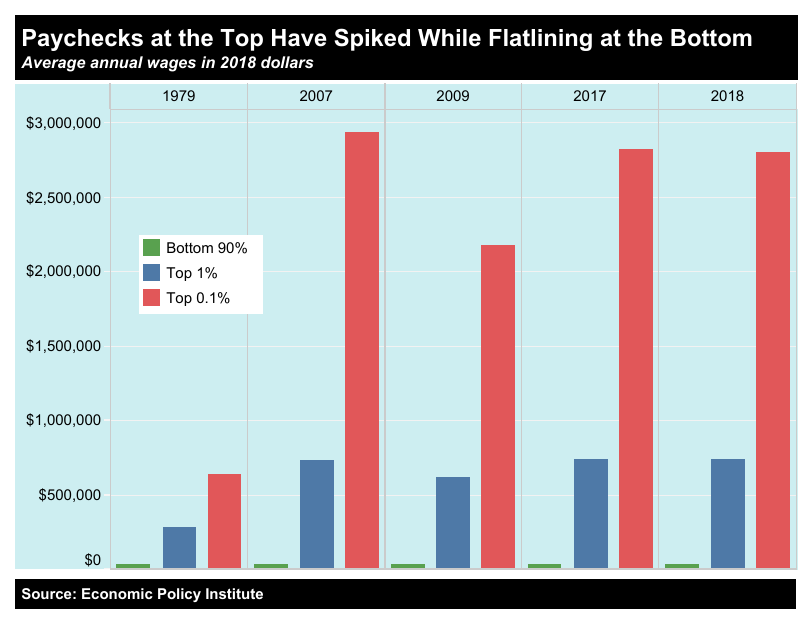

1. I'm going to start off with a heavy hitter. We're not happy to have a job, we're happy to be able to put food on our tables, a roof over our heads, clothes on our backs, afford healthcare, and have enough money left over to do things that we enjoy. Because of a capitalist society, the only way to achieve these goals is to participate and work and get a job. Personally, I love my jobs. I have a lot of fun, learn a lot, and get to do work that I'm proud of. But I'd be so much happier if I did not have to stress about being able to make rent or trying to stay healthy because I know I'm one financial disaster away from essentially ruining the rest of my life and never being able to crawl out of debt.
   Specifically regarding the Nike documentary, if you are paid so little that you can barely afford to eat two meals a day, you most certainly cannot afford to look for another job. You need to take time off work, travel to the new location, and presumably clean yourself up a bit for the interview. 
   In current events, we're seeing the result of people being freed from wage slavery in the United States. Many fast food restaurants are having trouble keeping their doors open because people are making the same or more on unemployment as they would at their old jobs. Now that they have the option to not work multiple jobs to make ends meet, there's no reason *to* work. Unusurprisingly, once those places raise their wages to a living wage, applications come flooding in.

2. I think, that given what I've said already, it is quite clear that I agree wholeheartedly with Marx. Let's recall this line from the skeptic: "Yes, they need some kind of health care system to help the uninsured, and they do need a raise of the minimum wage, but they are not **necessarily** alienated!" There are so many qualifiers in that statement that while it may be true in some cases, it is but a fraction of the greater truth. Are the proletariat not alienated by poor health care? If they *do* need a minimum wage increase, are they not alienated by current wages? There's an internet forum called "SelfAwarewolves" and it's all about people who don't realize they're arguing against themselves. This skeptic is so close to being one of those people. Again, just because people enjoy their jobs does not mean that they would be much happier overall if their jobs did not pay minimum wage. I'm going to close out my argument with a popular rhyme that illustrates Marx's point about how workers are separated from the monetary results of their work. Although the original rhyme has been extended and ends crudely, it reflects a general attitude among the working class.
   "Boss makes a dollar,

   I make a dime.

   That's why I poop

   On company time.

   But times, now, are different

   From what this phrase meant

   The bosses make billions

   While we poopers make cents.

   It's time for a change,

   We must take a stand.

   Don't just poop on their time,

   Poop on the boss-man!" – u/TalonasGnomeFollower

3. Let me direct everyone's attention to this article about income inequality over time: https://inequality.org/facts/income-inequality/
   The skeptic is correct right up until the very end as before with many qualifiers. As we can see from the myriad charts and graphs in the article I provided, the difference in wages between the bottom 90% of earners and top 1% of earners has grown drastically over time. 

   

   We can see that between 1979 and 2018, the average wages of the bottom 90% have barely increased at all. The slight variation in the top 1% and top .1% can be attributed to the Great Recession. If bosses truly wanted their workers to be happy, what amounts to a slight pay cut for them could be a substantial raise for everyone at the bottom.
   If you wanted to argue that workers aren't very productive and that the upper echelons of society have gotten richer due to increasing company sizes and globalization, let me direct you to these two articles about the divergence of worker compensation and worker productivity:
   https://www.epi.org/productivity-pay-gap/

   https://www.epi.org/publication/understanding-the-historic-divergence-between-productivity-and-a-typical-workers-pay-why-it-matters-and-why-its-real/

   Workers are more productive than ever and it's time that they are paid as such.

4. Yancy's core argument is that all of us have subconscious racist and sexist beliefs that we may not even know exist and that we should look within ourselves to learn them so that we can change our behaviors accordingly. While we may not act on any racist beliefs, we should recognize that if we were to look at someone and think to ourselves, "that person perpetuates this stereotype" (vague, I know, but I think you understand what I'm trying to say), then you should recognize that racism within yourself and work towards a world where you those thoughts never start. The most applicable part of his column to the Twilight Zone episode is when Yancy says "Don’t tell me that you don’t see color." Without seeing color, you cannot recognize that racism exists. In the episode, the people so firmly believe that everyone must look like them that they're unwilling to accept anyone different even though they recognize that on the inside, they're all human. It is this sort of world that Yancy is warning us of.

5. *Ex Slaves talk about Slavery in the USA*: I think that Yancy would find the first minute or so of the video the most important in which Faulk talks about how he believed in "giving blacks the right" to do so many things. As the man in the story responds, you can't give people those rights, they already have them. That's why they're rights. You can't give them or take them away. The most important part is that Faulk recognized, even though not right away, that his line of thinking was wrong and recognized the need for change.
   *White Like Me*: I was in fifth grade when Obama was elected. I remember sitting with my friends (10 or younger) and agreeing that electing Hillary Clinton, a white woman, would have been a bigger step forward than electing Barack Obama, a black man.
   This video addresses modern, systematic racism. People believe there is no more racism because it's not as obvious as a water fountain that says "whites only," but that doesn't mean it isn't there and Yancy would agree again. Racism today is non-obvious and so pervasive it's difficult to begin to tackle. While individual people may be looking inwards as Yancy suggests and doing their best to combat their own latent stereotypes, they're still operating in a system that is built upon racism so no matter how hard they try, they'll never be able to make things equitable without changing the system. A common example is how school budgets are built on property taxes. I think that I could not do this topic justice and would like to direct you to this NPR article: https://www.npr.org/sections/live-updates-protests-for-racial-justice/2020/07/07/888469809/how-funding-model-preserves-racial-segregation-in-public-schools
   *NOW on PBS | Teen Sexual Harassment at Work | PBS*: Oh lord. Sexual harassment in retail is rampant. Yancy speaks at length about the objectification of women and the stories in this video are no exception. While I recognize that harassment from managers and coworkers is rampant, I want to point out that harassment from retail customers can be worse. Retail companies hate banning customers for any reason and will avoid it until they have no other choice. Employees aren't allowed to educate the customers that what they're doing is wrong because it will create a "hostile" environment for the customer even though they've already created a hostile environment for the employee. This story had already broken by the time Yancy wrote his column but I'm sure he wouldn't have been surprised.

6. "***But*** **let's be very clear.** The one who was directly wronged is not here to accept any kind of apology or reparations, and the one who really should be apologizing and making things right is also long gone."
   Although earlier this person says that their life *would* be better today if the house had not been seized, the respondent is missing the point of reparations. Reparations are not about saying sorry. As they say, the person to apologize to is long gone. The point of reparations is to balance the scales, so to speak and help put that person's descendants in the place they would have been had their great great and so on's house been seized. Deciding what reparations are appropriate is extremely difficult because you are trying to bridge generations and it's nearly impossible to calculate what should have been.

7.  

   1. "The world does not live in religious harmony right now, but we should all learn to live in peace with our religious differences."
      There are some religious views that many would consider extreme. For example, I find that the evangelical view on gay marriage is wrong and while it may not affect me directly, should those views become law, my friends would suffer for it. We *should* learn to live in peace with our religious differences but we can only do that if we also accept that what's best for us may not be best for other people. Thus, I can only accept the first premise so long as the second and third are true first.
   2. I'm having trouble disagreeing with or finding either one of Dawkins' premises weak. However, I do think his second is weaker. Many people find solace in believing that their is a higher power that can explain the unexplained. There's the age old saying about how anything that appears to be magic is just science that hasn't been explained yet. I, myself, accept a higher power in areas that science does not have an explanation yet. Once there is a reasonable scientific explanation, I'll move to that because I'll almost certainly find it easier to accept than the existence of a higher power.
   3. In argument against the first premise, especially part C, I would like to remind everyone of our earlier discussion about the blind girl not knowing what a wall is. We've already determined that reality is, in many cases, what we agree it is and not necessarily what we perceive it to be. If we all agree that a wall is white, then it is a white wall unless something else arrives to suggest and prove otherwise.
   4. The Dalai Lama has the best argument because his is built on compassion for others. While Dawkins, in my mind, is right on all points, he is not nice in his delivery. To be fair to him, I don't think the pastor in the video was particularly nice either. The Dalai Lama argues that we should understand and accept one another for who we are and work to reach common ground through education. I think that the world would be a much nicer place if we were all better educated and more compassionate towards one another.

8. I think that B is the stronger argument. Like I said in 7d (7.4), compassion makes for a stronger argument in some cases and this is included. Of course the man in question is not really Filipino, but he clearly feels he has more in common with that culture than his "native" culture, so to speak. I disagree with argument B on many points but the underlying and main point is that we should be accepting of him. To follow my own points, perhaps if he felt more accepted by those around him, he would not have gone to such lengths to engrain himself in Filipino culture.